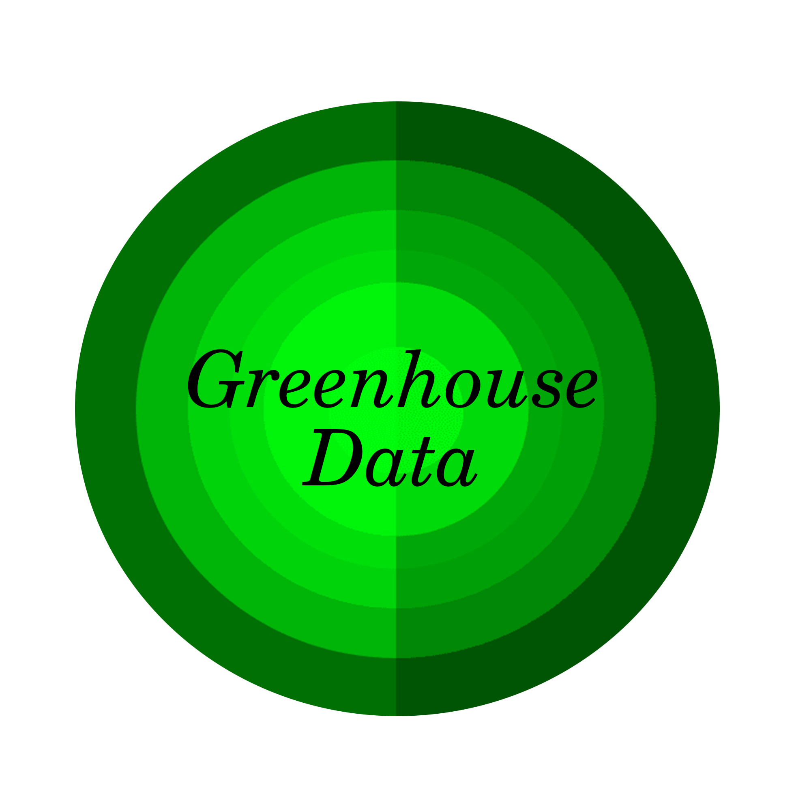
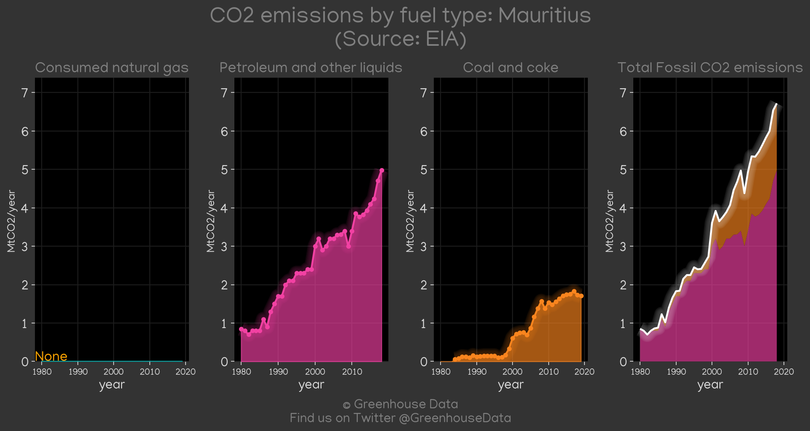
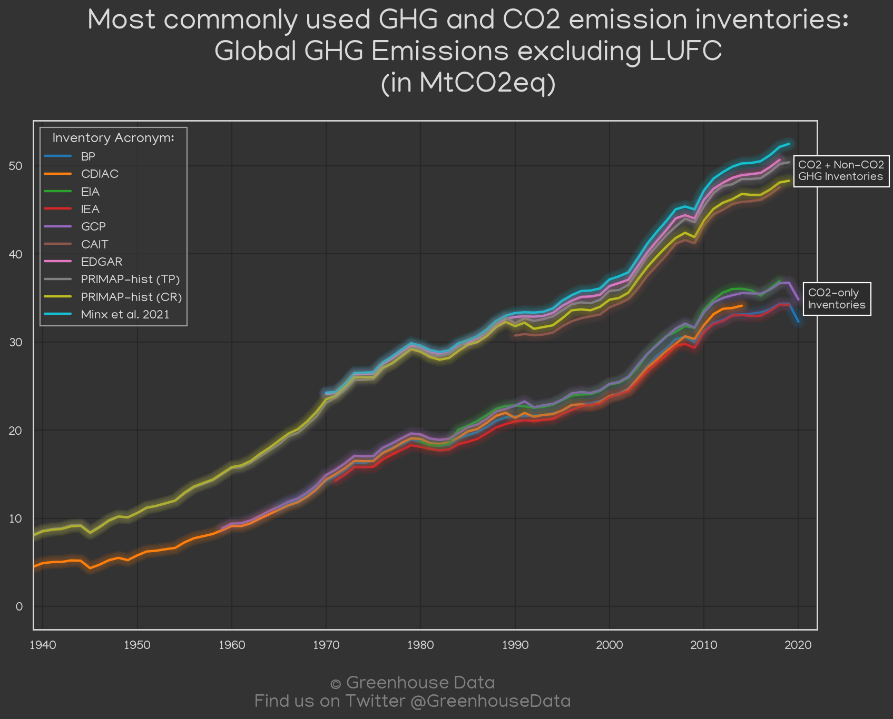
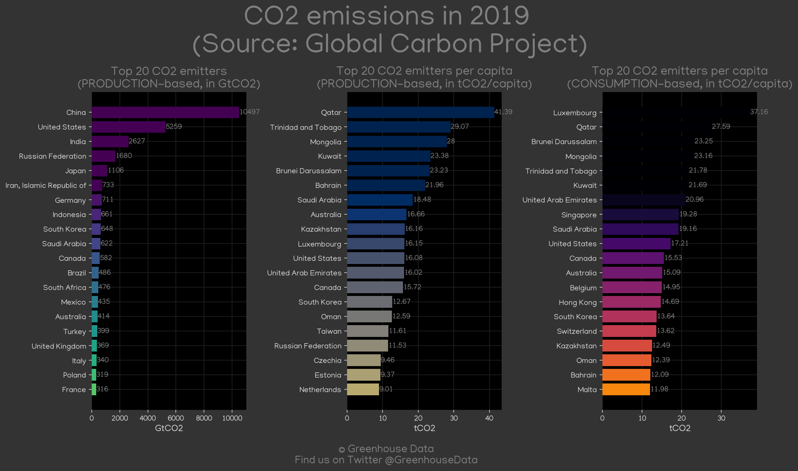

<h1>
Welcome to Greenhouse Data!
</h1>
<h3> 
Created by Diego Acevedo Quintanilla
</h3>

<a href="https://dquintani.github.io/Greenhouse-Data/pages/about">About this project</a>

 
<h1>Clean, homogenized GHG emissions inventory data <a href="https://github.com/dquintani/Greenhouse-Data/tree/master/clean_data">here</a></h1>

Includes: BP | EIA | UNFCCC | EDGAR | FAO | CAIT | EPA | CDIAC | PRIMAP-hist | GCP | Minx et al. 2021 | IEA

 
 

<h1>Selected entries:</h1>
<h1><a href="global/">🌍 Global 🌍</a></h1>
<h1><a href="country_data/CHE_Switzerland/">Switzerland 🇨🇭</a></h1>
<h1><a href="country_data/USA_United States/">USA 🇺🇸</a></h1>
<h1><a href="country_data/GBR_United Kingdom/">UK 🇬🇧</a></h1>
<h1><a href="country_data/CHN_China/">China 🇨🇳</a></h1>
<h1><a href="country_data/BOL_Bolivia/">Bolivia 🇧🇴</a></h1>
<h1><a href="country_data/IND_India/">India 🇮🇳</a></h1>

 
 

<h1 align="center">
    Random figure of the day:

 
 

 
 
<h1 align="center">
    We have a diverse set of inventories and figures 👇:

 
 
<h1 align="center">
    For all countries of the world 👍:

 
 <h1>Explore by Country:</h1><h1>

<a href="country_data/AFG_Afghanistan">Afghanistan - 🇦🇫</a>

</h1><h1>

<a href="country_data/ALB_Albania">Albania - 🇦🇱</a>

</h1><h1>

<a href="country_data/DZA_Algeria">Algeria - 🇩🇿</a>

</h1><h1>

<a href="country_data/ASM_American Samoa">American Samoa - 🇦🇸</a>

</h1><h1>

<a href="country_data/AND_Andorra">Andorra - 🇦🇩</a>

</h1><h1>

<a href="country_data/AGO_Angola">Angola - 🇦🇴</a>

</h1><h1>

<a href="country_data/AIA_Anguilla">Anguilla - 🇦🇮</a>

</h1><h1>

<a href="country_data/ATA_Antarctica">Antarctica - 🇦🇶</a>

</h1><h1>

<a href="country_data/ATG_Antigua and Barbuda">Antigua and Barbuda - 🇦🇬</a>

</h1><h1>

<a href="country_data/ARG_Argentina">Argentina - 🇦🇷</a>

</h1><h1>

<a href="country_data/ARM_Armenia">Armenia - 🇦🇲</a>

</h1><h1>

<a href="country_data/ABW_Aruba">Aruba - 🇦🇼</a>

</h1><h1>

<a href="country_data/AUS_Australia">Australia - 🇦🇺</a>

</h1><h1>

<a href="country_data/AUT_Austria">Austria - 🇦🇹</a>

</h1><h1>

<a href="country_data/AZE_Azerbaijan">Azerbaijan - 🇦🇿</a>

</h1><h1>

<a href="country_data/BHS_Bahamas">Bahamas - 🇧🇸</a>

</h1><h1>

<a href="country_data/BHR_Bahrain">Bahrain - 🇧🇭</a>

</h1><h1>

<a href="country_data/BGD_Bangladesh">Bangladesh - 🇧🇩</a>

</h1><h1>

<a href="country_data/BRB_Barbados">Barbados - 🇧🇧</a>

</h1><h1>

<a href="country_data/BLR_Belarus">Belarus - 🇧🇾</a>

</h1><h1>

<a href="country_data/BEL_Belgium">Belgium - 🇧🇪</a>

</h1><h1>

<a href="country_data/BLZ_Belize">Belize - 🇧🇿</a>

</h1><h1>

<a href="country_data/BEN_Benin">Benin - 🇧🇯</a>

</h1><h1>

<a href="country_data/BMU_Bermuda">Bermuda - 🇧🇲</a>

</h1><h1>

<a href="country_data/BTN_Bhutan">Bhutan - 🇧🇹</a>

</h1><h1>

<a href="country_data/BOL_Bolivia">Bolivia - 🇧🇴</a>

</h1><h1>

<a href="country_data/BES_Bonaire, Sint Eustatius and Saba">Bonaire, Sint Eustatius and Saba - 🇧🇶</a>

</h1><h1>

<a href="country_data/BIH_Bosnia and Herzegovina">Bosnia and Herzegovina - 🇧🇦</a>

</h1><h1>

<a href="country_data/BWA_Botswana">Botswana - 🇧🇼</a>

</h1><h1>

<a href="country_data/BVT_Bouvet Island">Bouvet Island - 🇧🇻</a>

</h1><h1>

<a href="country_data/BRA_Brazil">Brazil - 🇧🇷</a>

</h1><h1>

<a href="country_data/IOT_British Indian Ocean Territory">British Indian Ocean Territory - 🇮🇴</a>

</h1><h1>

<a href="country_data/BRN_Brunei Darussalam">Brunei Darussalam - 🇧🇳</a>

</h1><h1>

<a href="country_data/BGR_Bulgaria">Bulgaria - 🇧🇬</a>

</h1><h1>

<a href="country_data/BFA_Burkina Faso">Burkina Faso - 🇧🇫</a>

</h1><h1>

<a href="country_data/BDI_Burundi">Burundi - 🇧🇮</a>

</h1><h1>

<a href="country_data/CPV_Cabo Verde">Cabo Verde - 🇨🇻</a>

</h1><h1>

<a href="country_data/KHM_Cambodia">Cambodia - 🇰🇭</a>

</h1><h1>

<a href="country_data/CMR_Cameroon">Cameroon - 🇨🇲</a>

</h1><h1>

<a href="country_data/CAN_Canada">Canada - 🇨🇦</a>

</h1><h1>

<a href="country_data/CYM_Cayman Islands">Cayman Islands - 🇰🇾</a>

</h1><h1>

<a href="country_data/CAF_Central African Republic">Central African Republic - 🇨🇫</a>

</h1><h1>

<a href="country_data/TCD_Chad">Chad - 🇹🇩</a>

</h1><h1>

<a href="country_data/CHL_Chile">Chile - 🇨🇱</a>

</h1><h1>

<a href="country_data/CHN_China">China - 🇨🇳</a>

</h1><h1>

<a href="country_data/CXR_Christmas Island">Christmas Island - 🇨🇽</a>

</h1><h1>

<a href="country_data/CCK_Cocos (Keeling) Islands">Cocos (Keeling) Islands - 🇨🇨</a>

</h1><h1>

<a href="country_data/COL_Colombia">Colombia - 🇨🇴</a>

</h1><h1>

<a href="country_data/COM_Comoros">Comoros - 🇰🇲</a>

</h1><h1>

<a href="country_data/COG_Congo">Congo - 🇨🇬</a>

</h1><h1>

<a href="country_data/COD_Congo, The Democratic Republic of the">Congo, The Democratic Republic of the - 🇨🇩</a>

</h1><h1>

<a href="country_data/COK_Cook Islands">Cook Islands - 🇨🇰</a>

</h1><h1>

<a href="country_data/CRI_Costa Rica">Costa Rica - 🇨🇷</a>

</h1><h1>

<a href="country_data/HRV_Croatia">Croatia - 🇭🇷</a>

</h1><h1>

<a href="country_data/CUB_Cuba">Cuba - 🇨🇺</a>

</h1><h1>

<a href="country_data/CUW_Curaçao">Curaçao - 🇨🇼</a>

</h1><h1>

<a href="country_data/CYP_Cyprus">Cyprus - 🇨🇾</a>

</h1><h1>

<a href="country_data/CZE_Czechia">Czechia - 🇨🇿</a>

</h1><h1>

<a href="country_data/CIV_Côte d'Ivoire">Côte d'Ivoire - 🇨🇮</a>

</h1><h1>

<a href="country_data/DNK_Denmark">Denmark - 🇩🇰</a>

</h1><h1>

<a href="country_data/DJI_Djibouti">Djibouti - 🇩🇯</a>

</h1><h1>

<a href="country_data/DMA_Dominica">Dominica - 🇩🇲</a>

</h1><h1>

<a href="country_data/DOM_Dominican Republic">Dominican Republic - 🇩🇴</a>

</h1><h1>

<a href="country_data/ECU_Ecuador">Ecuador - 🇪🇨</a>

</h1><h1>

<a href="country_data/EGY_Egypt">Egypt - 🇪🇬</a>

</h1><h1>

<a href="country_data/SLV_El Salvador">El Salvador - 🇸🇻</a>

</h1><h1>

<a href="country_data/GNQ_Equatorial Guinea">Equatorial Guinea - 🇬🇶</a>

</h1><h1>

<a href="country_data/ERI_Eritrea">Eritrea - 🇪🇷</a>

</h1><h1>

<a href="country_data/EST_Estonia">Estonia - 🇪🇪</a>

</h1><h1>

<a href="country_data/SWZ_Eswatini">Eswatini - 🇸🇿</a>

</h1><h1>

<a href="country_data/ETH_Ethiopia">Ethiopia - 🇪🇹</a>

</h1><h1>

<a href="country_data/FLK_Falkland Islands (Malvinas)">Falkland Islands (Malvinas) - 🇫🇰</a>

</h1><h1>

<a href="country_data/FRO_Faroe Islands">Faroe Islands - 🇫🇴</a>

</h1><h1>

<a href="country_data/FJI_Fiji">Fiji - 🇫🇯</a>

</h1><h1>

<a href="country_data/FIN_Finland">Finland - 🇫🇮</a>

</h1><h1>

<a href="country_data/FRA_France">France - 🇫🇷</a>

</h1><h1>

<a href="country_data/GUF_French Guiana">French Guiana - 🇬🇫</a>

</h1><h1>

<a href="country_data/PYF_French Polynesia">French Polynesia - 🇵🇫</a>

</h1><h1>

<a href="country_data/ATF_French Southern Territories">French Southern Territories - 🇹🇫</a>

</h1><h1>

<a href="country_data/GAB_Gabon">Gabon - 🇬🇦</a>

</h1><h1>

<a href="country_data/GMB_Gambia">Gambia - 🇬🇲</a>

</h1><h1>

<a href="country_data/GEO_Georgia">Georgia - 🇬🇪</a>

</h1><h1>

<a href="country_data/DEU_Germany">Germany - 🇩🇪</a>

</h1><h1>

<a href="country_data/GHA_Ghana">Ghana - 🇬🇭</a>

</h1><h1>

<a href="country_data/GIB_Gibraltar">Gibraltar - 🇬🇮</a>

</h1><h1>

<a href="country_data/GRC_Greece">Greece - 🇬🇷</a>

</h1><h1>

<a href="country_data/GRL_Greenland">Greenland - 🇬🇱</a>

</h1><h1>

<a href="country_data/GRD_Grenada">Grenada - 🇬🇩</a>

</h1><h1>

<a href="country_data/GLP_Guadeloupe">Guadeloupe - 🇬🇵</a>

</h1><h1>

<a href="country_data/GUM_Guam">Guam - 🇬🇺</a>

</h1><h1>

<a href="country_data/GTM_Guatemala">Guatemala - 🇬🇹</a>

</h1><h1>

<a href="country_data/GGY_Guernsey">Guernsey - 🇬🇬</a>

</h1><h1>

<a href="country_data/GIN_Guinea">Guinea - 🇬🇳</a>

</h1><h1>

<a href="country_data/GNB_Guinea-Bissau">Guinea-Bissau - 🇬🇼</a>

</h1><h1>

<a href="country_data/GUY_Guyana">Guyana - 🇬🇾</a>

</h1><h1>

<a href="country_data/HTI_Haiti">Haiti - 🇭🇹</a>

</h1><h1>

<a href="country_data/HMD_Heard Island and McDonald Islands">Heard Island and McDonald Islands - 🇭🇲</a>

</h1><h1>

<a href="country_data/VAT_Holy See (Vatican City State)">Holy See (Vatican City State) - 🇻🇦</a>

</h1><h1>

<a href="country_data/HND_Honduras">Honduras - 🇭🇳</a>

</h1><h1>

<a href="country_data/HKG_Hong Kong">Hong Kong - 🇭🇰</a>

</h1><h1>

<a href="country_data/HUN_Hungary">Hungary - 🇭🇺</a>

</h1><h1>

<a href="country_data/ISL_Iceland">Iceland - 🇮🇸</a>

</h1><h1>

<a href="country_data/IND_India">India - 🇮🇳</a>

</h1><h1>

<a href="country_data/IDN_Indonesia">Indonesia - 🇮🇩</a>

</h1><h1>

<a href="country_data/IRN_Iran, Islamic Republic of">Iran, Islamic Republic of - 🇮🇷</a>

</h1><h1>

<a href="country_data/IRQ_Iraq">Iraq - 🇮🇶</a>

</h1><h1>

<a href="country_data/IRL_Ireland">Ireland - 🇮🇪</a>

</h1><h1>

<a href="country_data/IMN_Isle of Man">Isle of Man - 🇮🇲</a>

</h1><h1>

<a href="country_data/ISR_Israel">Israel - 🇮🇱</a>

</h1><h1>

<a href="country_data/ITA_Italy">Italy - 🇮🇹</a>

</h1><h1>

<a href="country_data/JAM_Jamaica">Jamaica - 🇯🇲</a>

</h1><h1>

<a href="country_data/JPN_Japan">Japan - 🇯🇵</a>

</h1><h1>

<a href="country_data/JEY_Jersey">Jersey - 🇯🇪</a>

</h1><h1>

<a href="country_data/JOR_Jordan">Jordan - 🇯🇴</a>

</h1><h1>

<a href="country_data/KAZ_Kazakhstan">Kazakhstan - 🇰🇿</a>

</h1><h1>

<a href="country_data/KEN_Kenya">Kenya - 🇰🇪</a>

</h1><h1>

<a href="country_data/KIR_Kiribati">Kiribati - 🇰🇮</a>

</h1><h1>

<a href="country_data/PRK_North Korea">North Korea - 🇰🇵</a>

</h1><h1>

<a href="country_data/KOR_South Korea">South Korea - 🇰🇷</a>

</h1><h1>

<a href="country_data/KWT_Kuwait">Kuwait - 🇰🇼</a>

</h1><h1>

<a href="country_data/KGZ_Kyrgyzstan">Kyrgyzstan - 🇰🇬</a>

</h1><h1>

<a href="country_data/LAO_Lao People's Democratic Republic">Lao People's Democratic Republic - 🇱🇦</a>

</h1><h1>

<a href="country_data/LVA_Latvia">Latvia - 🇱🇻</a>

</h1><h1>

<a href="country_data/LBN_Lebanon">Lebanon - 🇱🇧</a>

</h1><h1>

<a href="country_data/LSO_Lesotho">Lesotho - 🇱🇸</a>

</h1><h1>

<a href="country_data/LBR_Liberia">Liberia - 🇱🇷</a>

</h1><h1>

<a href="country_data/LBY_Libya">Libya - 🇱🇾</a>

</h1><h1>

<a href="country_data/LIE_Liechtenstein">Liechtenstein - 🇱🇮</a>

</h1><h1>

<a href="country_data/LTU_Lithuania">Lithuania - 🇱🇹</a>

</h1><h1>

<a href="country_data/LUX_Luxembourg">Luxembourg - 🇱🇺</a>

</h1><h1>

<a href="country_data/MAC_Macao">Macao - 🇲🇴</a>

</h1><h1>

<a href="country_data/MDG_Madagascar">Madagascar - 🇲🇬</a>

</h1><h1>

<a href="country_data/MWI_Malawi">Malawi - 🇲🇼</a>

</h1><h1>

<a href="country_data/MYS_Malaysia">Malaysia - 🇲🇾</a>

</h1><h1>

<a href="country_data/MDV_Maldives">Maldives - 🇲🇻</a>

</h1><h1>

<a href="country_data/MLI_Mali">Mali - 🇲🇱</a>

</h1><h1>

<a href="country_data/MLT_Malta">Malta - 🇲🇹</a>

</h1><h1>

<a href="country_data/MHL_Marshall Islands">Marshall Islands - 🇲🇭</a>

</h1><h1>

<a href="country_data/MTQ_Martinique">Martinique - 🇲🇶</a>

</h1><h1>

<a href="country_data/MRT_Mauritania">Mauritania - 🇲🇷</a>

</h1><h1>

<a href="country_data/MUS_Mauritius">Mauritius - 🇲🇺</a>

</h1><h1>

<a href="country_data/MYT_Mayotte">Mayotte - 🇾🇹</a>

</h1><h1>

<a href="country_data/MEX_Mexico">Mexico - 🇲🇽</a>

</h1><h1>

<a href="country_data/FSM_Micronesia, Federated States of">Micronesia, Federated States of - 🇫🇲</a>

</h1><h1>

<a href="country_data/MDA_Moldova">Moldova - 🇲🇩</a>

</h1><h1>

<a href="country_data/MCO_Monaco">Monaco - 🇲🇨</a>

</h1><h1>

<a href="country_data/MNG_Mongolia">Mongolia - 🇲🇳</a>

</h1><h1>

<a href="country_data/MNE_Montenegro">Montenegro - 🇲🇪</a>

</h1><h1>

<a href="country_data/MSR_Montserrat">Montserrat - 🇲🇸</a>

</h1><h1>

<a href="country_data/MAR_Morocco">Morocco - 🇲🇦</a>

</h1><h1>

<a href="country_data/MOZ_Mozambique">Mozambique - 🇲🇿</a>

</h1><h1>

<a href="country_data/MMR_Myanmar">Myanmar - 🇲🇲</a>

</h1><h1>

<a href="country_data/NAM_Namibia">Namibia - 🇳🇦</a>

</h1><h1>

<a href="country_data/NRU_Nauru">Nauru - 🇳🇷</a>

</h1><h1>

<a href="country_data/NPL_Nepal">Nepal - 🇳🇵</a>

</h1><h1>

<a href="country_data/NLD_Netherlands">Netherlands - 🇳🇱</a>

</h1><h1>

<a href="country_data/NCL_New Caledonia">New Caledonia - 🇳🇨</a>

</h1><h1>

<a href="country_data/NZL_New Zealand">New Zealand - 🇳🇿</a>

</h1><h1>

<a href="country_data/NIC_Nicaragua">Nicaragua - 🇳🇮</a>

</h1><h1>

<a href="country_data/NER_Niger">Niger - 🇳🇪</a>

</h1><h1>

<a href="country_data/NGA_Nigeria">Nigeria - 🇳🇬</a>

</h1><h1>

<a href="country_data/NIU_Niue">Niue - 🇳🇺</a>

</h1><h1>

<a href="country_data/NFK_Norfolk Island">Norfolk Island - 🇳🇫</a>

</h1><h1>

<a href="country_data/MKD_North Macedonia">North Macedonia - 🇲🇰</a>

</h1><h1>

<a href="country_data/MNP_Northern Mariana Islands">Northern Mariana Islands - 🇲🇵</a>

</h1><h1>

<a href="country_data/NOR_Norway">Norway - 🇳🇴</a>

</h1><h1>

<a href="country_data/OMN_Oman">Oman - 🇴🇲</a>

</h1><h1>

<a href="country_data/PAK_Pakistan">Pakistan - 🇵🇰</a>

</h1><h1>

<a href="country_data/PLW_Palau">Palau - 🇵🇼</a>

</h1><h1>

<a href="country_data/PSE_Palestine, State of">Palestine, State of - 🇵🇸</a>

</h1><h1>

<a href="country_data/PAN_Panama">Panama - 🇵🇦</a>

</h1><h1>

<a href="country_data/PNG_Papua New Guinea">Papua New Guinea - 🇵🇬</a>

</h1><h1>

<a href="country_data/PRY_Paraguay">Paraguay - 🇵🇾</a>

</h1><h1>

<a href="country_data/PER_Peru">Peru - 🇵🇪</a>

</h1><h1>

<a href="country_data/PHL_Philippines">Philippines - 🇵🇭</a>

</h1><h1>

<a href="country_data/PCN_Pitcairn">Pitcairn - 🇵🇳</a>

</h1><h1>

<a href="country_data/POL_Poland">Poland - 🇵🇱</a>

</h1><h1>

<a href="country_data/PRT_Portugal">Portugal - 🇵🇹</a>

</h1><h1>

<a href="country_data/PRI_Puerto Rico">Puerto Rico - 🇵🇷</a>

</h1><h1>

<a href="country_data/QAT_Qatar">Qatar - 🇶🇦</a>

</h1><h1>

<a href="country_data/ROU_Romania">Romania - 🇷🇴</a>

</h1><h1>

<a href="country_data/RUS_Russian Federation">Russian Federation - 🇷🇺</a>

</h1><h1>

<a href="country_data/RWA_Rwanda">Rwanda - 🇷🇼</a>

</h1><h1>

<a href="country_data/REU_Réunion">Réunion - 🇷🇪</a>

</h1><h1>

<a href="country_data/BLM_Saint Barthélemy">Saint Barthélemy - 🇧🇱</a>

</h1><h1>

<a href="country_data/SHN_Saint Helena, Ascension and Tristan da Cunha">Saint Helena, Ascension and Tristan da Cunha - 🇸🇭</a>

</h1><h1>

<a href="country_data/KNA_Saint Kitts and Nevis">Saint Kitts and Nevis - 🇰🇳</a>

</h1><h1>

<a href="country_data/LCA_Saint Lucia">Saint Lucia - 🇱🇨</a>

</h1><h1>

<a href="country_data/MAF_Saint Martin (French part)">Saint Martin (French part) - 🇲🇫</a>

</h1><h1>

<a href="country_data/SPM_Saint Pierre and Miquelon">Saint Pierre and Miquelon - 🇵🇲</a>

</h1><h1>

<a href="country_data/VCT_Saint Vincent and the Grenadines">Saint Vincent and the Grenadines - 🇻🇨</a>

</h1><h1>

<a href="country_data/WSM_Samoa">Samoa - 🇼🇸</a>

</h1><h1>

<a href="country_data/SMR_San Marino">San Marino - 🇸🇲</a>

</h1><h1>

<a href="country_data/STP_Sao Tome and Principe">Sao Tome and Principe - 🇸🇹</a>

</h1><h1>

<a href="country_data/SAU_Saudi Arabia">Saudi Arabia - 🇸🇦</a>

</h1><h1>

<a href="country_data/SEN_Senegal">Senegal - 🇸🇳</a>

</h1><h1>

<a href="country_data/SRB_Serbia">Serbia - 🇷🇸</a>

</h1><h1>

<a href="country_data/SYC_Seychelles">Seychelles - 🇸🇨</a>

</h1><h1>

<a href="country_data/SLE_Sierra Leone">Sierra Leone - 🇸🇱</a>

</h1><h1>

<a href="country_data/SGP_Singapore">Singapore - 🇸🇬</a>

</h1><h1>

<a href="country_data/SXM_Sint Maarten (Dutch part)">Sint Maarten (Dutch part) - 🇸🇽</a>

</h1><h1>

<a href="country_data/SVK_Slovakia">Slovakia - 🇸🇰</a>

</h1><h1>

<a href="country_data/SVN_Slovenia">Slovenia - 🇸🇮</a>

</h1><h1>

<a href="country_data/SLB_Solomon Islands">Solomon Islands - 🇸🇧</a>

</h1><h1>

<a href="country_data/SOM_Somalia">Somalia - 🇸🇴</a>

</h1><h1>

<a href="country_data/ZAF_South Africa">South Africa - 🇿🇦</a>

</h1><h1>

<a href="country_data/SGS_South Georgia and the South Sandwich Islands">South Georgia and the South Sandwich Islands - 🇬🇸</a>

</h1><h1>

<a href="country_data/SSD_South Sudan">South Sudan - 🇸🇸</a>

</h1><h1>

<a href="country_data/ESP_Spain">Spain - 🇪🇸</a>

</h1><h1>

<a href="country_data/LKA_Sri Lanka">Sri Lanka - 🇱🇰</a>

</h1><h1>

<a href="country_data/SDN_Sudan">Sudan - 🇸🇩</a>

</h1><h1>

<a href="country_data/SUR_Suriname">Suriname - 🇸🇷</a>

</h1><h1>

<a href="country_data/SJM_Svalbard and Jan Mayen">Svalbard and Jan Mayen - 🇸🇯</a>

</h1><h1>

<a href="country_data/SWE_Sweden">Sweden - 🇸🇪</a>

</h1><h1>

<a href="country_data/CHE_Switzerland">Switzerland - 🇨🇭</a>

</h1><h1>

<a href="country_data/SYR_Syrian Arab Republic">Syrian Arab Republic - 🇸🇾</a>

</h1><h1>

<a href="country_data/TWN_Taiwan">Taiwan - 🇹🇼</a>

</h1><h1>

<a href="country_data/TJK_Tajikistan">Tajikistan - 🇹🇯</a>

</h1><h1>

<a href="country_data/TZA_Tanzania">Tanzania - 🇹🇿</a>

</h1><h1>

<a href="country_data/THA_Thailand">Thailand - 🇹🇭</a>

</h1><h1>

<a href="country_data/TLS_Timor-Leste">Timor-Leste - 🇹🇱</a>

</h1><h1>

<a href="country_data/TGO_Togo">Togo - 🇹🇬</a>

</h1><h1>

<a href="country_data/TKL_Tokelau">Tokelau - 🇹🇰</a>

</h1><h1>

<a href="country_data/TON_Tonga">Tonga - 🇹🇴</a>

</h1><h1>

<a href="country_data/TTO_Trinidad and Tobago">Trinidad and Tobago - 🇹🇹</a>

</h1><h1>

<a href="country_data/TUN_Tunisia">Tunisia - 🇹🇳</a>

</h1><h1>

<a href="country_data/TUR_Turkey">Turkey - 🇹🇷</a>

</h1><h1>

<a href="country_data/TKM_Turkmenistan">Turkmenistan - 🇹🇲</a>

</h1><h1>

<a href="country_data/TCA_Turks and Caicos Islands">Turks and Caicos Islands - 🇹🇨</a>

</h1><h1>

<a href="country_data/TUV_Tuvalu">Tuvalu - 🇹🇻</a>

</h1><h1>

<a href="country_data/UGA_Uganda">Uganda - 🇺🇬</a>

</h1><h1>

<a href="country_data/UKR_Ukraine">Ukraine - 🇺🇦</a>

</h1><h1>

<a href="country_data/ARE_United Arab Emirates">United Arab Emirates - 🇦🇪</a>

</h1><h1>

<a href="country_data/GBR_United Kingdom">United Kingdom - 🇬🇧</a>

</h1><h1>

<a href="country_data/USA_United States">United States - 🇺🇸</a>

</h1><h1>

<a href="country_data/UMI_United States Minor Outlying Islands">United States Minor Outlying Islands - 🇺🇲</a>

</h1><h1>

<a href="country_data/URY_Uruguay">Uruguay - 🇺🇾</a>

</h1><h1>

<a href="country_data/UZB_Uzbekistan">Uzbekistan - 🇺🇿</a>

</h1><h1>

<a href="country_data/VUT_Vanuatu">Vanuatu - 🇻🇺</a>

</h1><h1>

<a href="country_data/VEN_Venezuela">Venezuela - 🇻🇪</a>

</h1><h1>

<a href="country_data/VNM_Vietnam">Vietnam - 🇻🇳</a>

</h1><h1>

<a href="country_data/VGB_Virgin Islands, British">Virgin Islands, British - 🇻🇬</a>

</h1><h1>

<a href="country_data/VIR_Virgin Islands, U.S.">Virgin Islands, U.S. - 🇻🇮</a>

</h1><h1>

<a href="country_data/WLF_Wallis and Futuna">Wallis and Futuna - 🇼🇫</a>

</h1><h1>

<a href="country_data/ESH_Western Sahara">Western Sahara - 🇪🇭</a>

</h1><h1>

<a href="country_data/YEM_Yemen">Yemen - 🇾🇪</a>

</h1><h1>

<a href="country_data/ZMB_Zambia">Zambia - 🇿🇲</a>

</h1><h1>

<a href="country_data/ZWE_Zimbabwe">Zimbabwe - 🇿🇼</a>

</h1><h1>

<a href="country_data/ALA_Åland Islands">Åland Islands - 🇦🇽</a>

</h1>