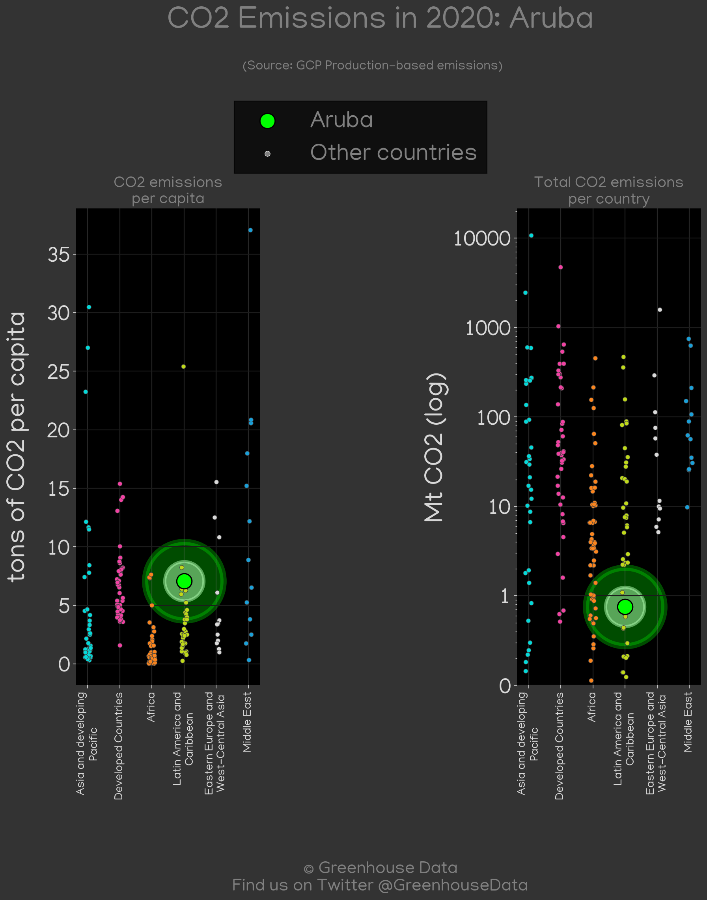
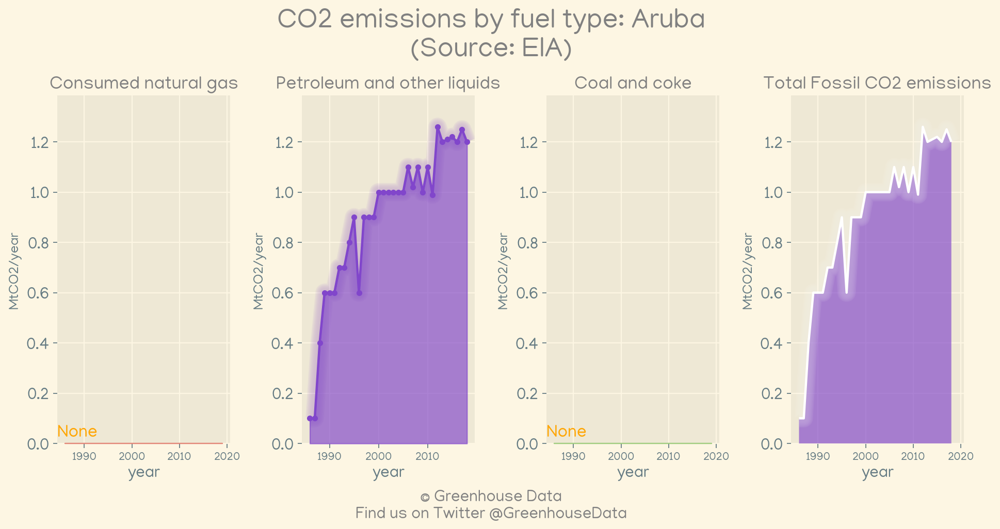
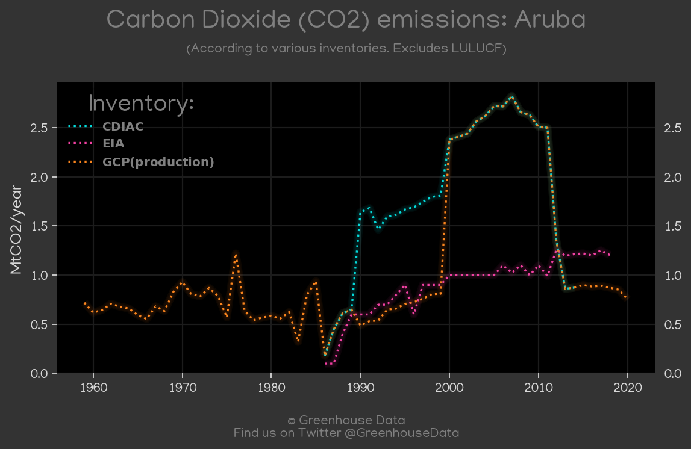
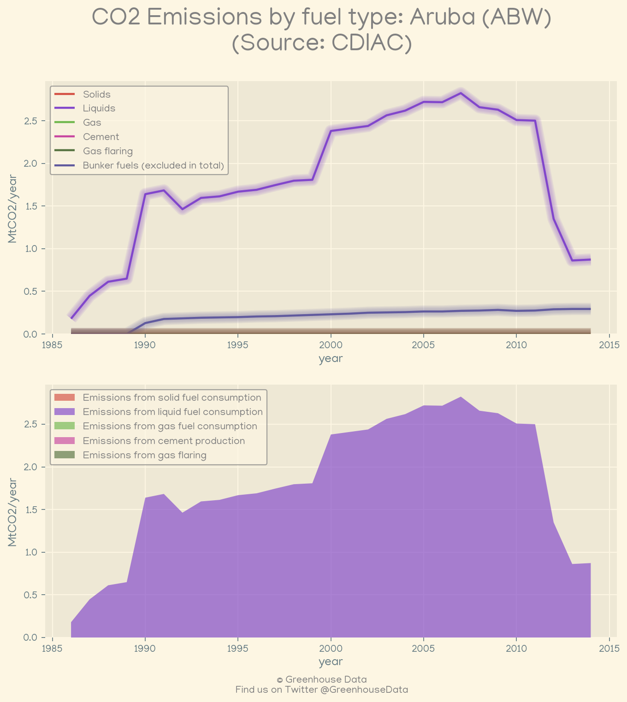
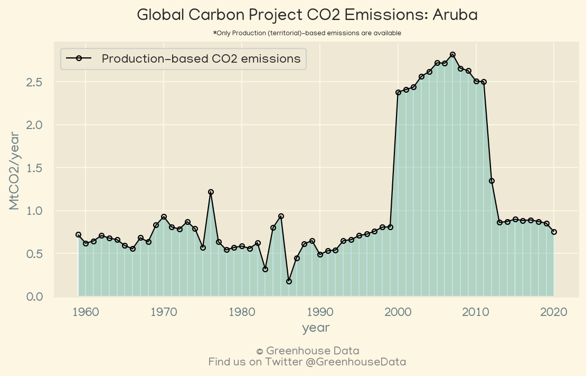
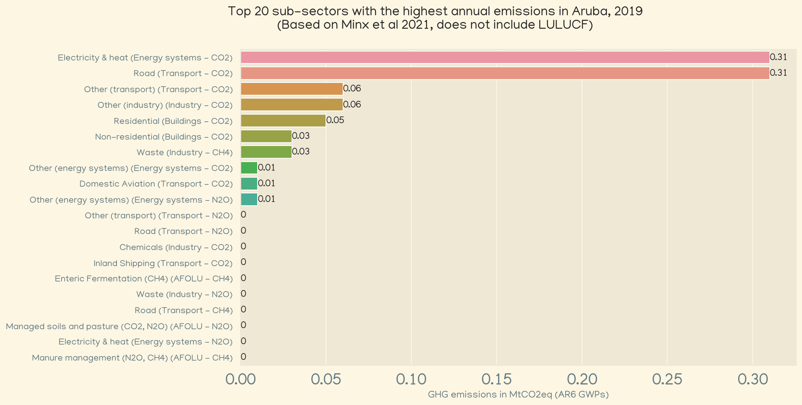

<h1 align="center">
🇦🇼🇦🇼🇦🇼🇦🇼🇦🇼
 
Aruba
 
🇦🇼🇦🇼🇦🇼🇦🇼🇦🇼
</h1>
<h2>Datasets:</h2>

<a href="https://github.com/dquintani/GreenhouseData/tree/master/country_data/ABW_Aruba/data">View on Github</a>
 

<a href="data/ABW_PRIMAP-hist.csv">PRIMAP-hist</a> || <a href="data/ABW_GCP_consupmption.csv">GCP_consupmption</a> || <a href="data/ABW_EIA.csv">EIA</a> || <a href="data/ABW_GCP.csv">GCP</a> || <a href="data/ABW_CDIAC.csv">CDIAC</a> || <a href="data/ABW_EDGAR.csv">EDGAR</a> || <a href="data/ABW_FAO.csv">FAO</a> || <a href="data/ABW_Minx_2021.csv">Minx_2021</a>

 

<h1>Figures:</h1><h2>#1 (ABW_GCP_Country_Highlight)</h2>

<h2>#2 (ABW_EIA_1)</h2>

<h2>#3 (ABW_CO2_totals)</h2>

<h2>#4 (ABW_CDIAC_1)</h2>

<h2>#5 (ABW_GCP_1)</h2>

<h2>#6 (ABW_Minx_top20_subsectors)</h2>

