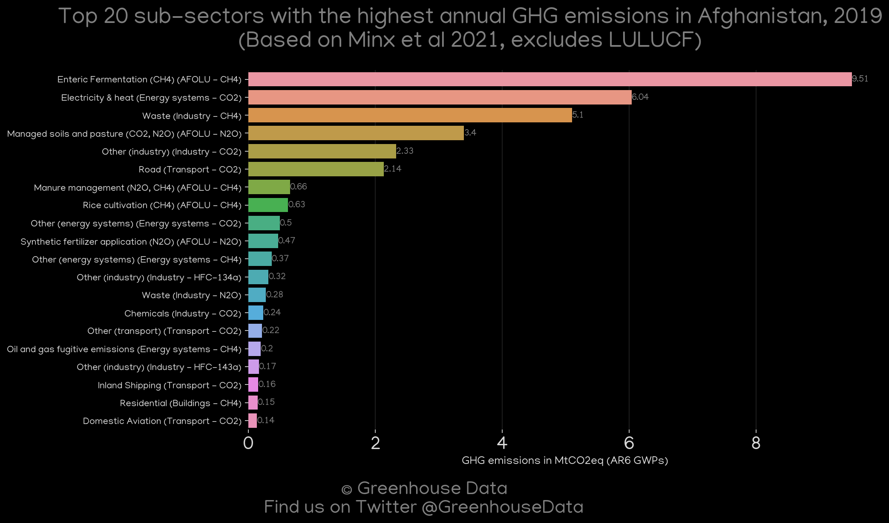
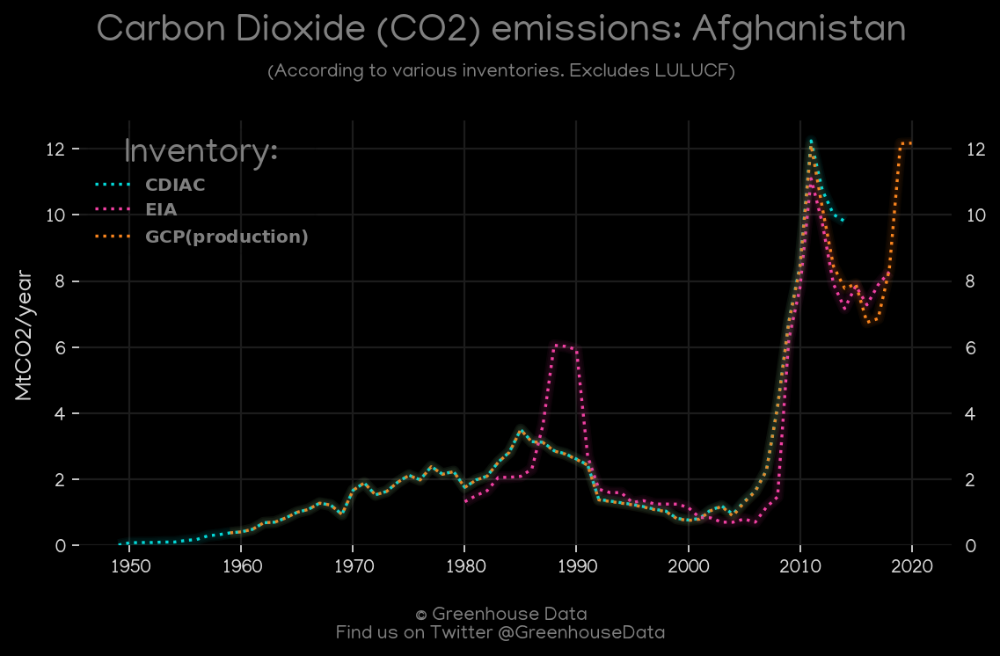
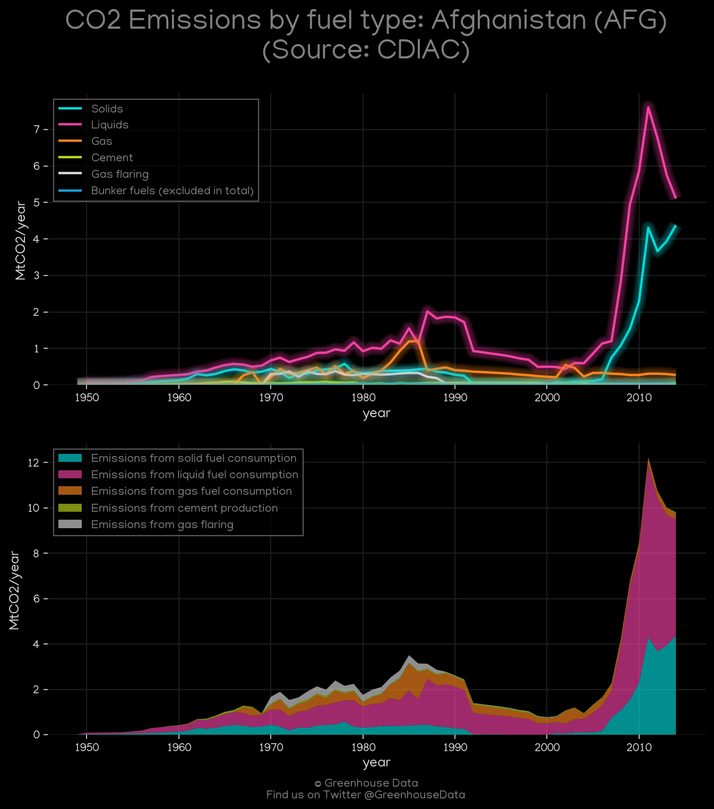
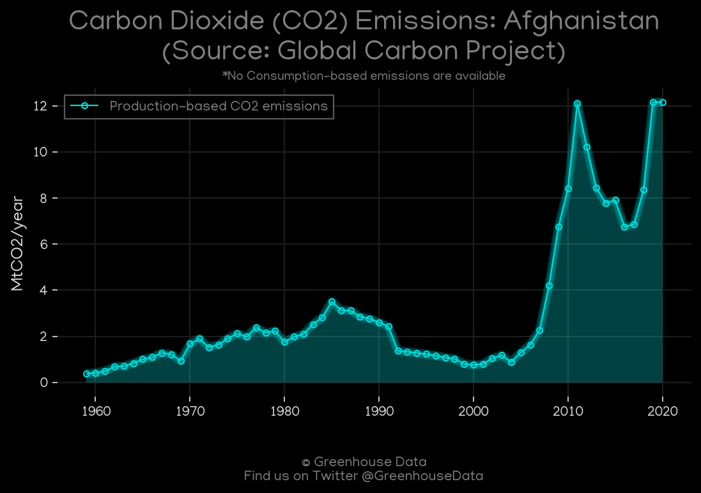
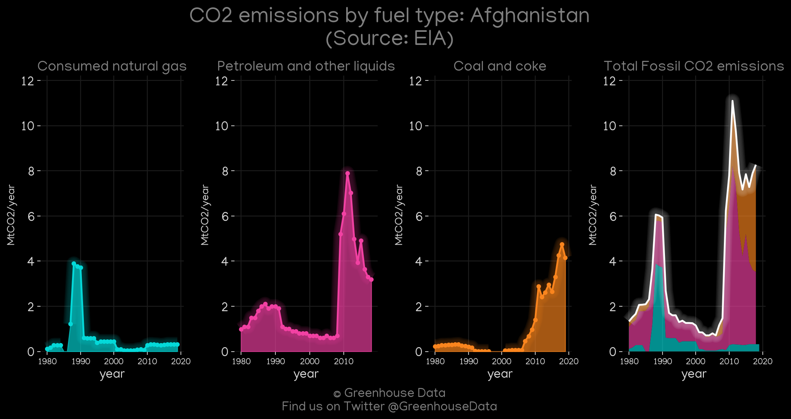
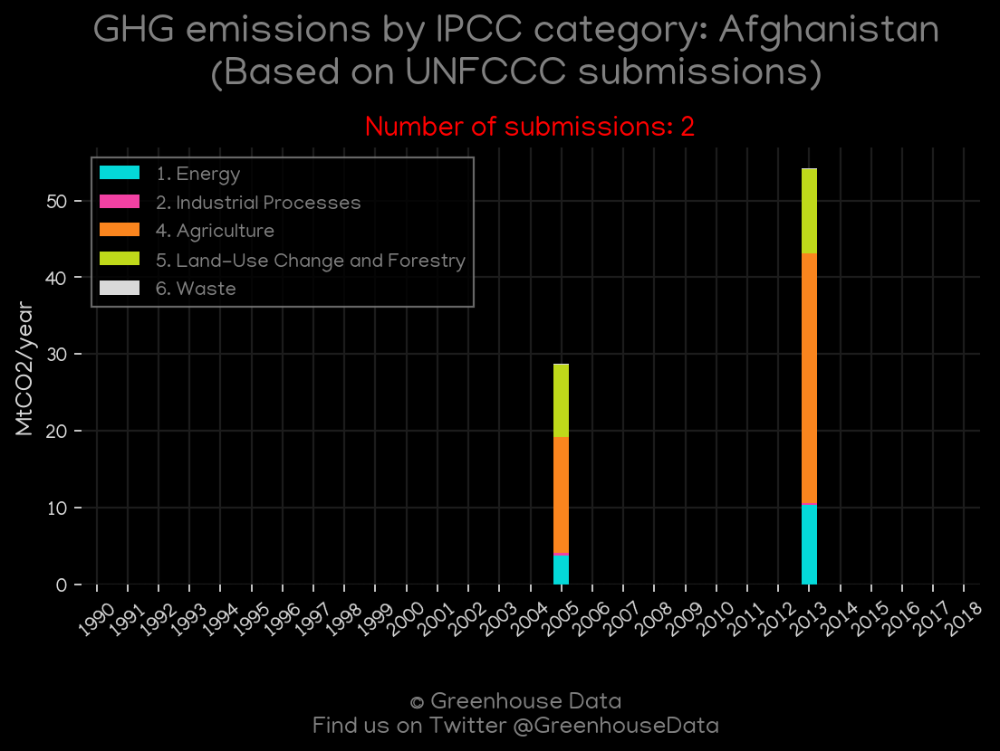

<h1 align="center">
🇦🇫🇦🇫🇦🇫🇦🇫🇦🇫
 
Afghanistan
 
🇦🇫🇦🇫🇦🇫🇦🇫🇦🇫
</h1>
<h2>Datasets:</h2>

<a href="https://github.com/dquintani/GreenhouseData/tree/master/country_data/AFG_Afghanistan/data">View on Github</a>
 

<a href="data/AFG_PRIMAP-hist.csv">PRIMAP-hist</a> || <a href="data/AFG_GCP.csv">GCP</a> || <a href="data/AFG_CAIT.csv">CAIT</a> || <a href="data/AFG_EPA.csv">EPA</a> || <a href="data/AFG_CDIAC.csv">CDIAC</a> || <a href="data/AFG_Minx_2021.csv">Minx_2021</a> || <a href="data/AFG_EIA.csv">EIA</a> || <a href="data/AFG_EDGAR.csv">EDGAR</a> || <a href="data/AFG_GCP_consupmption.csv">GCP_consupmption</a> || <a href="data/AFG_FAO.csv">FAO</a>

 

<h1>Figures:</h1><h2>#1 (AFG_Minx_top20_subsectors)</h2>

<h2>#2 (AFG_CO2_totals)</h2>

<h2>#3 (AFG_CDIAC_1)</h2>

<h2>#4 (AFG_GCP_1)</h2>

<h2>#5 (AFG_CAIT_gases_1)</h2>

<h2>#6 (AFG_EIA_1)</h2>

<h2>#7 (AFG_UNFCCC_NAI_1)</h2>

<h2>#8 (AFG_CAIT_lucf_vs_nolucf)</h2>

