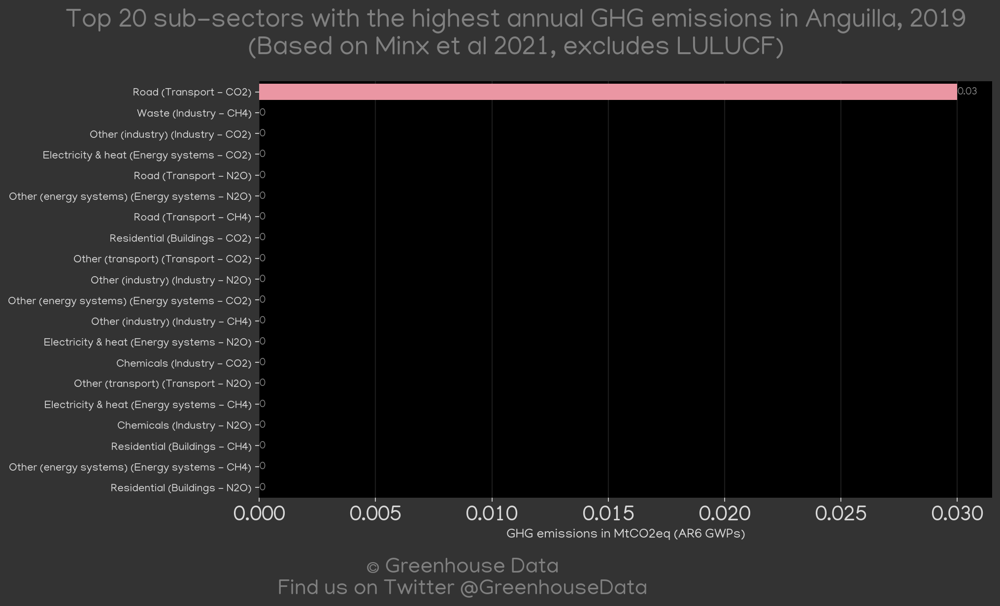
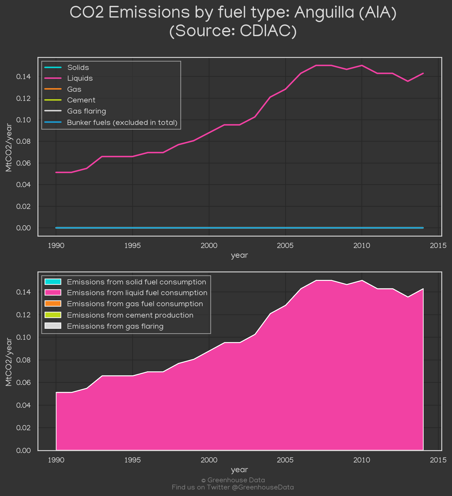
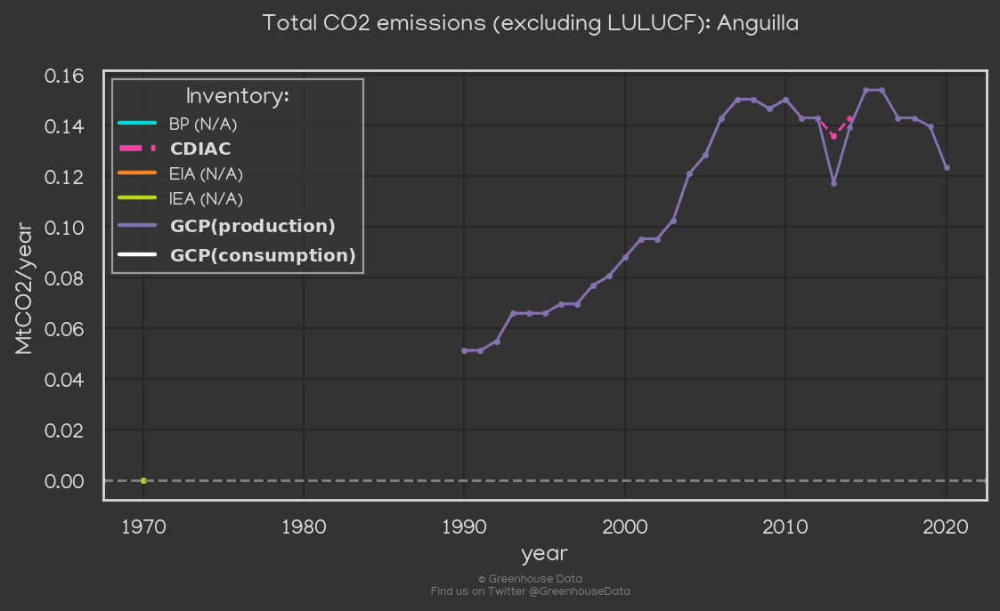
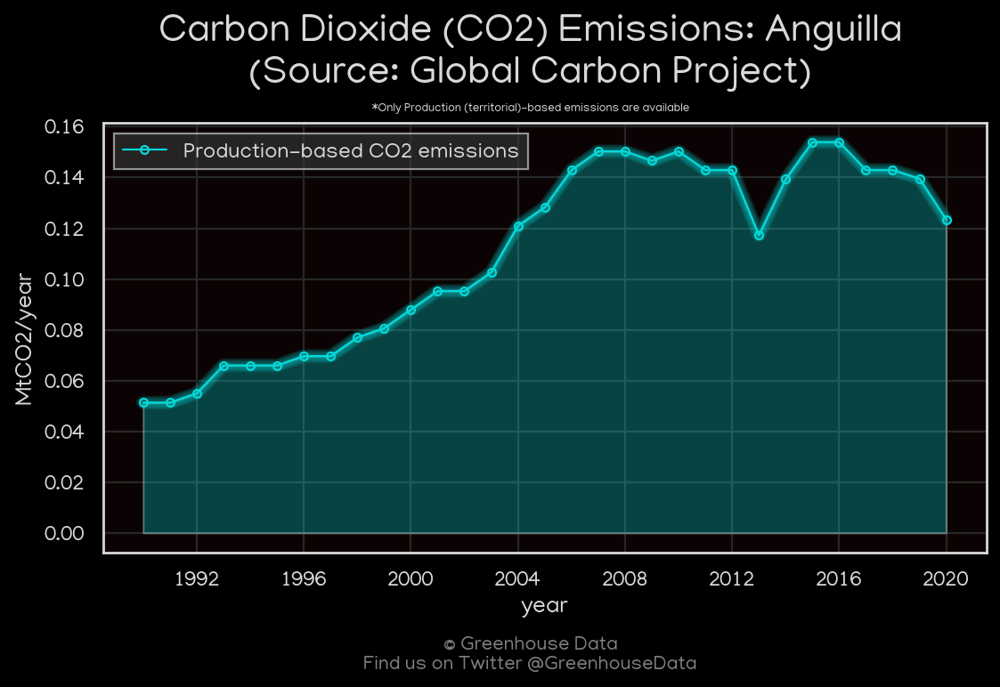

<h1 align="center">
🇦🇮🇦🇮🇦🇮🇦🇮🇦🇮
 
Anguilla
 
🇦🇮🇦🇮🇦🇮🇦🇮🇦🇮
</h1>
<h2>Datasets:</h2>

<a href="https://github.com/dquintani/GreenhouseData/tree/master/country_data/AIA_Anguilla/data">View on Github</a>
 

<a href="data/AIA_CDIAC.csv">CDIAC</a> || <a href="data/AIA_GCP.csv">GCP</a> || <a href="data/AIA_FAO.csv">FAO</a> || <a href="data/AIA_EDGAR.csv">EDGAR</a> || <a href="data/AIA_Minx_2021.csv">Minx_2021</a> || <a href="data/AIA_GCP_consupmption.csv">GCP_consupmption</a> || <a href="data/AIA_PRIMAP-hist.csv">PRIMAP-hist</a> || <a href="data/AIA_GCP_cons.csv">GCP_cons</a>

 

<h1>Figures:</h1><h2>#1 (AIA_Minx_top20_subsectors)</h2>

<h2>#2 (AIA_CDIAC_1)</h2>

<h2>#3 (AIA_CO2_totals)</h2>

<h2>#4 (AIA_GCP_1)</h2>

