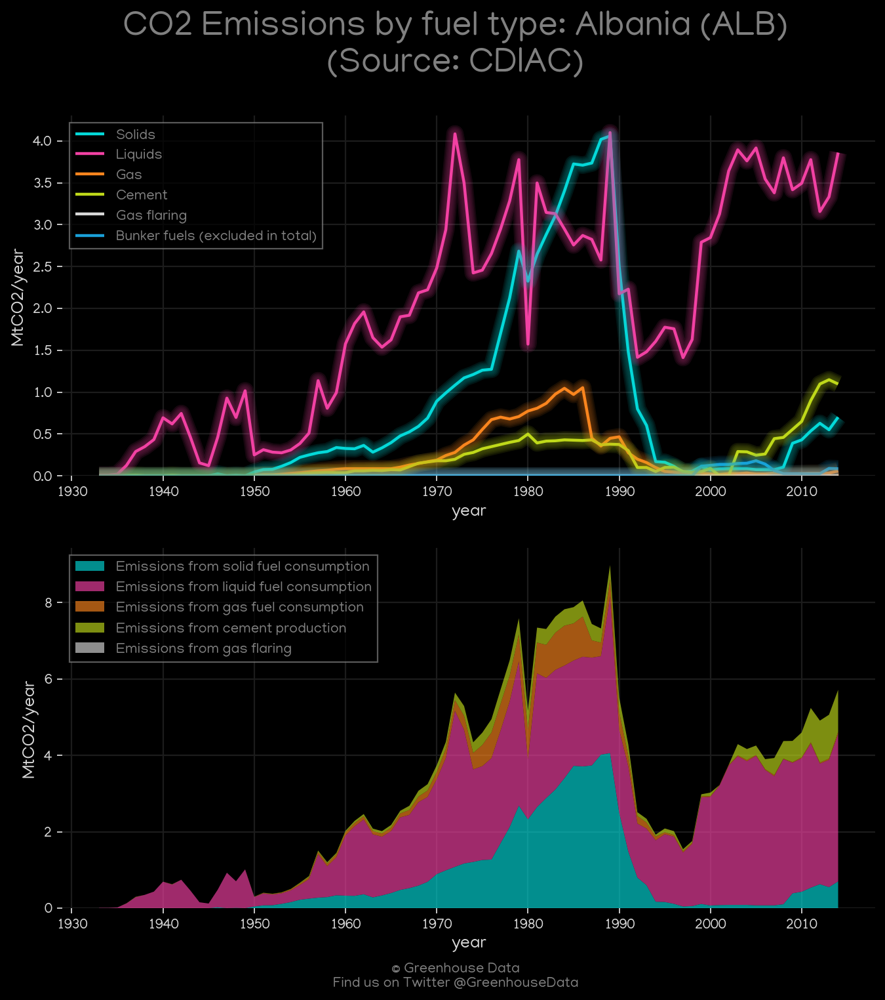
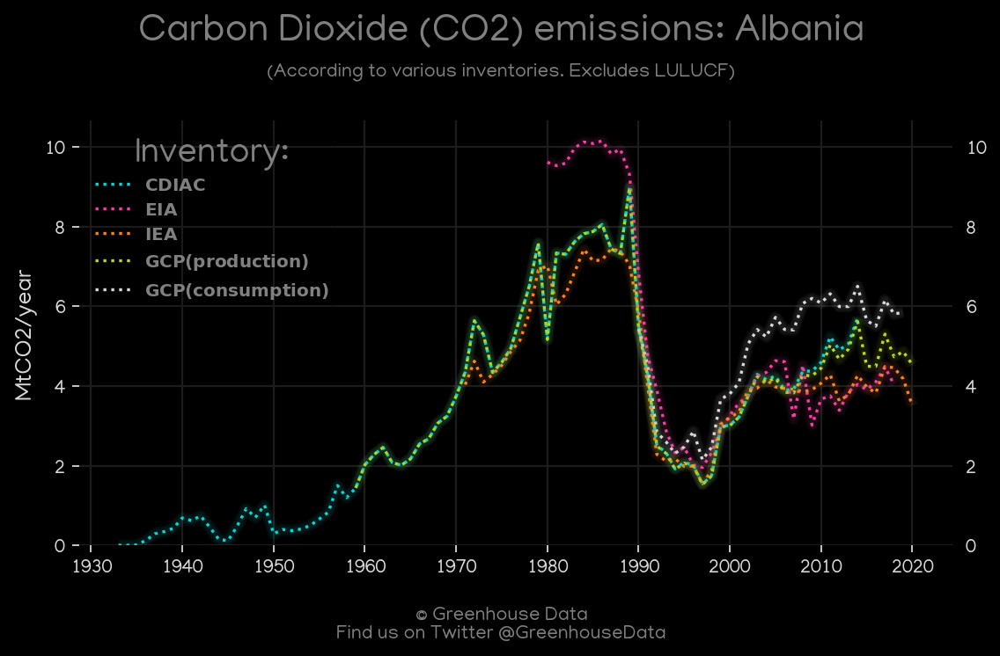
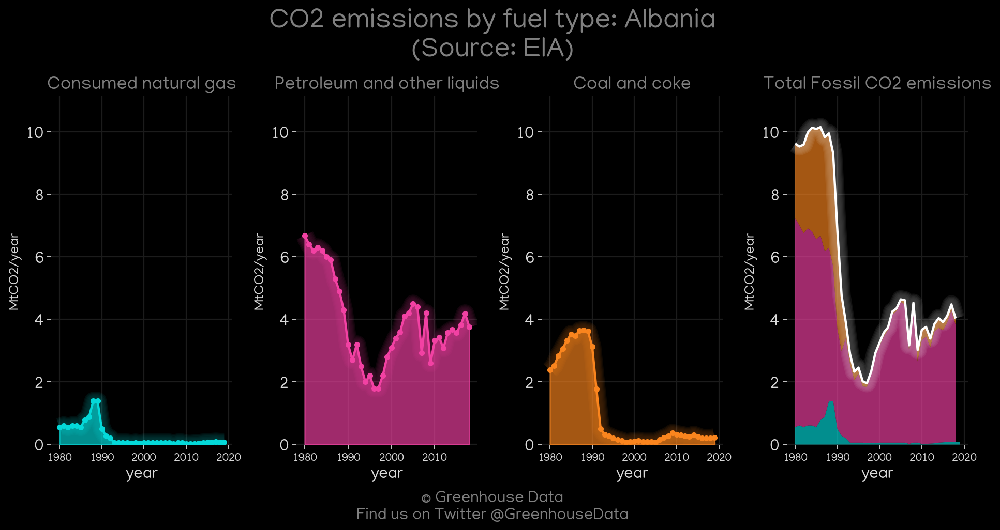
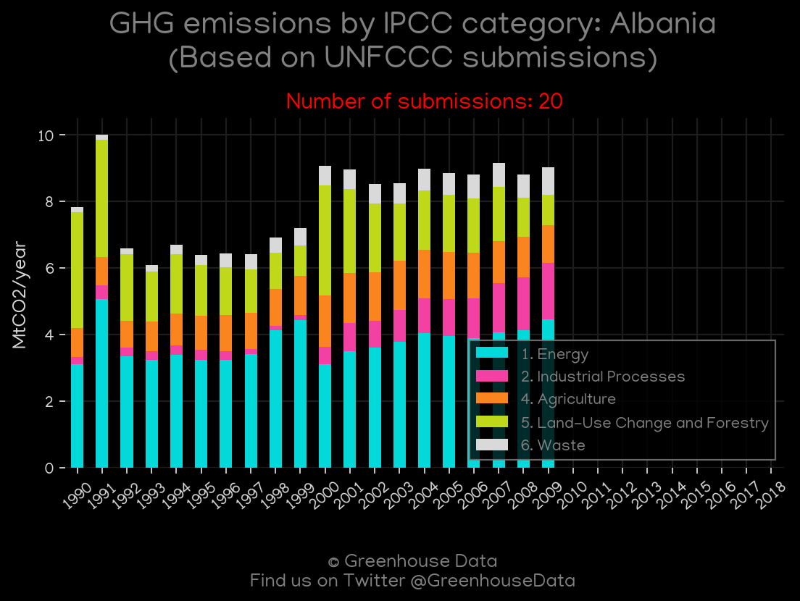
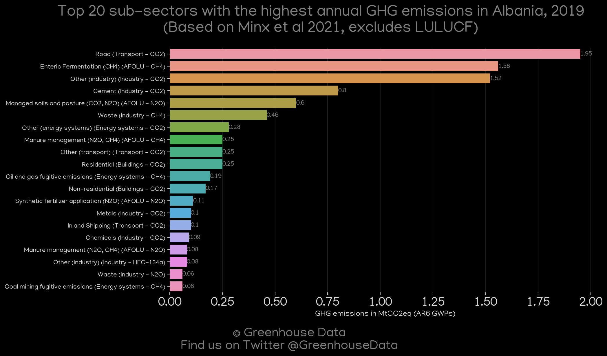
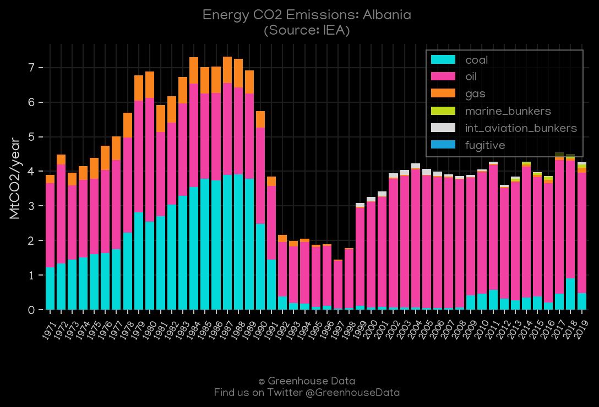
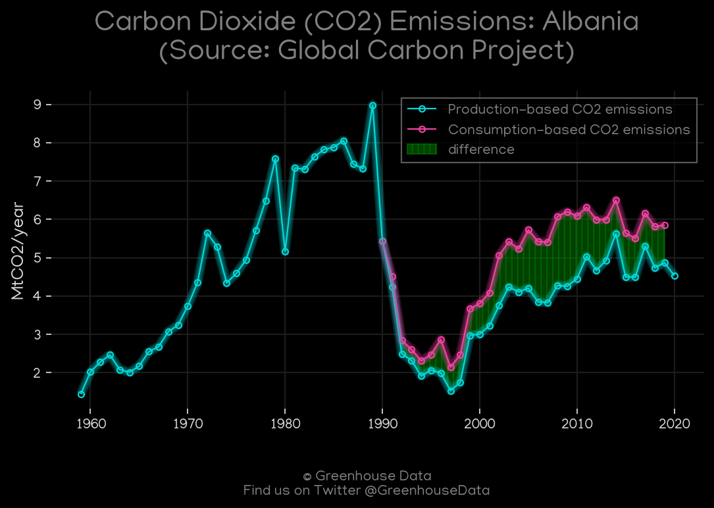

<h1 align="center">
🇦🇱🇦🇱🇦🇱🇦🇱🇦🇱
 
Albania
 
🇦🇱🇦🇱🇦🇱🇦🇱🇦🇱
</h1>
<h2>Datasets:</h2>

<a href="https://github.com/dquintani/GreenhouseData/tree/master/country_data/ALB_Albania/data">View on Github</a>
 

<a href="data/ALB_GCP.csv">GCP</a> || <a href="data/ALB_FAO.csv">FAO</a> || <a href="data/ALB_EDGAR.csv">EDGAR</a> || <a href="data/ALB_CAIT.csv">CAIT</a> || <a href="data/ALB_EIA.csv">EIA</a> || <a href="data/ALB_GCP_consupmption.csv">GCP_consupmption</a> || <a href="data/ALB_EPA.csv">EPA</a> || <a href="data/ALB_PRIMAP-hist.csv">PRIMAP-hist</a> || <a href="data/ALB_CDIAC.csv">CDIAC</a> || <a href="data/ALB_Minx_2021.csv">Minx_2021</a> || <a href="data/ALB_IEA.csv">IEA</a>

 

<h1>Figures:</h1><h2>#1 (ALB_CDIAC_1)</h2>

<h2>#2 (ALB_CO2_totals)</h2>

<h2>#3 (ALB_EIA_1)</h2>

<h2>#4 (ALB_UNFCCC_NAI_1)</h2>

<h2>#5 (ALB_CAIT_gases_1)</h2>

<h2>#6 (ALB_Minx_top20_subsectors)</h2>

<h2>#7 (ALB_IEA_1)</h2>

<h2>#8 (ALB_GCP_1)</h2>

