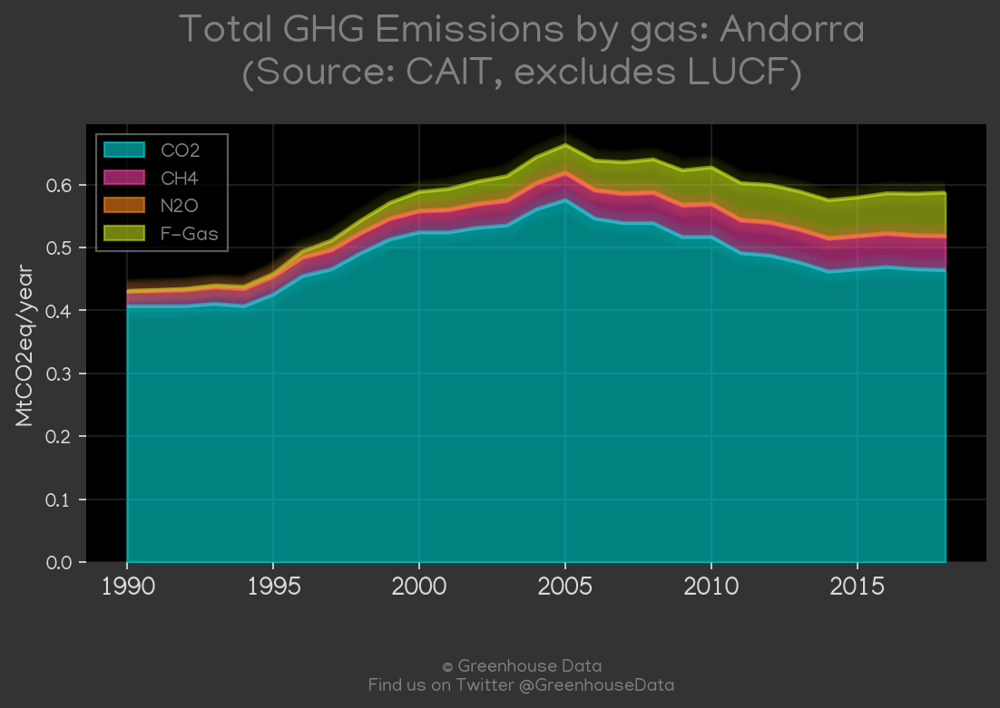
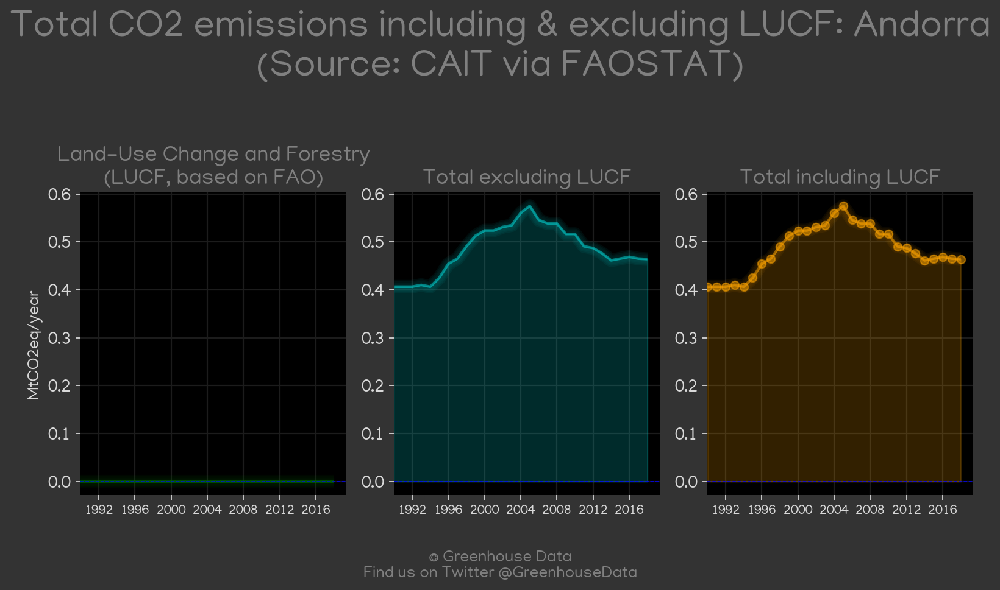
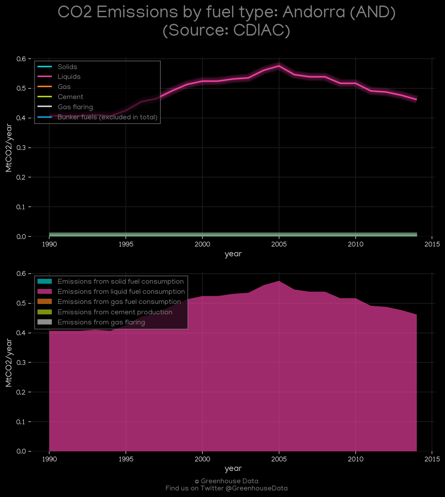
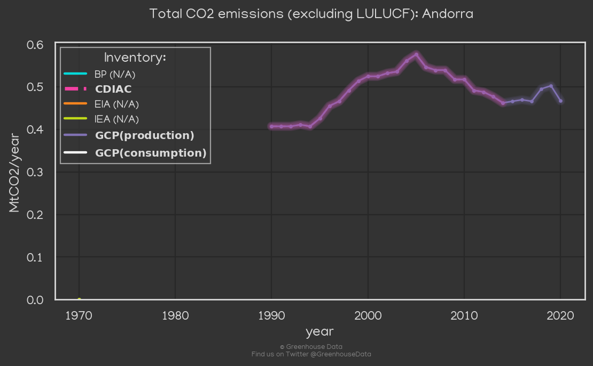
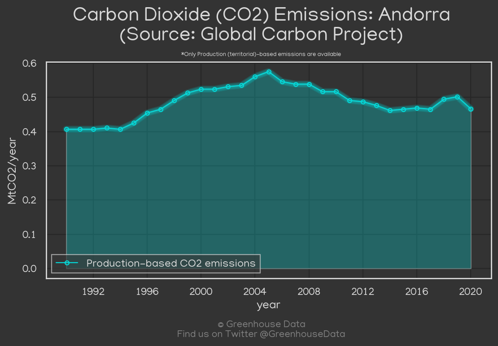
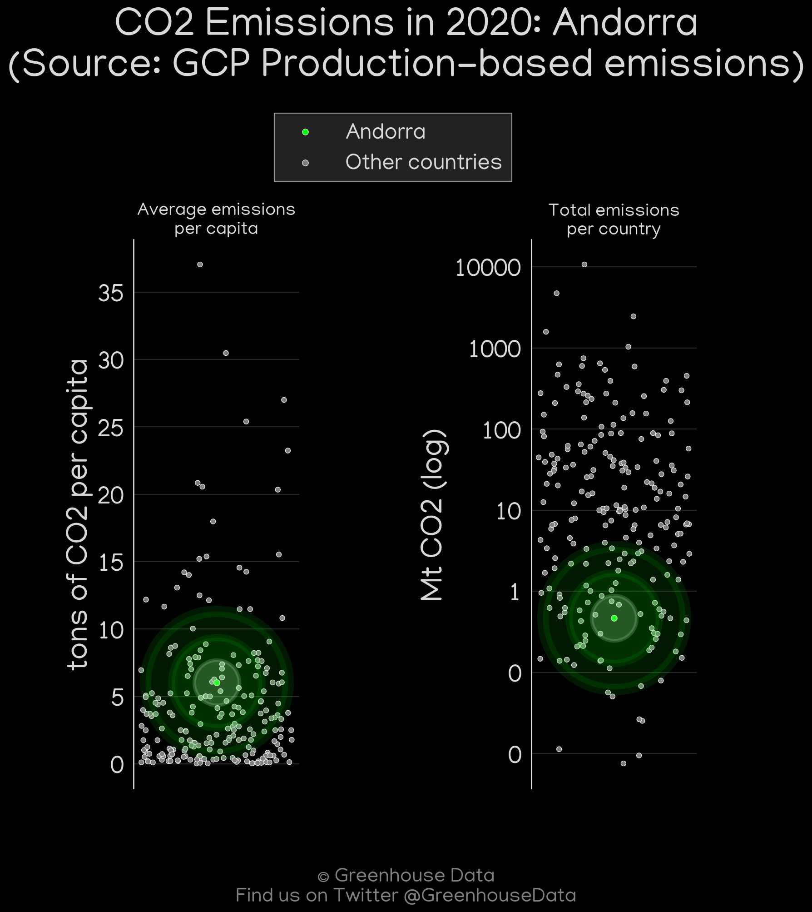
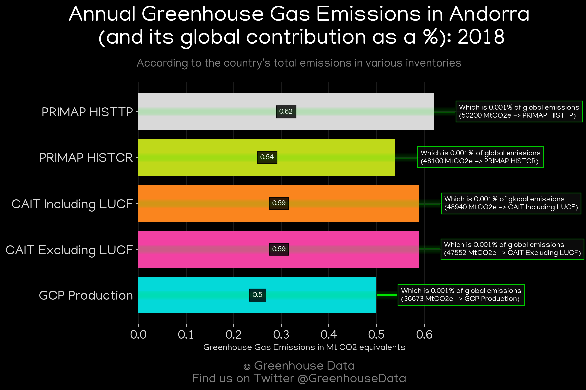

<h1 align="center">
🇦🇩🇦🇩🇦🇩🇦🇩🇦🇩
 
Andorra
 
🇦🇩🇦🇩🇦🇩🇦🇩🇦🇩
</h1>
<h2>Datasets:</h2>

<a href="https://github.com/dquintani/GreenhouseData/tree/master/country_data/AND_Andorra/data">View on Github</a>
 

<a href="data/AND_CAIT.csv">CAIT</a> || <a href="data/AND_CDIAC.csv">CDIAC</a> || <a href="data/AND_EPA.csv">EPA</a> || <a href="data/AND_FAO.csv">FAO</a> || <a href="data/AND_GCP.csv">GCP</a> || <a href="data/AND_GCP_consupmption.csv">GCP_consupmption</a> || <a href="data/AND_PRIMAP-hist.csv">PRIMAP-hist</a>

 

<h1>Figures:</h1><h2>#1 (AND_CAIT_gases_1)</h2>

<h2>#2 (AND_CAIT_lucf_vs_nolucf)</h2>

<h2>#3 (AND_CDIAC_1)</h2>

<h2>#4 (AND_CO2_totals)</h2>

<h2>#5 (AND_GCP_1)</h2>

<h2>#6 (AND_GCP_Country_Highlight)</h2>

<h2>#7 (AND_relative_totals)</h2>

