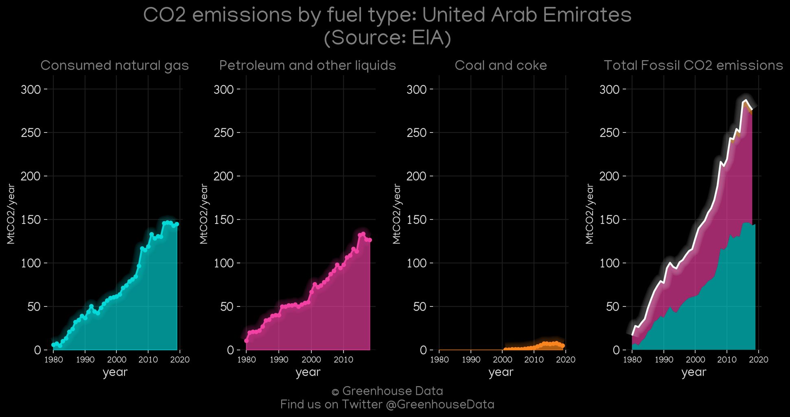
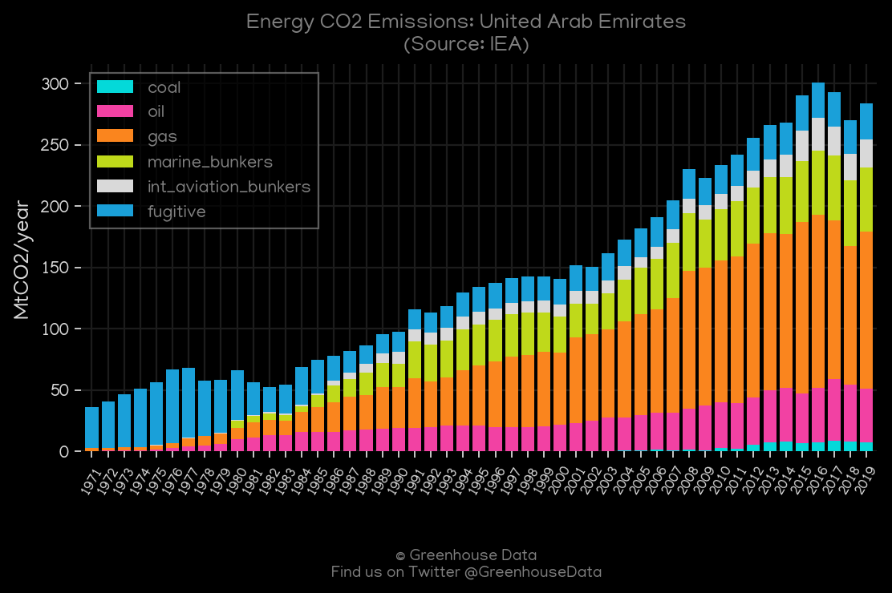
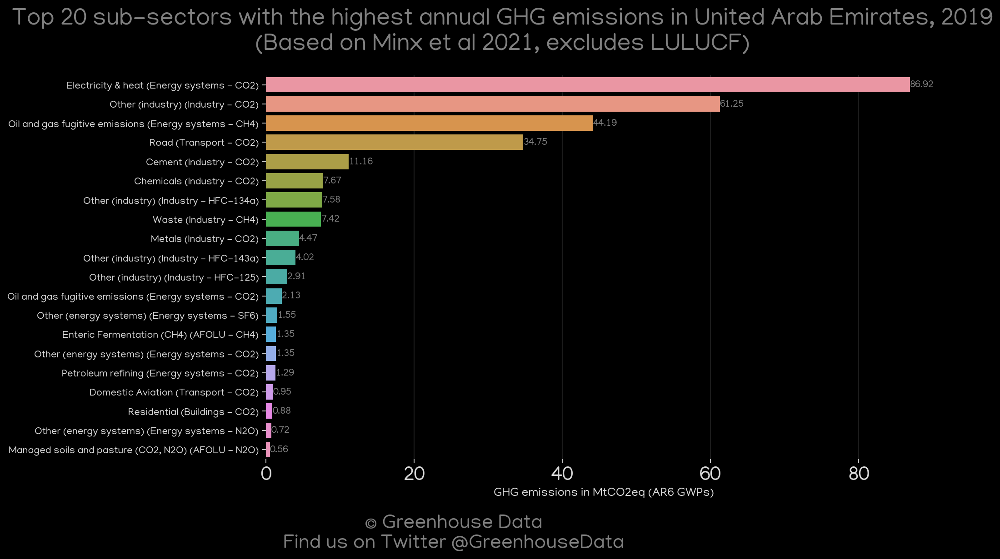
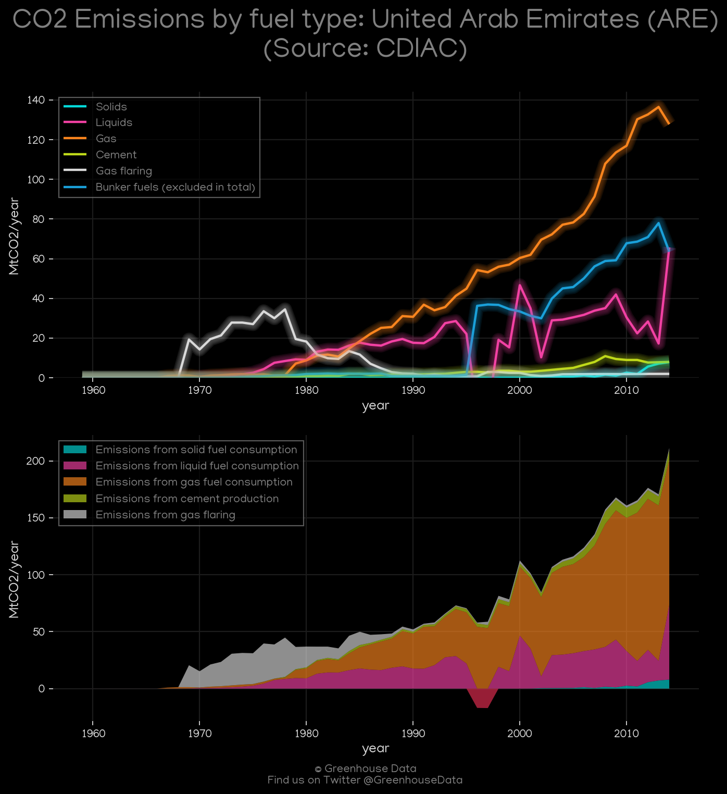
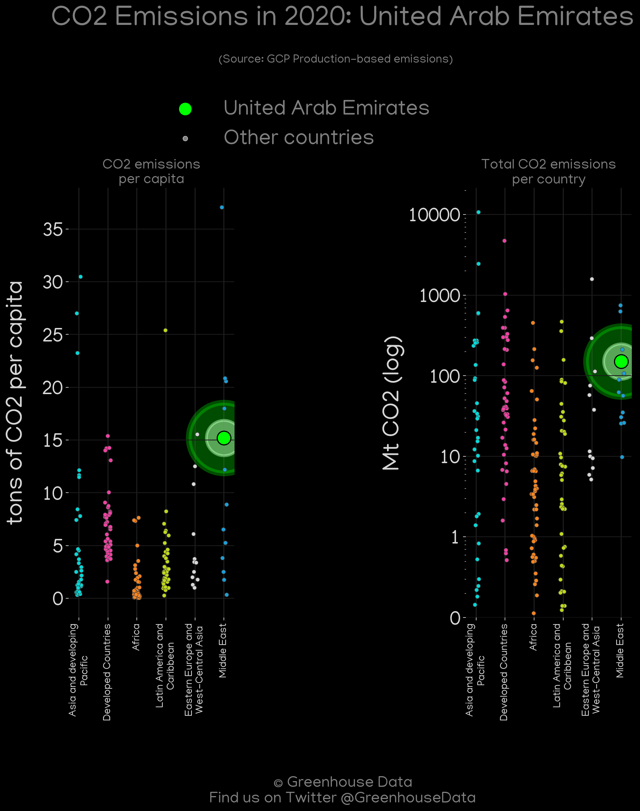
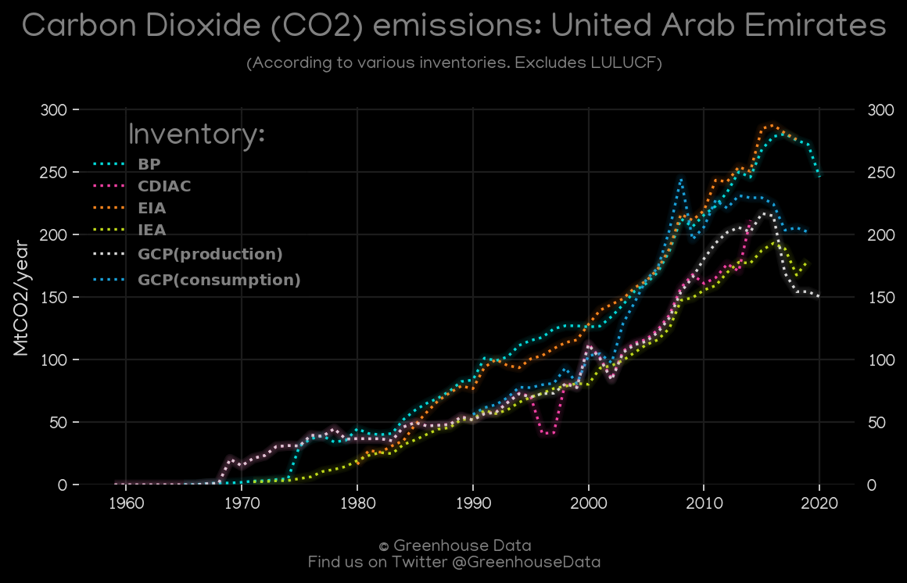
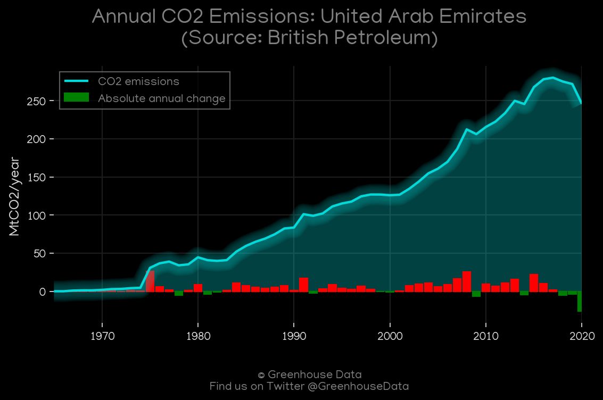

<h1 align="center">
🇦🇪🇦🇪🇦🇪🇦🇪🇦🇪
 
United Arab Emirates
 
🇦🇪🇦🇪🇦🇪🇦🇪🇦🇪
</h1>
<h2>Datasets:</h2>

<a href="https://github.com/dquintani/GreenhouseData/tree/master/country_data/ARE_United Arab Emirates/data">View on Github</a>
 

<a href="data/ARE_EIA.csv">EIA</a> || <a href="data/ARE_EDGAR.csv">EDGAR</a> || <a href="data/ARE_GCP_consupmption.csv">GCP_consupmption</a> || <a href="data/ARE_EPA.csv">EPA</a> || <a href="data/ARE_BP.csv">BP</a> || <a href="data/ARE_FAO.csv">FAO</a> || <a href="data/ARE_PRIMAP-hist.csv">PRIMAP-hist</a> || <a href="data/ARE_IEA.csv">IEA</a> || <a href="data/ARE_CDIAC.csv">CDIAC</a> || <a href="data/ARE_GCP.csv">GCP</a> || <a href="data/ARE_Minx_2021.csv">Minx_2021</a> || <a href="data/ARE_CAIT.csv">CAIT</a>

 

<h1>Figures:</h1><h2>#1 (ARE_CAIT_gases_1)</h2>

<h2>#2 (ARE_GCP_1)</h2>

<h2>#3 (ARE_EIA_1)</h2>

<h2>#4 (ARE_IEA_1)</h2>

<h2>#5 (ARE_Minx_top20_subsectors)</h2>

<h2>#6 (ARE_relative_totals)</h2>

<h2>#7 (ARE_CDIAC_1)</h2>

<h2>#8 (ARE_GCP_Country_Highlight)</h2>

<h2>#9 (ARE_CO2_totals)</h2>

<h2>#10 (ARE_BP_1)</h2>

<h2>#11 (ARE_UNFCCC_NAI_1)</h2>

