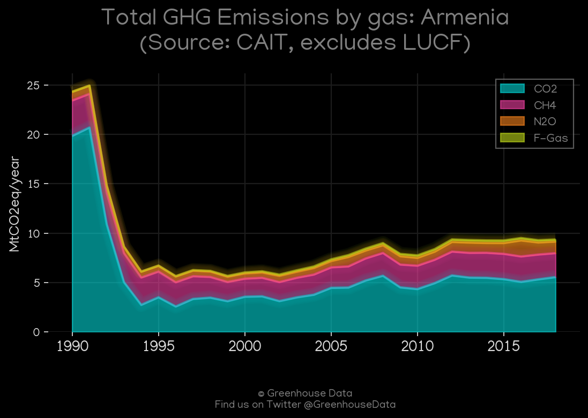
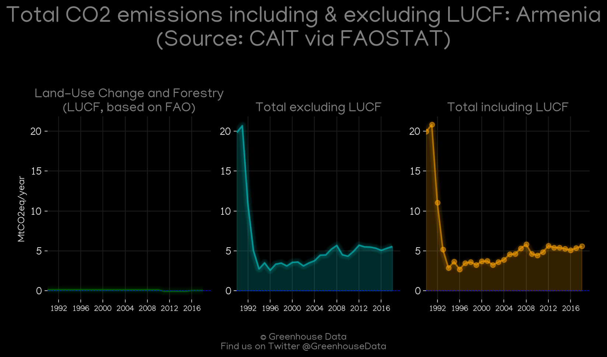
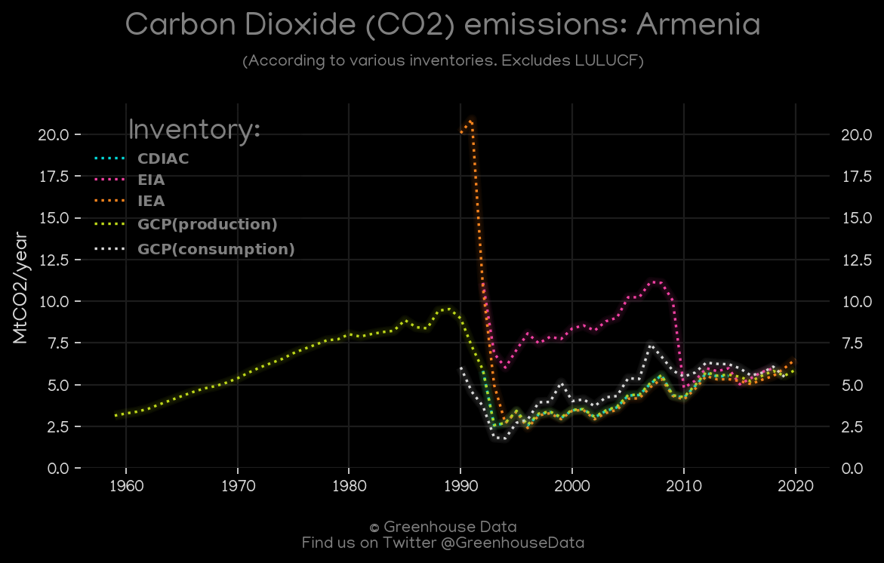
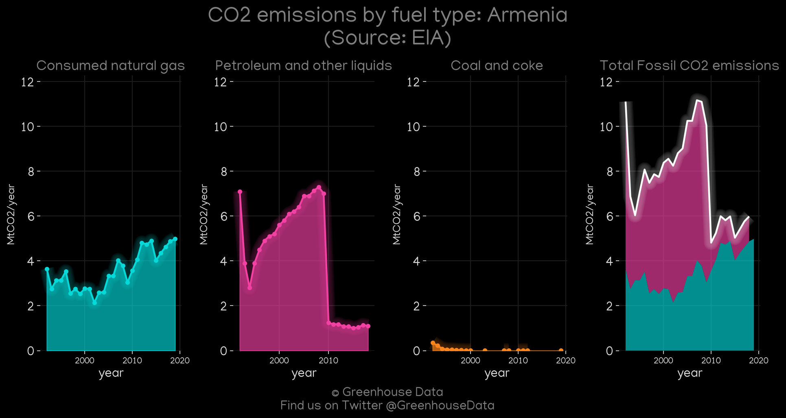
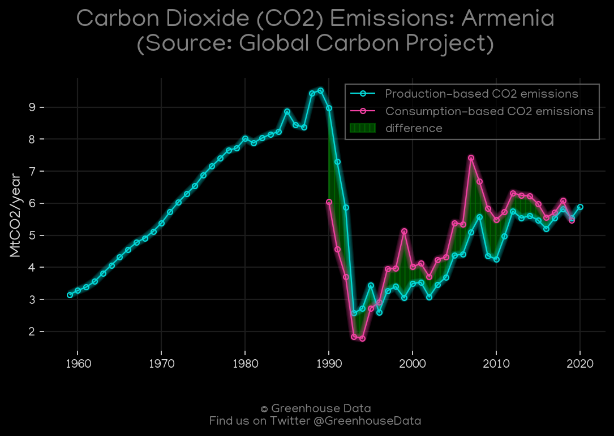
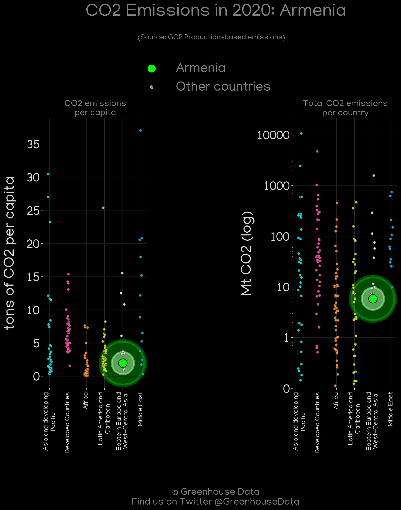
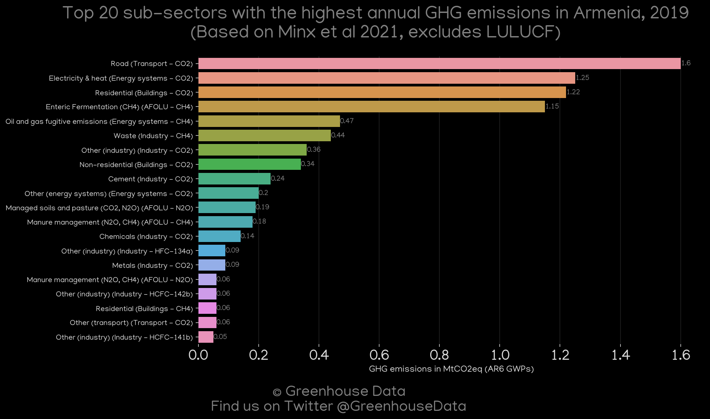

<h1 align="center">
🇦🇲🇦🇲🇦🇲🇦🇲🇦🇲
 
Armenia
 
🇦🇲🇦🇲🇦🇲🇦🇲🇦🇲
</h1>
<h2>Datasets:</h2>

<a href="https://github.com/dquintani/GreenhouseData/tree/master/country_data/ARM_Armenia/data">View on Github</a>
 

<a href="data/ARM_CAIT.csv">CAIT</a> || <a href="data/ARM_CDIAC.csv">CDIAC</a> || <a href="data/ARM_EDGAR.csv">EDGAR</a> || <a href="data/ARM_EIA.csv">EIA</a> || <a href="data/ARM_EPA.csv">EPA</a> || <a href="data/ARM_FAO.csv">FAO</a> || <a href="data/ARM_GCP.csv">GCP</a> || <a href="data/ARM_GCP_consupmption.csv">GCP_consupmption</a> || <a href="data/ARM_IEA.csv">IEA</a> || <a href="data/ARM_Minx_2021.csv">Minx_2021</a> || <a href="data/ARM_PRIMAP-hist.csv">PRIMAP-hist</a>

 

<h1>Figures:</h1><h2>#1 (ARM_CAIT_gases_1)</h2>

<h2>#2 (ARM_CAIT_lucf_vs_nolucf)</h2>

<h2>#3 (ARM_CDIAC_1)</h2>

<h2>#4 (ARM_CO2_totals)</h2>

<h2>#5 (ARM_EIA_1)</h2>

<h2>#6 (ARM_GCP_1)</h2>

<h2>#7 (ARM_GCP_Country_Highlight)</h2>

<h2>#8 (ARM_IEA_1)</h2>

<h2>#9 (ARM_Minx_top20_subsectors)</h2>

<h2>#10 (ARM_relative_totals)</h2>

<h2>#11 (ARM_UNFCCC_NAI_1)</h2>

