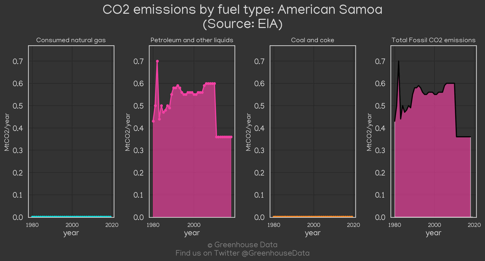
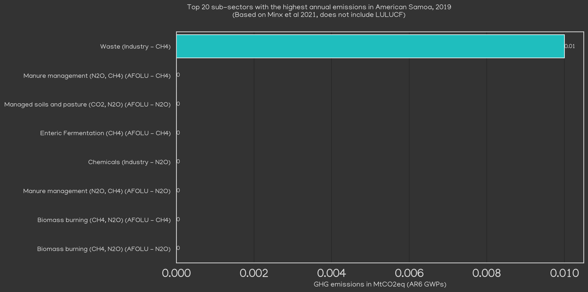
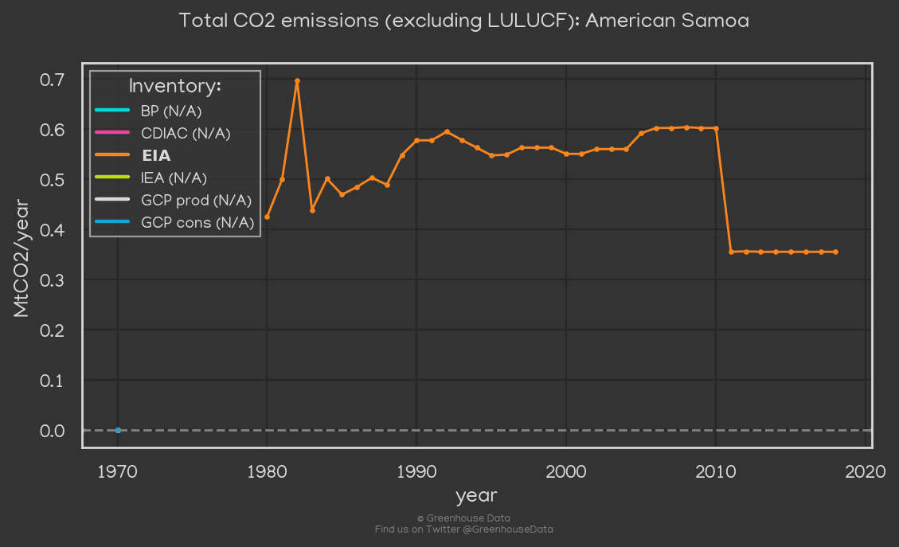

<h1 align="center">
🇦🇸🇦🇸🇦🇸🇦🇸🇦🇸
 
American Samoa
 
🇦🇸🇦🇸🇦🇸🇦🇸🇦🇸
</h1>
<h2>Datasets:</h2>

<a href="https://github.com/dquintani/Greenhouse-Data/tree/master/country_data/ASM_American Samoa/data">View on Github</a>
 

<a href="data/ASM_FAO.csv">FAO</a> || <a href="data/ASM_EIA.csv">EIA</a> || <a href="data/ASM_Minx_2021.csv">Minx_2021</a> || <a href="data/ASM_EDGAR.csv">EDGAR</a>

 

<h1>Figures:</h1><h2>#1 (ASM_EIA_1)</h2>

<h2>#2 (ASM_Minx_top20_subsectors)</h2>

<h2>#3 (ASM_CO2_totals)</h2>

