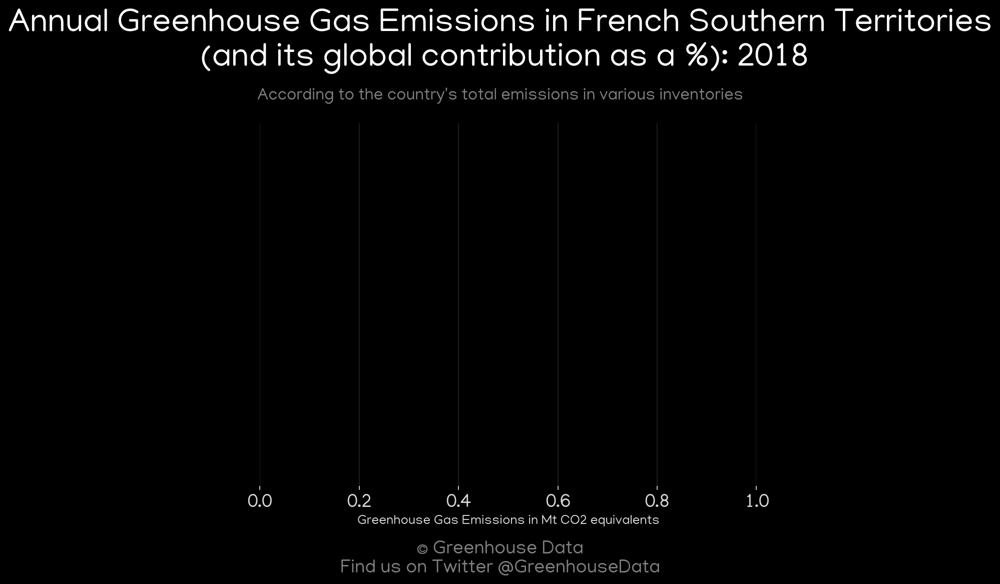
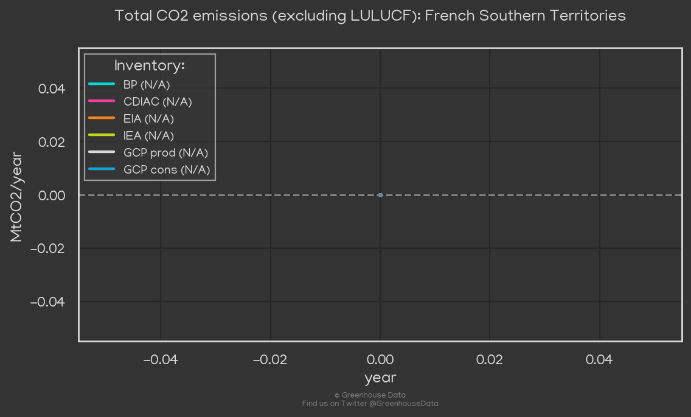

<h1 align="center">
🇹🇫🇹🇫🇹🇫🇹🇫🇹🇫
 
French Southern Territories
 
🇹🇫🇹🇫🇹🇫🇹🇫🇹🇫
</h1>
<h2>Datasets:</h2>

<a href="https://github.com/dquintani/GreenhouseData/tree/master/country_data/ATF_French Southern Territories/data">View on Github</a>
 

<a href="data/ATF_Minx_2021.csv">Minx_2021</a> || <a href="data/ATF_EDGAR.csv">EDGAR</a>

 

<h1>Figures:</h1><h2>#1 (ATF_relative_totals)</h2>

<h2>#2 (ATF_CO2_totals)</h2>

