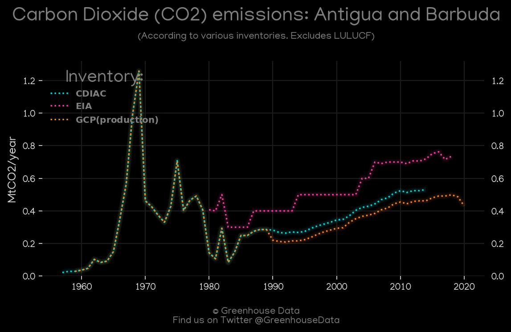
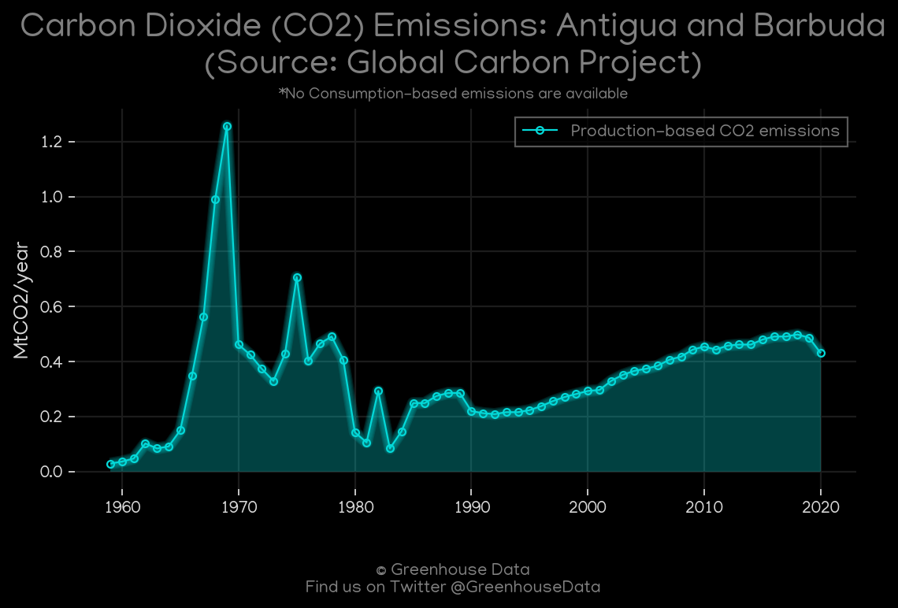
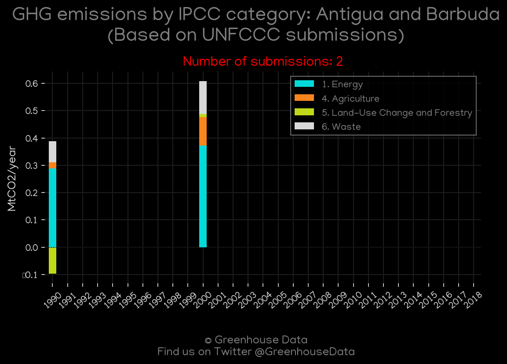
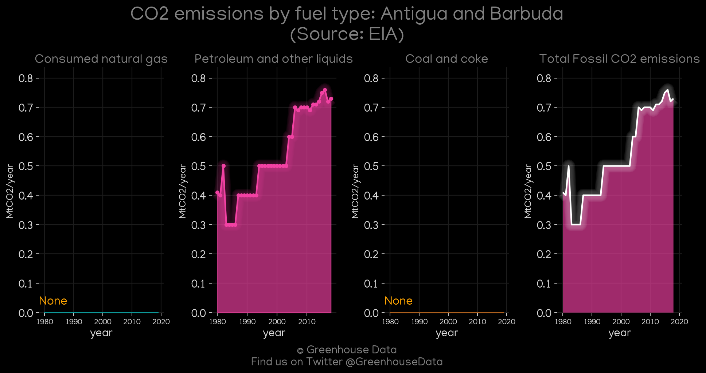
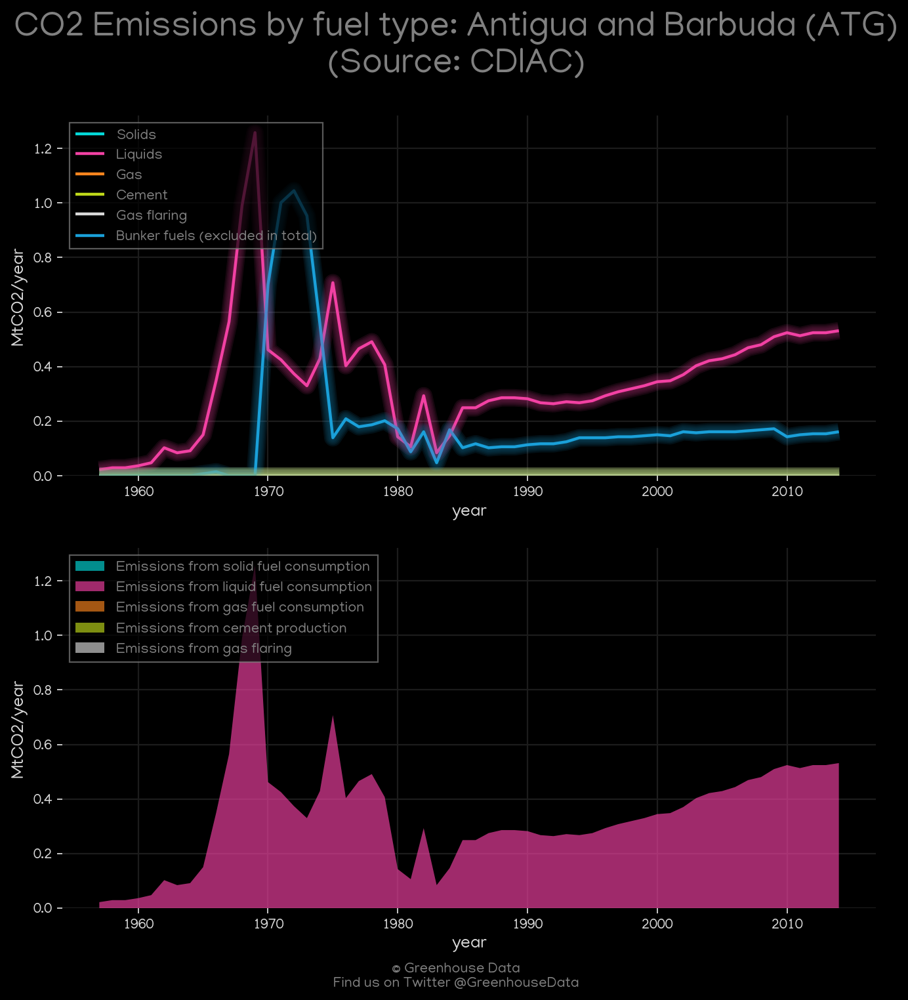
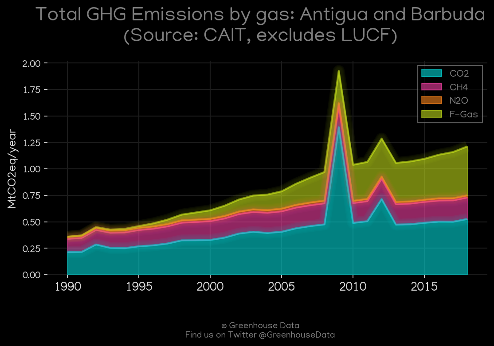

<h1 align="center">
🇦🇬🇦🇬🇦🇬🇦🇬🇦🇬
 
Antigua and Barbuda
 
🇦🇬🇦🇬🇦🇬🇦🇬🇦🇬
</h1>
<h2>Datasets:</h2>

<a href="https://github.com/dquintani/GreenhouseData/tree/master/country_data/ATG_Antigua and Barbuda/data">View on Github</a>
 

<a href="data/ATG_PRIMAP-hist.csv">PRIMAP-hist</a> || <a href="data/ATG_EDGAR.csv">EDGAR</a> || <a href="data/ATG_Minx_2021.csv">Minx_2021</a> || <a href="data/ATG_CAIT.csv">CAIT</a> || <a href="data/ATG_GCP_consupmption.csv">GCP_consupmption</a> || <a href="data/ATG_GCP.csv">GCP</a> || <a href="data/ATG_EIA.csv">EIA</a> || <a href="data/ATG_CDIAC.csv">CDIAC</a> || <a href="data/ATG_EPA.csv">EPA</a> || <a href="data/ATG_FAO.csv">FAO</a>

 

<h1>Figures:</h1><h2>#1 (ATG_CO2_totals)</h2>

<h2>#2 (ATG_GCP_1)</h2>

<h2>#3 (ATG_relative_totals)</h2>

<h2>#4 (ATG_UNFCCC_NAI_1)</h2>

<h2>#5 (ATG_Minx_top20_subsectors)</h2>

<h2>#6 (ATG_EIA_1)</h2>

<h2>#7 (ATG_CDIAC_1)</h2>

<h2>#8 (ATG_GCP_Country_Highlight)</h2>

<h2>#9 (ATG_CAIT_gases_1)</h2>

