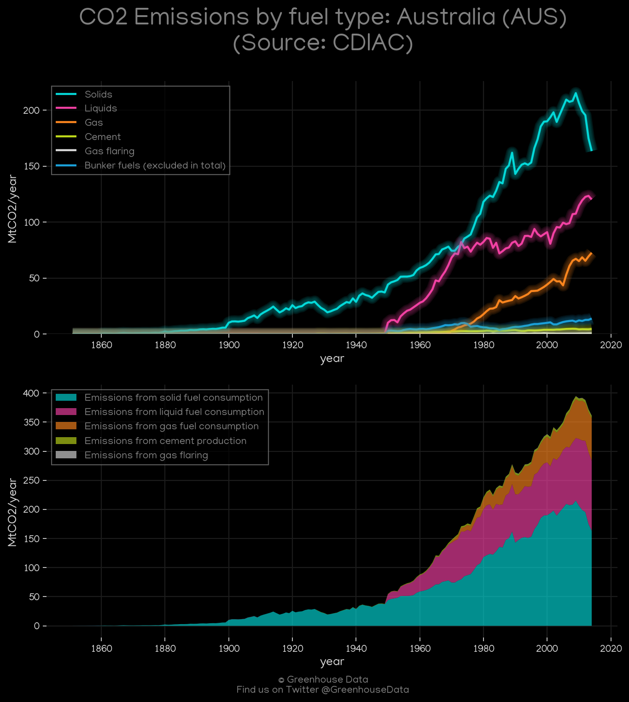
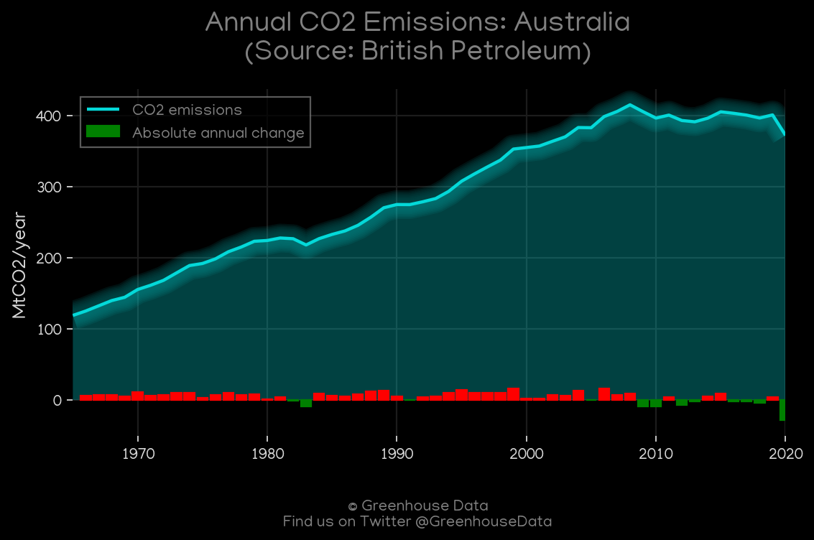
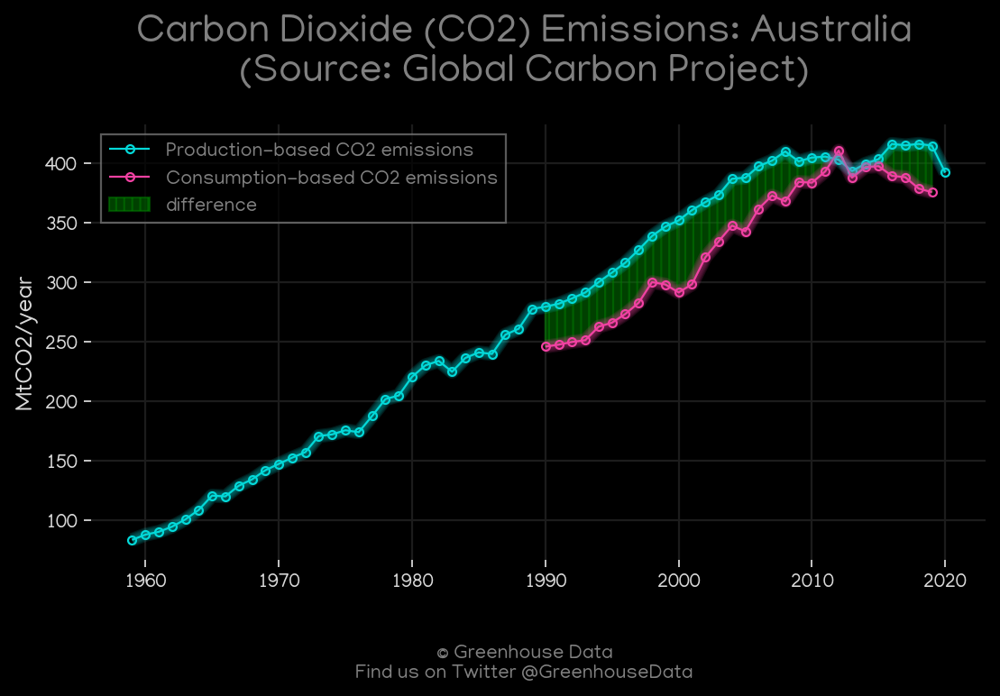
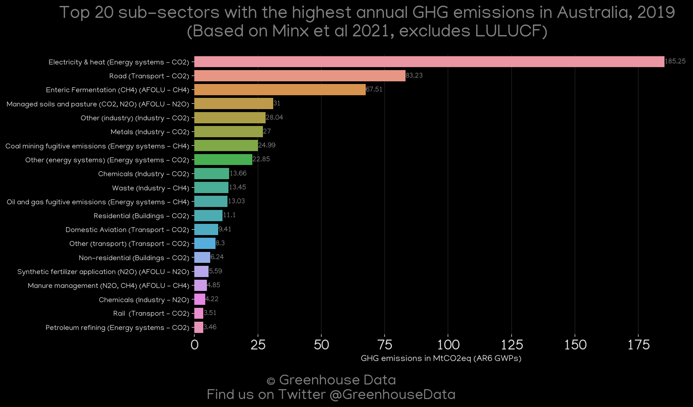
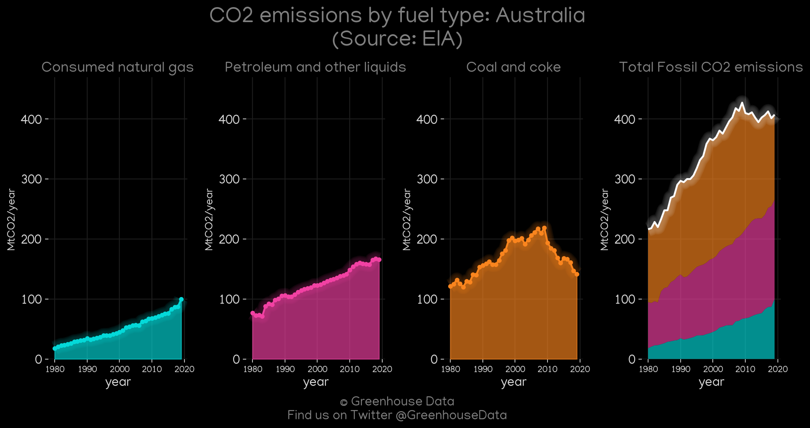
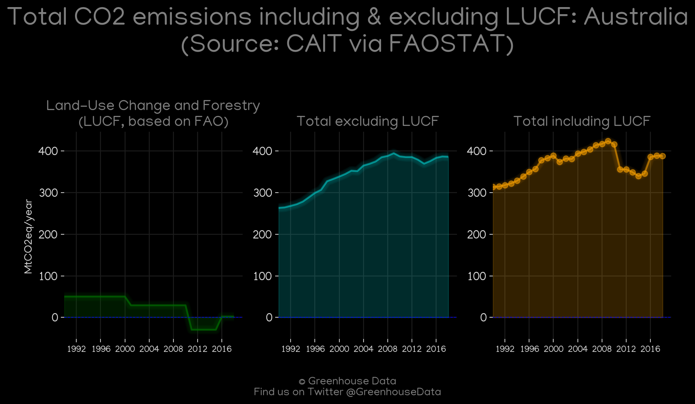
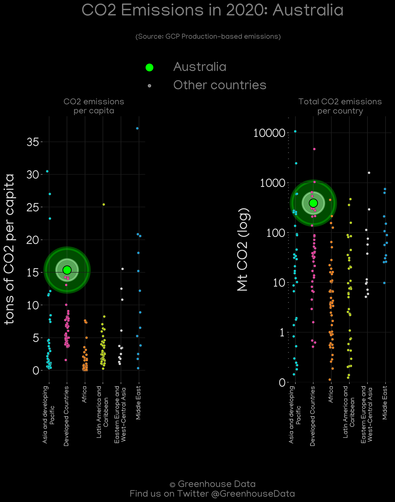
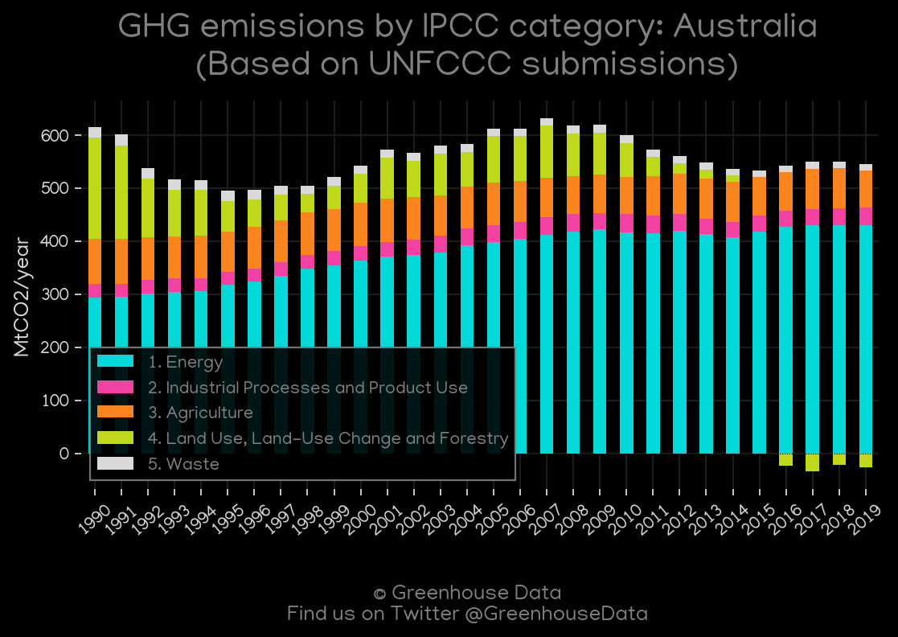
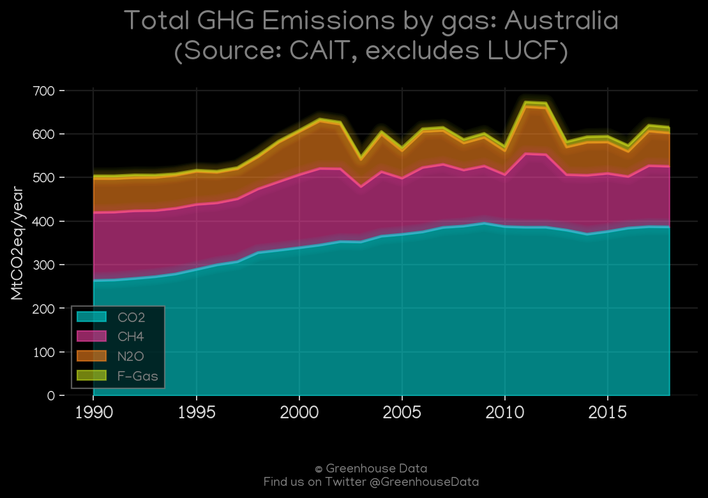

<h1 align="center">
🇦🇺🇦🇺🇦🇺🇦🇺🇦🇺
 
Australia
 
🇦🇺🇦🇺🇦🇺🇦🇺🇦🇺
</h1>
<h2>Datasets:</h2>

<a href="https://github.com/dquintani/GreenhouseData/tree/master/country_data/AUS_Australia/data">View on Github</a>
 

<a href="data/AUS_CAIT.csv">CAIT</a> || <a href="data/AUS_EPA.csv">EPA</a> || <a href="data/AUS_IEA.csv">IEA</a> || <a href="data/AUS_BP.csv">BP</a> || <a href="data/AUS_CDIAC.csv">CDIAC</a> || <a href="data/AUS_EDGAR.csv">EDGAR</a> || <a href="data/AUS_Minx_2021.csv">Minx_2021</a> || <a href="data/AUS_EIA.csv">EIA</a> || <a href="data/AUS_GCP.csv">GCP</a> || <a href="data/AUS_GCP_consupmption.csv">GCP_consupmption</a> || <a href="data/AUS_PRIMAP-hist.csv">PRIMAP-hist</a> || <a href="data/AUS_FAO.csv">FAO</a>

 

<h1>Figures:</h1><h2>#1 (AUS_CDIAC_1)</h2>

<h2>#2 (AUS_BP_1)</h2>

<h2>#3 (AUS_IEA_1)</h2>

<h2>#4 (AUS_GCP_1)</h2>

<h2>#5 (AUS_Minx_top20_subsectors)</h2>

<h2>#6 (AUS_EIA_1)</h2>

<h2>#7 (AUS_CAIT_lucf_vs_nolucf)</h2>

<h2>#8 (AUS_GCP_Country_Highlight)</h2>

<h2>#9 (AUS_CO2_totals)</h2>

<h2>#10 (AUS_UNFCCC_AI_1)</h2>

<h2>#11 (AUS_CAIT_gases_1)</h2>

