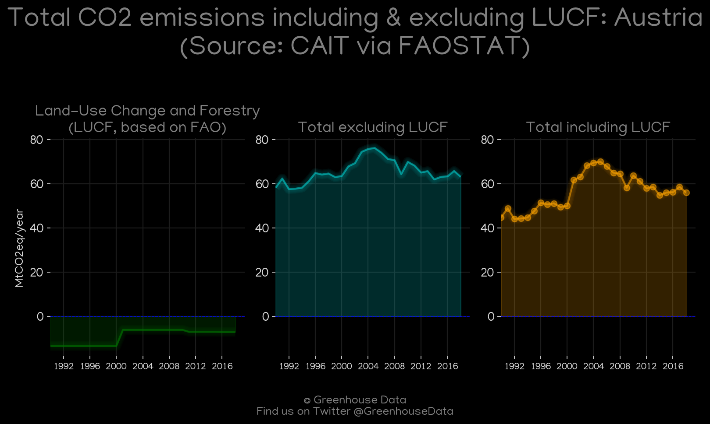
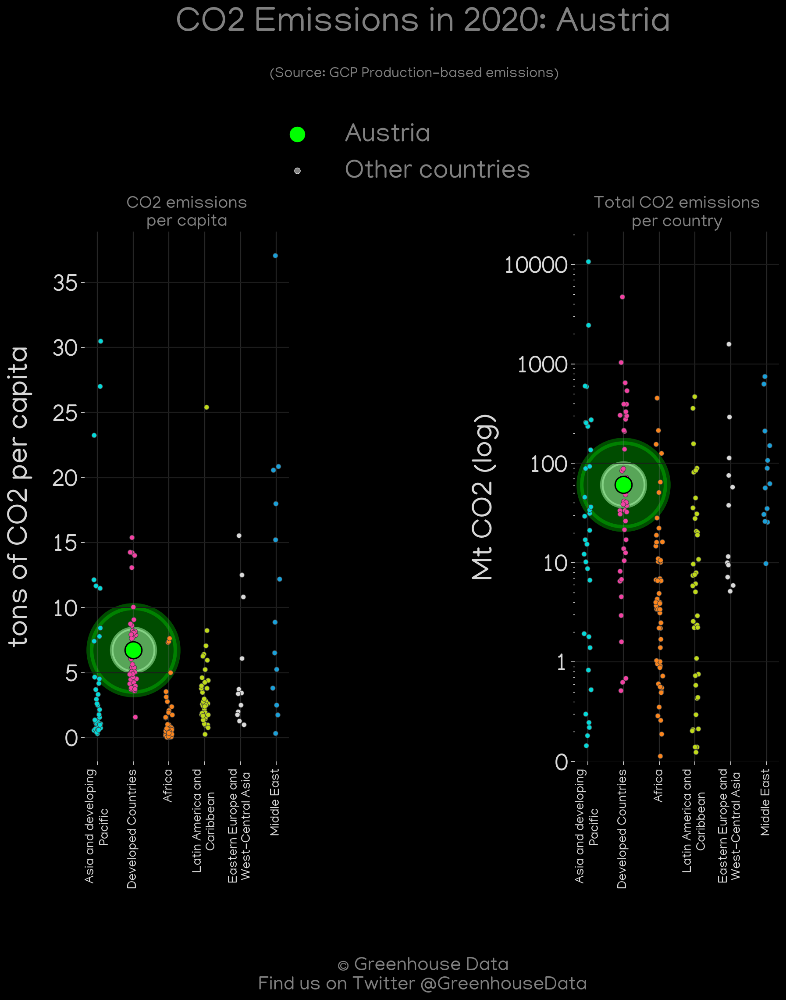
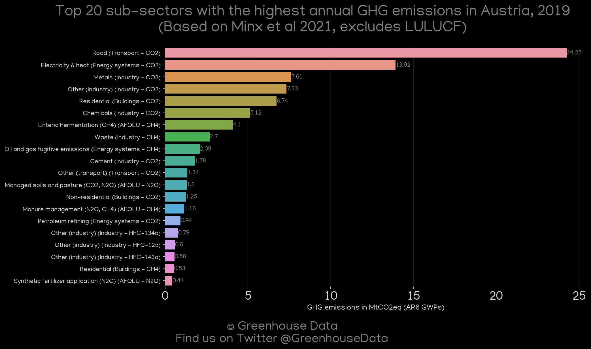
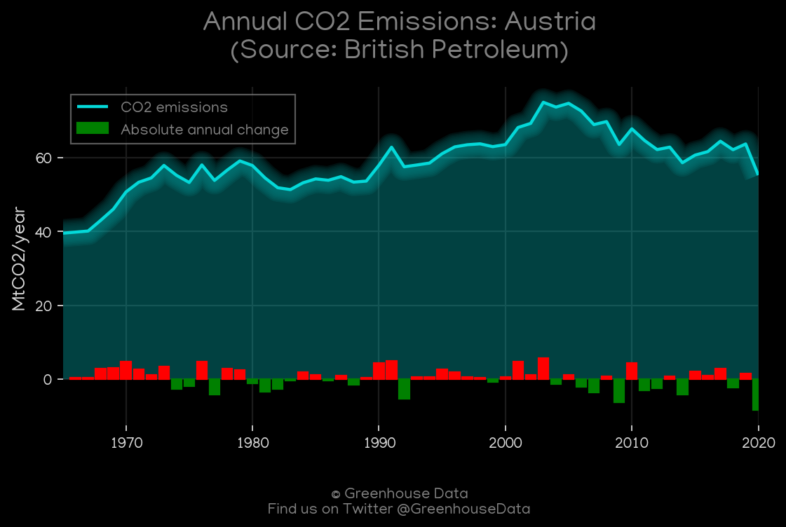
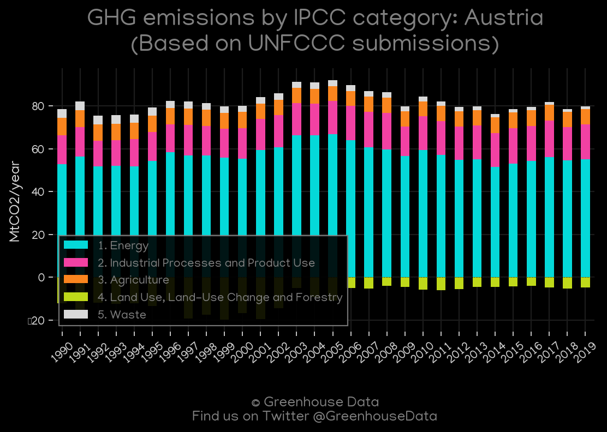
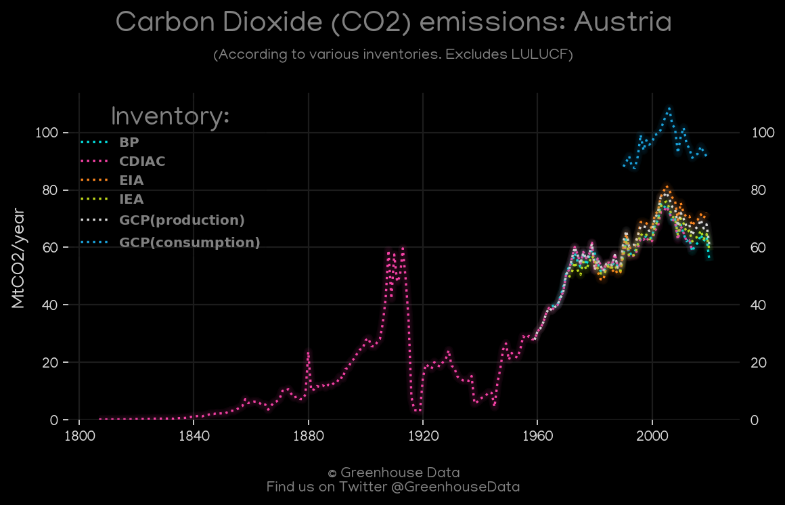
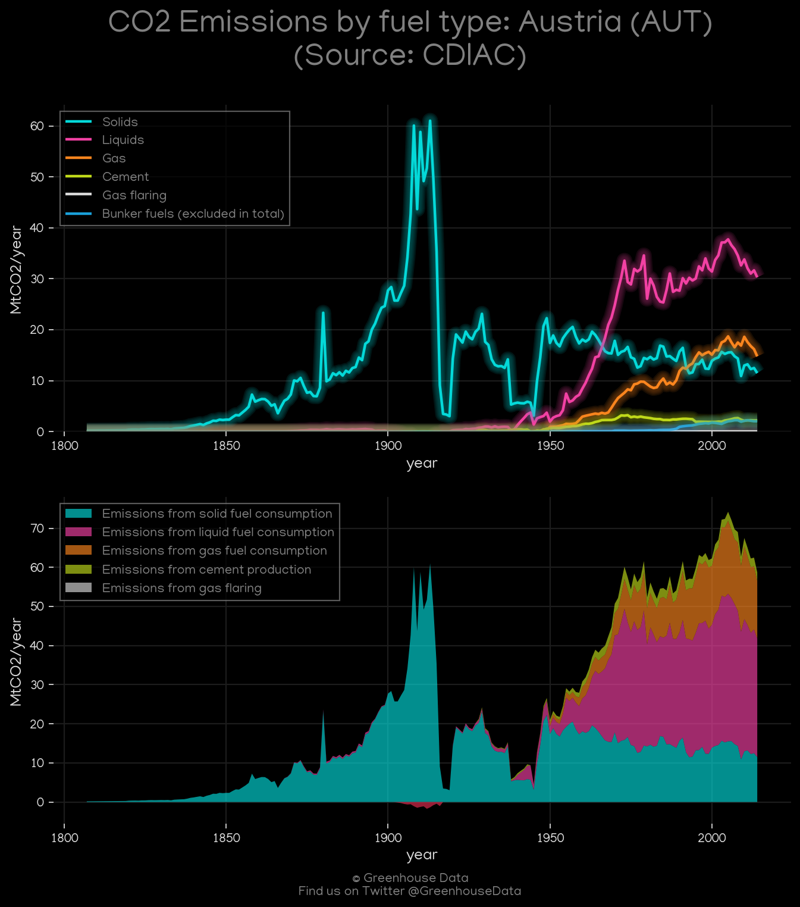
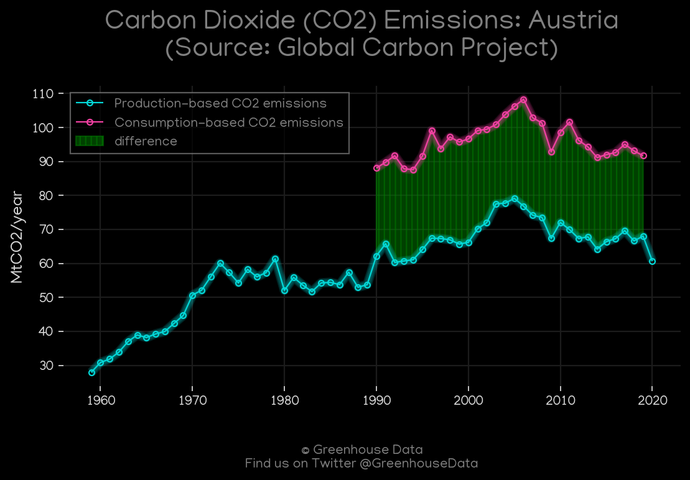
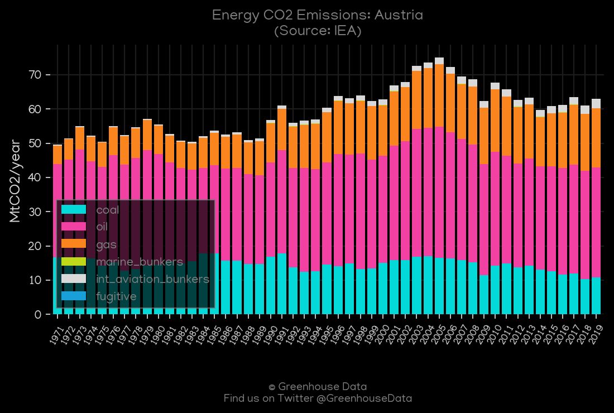

<h1 align="center">
🇦🇹🇦🇹🇦🇹🇦🇹🇦🇹
 
Austria
 
🇦🇹🇦🇹🇦🇹🇦🇹🇦🇹
</h1>
<h2>Datasets:</h2>

<a href="https://github.com/dquintani/GreenhouseData/tree/master/country_data/AUT_Austria/data">View on Github</a>
 

<a href="data/AUT_EIA.csv">EIA</a> || <a href="data/AUT_CAIT.csv">CAIT</a> || <a href="data/AUT_BP.csv">BP</a> || <a href="data/AUT_FAO.csv">FAO</a> || <a href="data/AUT_IEA.csv">IEA</a> || <a href="data/AUT_PRIMAP-hist.csv">PRIMAP-hist</a> || <a href="data/AUT_CDIAC.csv">CDIAC</a> || <a href="data/AUT_GCP_consupmption.csv">GCP_consupmption</a> || <a href="data/AUT_GCP.csv">GCP</a> || <a href="data/AUT_EDGAR.csv">EDGAR</a> || <a href="data/AUT_EPA.csv">EPA</a> || <a href="data/AUT_Minx_2021.csv">Minx_2021</a>

 

<h1>Figures:</h1><h2>#1 (AUT_CAIT_lucf_vs_nolucf)</h2>

<h2>#2 (AUT_GCP_Country_Highlight)</h2>

<h2>#3 (AUT_Minx_top20_subsectors)</h2>

<h2>#4 (AUT_BP_1)</h2>

<h2>#5 (AUT_UNFCCC_AI_1)</h2>

<h2>#6 (AUT_CO2_totals)</h2>

<h2>#7 (AUT_CDIAC_1)</h2>

<h2>#8 (AUT_EIA_1)</h2>

<h2>#9 (AUT_GCP_1)</h2>

<h2>#10 (AUT_IEA_1)</h2>

<h2>#11 (AUT_CAIT_gases_1)</h2>

