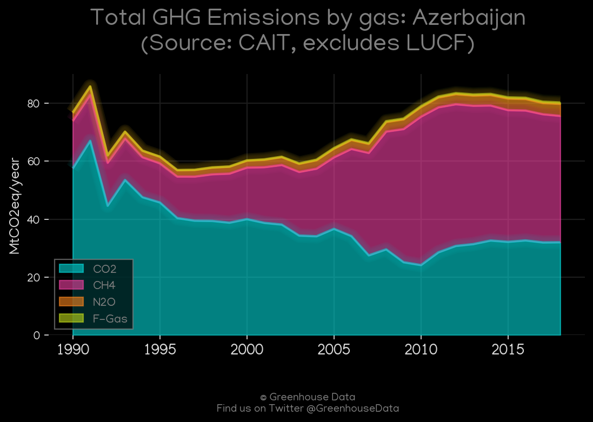
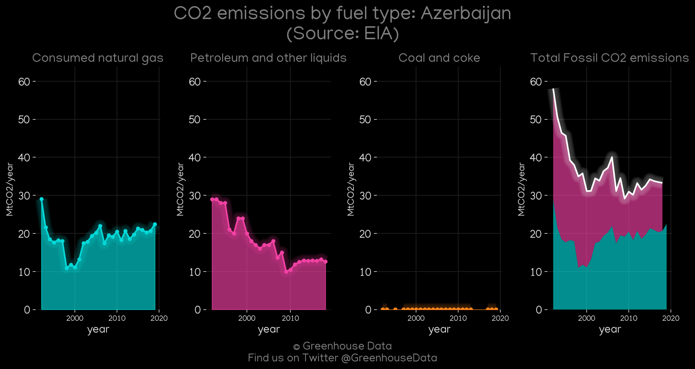
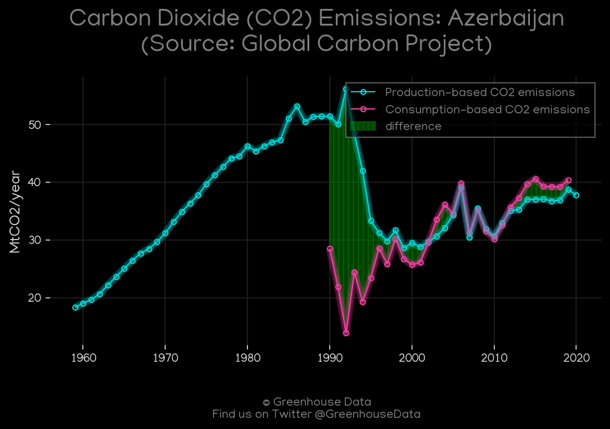
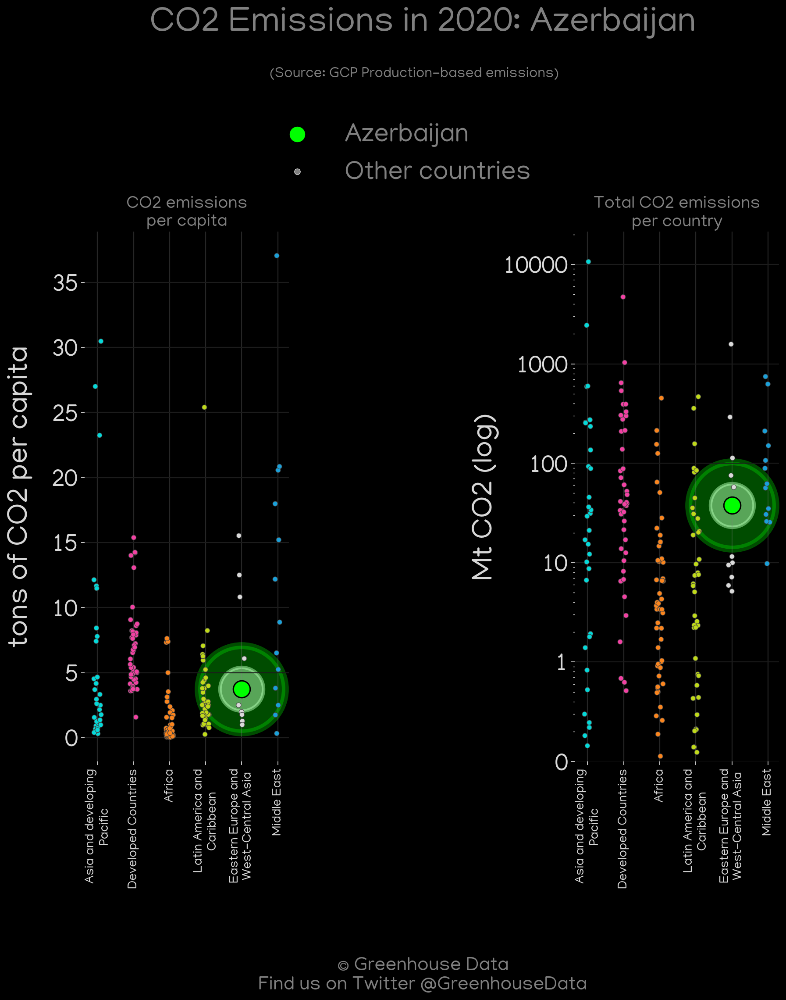
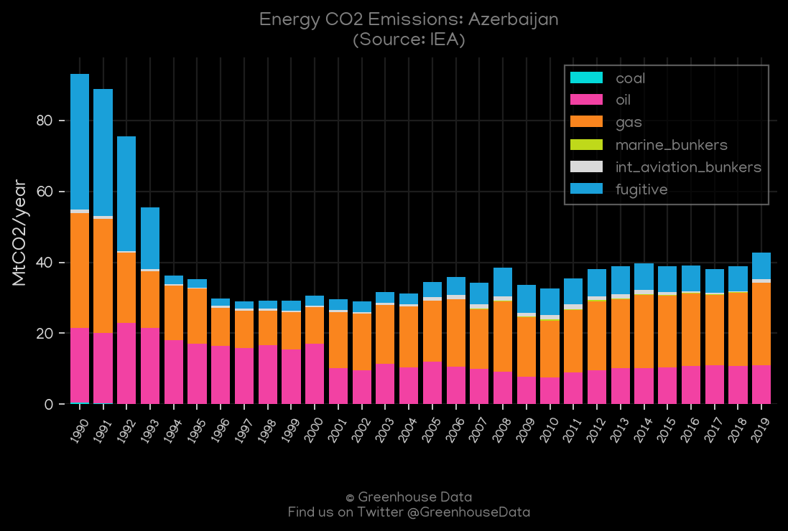
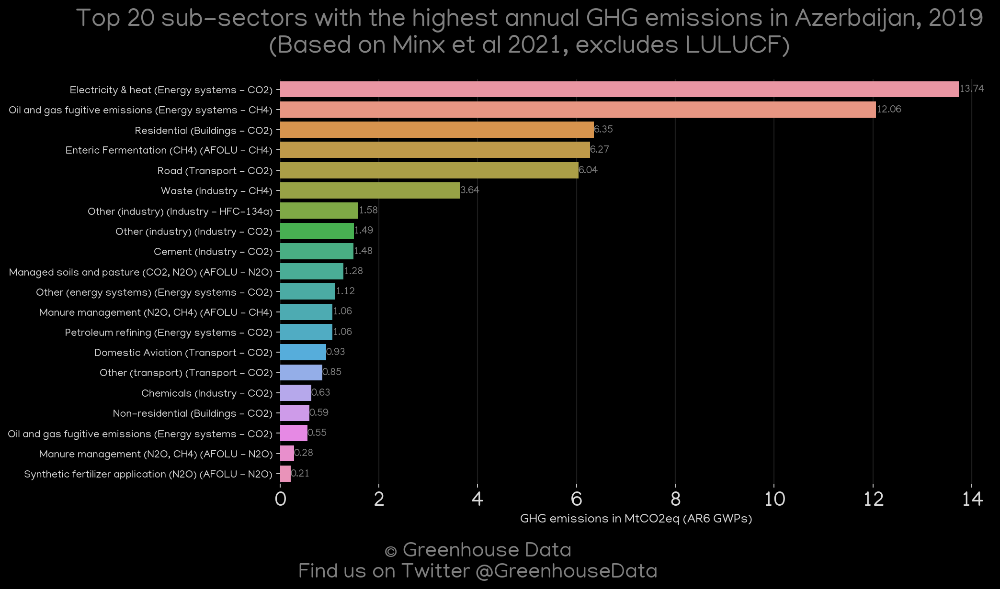
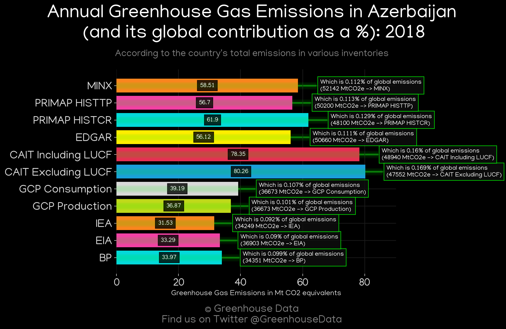
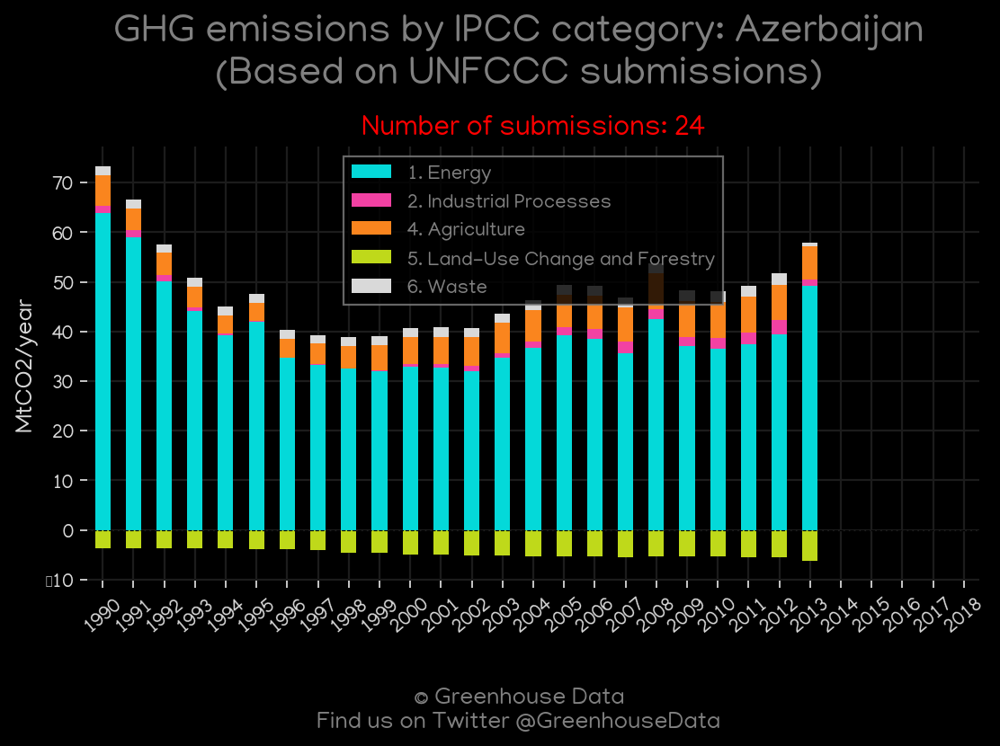

<h1 align="center">
🇦🇿🇦🇿🇦🇿🇦🇿🇦🇿
 
Azerbaijan
 
🇦🇿🇦🇿🇦🇿🇦🇿🇦🇿
</h1>
<h2>Datasets:</h2>

<a href="https://github.com/dquintani/GreenhouseData/tree/master/country_data/AZE_Azerbaijan/data">View on Github</a>
 

<a href="data/AZE_BP.csv">BP</a> || <a href="data/AZE_CAIT.csv">CAIT</a> || <a href="data/AZE_CDIAC.csv">CDIAC</a> || <a href="data/AZE_EDGAR.csv">EDGAR</a> || <a href="data/AZE_EIA.csv">EIA</a> || <a href="data/AZE_EPA.csv">EPA</a> || <a href="data/AZE_FAO.csv">FAO</a> || <a href="data/AZE_GCP.csv">GCP</a> || <a href="data/AZE_GCP_consupmption.csv">GCP_consupmption</a> || <a href="data/AZE_IEA.csv">IEA</a> || <a href="data/AZE_Minx_2021.csv">Minx_2021</a> || <a href="data/AZE_PRIMAP-hist.csv">PRIMAP-hist</a>

 

<h1>Figures:</h1><h2>#1 (AZE_BP_1)</h2>

<h2>#2 (AZE_CAIT_gases_1)</h2>

<h2>#3 (AZE_CAIT_lucf_vs_nolucf)</h2>

<h2>#4 (AZE_CDIAC_1)</h2>

<h2>#5 (AZE_CO2_totals)</h2>

<h2>#6 (AZE_EIA_1)</h2>

<h2>#7 (AZE_GCP_1)</h2>

<h2>#8 (AZE_GCP_Country_Highlight)</h2>

<h2>#9 (AZE_IEA_1)</h2>

<h2>#10 (AZE_Minx_top20_subsectors)</h2>

<h2>#11 (AZE_relative_totals)</h2>

<h2>#12 (AZE_UNFCCC_NAI_1)</h2>

