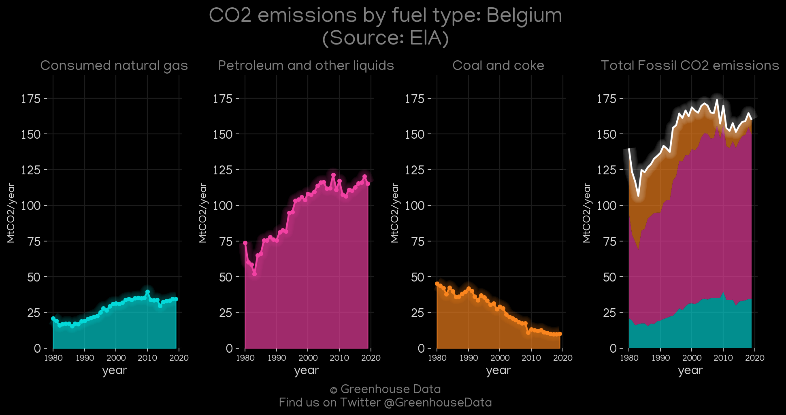
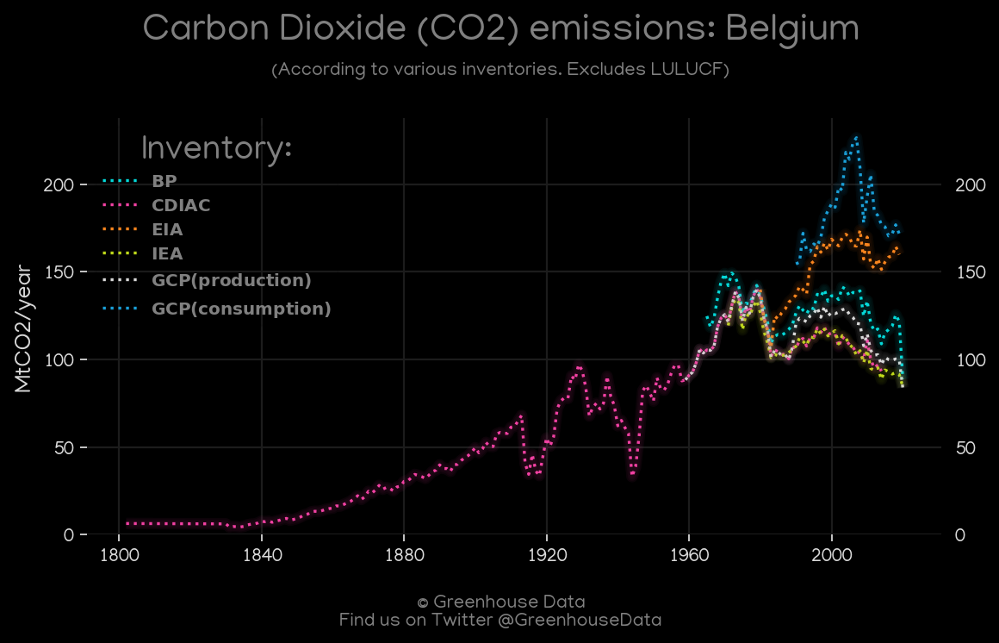
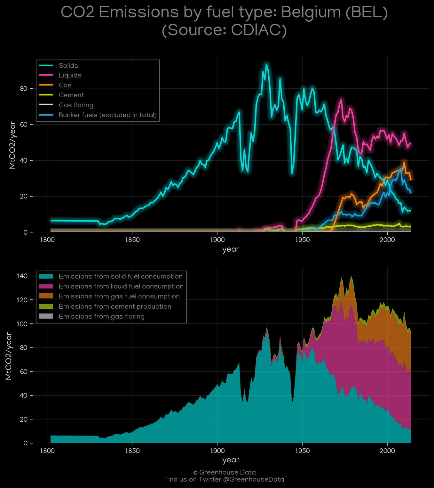
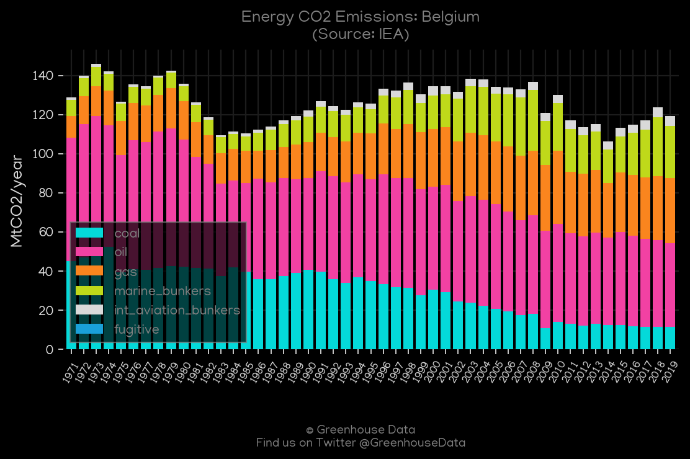
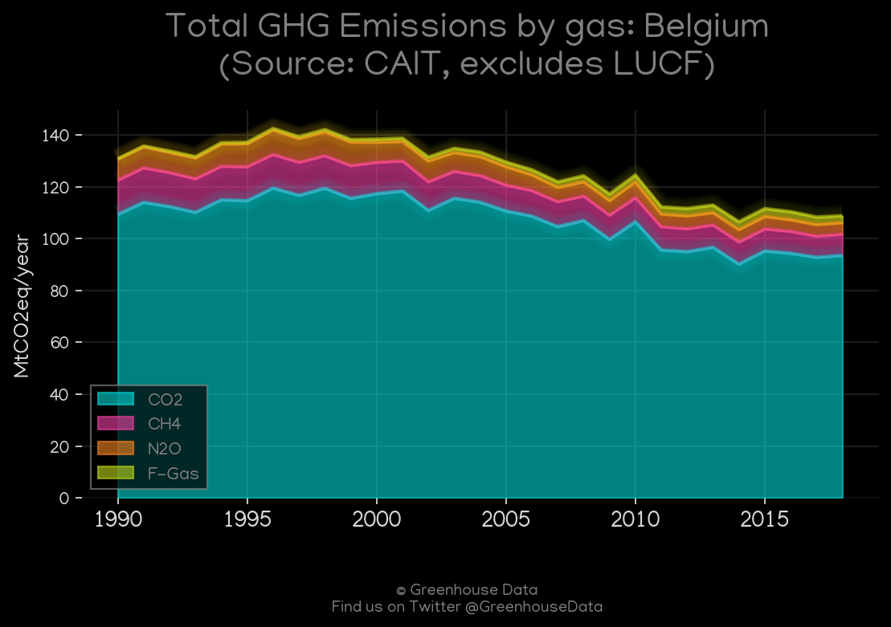
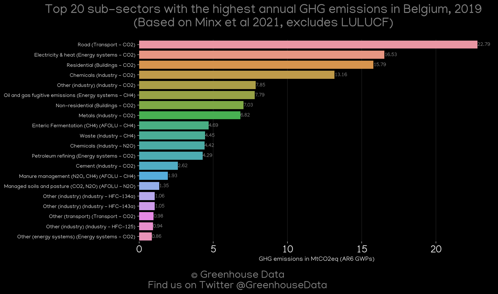
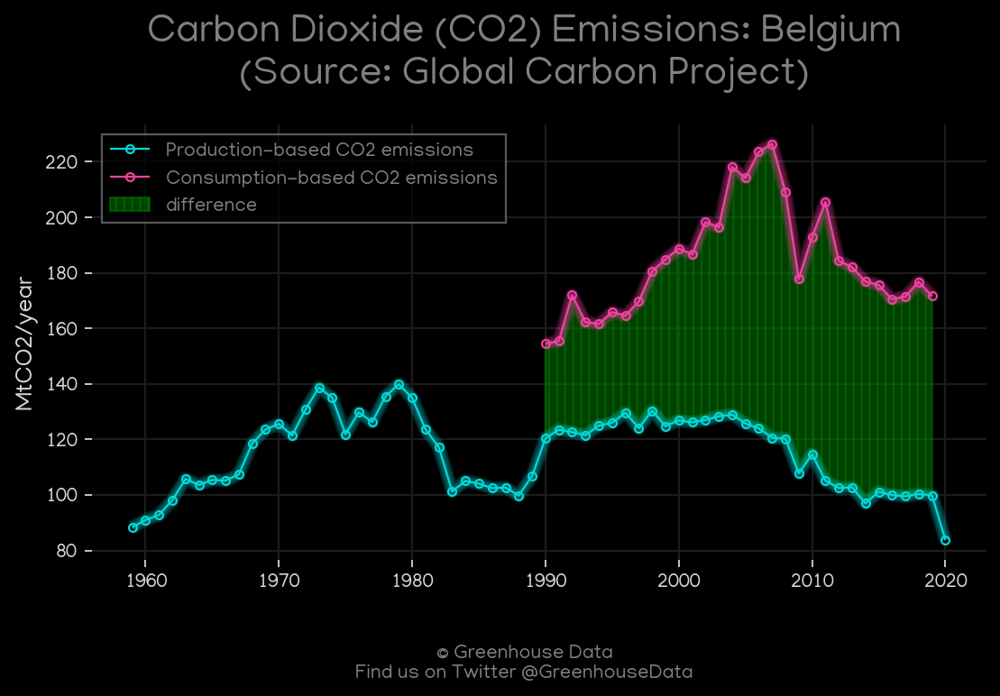

<h1 align="center">
🇧🇪🇧🇪🇧🇪🇧🇪🇧🇪
 
Belgium
 
🇧🇪🇧🇪🇧🇪🇧🇪🇧🇪
</h1>
<h2>Datasets:</h2>

<a href="https://github.com/dquintani/Greenhouse-Data/tree/master/country_data/BEL_Belgium/data">View on Github</a>
 

<a href="data/BEL_PRIMAP-hist.csv">PRIMAP-hist</a> || <a href="data/BEL_CDIAC.csv">CDIAC</a> || <a href="data/BEL_IEA.csv">IEA</a> || <a href="data/BEL_EDGAR.csv">EDGAR</a> || <a href="data/BEL_CAIT.csv">CAIT</a> || <a href="data/BEL_GCP_cons.csv">GCP_cons</a> || <a href="data/BEL_Minx_2021.csv">Minx_2021</a> || <a href="data/BEL_GCP.csv">GCP</a> || <a href="data/BEL_GCP_consupmption.csv">GCP_consupmption</a> || <a href="data/BEL_BP.csv">BP</a> || <a href="data/BEL_FAO.csv">FAO</a> || <a href="data/BEL_EPA.csv">EPA</a> || <a href="data/BEL_EIA.csv">EIA</a>

 

<h1>Figures:</h1><h2>#1 (BEL_EIA_1)</h2>

<h2>#2 (BEL_CO2_totals)</h2>

<h2>#3 (BEL_CDIAC_1)</h2>

<h2>#4 (BEL_IEA_1)</h2>

<h2>#5 (BEL_CAIT_gases_1)</h2>

<h2>#6 (BEL_UNFCCC_NAI_1)</h2>

<h2>#7 (BEL_Minx_top20_subsectors)</h2>

<h2>#8 (BEL_UNFCCC_AI_1)</h2>

<h2>#9 (BEL_BP_1)</h2>

<h2>#10 (BEL_GCP_1)</h2>

