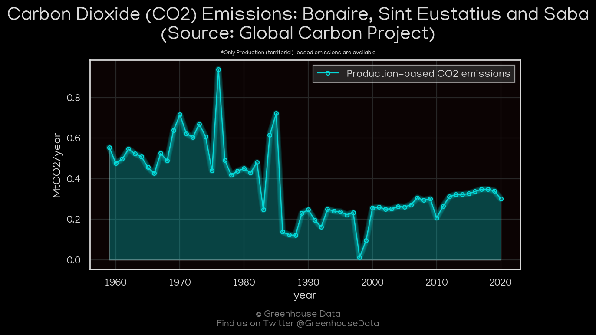
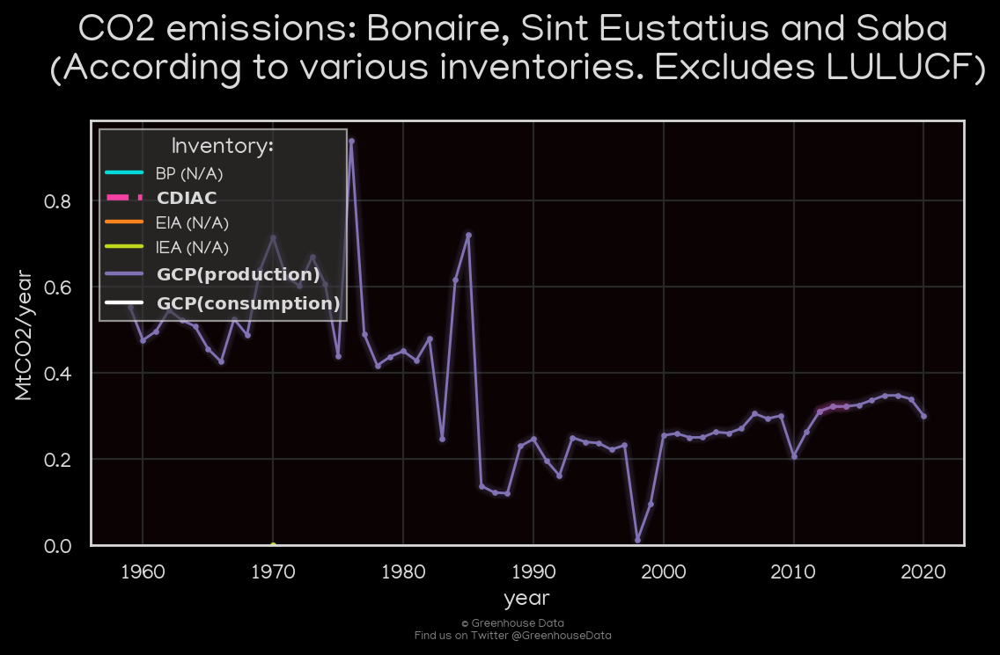
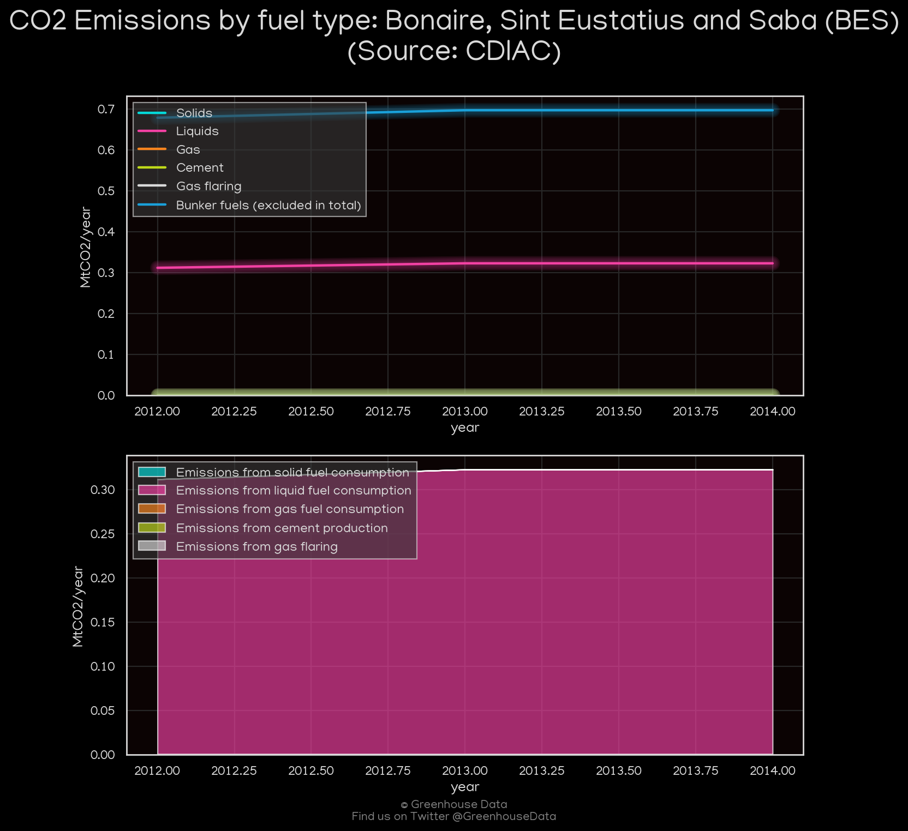

<h1 align="center">
🇧🇶🇧🇶🇧🇶🇧🇶🇧🇶
 
Bonaire, Sint Eustatius and Saba
 
🇧🇶🇧🇶🇧🇶🇧🇶🇧🇶
</h1>
<h2>Datasets:</h2>

<a href="https://github.com/dquintani/GreenhouseData/tree/master/country_data/BES_Bonaire, Sint Eustatius and Saba/data">View on Github</a>
 

<a href="data/BES_GCP.csv">GCP</a> || <a href="data/BES_GCP_cons.csv">GCP_cons</a> || <a href="data/BES_GCP_consupmption.csv">GCP_consupmption</a> || <a href="data/BES_CDIAC.csv">CDIAC</a>

 

<h1>Figures:</h1><h2>#1 (BES_GCP_1)</h2>

<h2>#2 (BES_CO2_totals)</h2>

<h2>#3 (BES_CDIAC_1)</h2>

