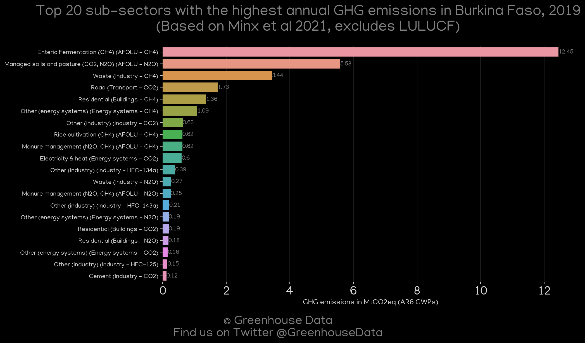
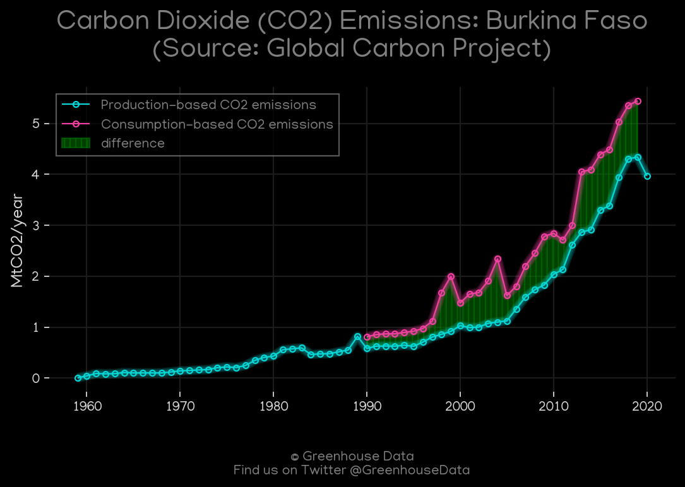
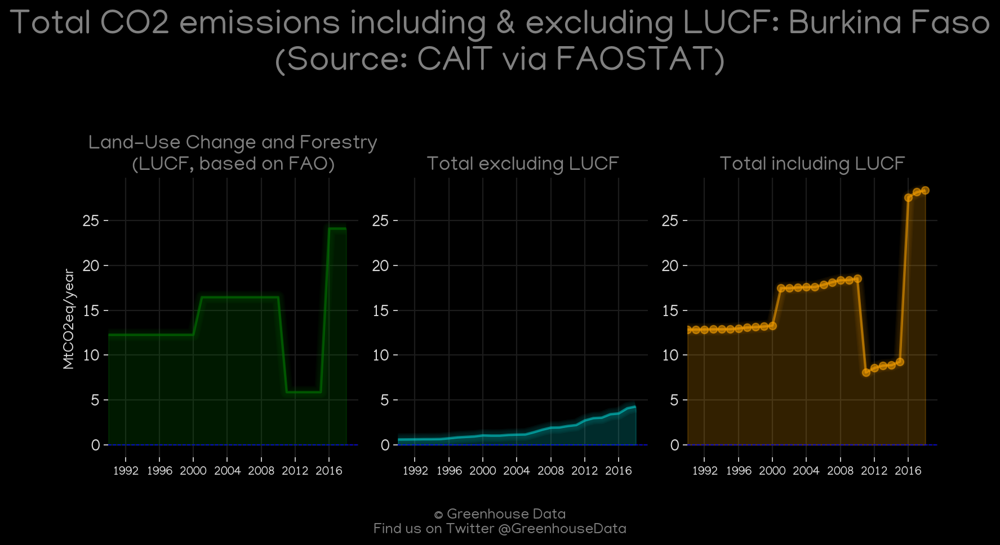
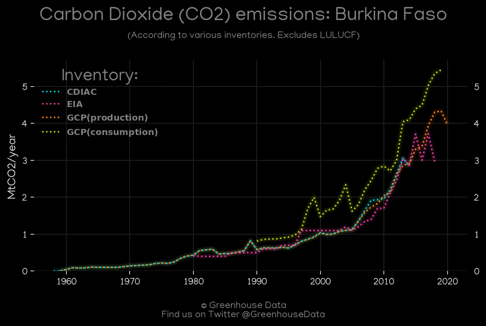
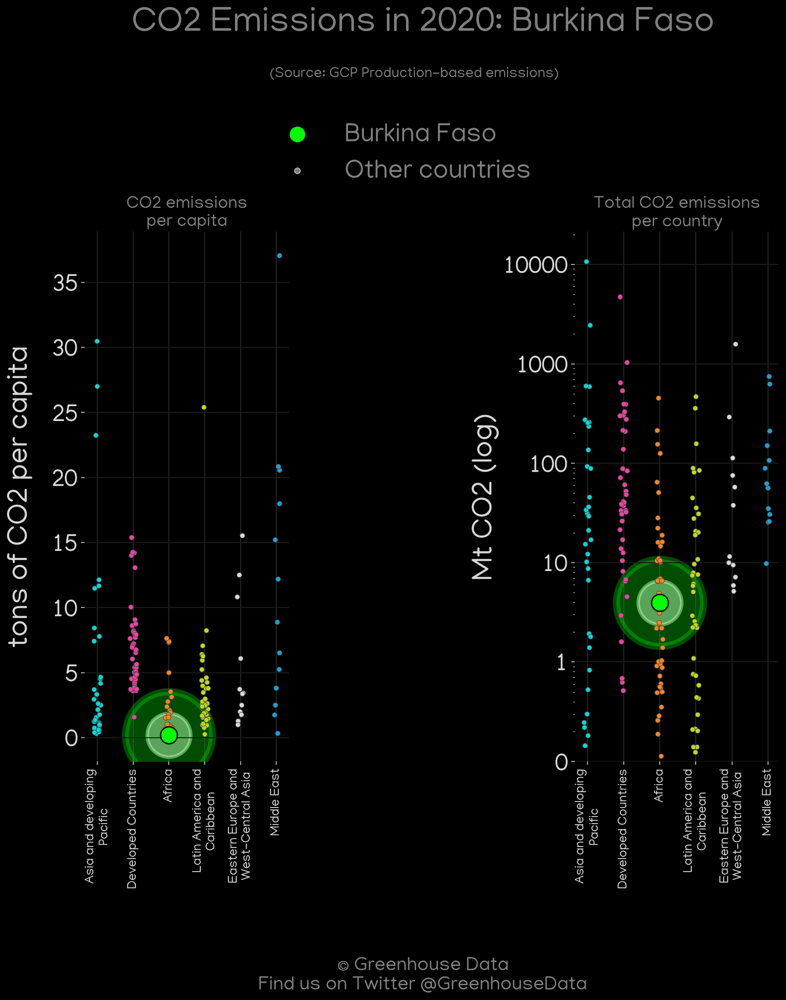
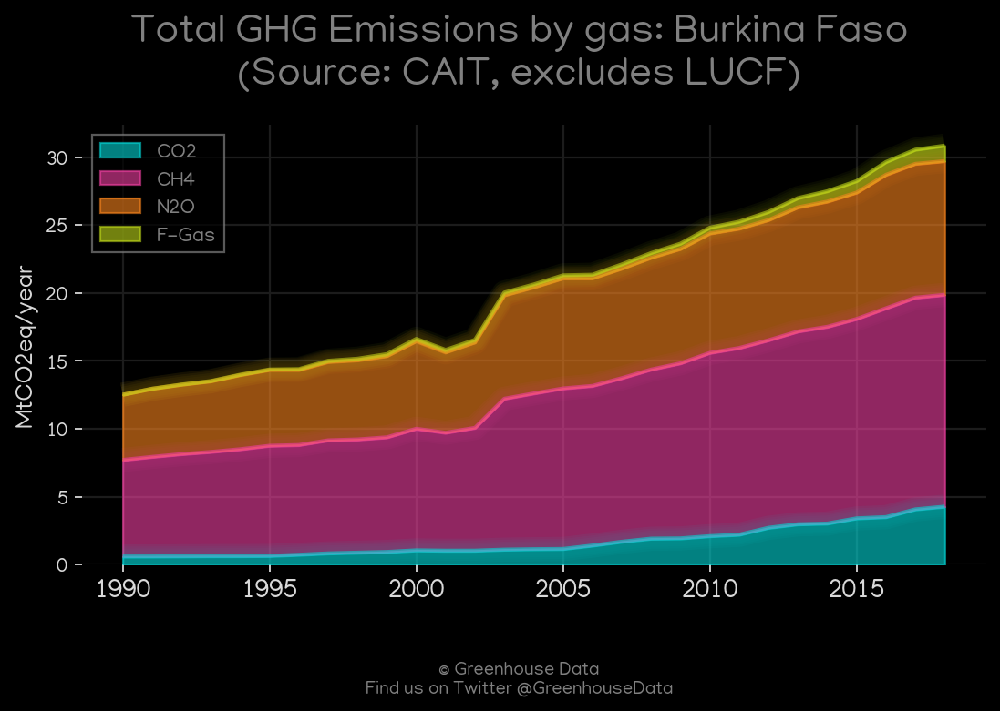

<h1 align="center">
🇧🇫🇧🇫🇧🇫🇧🇫🇧🇫
 
Burkina Faso
 
🇧🇫🇧🇫🇧🇫🇧🇫🇧🇫
</h1>
<h2>Datasets:</h2>

<a href="https://github.com/dquintani/GreenhouseData/tree/master/country_data/BFA_Burkina Faso/data">View on Github</a>
 

<a href="data/BFA_EPA.csv">EPA</a> || <a href="data/BFA_GCP_consupmption.csv">GCP_consupmption</a> || <a href="data/BFA_EIA.csv">EIA</a> || <a href="data/BFA_CAIT.csv">CAIT</a> || <a href="data/BFA_Minx_2021.csv">Minx_2021</a> || <a href="data/BFA_FAO.csv">FAO</a> || <a href="data/BFA_CDIAC.csv">CDIAC</a> || <a href="data/BFA_PRIMAP-hist.csv">PRIMAP-hist</a> || <a href="data/BFA_EDGAR.csv">EDGAR</a> || <a href="data/BFA_GCP.csv">GCP</a>

 

<h1>Figures:</h1><h2>#1 (BFA_relative_totals)</h2>

<h2>#2 (BFA_Minx_top20_subsectors)</h2>

<h2>#3 (BFA_GCP_1)</h2>

<h2>#4 (BFA_UNFCCC_NAI_1)</h2>

<h2>#5 (BFA_CAIT_lucf_vs_nolucf)</h2>

<h2>#6 (BFA_CDIAC_1)</h2>

<h2>#7 (BFA_CO2_totals)</h2>

<h2>#8 (BFA_GCP_Country_Highlight)</h2>

<h2>#9 (BFA_EIA_1)</h2>

<h2>#10 (BFA_CAIT_gases_1)</h2>

