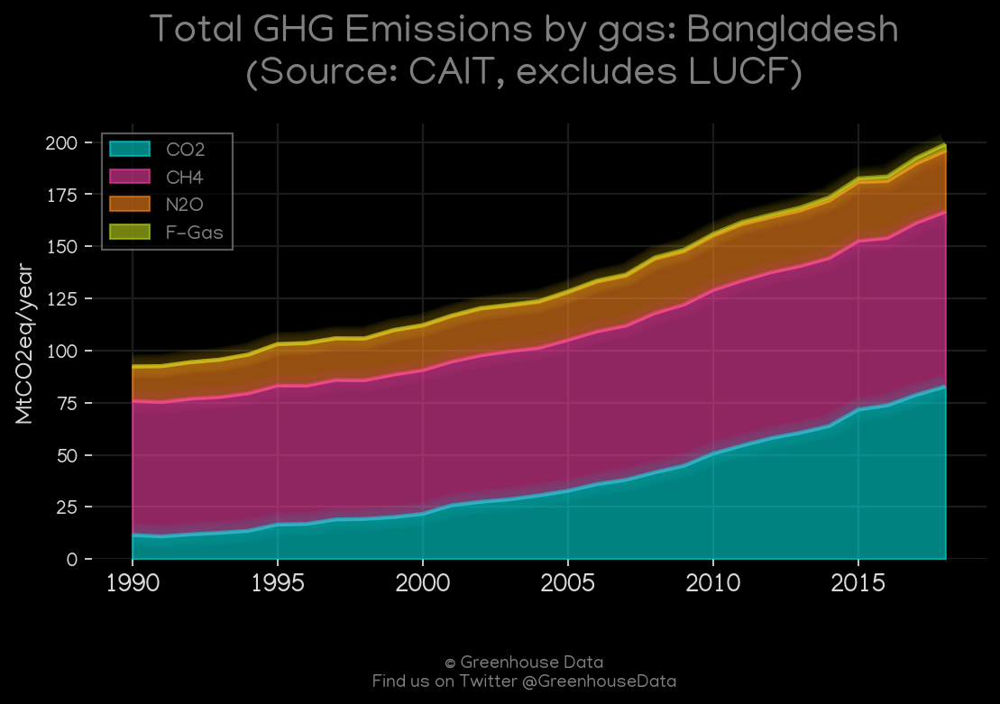
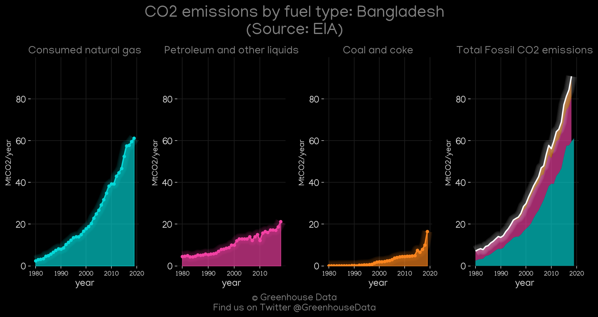
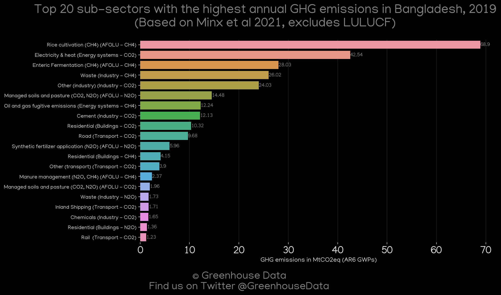
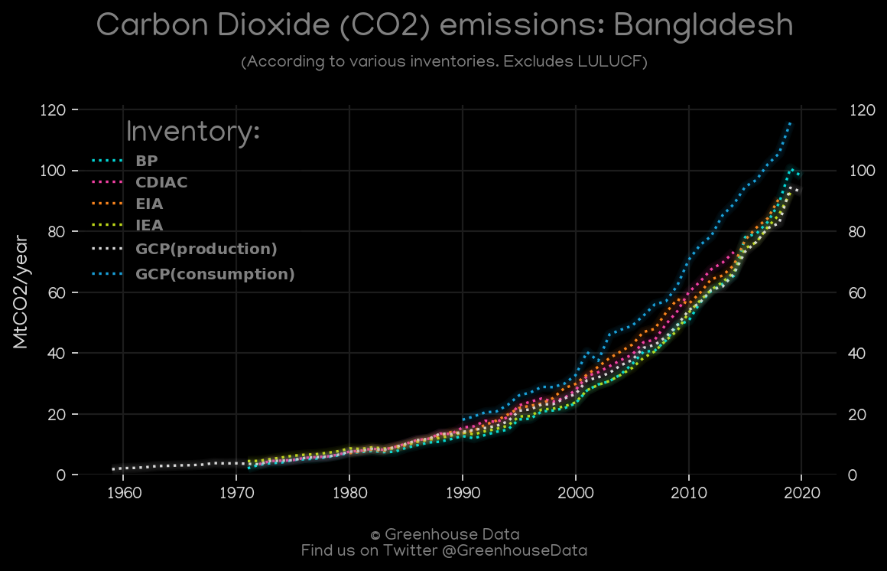
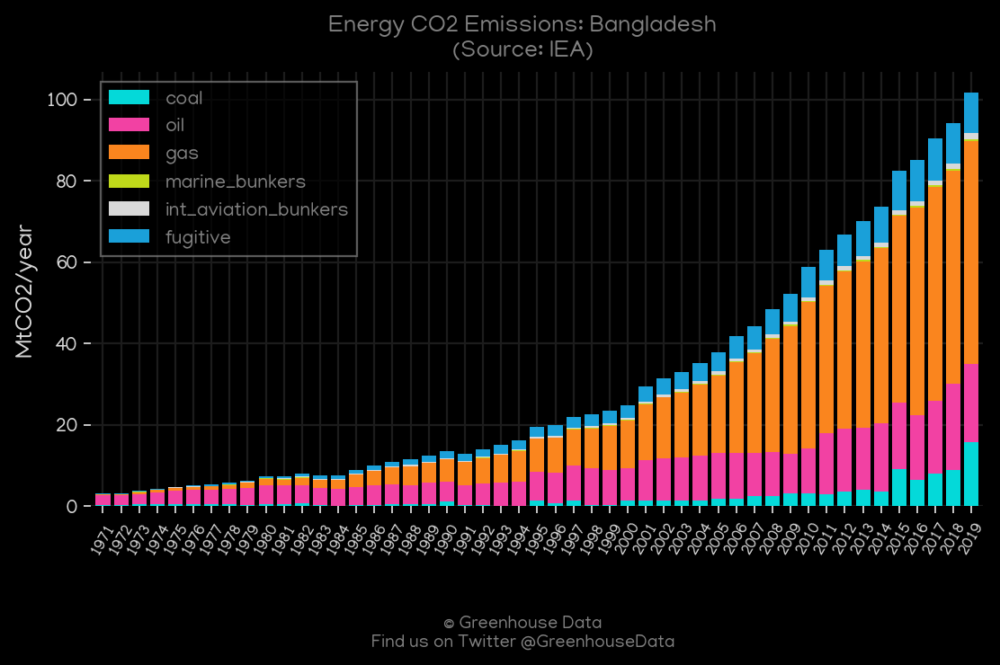
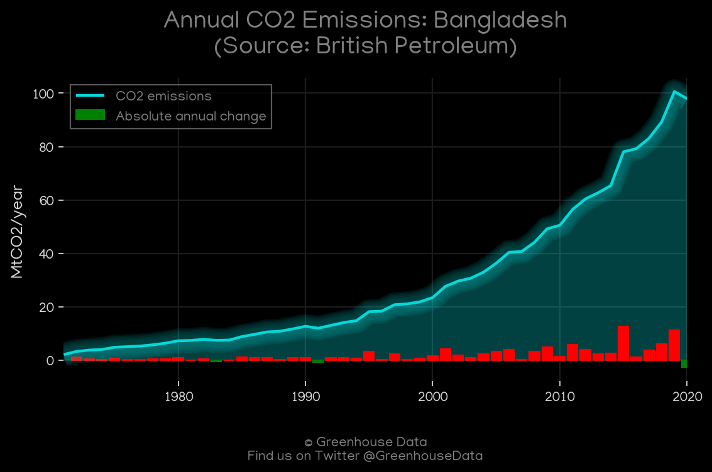

<h1 align="center">
🇧🇩🇧🇩🇧🇩🇧🇩🇧🇩
 
Bangladesh
 
🇧🇩🇧🇩🇧🇩🇧🇩🇧🇩
</h1>
<h2>Datasets:</h2>

<a href="https://github.com/dquintani/GreenhouseData/tree/master/country_data/BGD_Bangladesh/data">View on Github</a>
 

<a href="data/BGD_Minx_2021.csv">Minx_2021</a> || <a href="data/BGD_CDIAC.csv">CDIAC</a> || <a href="data/BGD_IEA.csv">IEA</a> || <a href="data/BGD_EPA.csv">EPA</a> || <a href="data/BGD_EIA.csv">EIA</a> || <a href="data/BGD_GCP_consupmption.csv">GCP_consupmption</a> || <a href="data/BGD_FAO.csv">FAO</a> || <a href="data/BGD_PRIMAP-hist.csv">PRIMAP-hist</a> || <a href="data/BGD_CAIT.csv">CAIT</a> || <a href="data/BGD_EDGAR.csv">EDGAR</a> || <a href="data/BGD_GCP.csv">GCP</a> || <a href="data/BGD_BP.csv">BP</a>

 

<h1>Figures:</h1><h2>#1 (BGD_CAIT_gases_1)</h2>

<h2>#2 (BGD_EIA_1)</h2>

<h2>#3 (BGD_GCP_1)</h2>

<h2>#4 (BGD_Minx_top20_subsectors)</h2>

<h2>#5 (BGD_CO2_totals)</h2>

<h2>#6 (BGD_IEA_1)</h2>

<h2>#7 (BGD_CDIAC_1)</h2>

<h2>#8 (BGD_UNFCCC_NAI_1)</h2>

<h2>#9 (BGD_BP_1)</h2>

