

<h1 align="center">
🇧🇬🇧🇬🇧🇬🇧🇬🇧🇬
 
Bulgaria
 
🇧🇬🇧🇬🇧🇬🇧🇬🇧🇬
</h1>
<h2>Datasets:</h2>

<a href="https://github.com/dquintani/GreenhouseData/tree/master/country_data/BGR_Bulgaria/data">View on Github</a>
 

<a href="data/BGR_Minx_2021.csv">Minx_2021</a> || <a href="data/BGR_EDGAR.csv">EDGAR</a> || <a href="data/BGR_GCP_consupmption.csv">GCP_consupmption</a> || <a href="data/BGR_EIA.csv">EIA</a> || <a href="data/BGR_CDIAC.csv">CDIAC</a> || <a href="data/BGR_FAO.csv">FAO</a> || <a href="data/BGR_BP.csv">BP</a> || <a href="data/BGR_IEA.csv">IEA</a> || <a href="data/BGR_CAIT.csv">CAIT</a> || <a href="data/BGR_PRIMAP-hist.csv">PRIMAP-hist</a> || <a href="data/BGR_GCP.csv">GCP</a> || <a href="data/BGR_EPA.csv">EPA</a>

 

<h1>Figures:</h1><h2>#1 (BGR_BP_1)</h2>

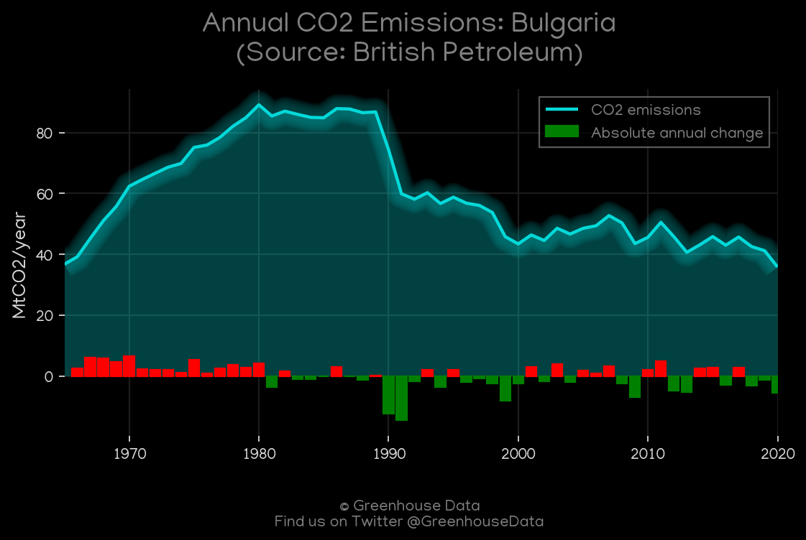
<h2>#2 (BGR_CO2_totals)</h2>

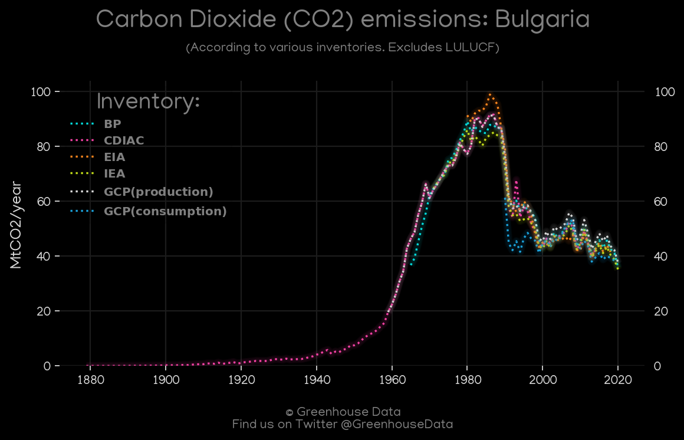
<h2>#3 (BGR_Minx_top20_subsectors)</h2>

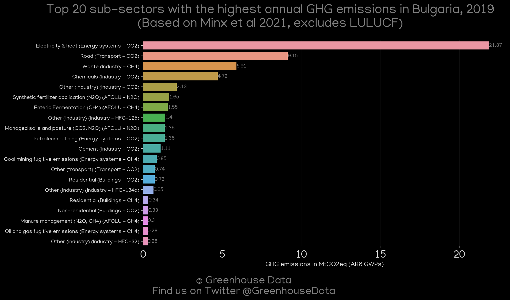
<h2>#4 (BGR_IEA_1)</h2>

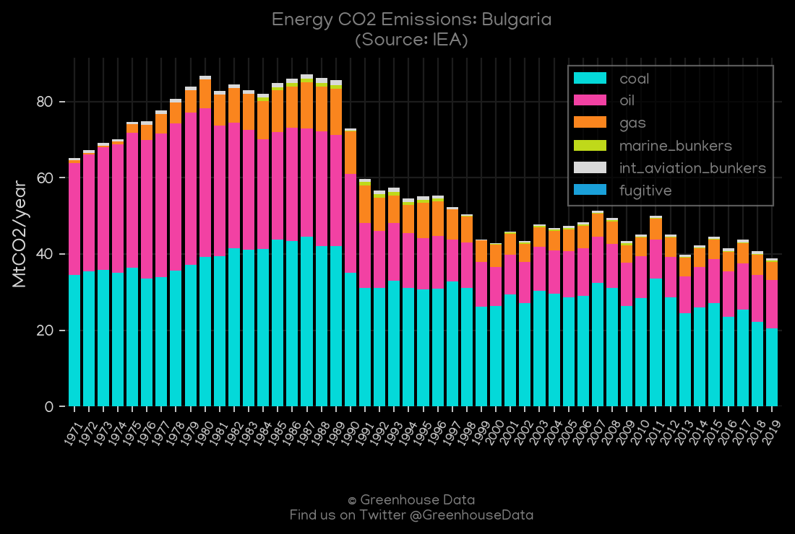
<h2>#5 (BGR_EIA_1)</h2>

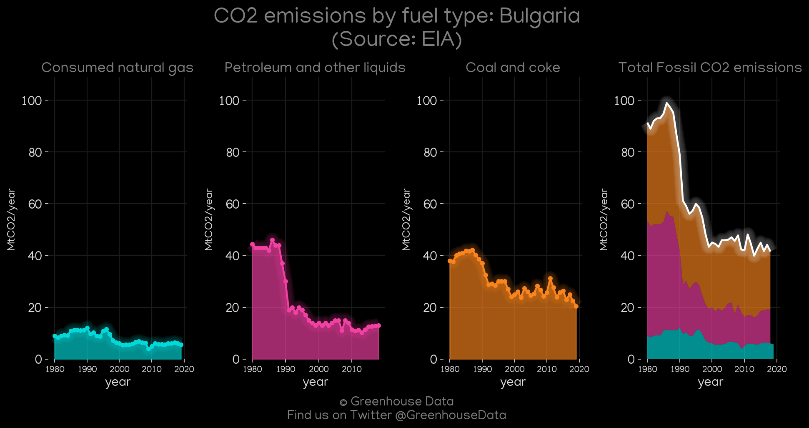
<h2>#6 (BGR_GCP_Country_Highlight)</h2>

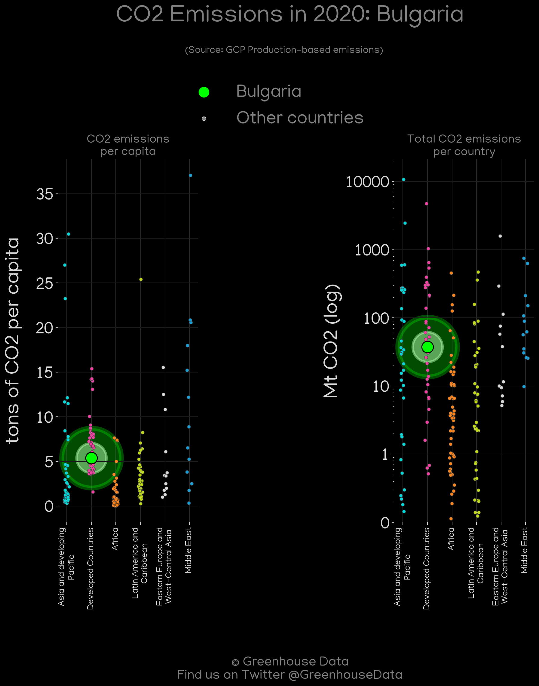
<h2>#7 (BGR_GCP_1)</h2>

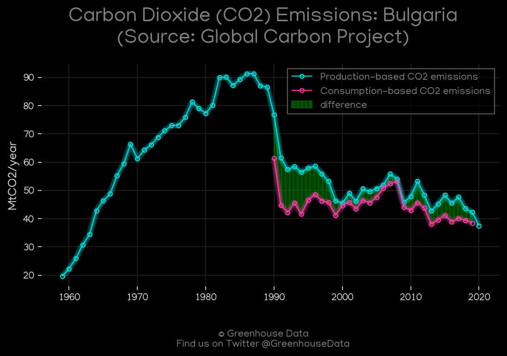
<h2>#8 (BGR_CDIAC_1)</h2>

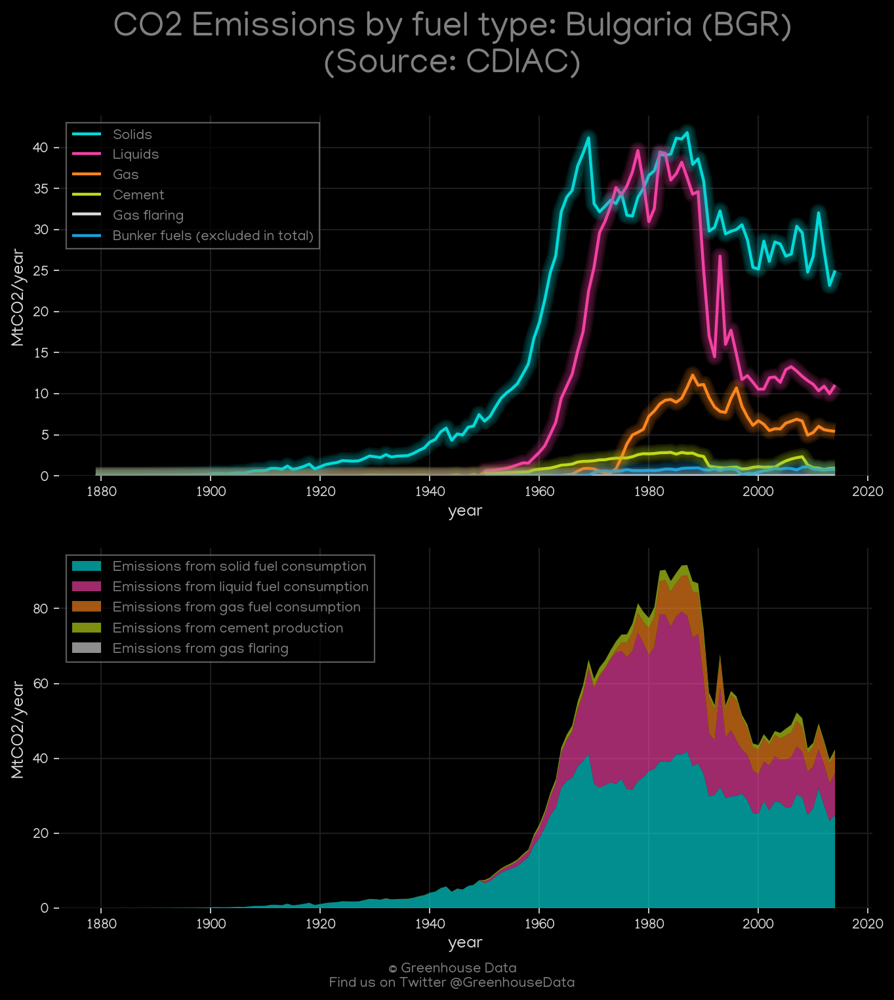
<h2>#9 (BGR_CAIT_lucf_vs_nolucf)</h2>

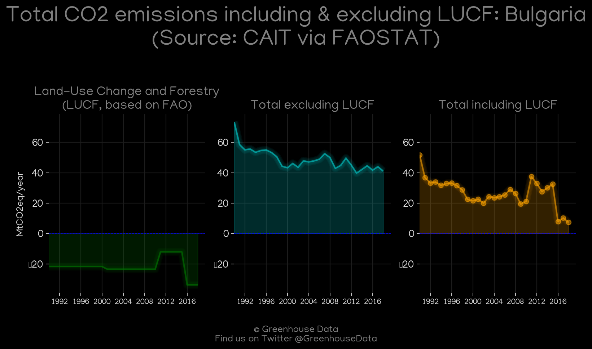
<h2>#10 (BGR_UNFCCC_AI_1)</h2>

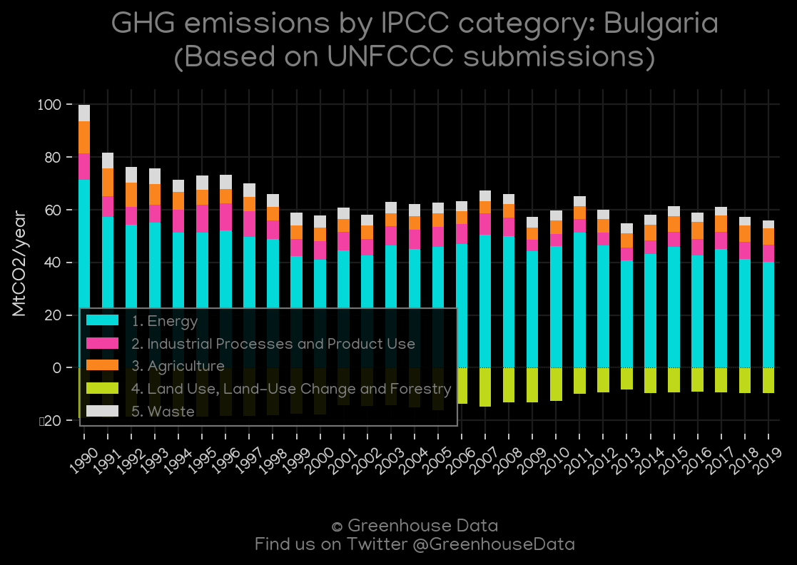
<h2>#11 (BGR_CAIT_gases_1)</h2>

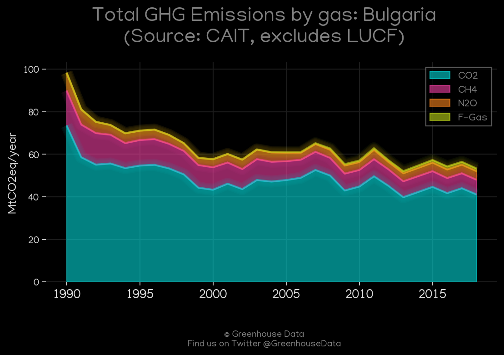
