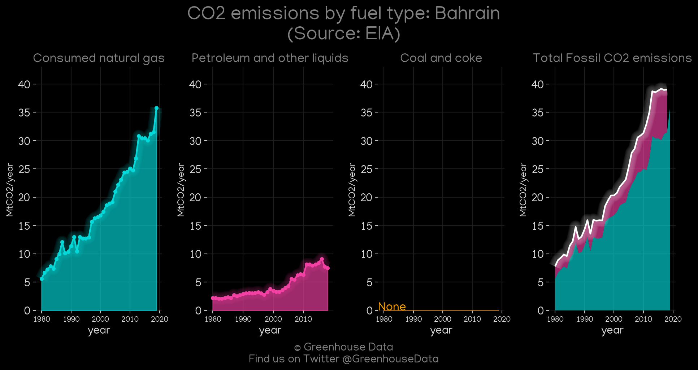
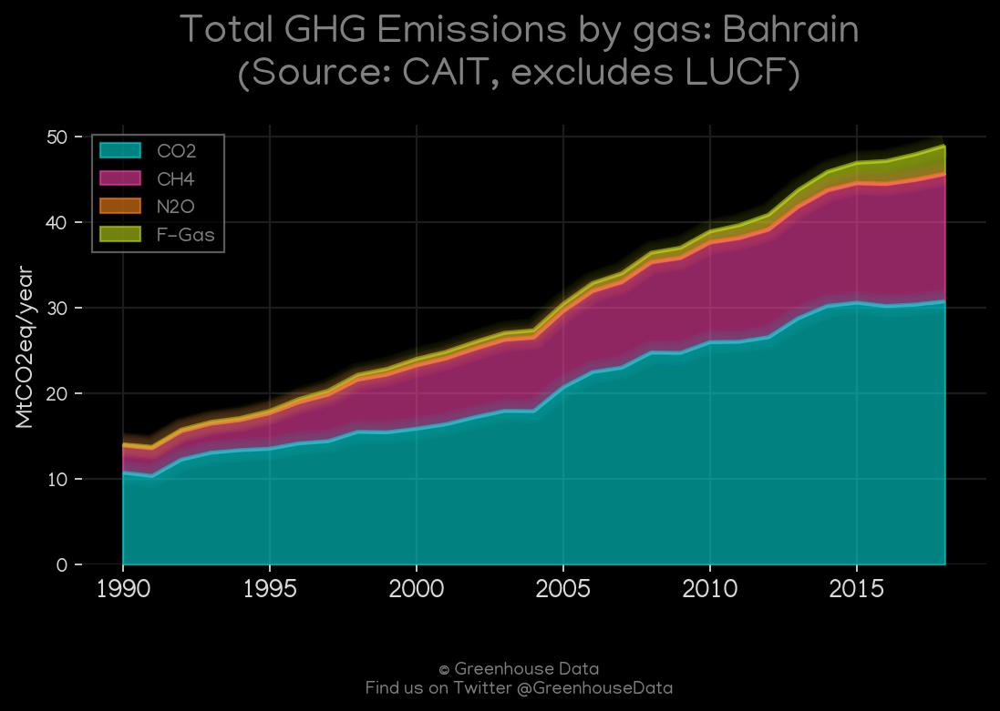
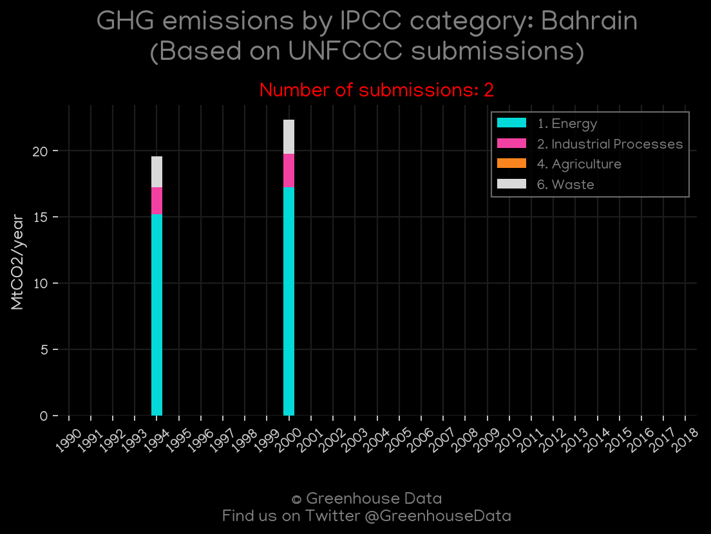
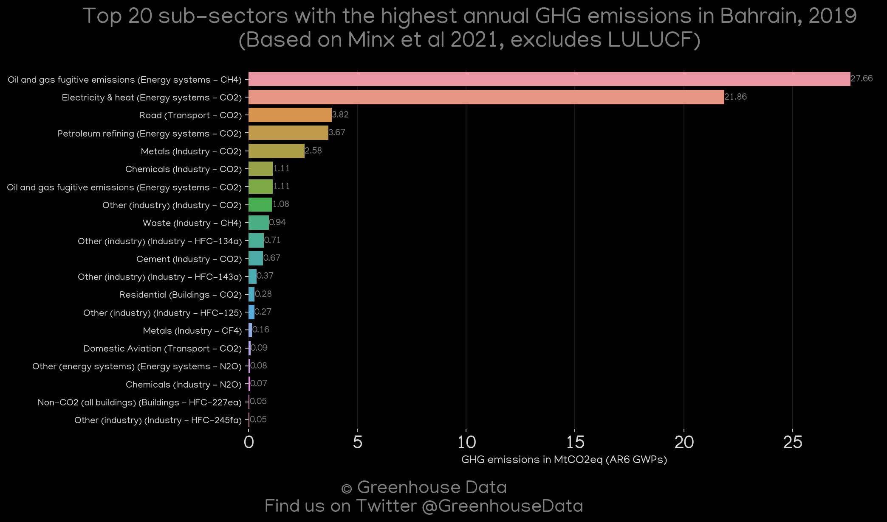
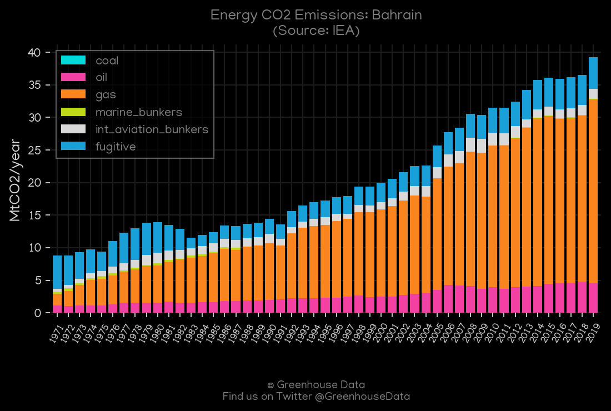
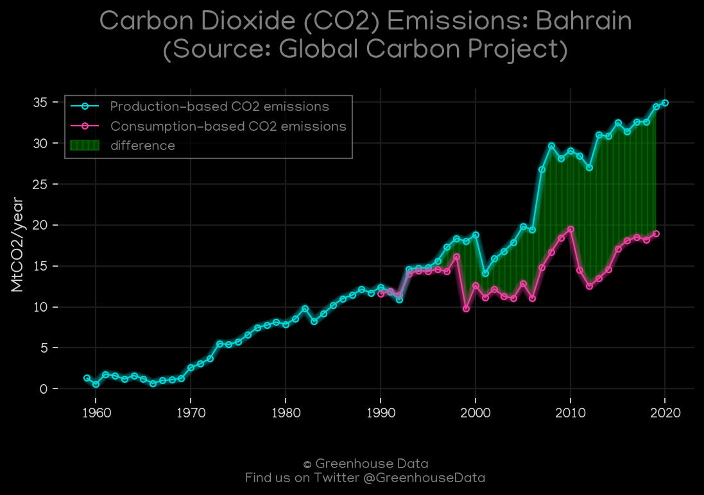

<h1 align="center">
🇧🇭🇧🇭🇧🇭🇧🇭🇧🇭
 
Bahrain
 
🇧🇭🇧🇭🇧🇭🇧🇭🇧🇭
</h1>
<h2>Datasets:</h2>

<a href="https://github.com/dquintani/GreenhouseData/tree/master/country_data/BHR_Bahrain/data">View on Github</a>
 

<a href="data/BHR_IEA.csv">IEA</a> || <a href="data/BHR_Minx_2021.csv">Minx_2021</a> || <a href="data/BHR_EDGAR.csv">EDGAR</a> || <a href="data/BHR_EPA.csv">EPA</a> || <a href="data/BHR_GCP_consupmption.csv">GCP_consupmption</a> || <a href="data/BHR_CAIT.csv">CAIT</a> || <a href="data/BHR_PRIMAP-hist.csv">PRIMAP-hist</a> || <a href="data/BHR_CDIAC.csv">CDIAC</a> || <a href="data/BHR_GCP.csv">GCP</a> || <a href="data/BHR_EIA.csv">EIA</a> || <a href="data/BHR_FAO.csv">FAO</a>

 

<h1>Figures:</h1><h2>#1 (BHR_EIA_1)</h2>

<h2>#2 (BHR_CAIT_gases_1)</h2>

<h2>#3 (BHR_UNFCCC_NAI_1)</h2>

<h2>#4 (BHR_CO2_totals)</h2>

<h2>#5 (BHR_CDIAC_1)</h2>

<h2>#6 (BHR_Minx_top20_subsectors)</h2>

<h2>#7 (BHR_IEA_1)</h2>

<h2>#8 (BHR_GCP_1)</h2>

