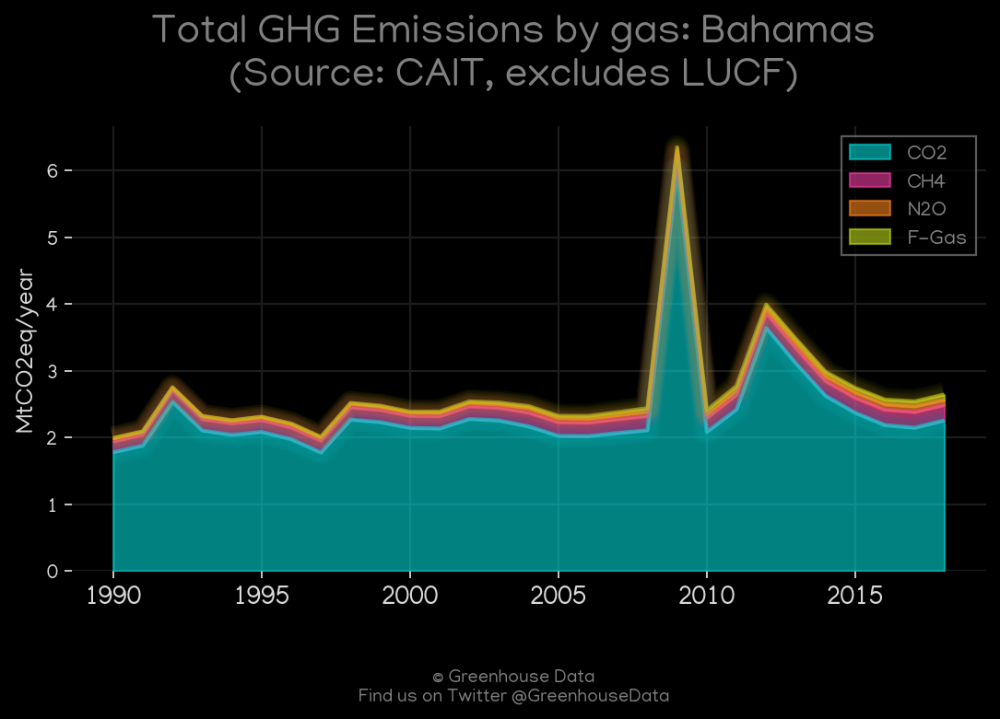
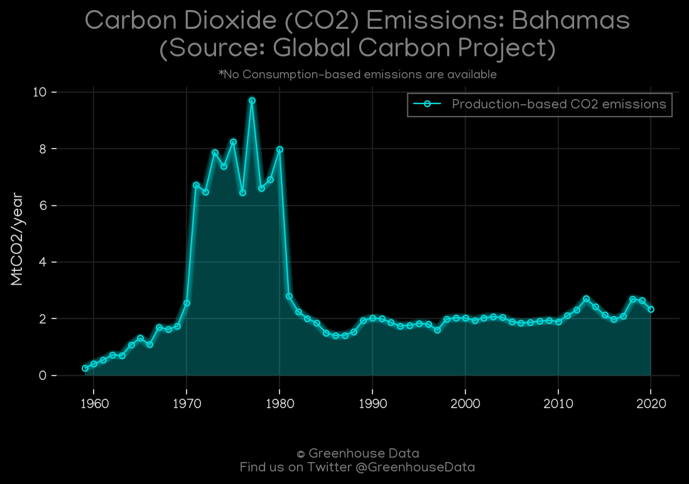
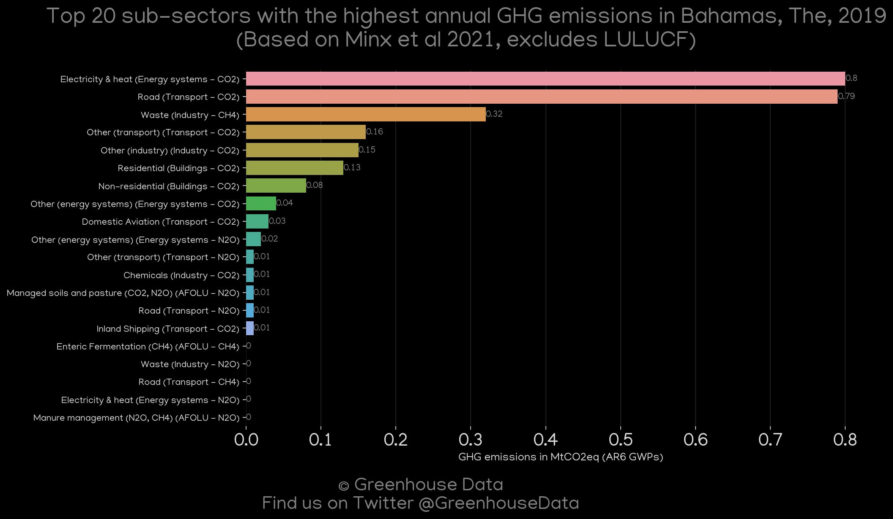
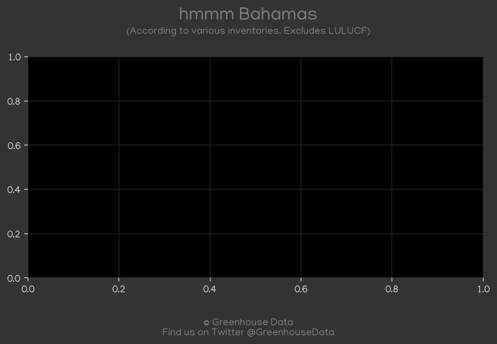
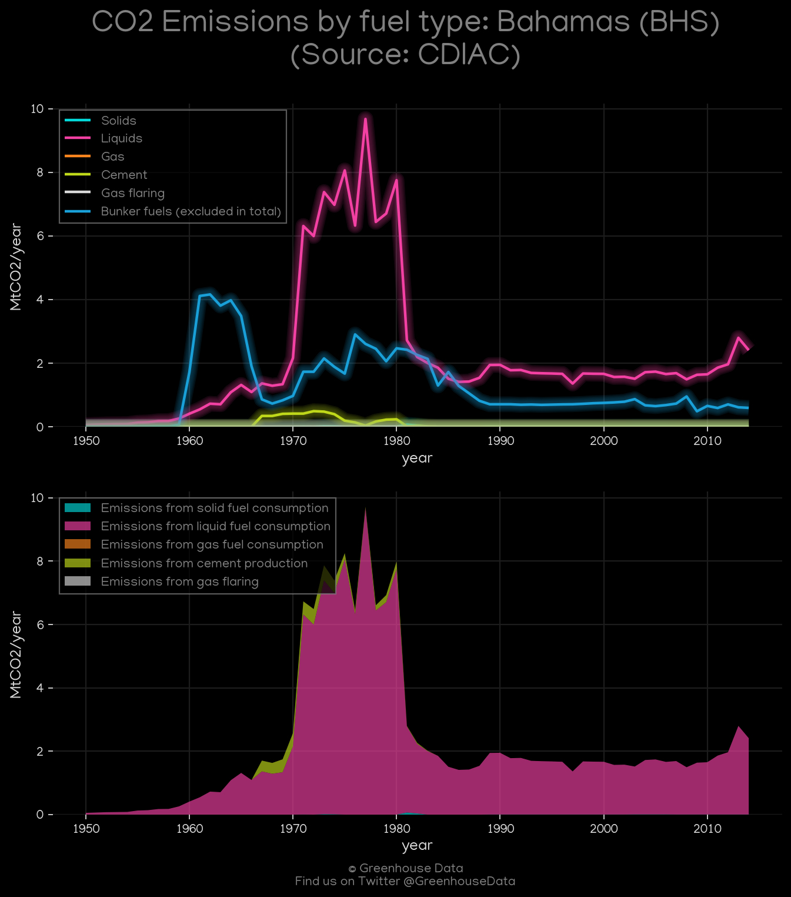
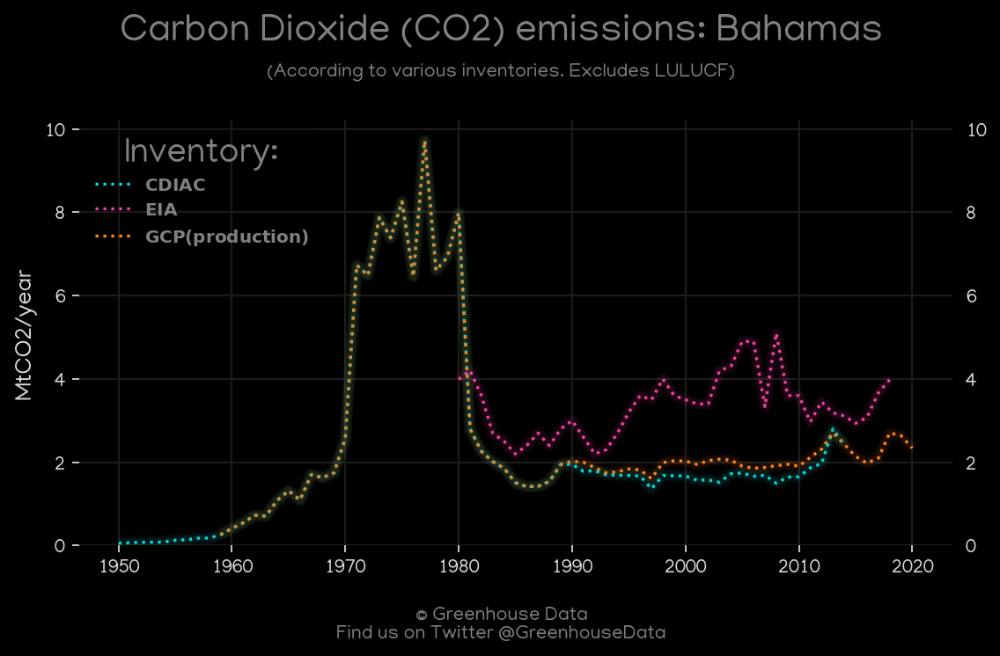
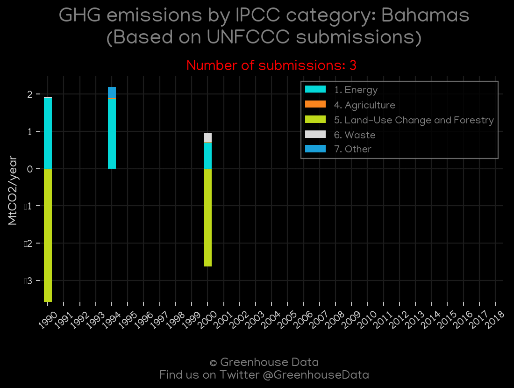

<h1 align="center">
🇧🇸🇧🇸🇧🇸🇧🇸🇧🇸
 
Bahamas
 
🇧🇸🇧🇸🇧🇸🇧🇸🇧🇸
</h1>
<h2>Datasets:</h2>

<a href="https://github.com/dquintani/Greenhouse-Data/tree/master/country_data/BHS_Bahamas/data">View on Github</a>
 

<a href="data/BHS_CDIAC.csv">CDIAC</a> || <a href="data/BHS_GCP_consupmption.csv">GCP_consupmption</a> || <a href="data/BHS_FAO.csv">FAO</a> || <a href="data/BHS_EPA.csv">EPA</a> || <a href="data/BHS_PRIMAP-hist.csv">PRIMAP-hist</a> || <a href="data/BHS_GCP.csv">GCP</a> || <a href="data/BHS_EIA.csv">EIA</a> || <a href="data/BHS_Minx_2021.csv">Minx_2021</a> || <a href="data/BHS_EDGAR.csv">EDGAR</a> || <a href="data/BHS_CAIT.csv">CAIT</a> || <a href="data/BHS_GCP_cons.csv">GCP_cons</a>

 

<h1>Figures:</h1><h2>#1 (BHS_CAIT_gases_1)</h2>

<h2>#2 (BHS_GCP_1)</h2>

<h2>#3 (BHS_Minx_top20_subsectors)</h2>

<h2>#4 (BHS_BP_1)</h2>

<h2>#5 (BHS_CDIAC_1)</h2>

<h2>#6 (BHS_CO2_totals)</h2>

<h2>#7 (BHS_UNFCCC_NAI_1)</h2>

<h2>#8 (BHS_EIA_1)</h2>

