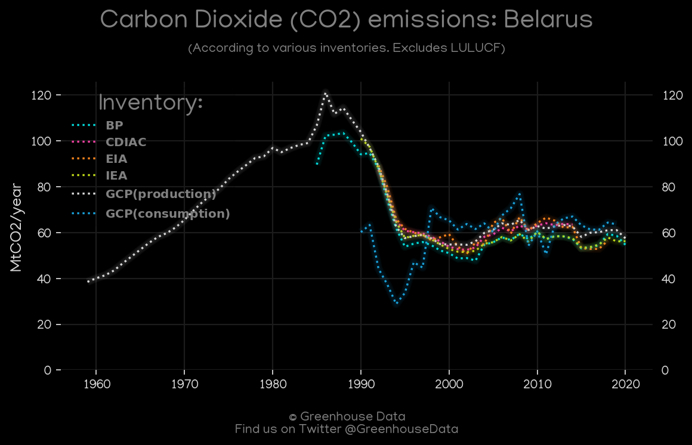
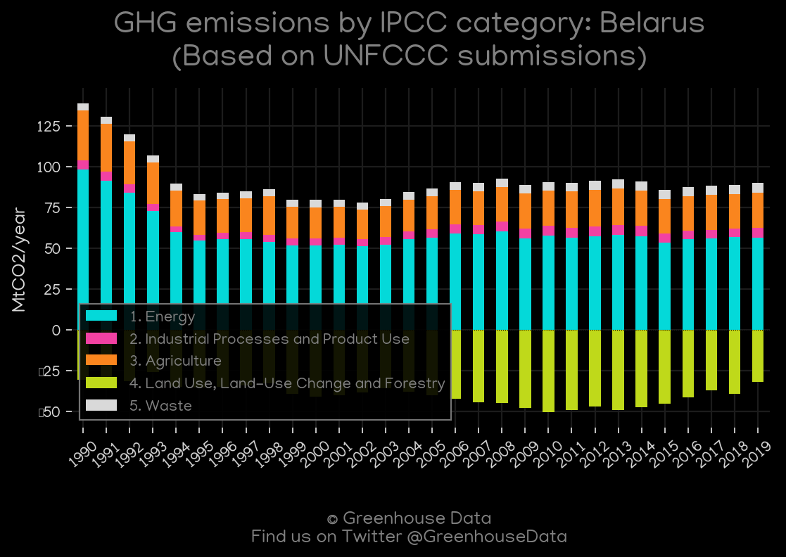
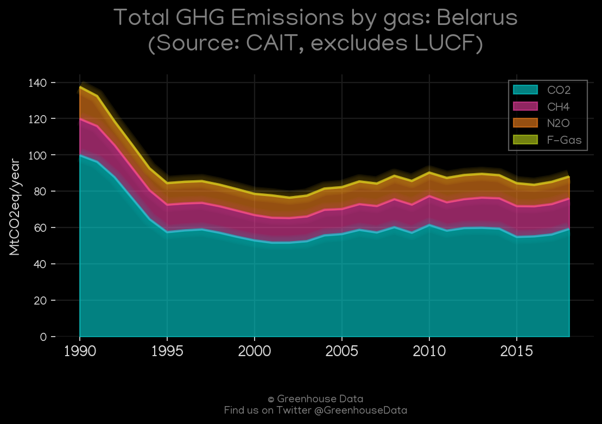
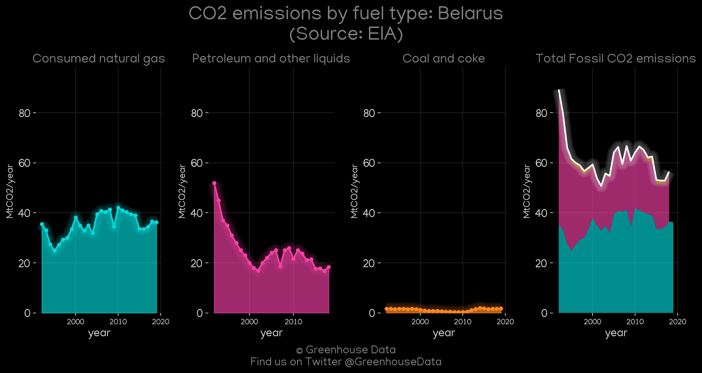
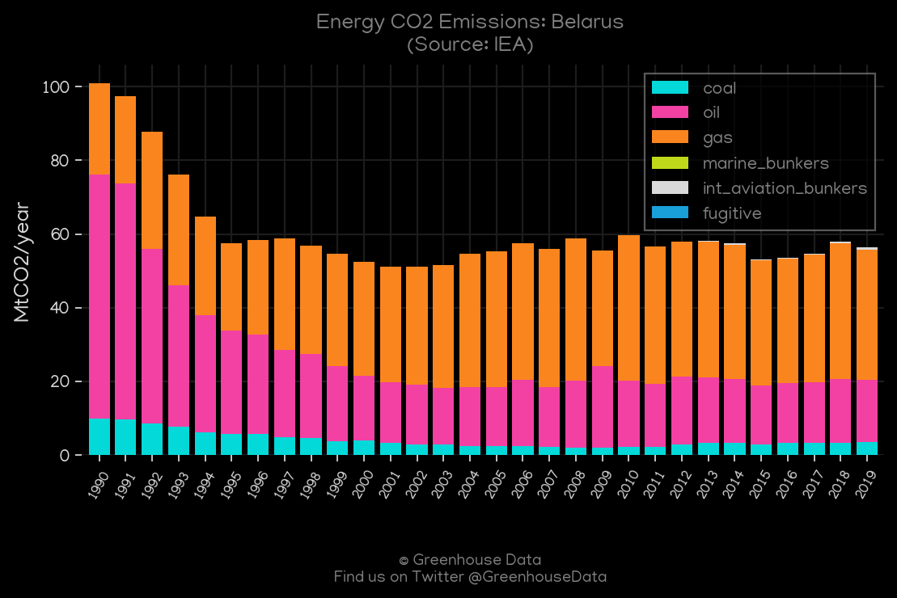
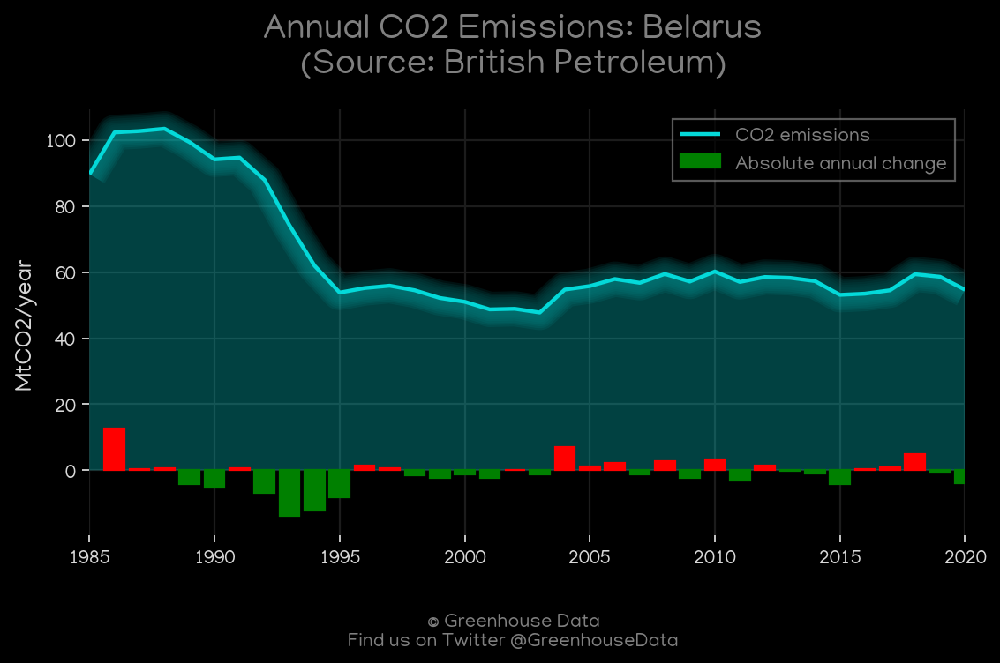
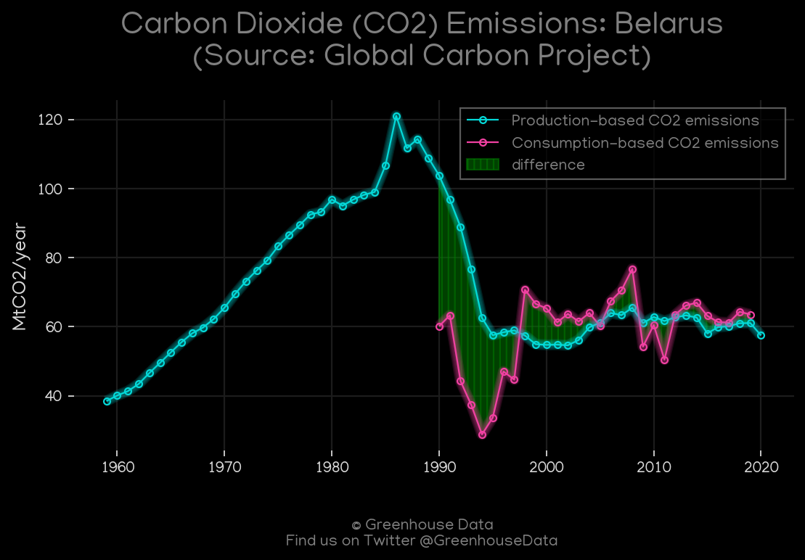
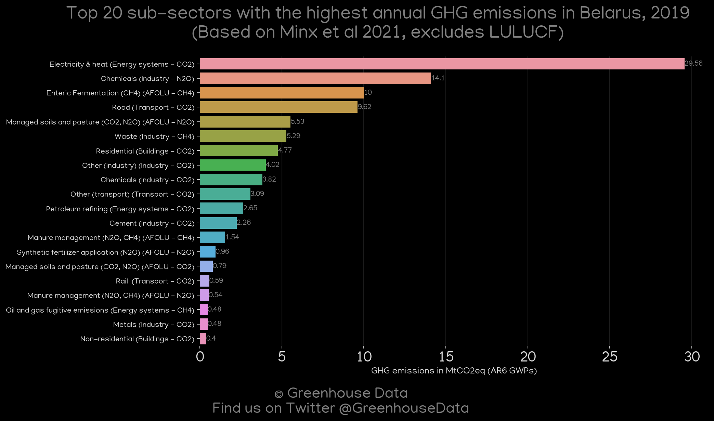
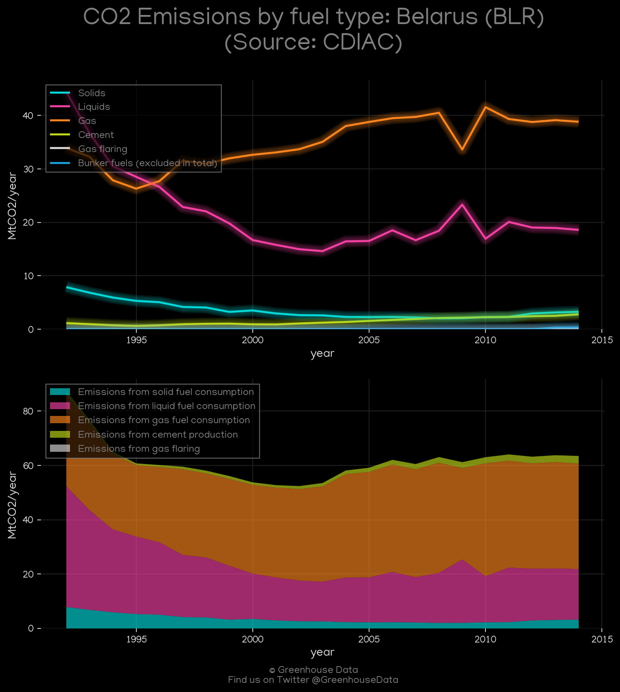

<h1 align="center">
🇧🇾🇧🇾🇧🇾🇧🇾🇧🇾
 
Belarus
 
🇧🇾🇧🇾🇧🇾🇧🇾🇧🇾
</h1>
<h2>Datasets:</h2>

<a href="https://github.com/dquintani/Greenhouse-Data/tree/master/country_data/BLR_Belarus/data">View on Github</a>
 

<a href="data/BLR_GCP_cons.csv">GCP_cons</a> || <a href="data/BLR_IEA.csv">IEA</a> || <a href="data/BLR_GCP_consupmption.csv">GCP_consupmption</a> || <a href="data/BLR_CDIAC.csv">CDIAC</a> || <a href="data/BLR_PRIMAP-hist.csv">PRIMAP-hist</a> || <a href="data/BLR_EDGAR.csv">EDGAR</a> || <a href="data/BLR_FAO.csv">FAO</a> || <a href="data/BLR_GCP.csv">GCP</a> || <a href="data/BLR_EIA.csv">EIA</a> || <a href="data/BLR_Minx_2021.csv">Minx_2021</a> || <a href="data/BLR_BP.csv">BP</a> || <a href="data/BLR_EPA.csv">EPA</a> || <a href="data/BLR_CAIT.csv">CAIT</a>

 

<h1>Figures:</h1><h2>#1 (BLR_CO2_totals)</h2>

<h2>#2 (BLR_UNFCCC_AI_1)</h2>

<h2>#3 (BLR_CAIT_gases_1)</h2>

<h2>#4 (BLR_EIA_1)</h2>

<h2>#5 (BLR_IEA_1)</h2>

<h2>#6 (BLR_BP_1)</h2>

<h2>#7 (BLR_GCP_1)</h2>

<h2>#8 (BLR_Minx_top20_subsectors)</h2>

<h2>#9 (BLR_CDIAC_1)</h2>

