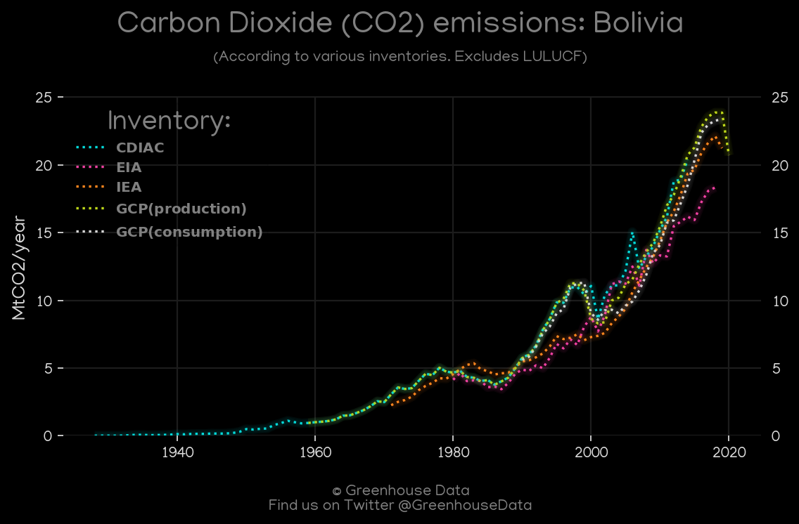
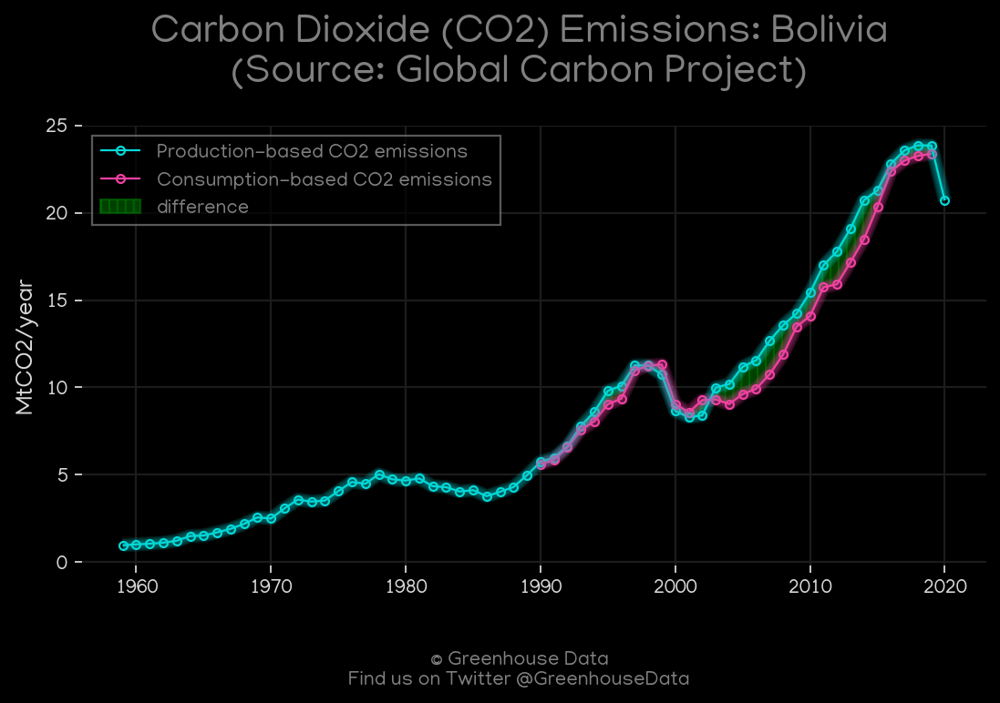
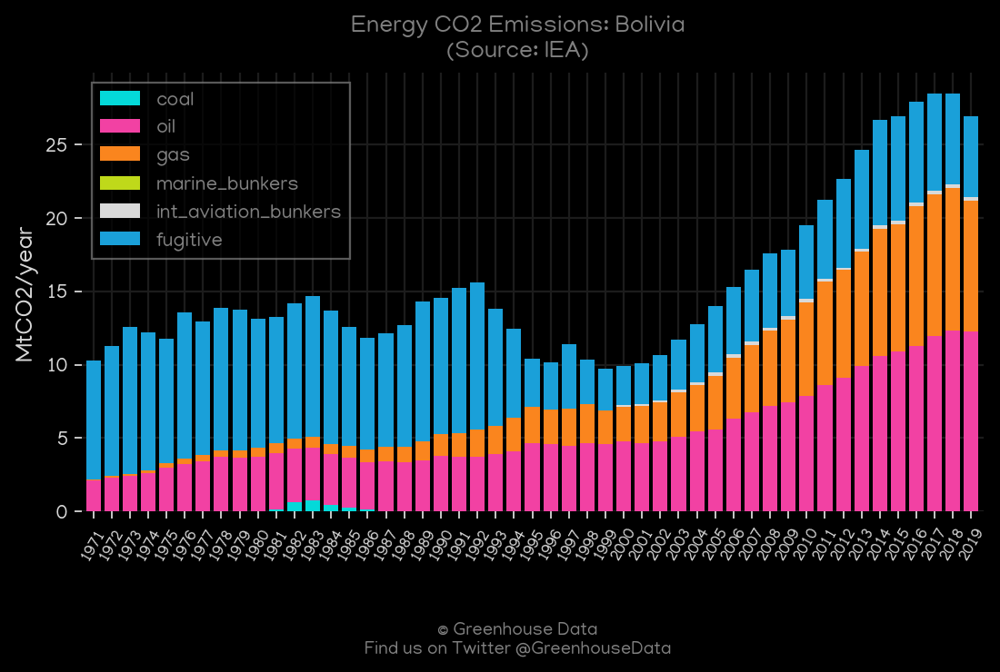
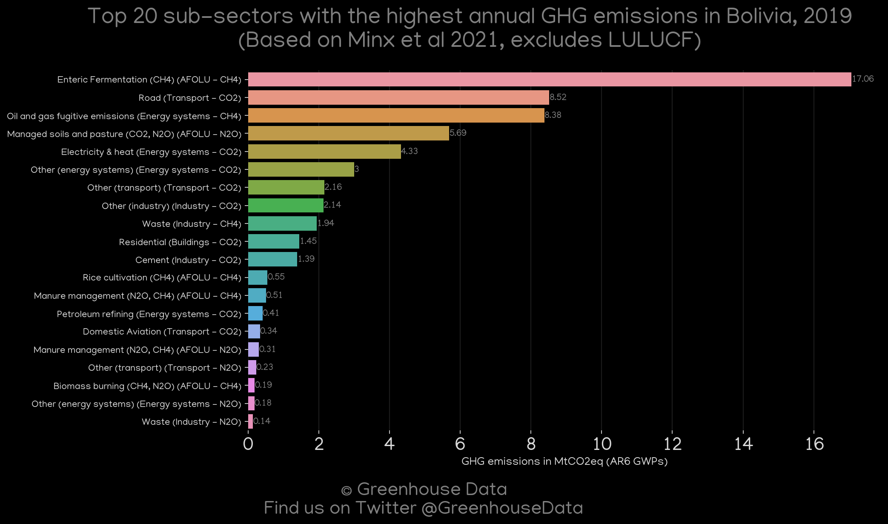
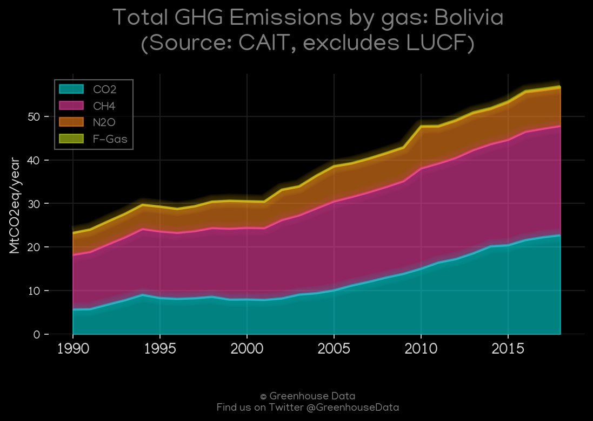
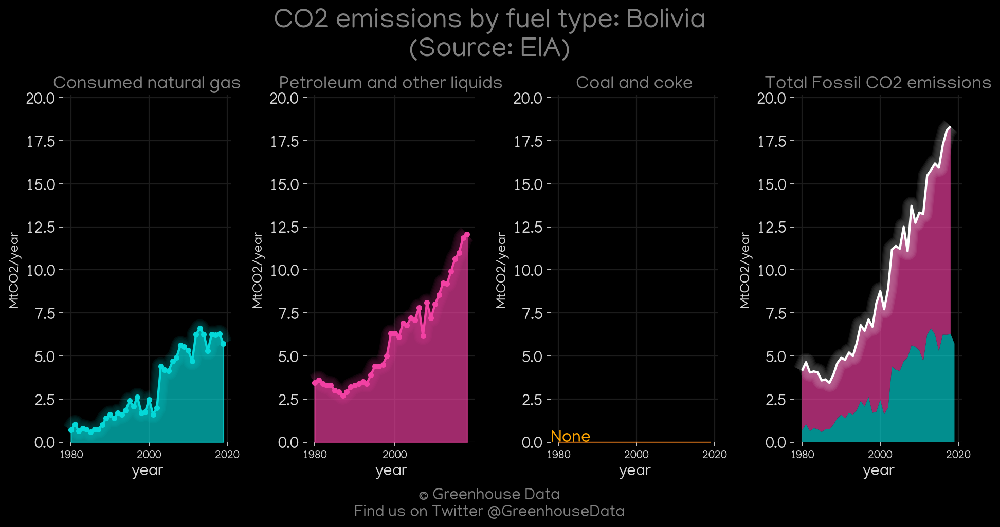
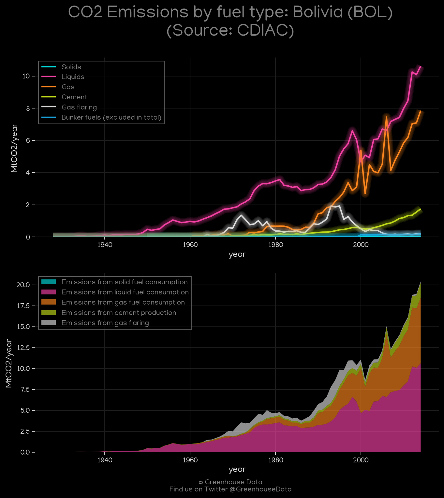

<h1 align="center">
🇧🇴🇧🇴🇧🇴🇧🇴🇧🇴
 
Bolivia
 
🇧🇴🇧🇴🇧🇴🇧🇴🇧🇴
</h1>
<h2>Datasets:</h2>

<a href="https://github.com/dquintani/GreenhouseData/tree/master/country_data/BOL_Bolivia/data">View on Github</a>
 

<a href="data/BOL_EPA.csv">EPA</a> || <a href="data/BOL_Minx_2021.csv">Minx_2021</a> || <a href="data/BOL_EIA.csv">EIA</a> || <a href="data/BOL_GCP.csv">GCP</a> || <a href="data/BOL_PRIMAP-hist.csv">PRIMAP-hist</a> || <a href="data/BOL_EDGAR.csv">EDGAR</a> || <a href="data/BOL_GCP_consupmption.csv">GCP_consupmption</a> || <a href="data/BOL_FAO.csv">FAO</a> || <a href="data/BOL_IEA.csv">IEA</a> || <a href="data/BOL_CDIAC.csv">CDIAC</a> || <a href="data/BOL_CAIT.csv">CAIT</a>

 

<h1>Figures:</h1><h2>#1 (BOL_CO2_totals)</h2>

<h2>#2 (BOL_GCP_1)</h2>

<h2>#3 (BOL_IEA_1)</h2>

<h2>#4 (BOL_UNFCCC_NAI_1)</h2>

<h2>#5 (BOL_Minx_top20_subsectors)</h2>

<h2>#6 (BOL_CAIT_gases_1)</h2>

<h2>#7 (BOL_EIA_1)</h2>

<h2>#8 (BOL_CDIAC_1)</h2>

