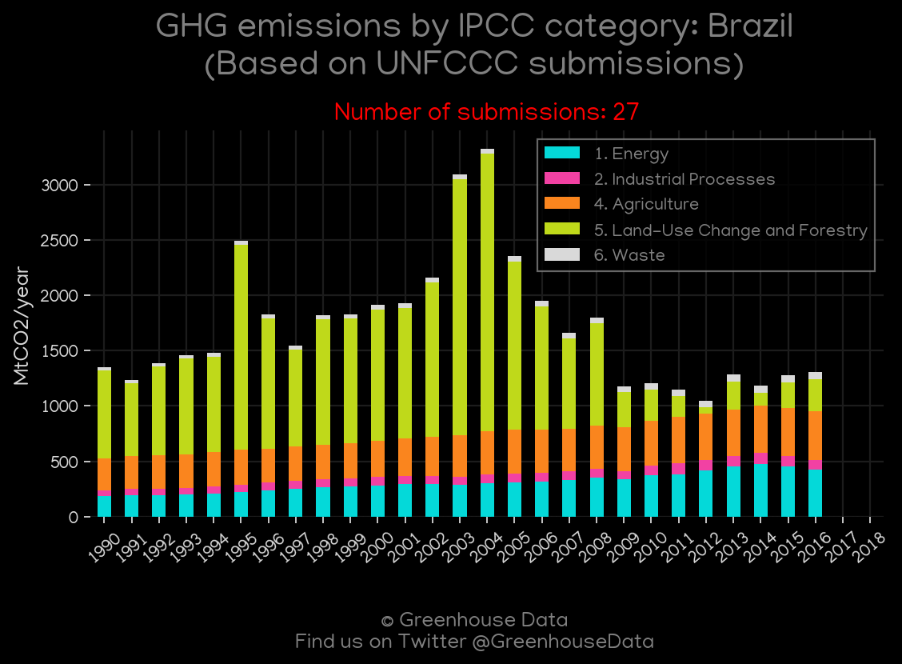
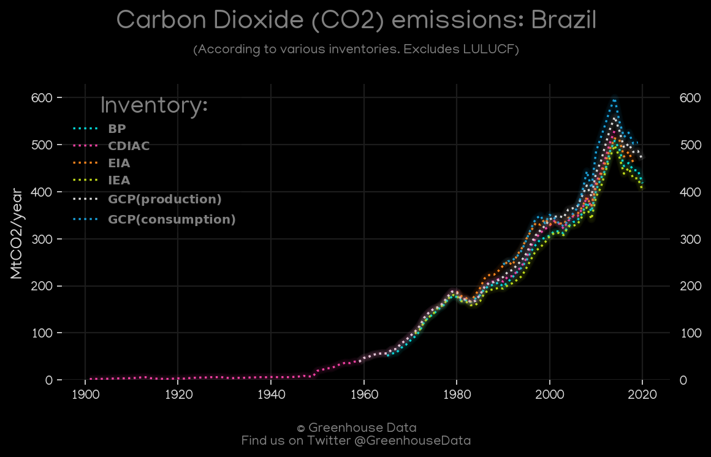
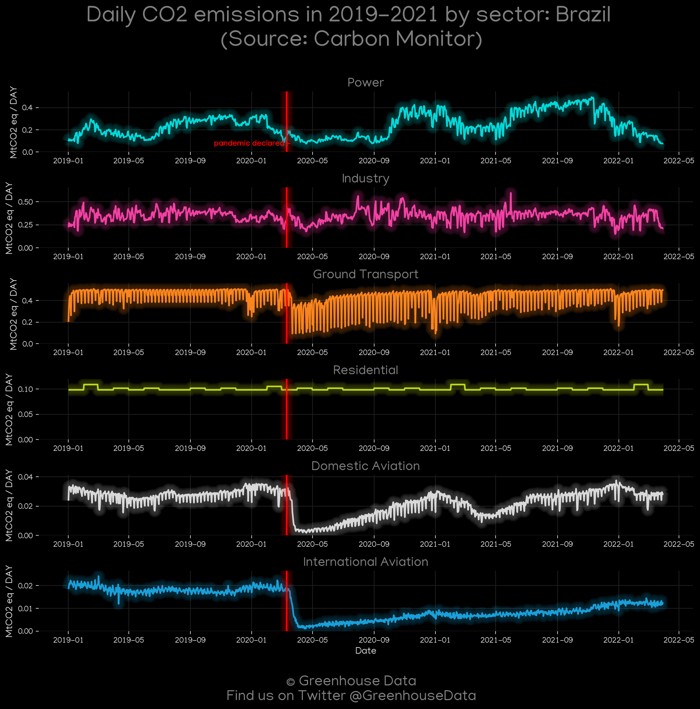
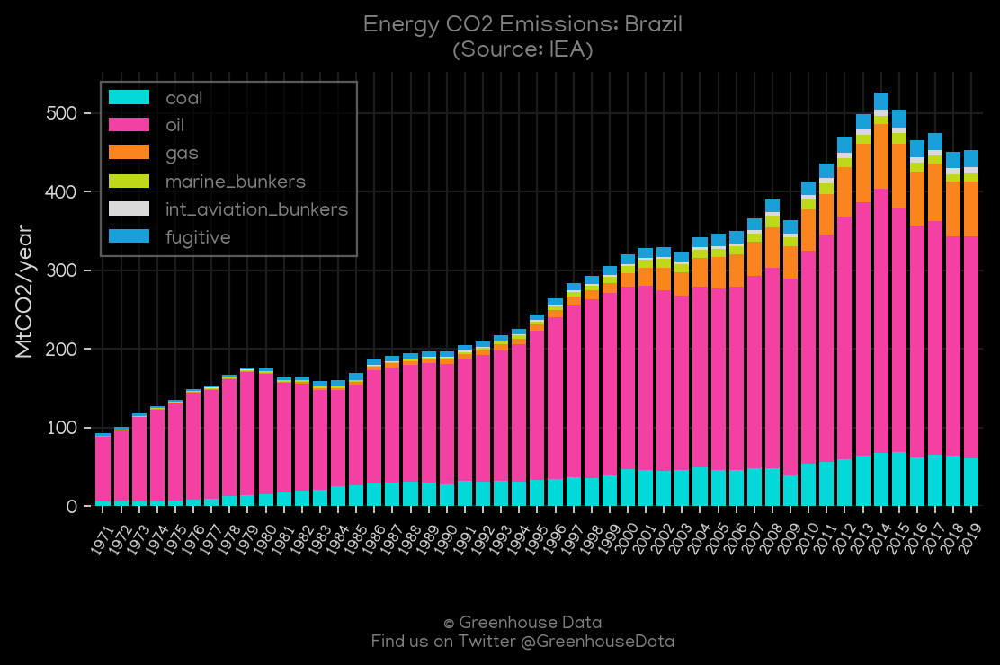
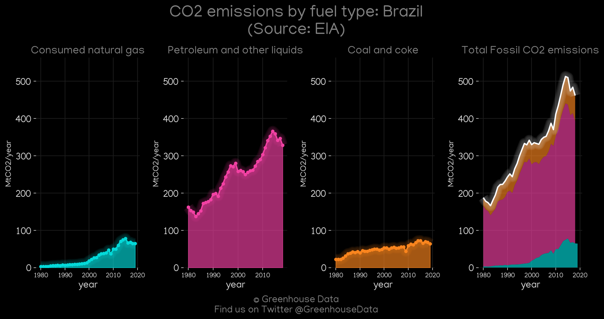
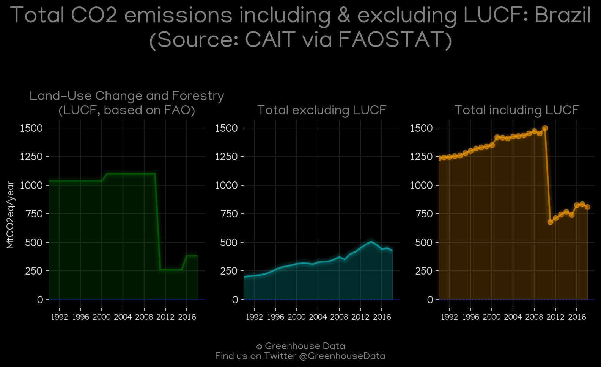
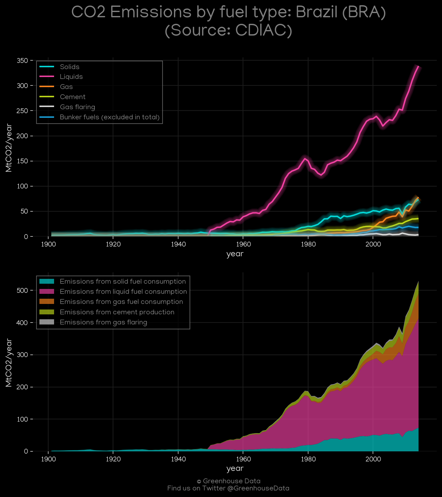
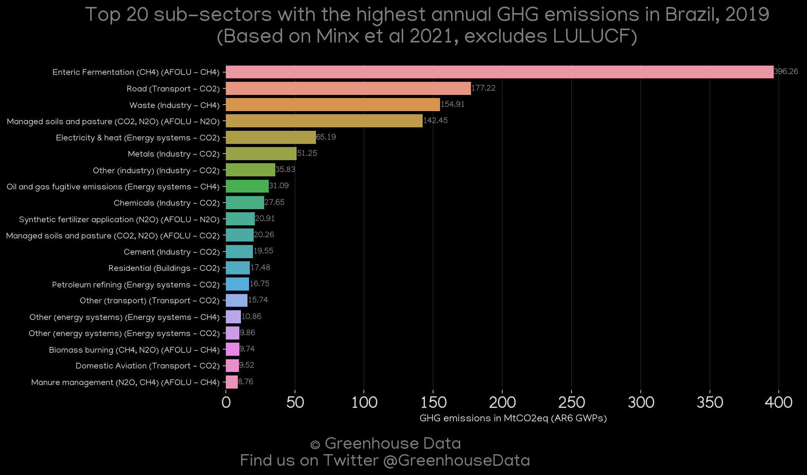
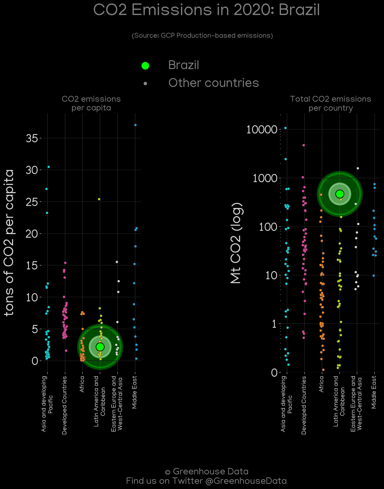
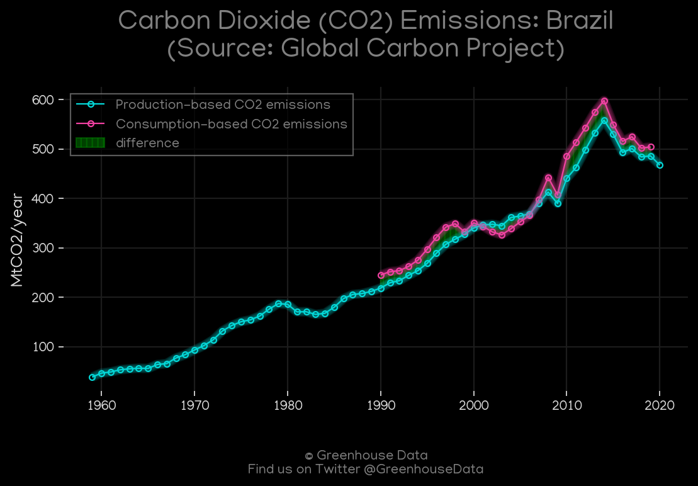

<h1 align="center">
🇧🇷🇧🇷🇧🇷🇧🇷🇧🇷
 
Brazil
 
🇧🇷🇧🇷🇧🇷🇧🇷🇧🇷
</h1>
<h2>Datasets:</h2>

<a href="https://github.com/dquintani/GreenhouseData/tree/master/country_data/BRA_Brazil/data">View on Github</a>
 

<a href="data/BRA_GCP.csv">GCP</a> || <a href="data/BRA_FAO.csv">FAO</a> || <a href="data/BRA_GCP_consupmption.csv">GCP_consupmption</a> || <a href="data/BRA_EDGAR.csv">EDGAR</a> || <a href="data/BRA_EIA.csv">EIA</a> || <a href="data/BRA_EPA.csv">EPA</a> || <a href="data/BRA_CDIAC.csv">CDIAC</a> || <a href="data/BRA_Minx_2021.csv">Minx_2021</a> || <a href="data/BRA_PRIMAP-hist.csv">PRIMAP-hist</a> || <a href="data/BRA_CAIT.csv">CAIT</a> || <a href="data/BRA_BP.csv">BP</a> || <a href="data/BRA_IEA.csv">IEA</a>

 

<h1>Figures:</h1><h2>#1 (BRA_UNFCCC_NAI_1)</h2>

<h2>#2 (BRA_CO2_totals)</h2>

<h2>#3 (BRA_Carbon_Monitor_1)</h2>

<h2>#4 (BRA_relative_totals)</h2>

<h2>#5 (BRA_CAIT_gases_1)</h2>

<h2>#6 (BRA_IEA_1)</h2>

<h2>#7 (BRA_EIA_1)</h2>

<h2>#8 (BRA_BP_1)</h2>

<h2>#9 (BRA_CAIT_lucf_vs_nolucf)</h2>

<h2>#10 (BRA_CDIAC_1)</h2>

<h2>#11 (BRA_Minx_top20_subsectors)</h2>

<h2>#12 (BRA_GCP_Country_Highlight)</h2>

<h2>#13 (BRA_GCP_1)</h2>

