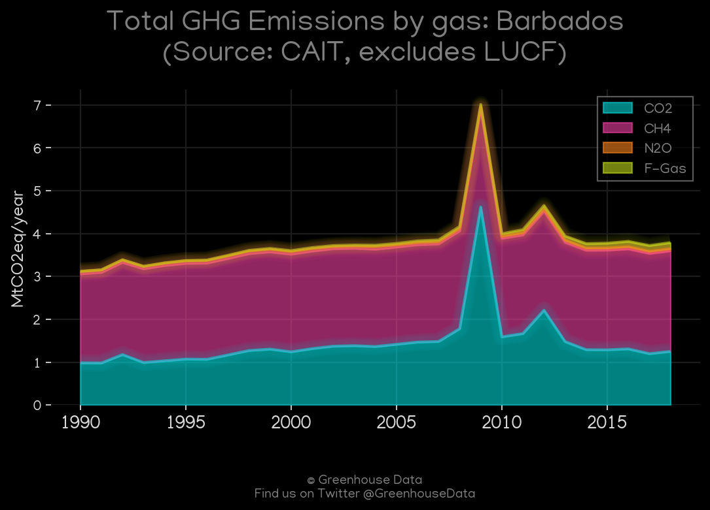
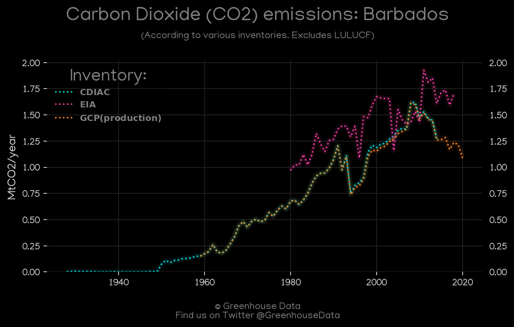
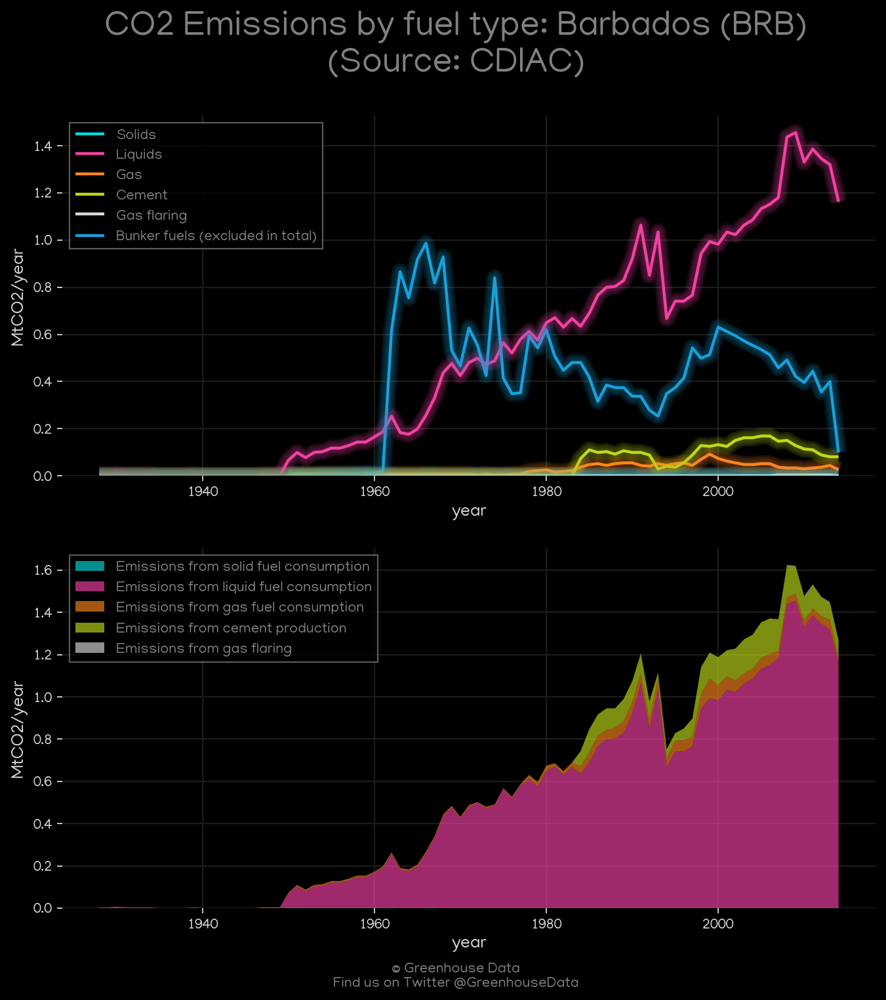
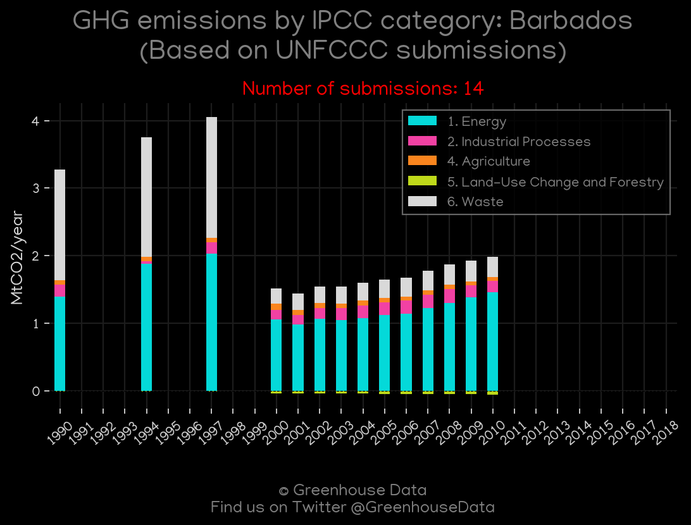
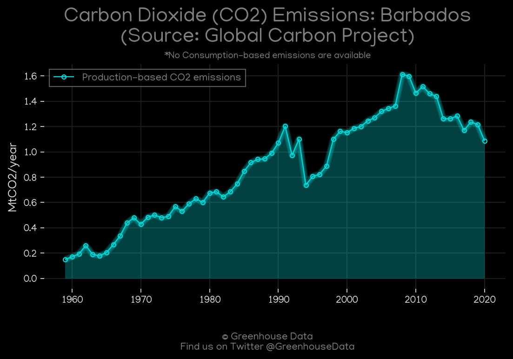
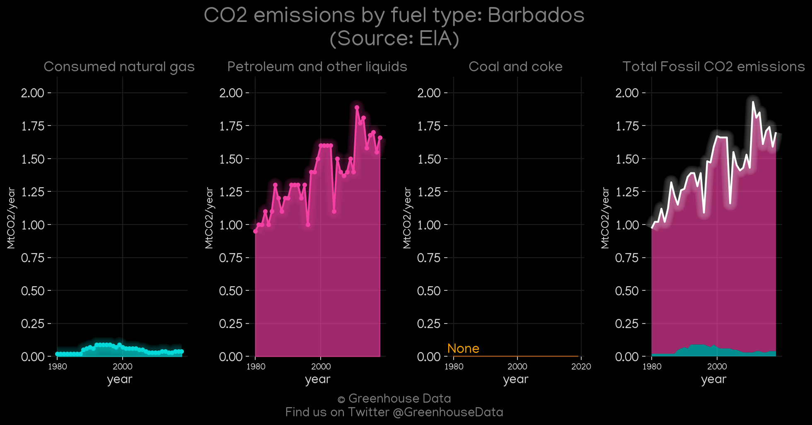

<h1 align="center">
🇧🇧🇧🇧🇧🇧🇧🇧🇧🇧
 
Barbados
 
🇧🇧🇧🇧🇧🇧🇧🇧🇧🇧
</h1>
<h2>Datasets:</h2>

<a href="https://github.com/dquintani/GreenhouseData/tree/master/country_data/BRB_Barbados/data">View on Github</a>
 

<a href="data/BRB_GCP_consupmption.csv">GCP_consupmption</a> || <a href="data/BRB_Minx_2021.csv">Minx_2021</a> || <a href="data/BRB_CAIT.csv">CAIT</a> || <a href="data/BRB_CDIAC.csv">CDIAC</a> || <a href="data/BRB_EPA.csv">EPA</a> || <a href="data/BRB_EIA.csv">EIA</a> || <a href="data/BRB_PRIMAP-hist.csv">PRIMAP-hist</a> || <a href="data/BRB_FAO.csv">FAO</a> || <a href="data/BRB_GCP.csv">GCP</a> || <a href="data/BRB_EDGAR.csv">EDGAR</a>

 

<h1>Figures:</h1><h2>#1 (BRB_CAIT_gases_1)</h2>

<h2>#2 (BRB_CO2_totals)</h2>

<h2>#3 (BRB_Minx_top20_subsectors)</h2>

<h2>#4 (BRB_CDIAC_1)</h2>

<h2>#5 (BRB_CAIT_lucf_vs_nolucf)</h2>

<h2>#6 (BRB_UNFCCC_NAI_1)</h2>

<h2>#7 (BRB_GCP_1)</h2>

<h2>#8 (BRB_EIA_1)</h2>

