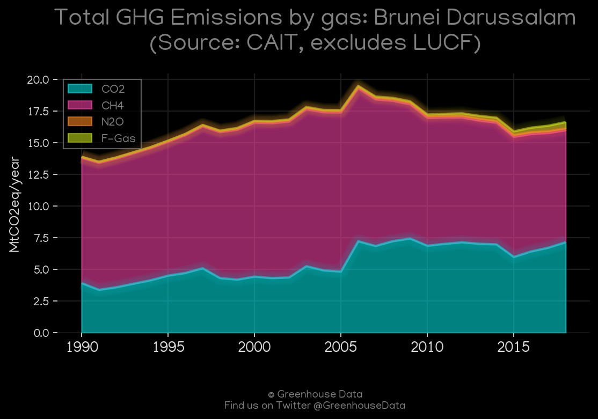
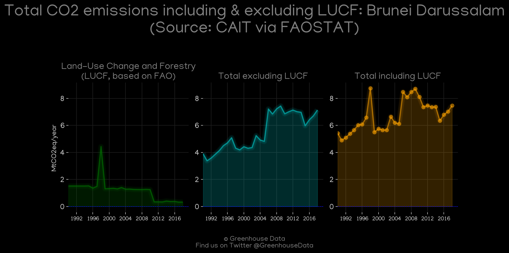
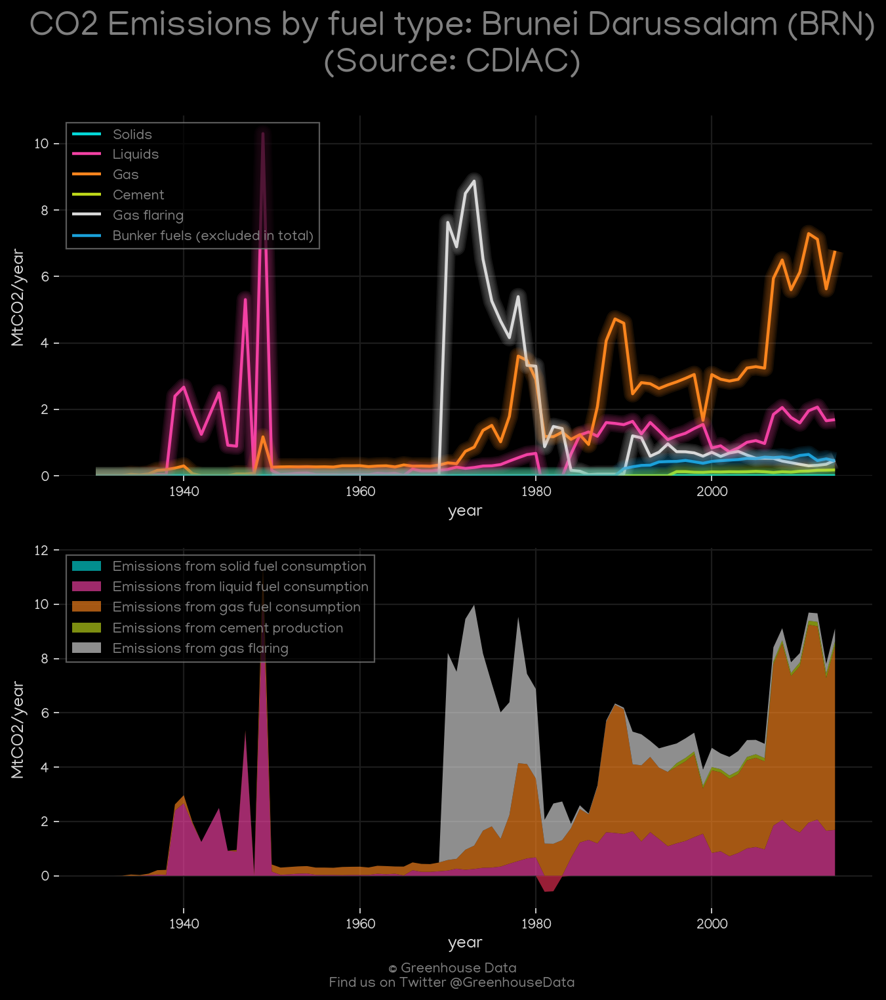
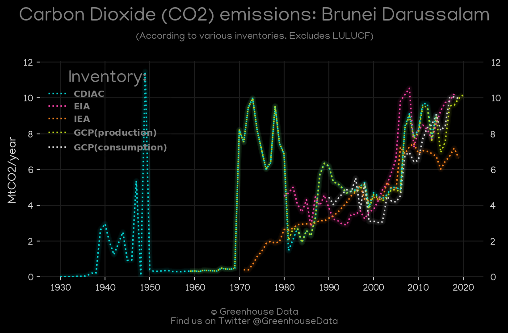
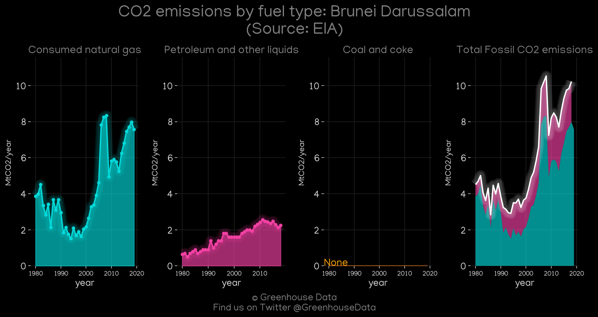
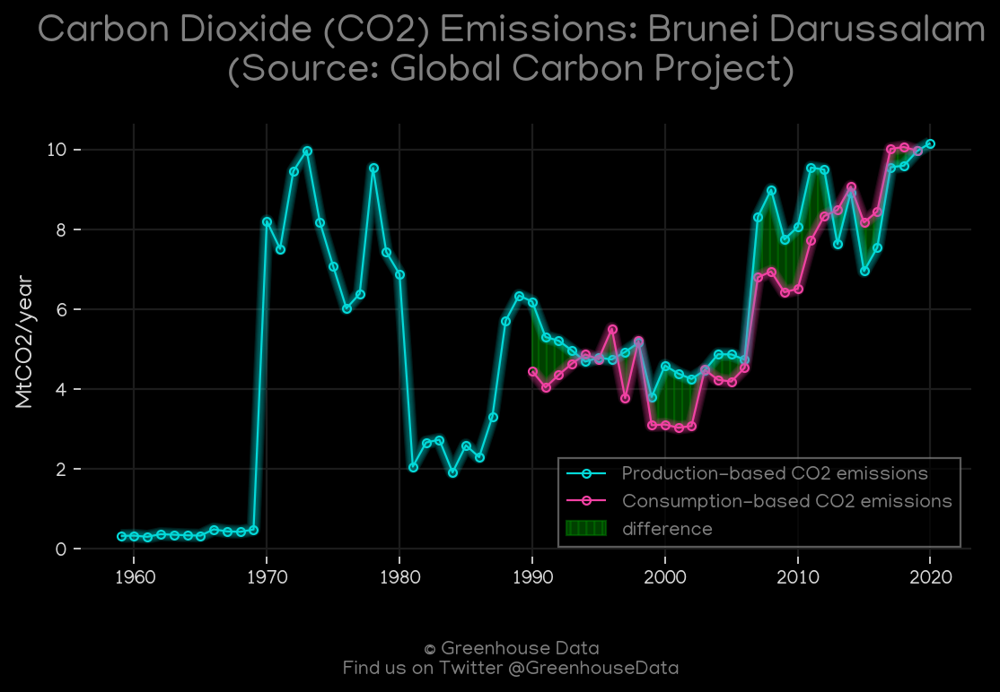
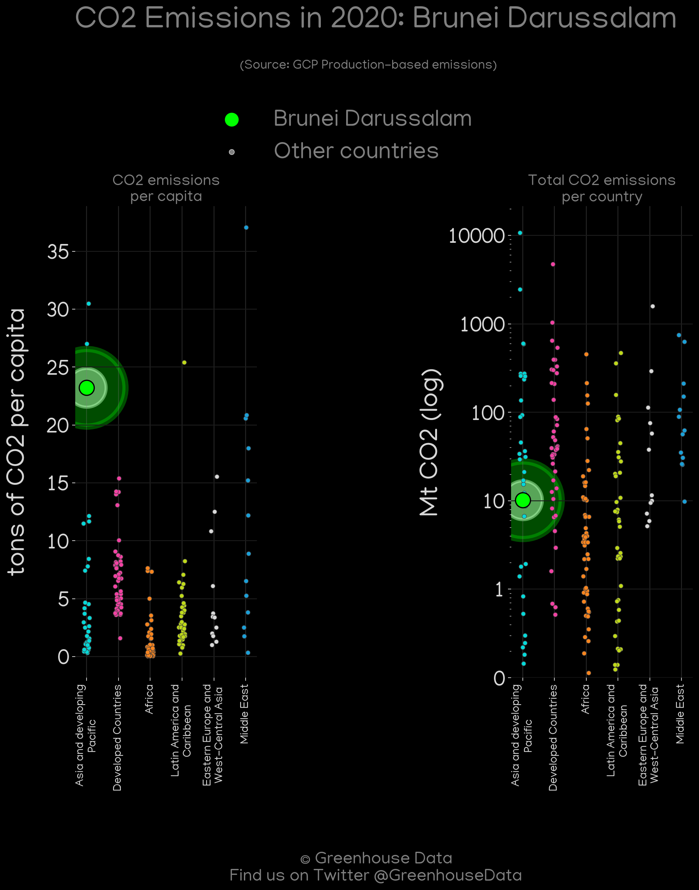
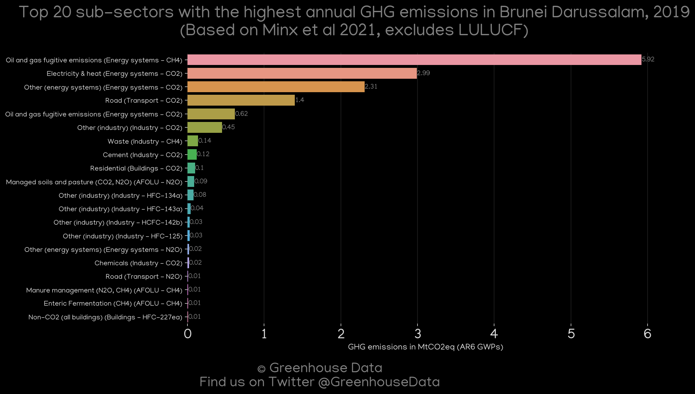
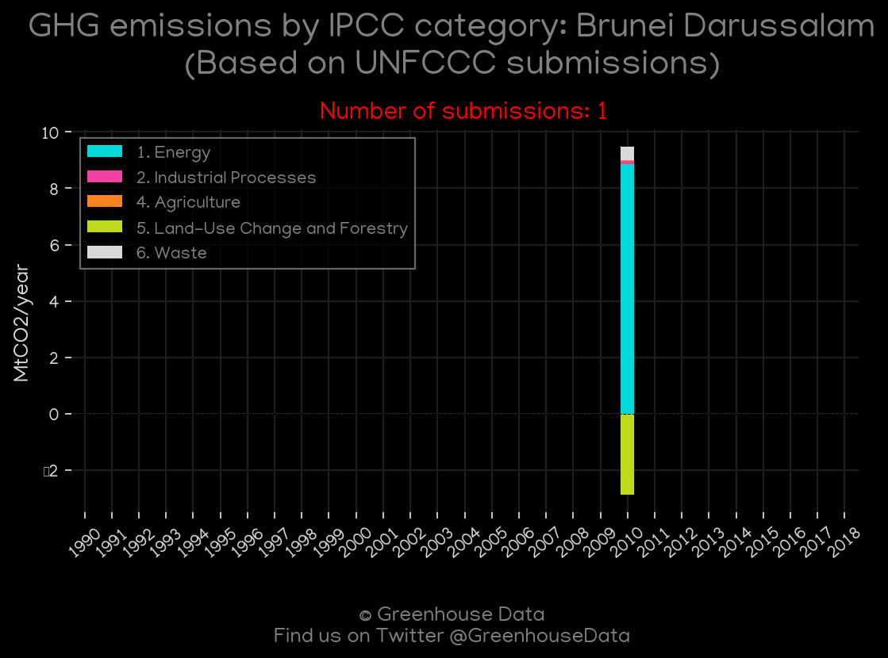

<h1 align="center">
🇧🇳🇧🇳🇧🇳🇧🇳🇧🇳
 
Brunei Darussalam
 
🇧🇳🇧🇳🇧🇳🇧🇳🇧🇳
</h1>
<h2>Datasets:</h2>

<a href="https://github.com/dquintani/GreenhouseData/tree/master/country_data/BRN_Brunei Darussalam/data">View on Github</a>
 

<a href="data/BRN_CAIT.csv">CAIT</a> || <a href="data/BRN_CDIAC.csv">CDIAC</a> || <a href="data/BRN_EDGAR.csv">EDGAR</a> || <a href="data/BRN_EIA.csv">EIA</a> || <a href="data/BRN_EPA.csv">EPA</a> || <a href="data/BRN_FAO.csv">FAO</a> || <a href="data/BRN_GCP.csv">GCP</a> || <a href="data/BRN_GCP_consupmption.csv">GCP_consupmption</a> || <a href="data/BRN_IEA.csv">IEA</a> || <a href="data/BRN_Minx_2021.csv">Minx_2021</a> || <a href="data/BRN_PRIMAP-hist.csv">PRIMAP-hist</a>

 

<h1>Figures:</h1><h2>#1 (BRN_CAIT_gases_1)</h2>

<h2>#2 (BRN_CAIT_lucf_vs_nolucf)</h2>

<h2>#3 (BRN_CDIAC_1)</h2>

<h2>#4 (BRN_CO2_totals)</h2>

<h2>#5 (BRN_EIA_1)</h2>

<h2>#6 (BRN_GCP_1)</h2>

<h2>#7 (BRN_GCP_Country_Highlight)</h2>

<h2>#8 (BRN_IEA_1)</h2>

<h2>#9 (BRN_Minx_top20_subsectors)</h2>

<h2>#10 (BRN_relative_totals)</h2>

<h2>#11 (BRN_UNFCCC_NAI_1)</h2>

