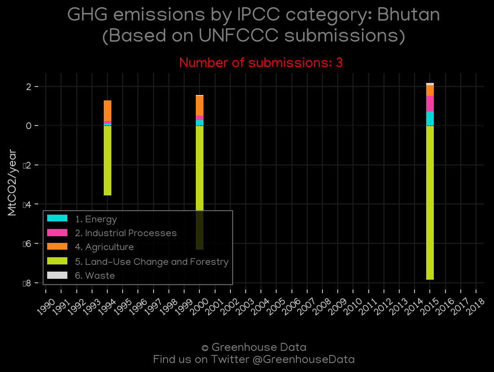
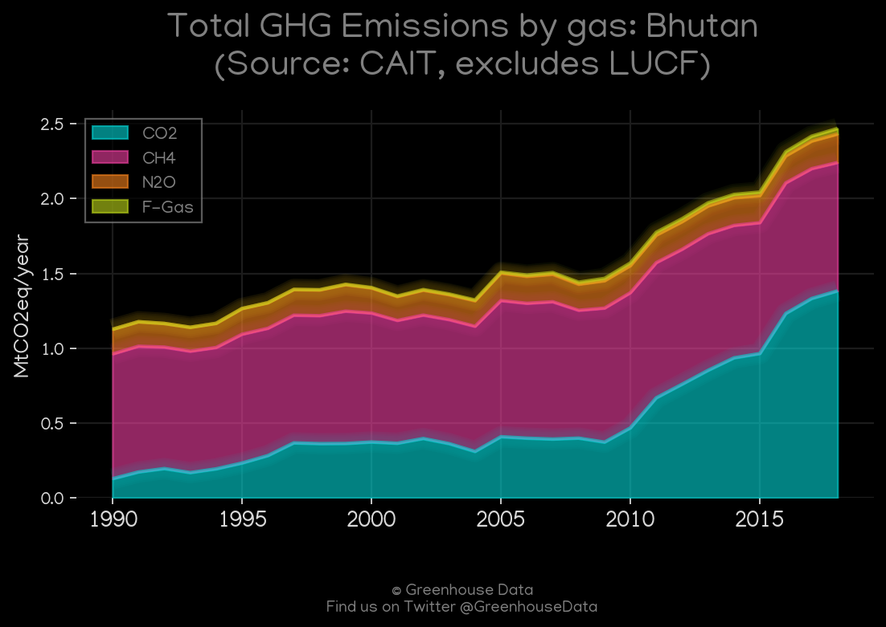
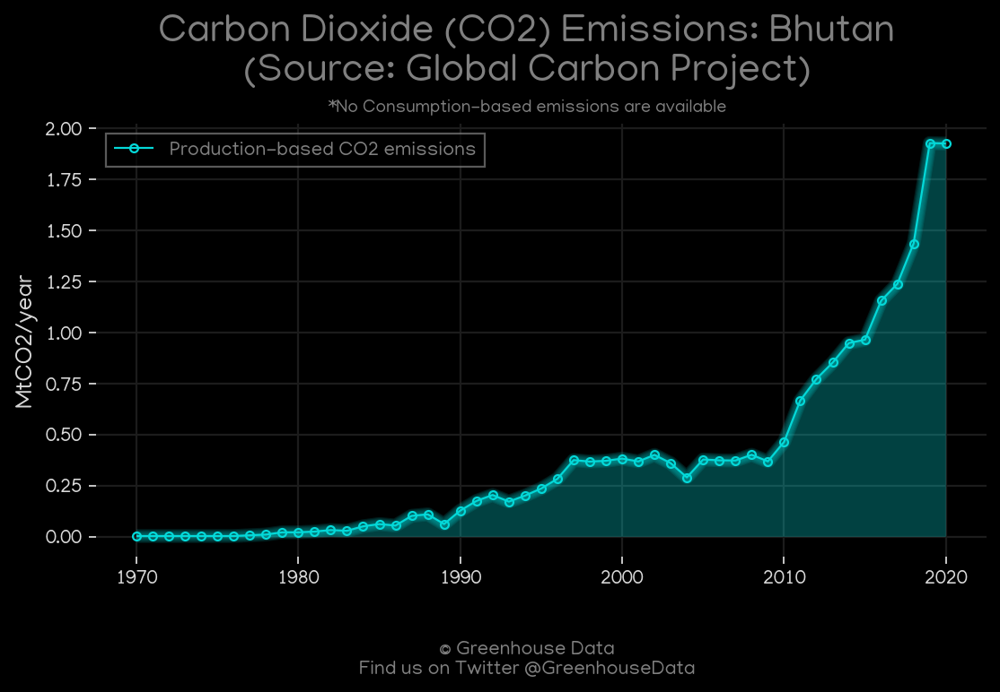
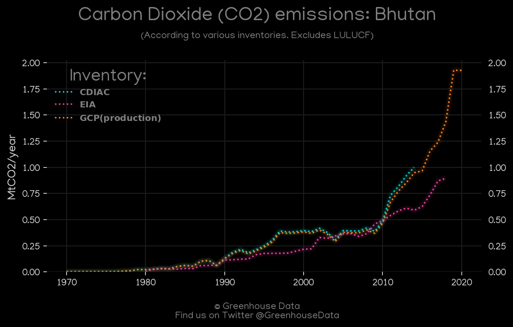
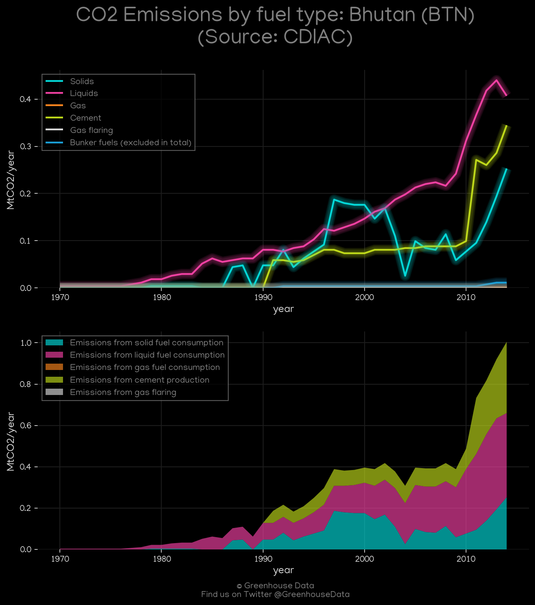
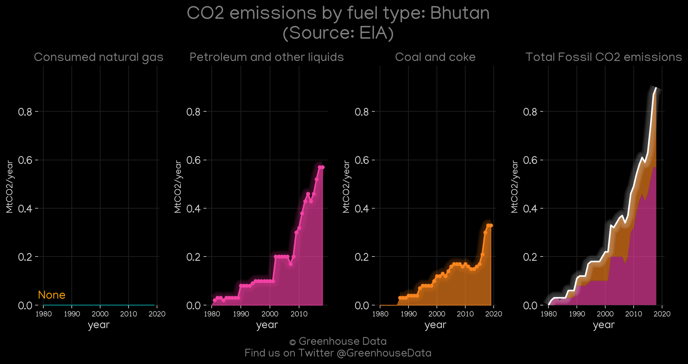
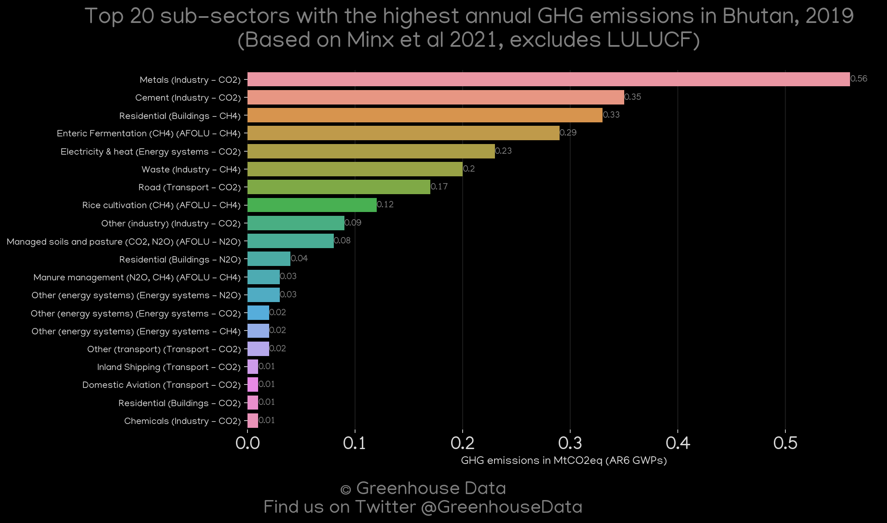

<h1 align="center">
🇧🇹🇧🇹🇧🇹🇧🇹🇧🇹
 
Bhutan
 
🇧🇹🇧🇹🇧🇹🇧🇹🇧🇹
</h1>
<h2>Datasets:</h2>

<a href="https://github.com/dquintani/GreenhouseData/tree/master/country_data/BTN_Bhutan/data">View on Github</a>
 

<a href="data/BTN_GCP_consupmption.csv">GCP_consupmption</a> || <a href="data/BTN_CAIT.csv">CAIT</a> || <a href="data/BTN_CDIAC.csv">CDIAC</a> || <a href="data/BTN_GCP.csv">GCP</a> || <a href="data/BTN_EIA.csv">EIA</a> || <a href="data/BTN_EDGAR.csv">EDGAR</a> || <a href="data/BTN_PRIMAP-hist.csv">PRIMAP-hist</a> || <a href="data/BTN_Minx_2021.csv">Minx_2021</a> || <a href="data/BTN_EPA.csv">EPA</a> || <a href="data/BTN_FAO.csv">FAO</a>

 

<h1>Figures:</h1><h2>#1 (BTN_UNFCCC_NAI_1)</h2>

<h2>#2 (BTN_CAIT_gases_1)</h2>

<h2>#3 (BTN_GCP_1)</h2>

<h2>#4 (BTN_CO2_totals)</h2>

<h2>#5 (BTN_CDIAC_1)</h2>

<h2>#6 (BTN_EIA_1)</h2>

<h2>#7 (BTN_Minx_top20_subsectors)</h2>

