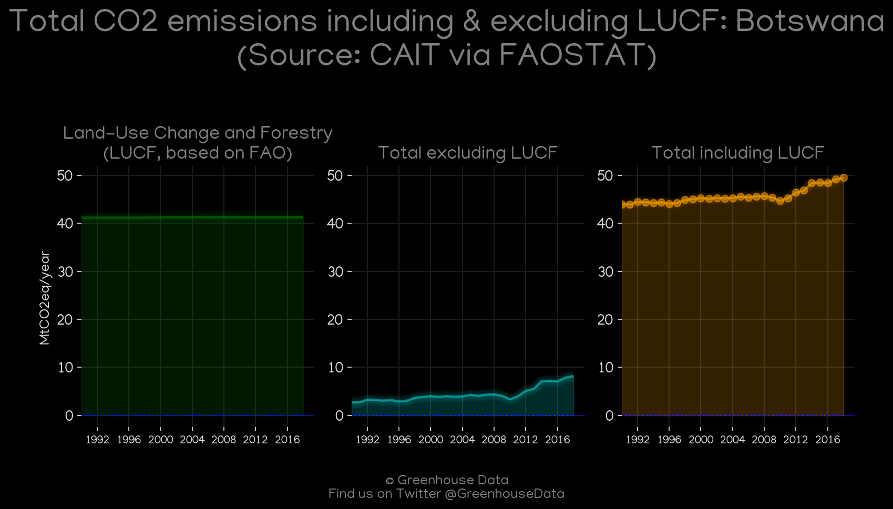
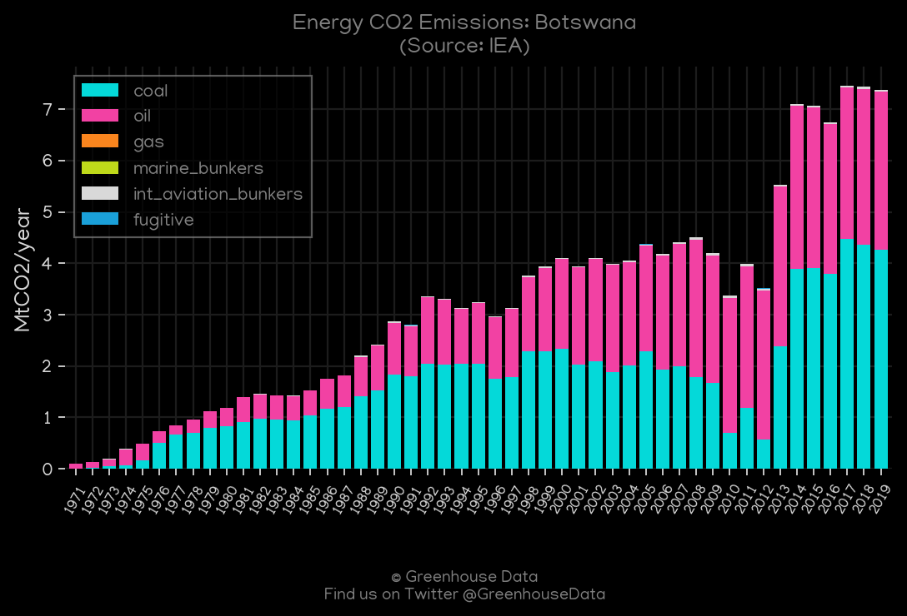
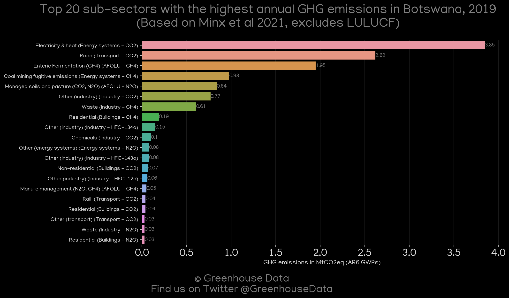
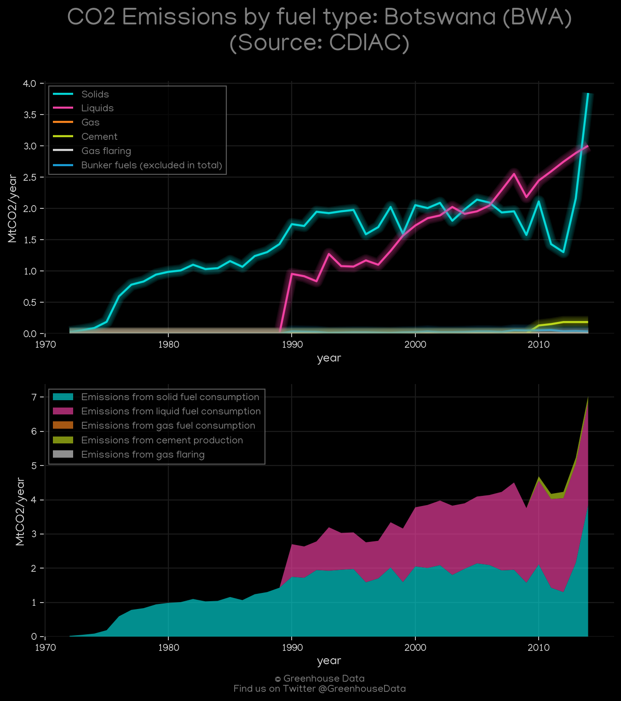
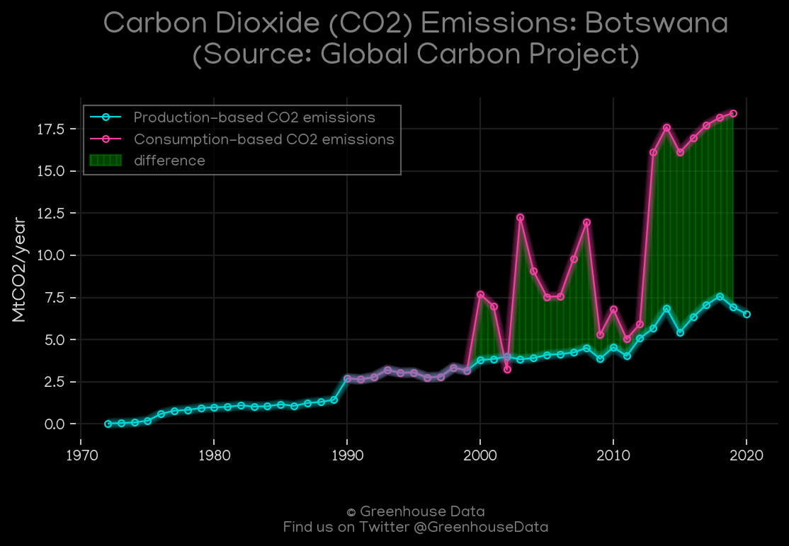
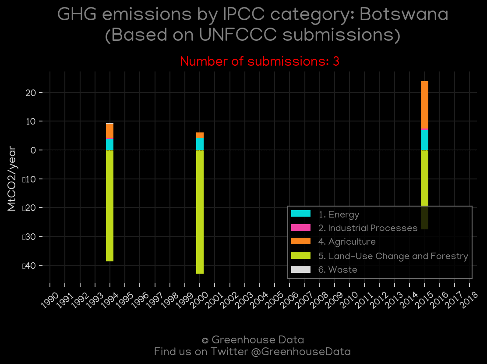
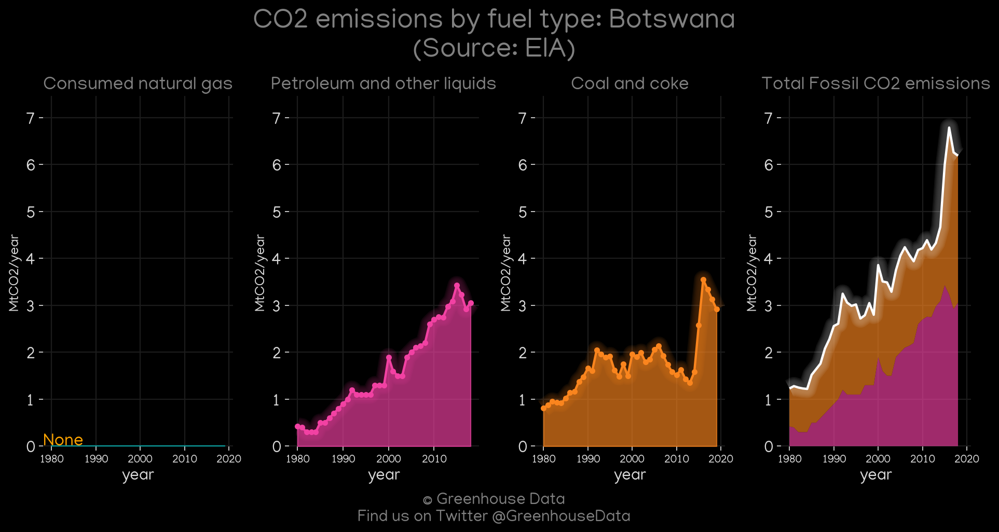
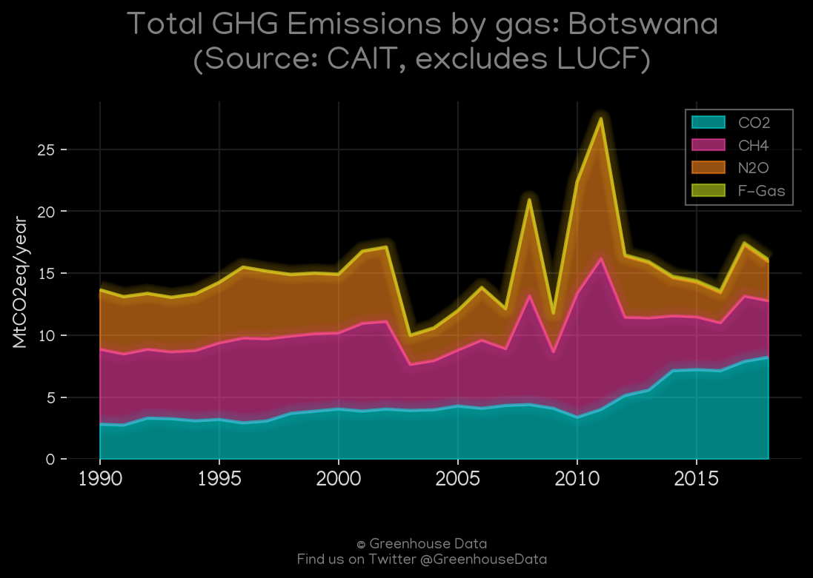

<h1 align="center">
🇧🇼🇧🇼🇧🇼🇧🇼🇧🇼
 
Botswana
 
🇧🇼🇧🇼🇧🇼🇧🇼🇧🇼
</h1>
<h2>Datasets:</h2>

<a href="https://github.com/dquintani/GreenhouseData/tree/master/country_data/BWA_Botswana/data">View on Github</a>
 

<a href="data/BWA_EIA.csv">EIA</a> || <a href="data/BWA_PRIMAP-hist.csv">PRIMAP-hist</a> || <a href="data/BWA_FAO.csv">FAO</a> || <a href="data/BWA_GCP.csv">GCP</a> || <a href="data/BWA_GCP_consupmption.csv">GCP_consupmption</a> || <a href="data/BWA_Minx_2021.csv">Minx_2021</a> || <a href="data/BWA_CAIT.csv">CAIT</a> || <a href="data/BWA_EPA.csv">EPA</a> || <a href="data/BWA_CDIAC.csv">CDIAC</a> || <a href="data/BWA_IEA.csv">IEA</a> || <a href="data/BWA_EDGAR.csv">EDGAR</a>

 

<h1>Figures:</h1><h2>#1 (BWA_CAIT_lucf_vs_nolucf)</h2>

<h2>#2 (BWA_IEA_1)</h2>

<h2>#3 (BWA_Minx_top20_subsectors)</h2>

<h2>#4 (BWA_CDIAC_1)</h2>

<h2>#5 (BWA_GCP_1)</h2>

<h2>#6 (BWA_UNFCCC_NAI_1)</h2>

<h2>#7 (BWA_CO2_totals)</h2>

<h2>#8 (BWA_EIA_1)</h2>

<h2>#9 (BWA_CAIT_gases_1)</h2>

