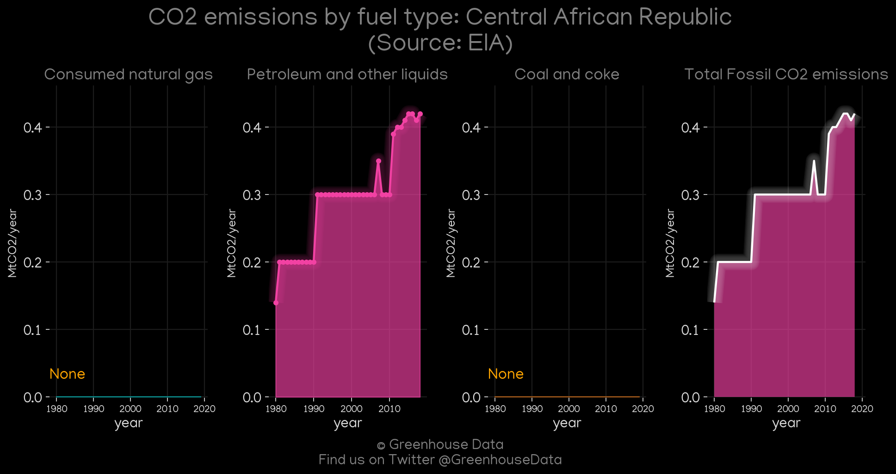
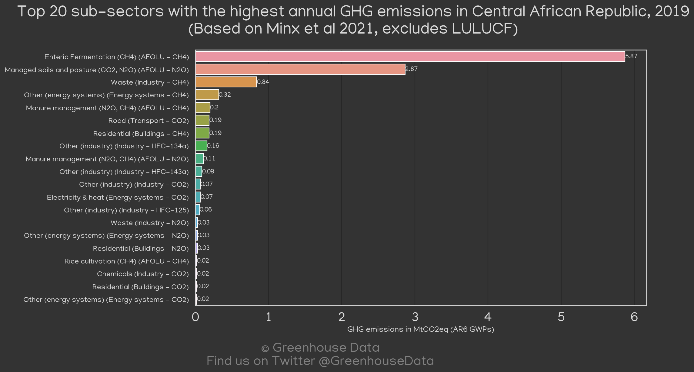
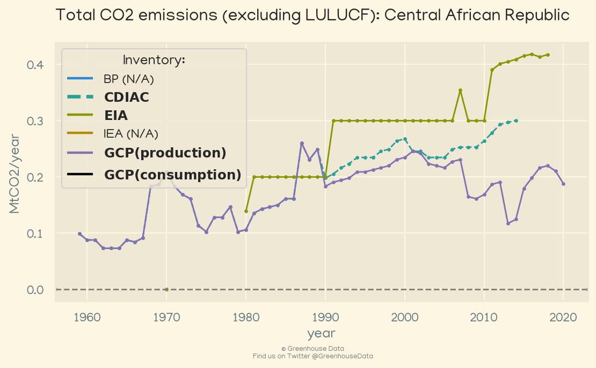
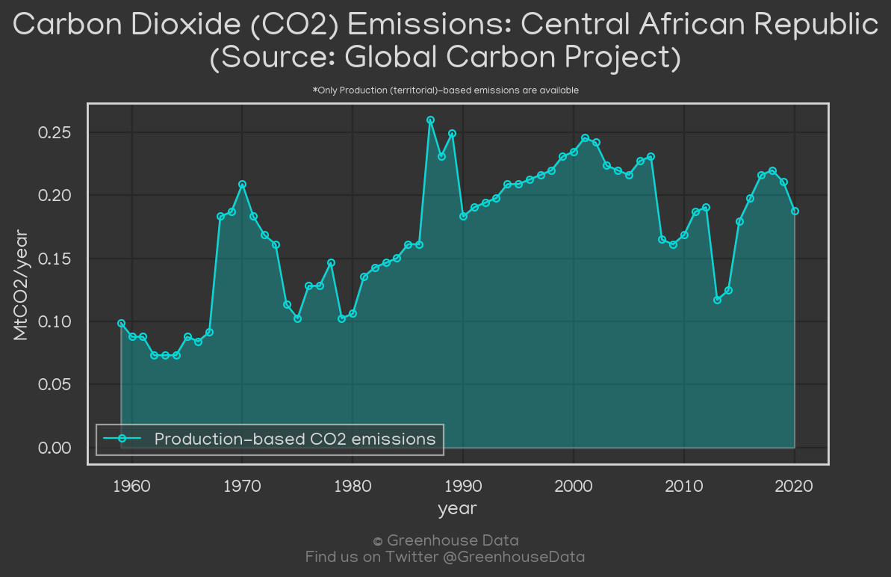
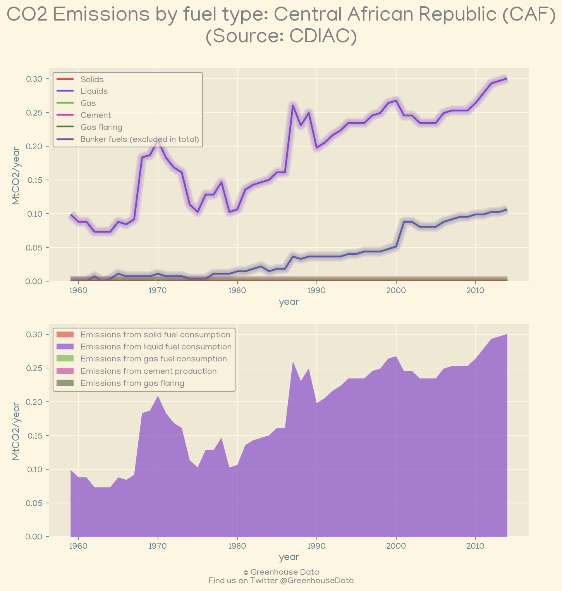
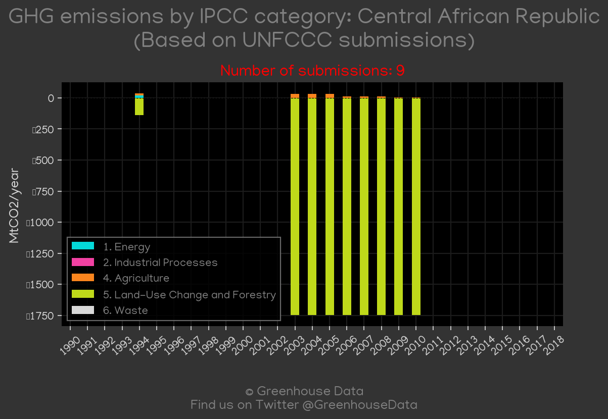

<h1 align="center">
🇨🇫🇨🇫🇨🇫🇨🇫🇨🇫
 
Central African Republic
 
🇨🇫🇨🇫🇨🇫🇨🇫🇨🇫
</h1>
<h2>Datasets:</h2>

<a href="https://github.com/dquintani/GreenhouseData/tree/master/country_data/CAF_Central African Republic/data">View on Github</a>
 

<a href="data/CAF_PRIMAP-hist.csv">PRIMAP-hist</a> || <a href="data/CAF_EPA.csv">EPA</a> || <a href="data/CAF_GCP_consupmption.csv">GCP_consupmption</a> || <a href="data/CAF_Minx_2021.csv">Minx_2021</a> || <a href="data/CAF_CDIAC.csv">CDIAC</a> || <a href="data/CAF_GCP.csv">GCP</a> || <a href="data/CAF_CAIT.csv">CAIT</a> || <a href="data/CAF_FAO.csv">FAO</a> || <a href="data/CAF_EIA.csv">EIA</a> || <a href="data/CAF_EDGAR.csv">EDGAR</a>

 

<h1>Figures:</h1><h2>#1 (CAF_CAIT_gases_1)</h2>

<h2>#2 (CAF_EIA_1)</h2>

<h2>#3 (CAF_Minx_top20_subsectors)</h2>

<h2>#4 (CAF_CO2_totals)</h2>

<h2>#5 (CAF_GCP_1)</h2>

<h2>#6 (CAF_CDIAC_1)</h2>

<h2>#7 (CAF_UNFCCC_NAI_1)</h2>

