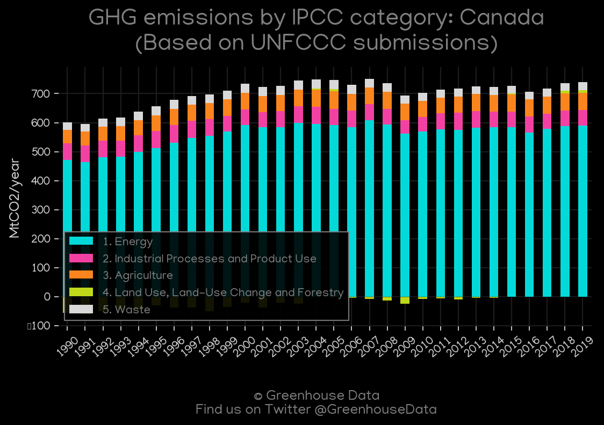
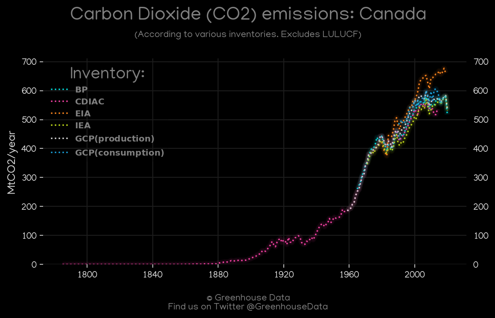
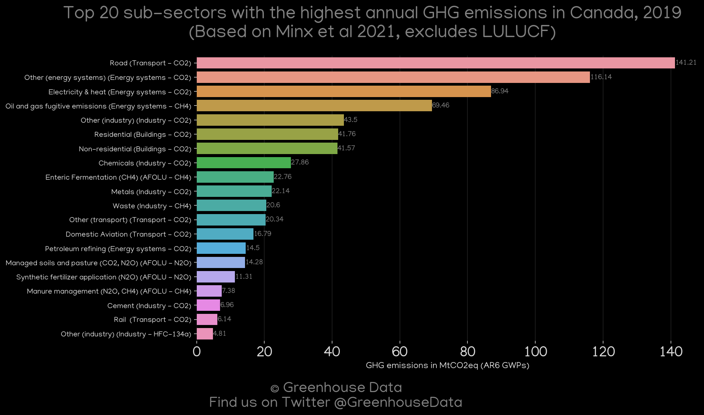
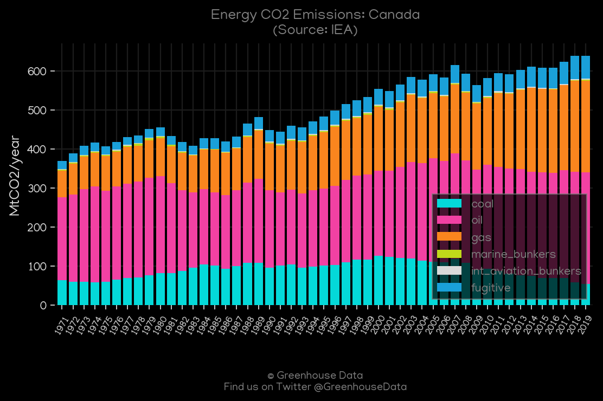
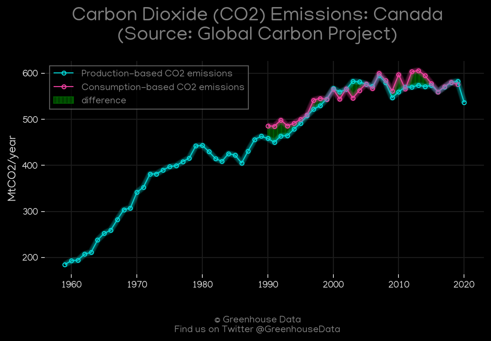
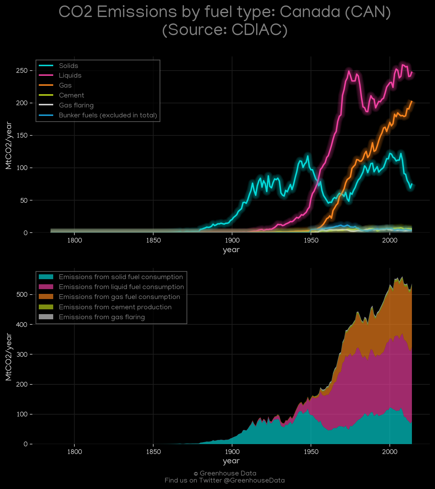

<h1 align="center">
🇨🇦🇨🇦🇨🇦🇨🇦🇨🇦
 
Canada
 
🇨🇦🇨🇦🇨🇦🇨🇦🇨🇦
</h1>
<h2>Datasets:</h2>

<a href="https://github.com/dquintani/GreenhouseData/tree/master/country_data/CAN_Canada/data">View on Github</a>
 

<a href="data/CAN_EDGAR.csv">EDGAR</a> || <a href="data/CAN_Minx_2021.csv">Minx_2021</a> || <a href="data/CAN_IEA.csv">IEA</a> || <a href="data/CAN_EPA.csv">EPA</a> || <a href="data/CAN_GCP_consupmption.csv">GCP_consupmption</a> || <a href="data/CAN_FAO.csv">FAO</a> || <a href="data/CAN_EIA.csv">EIA</a> || <a href="data/CAN_PRIMAP-hist.csv">PRIMAP-hist</a> || <a href="data/CAN_BP.csv">BP</a> || <a href="data/CAN_GCP.csv">GCP</a> || <a href="data/CAN_CAIT.csv">CAIT</a> || <a href="data/CAN_CDIAC.csv">CDIAC</a>

 

<h1>Figures:</h1><h2>#1 (CAN_UNFCCC_AI_1)</h2>

<h2>#2 (CAN_CO2_totals)</h2>

<h2>#3 (CAN_CAIT_gases_1)</h2>

<h2>#4 (CAN_Minx_top20_subsectors)</h2>

<h2>#5 (CAN_IEA_1)</h2>

<h2>#6 (CAN_GCP_1)</h2>

<h2>#7 (CAN_CDIAC_1)</h2>

<h2>#8 (CAN_EIA_1)</h2>

<h2>#9 (CAN_BP_1)</h2>

