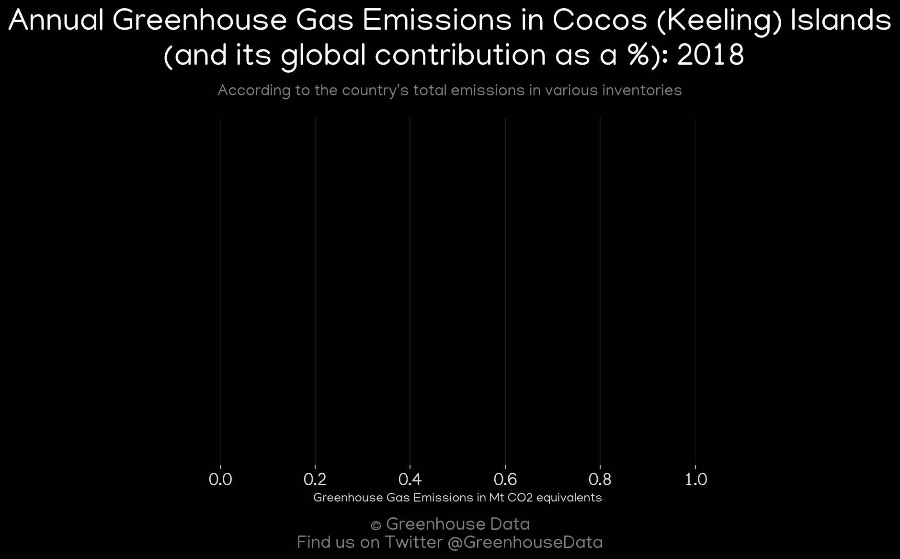
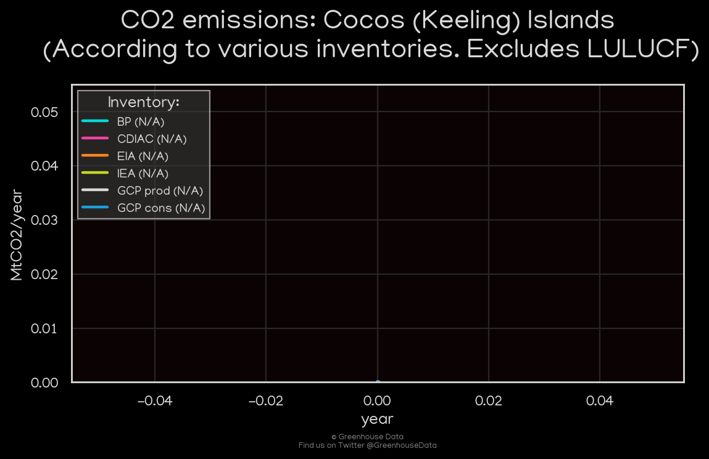

<h1 align="center">
🇨🇨🇨🇨🇨🇨🇨🇨🇨🇨
 
Cocos (Keeling) Islands
 
🇨🇨🇨🇨🇨🇨🇨🇨🇨🇨
</h1>
<h2>Datasets:</h2>

<a href="https://github.com/dquintani/GreenhouseData/tree/master/country_data/CCK_Cocos (Keeling) Islands/data">View on Github</a>
 

<a href="data/CCK_Minx_2021.csv">Minx_2021</a> || <a href="data/CCK_EDGAR.csv">EDGAR</a>

 

<h1>Figures:</h1><h2>#1 (CCK_relative_totals)</h2>

<h2>#2 (CCK_CO2_totals)</h2>

