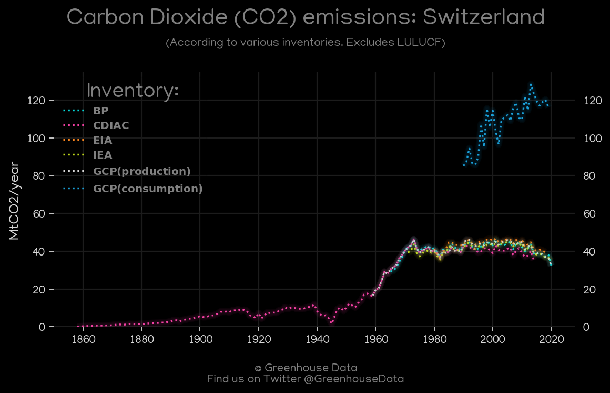
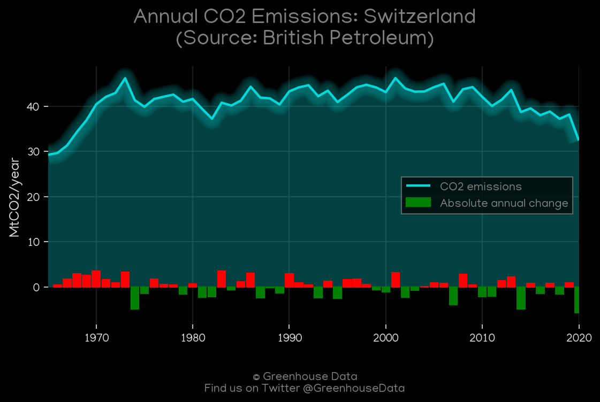
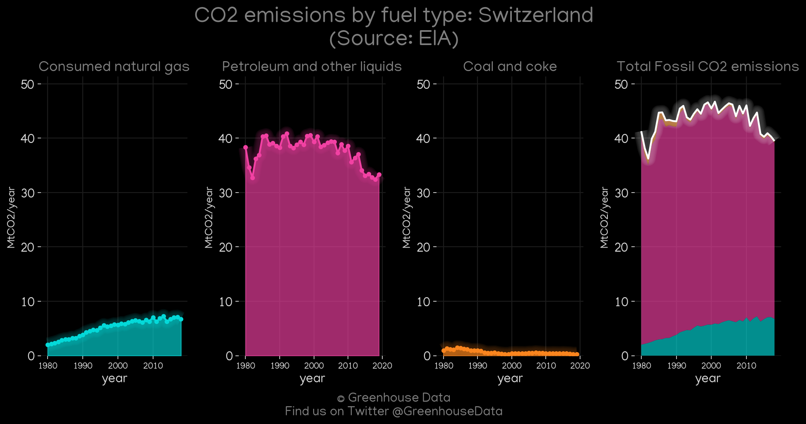
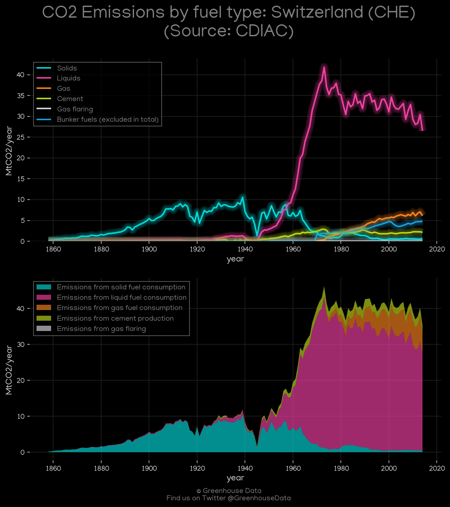
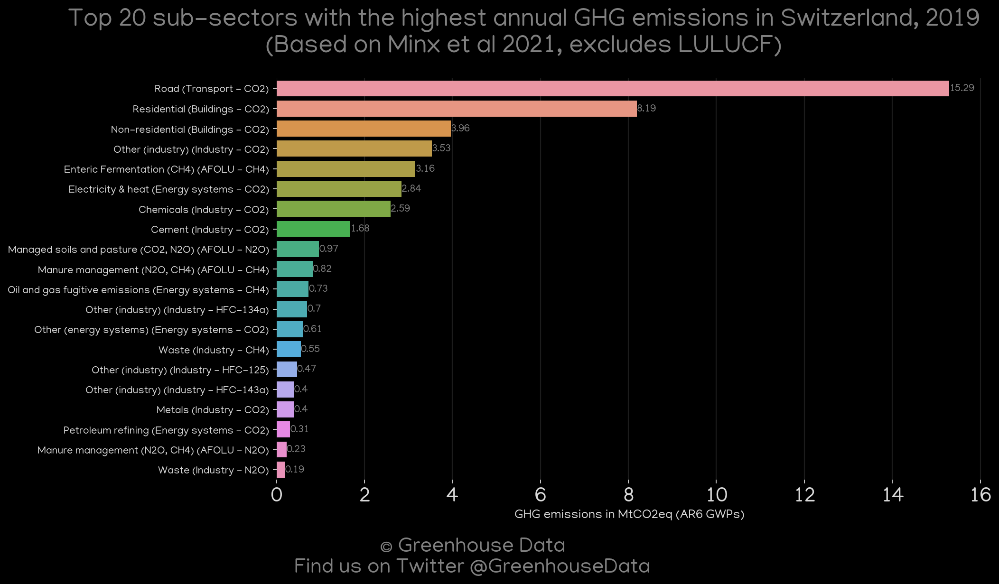
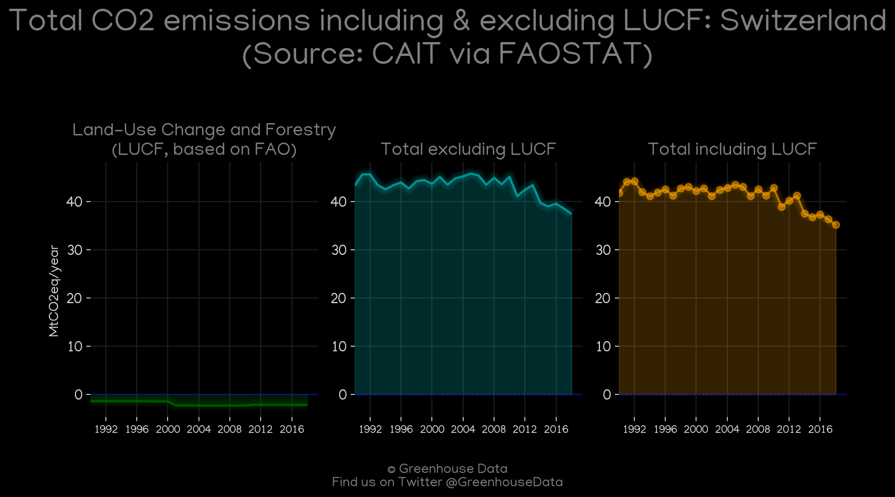
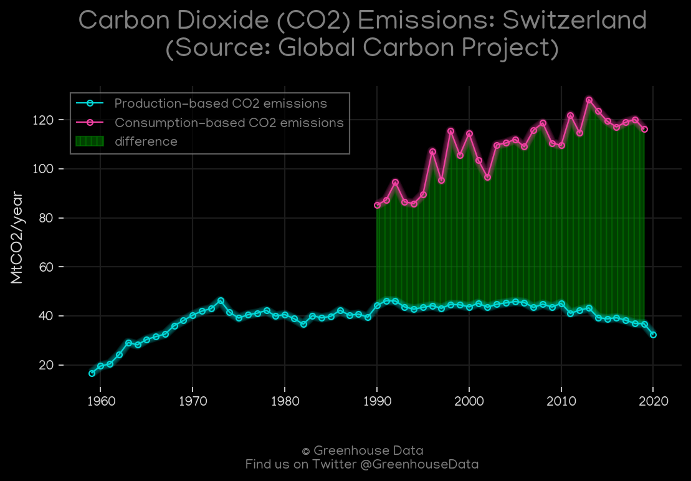
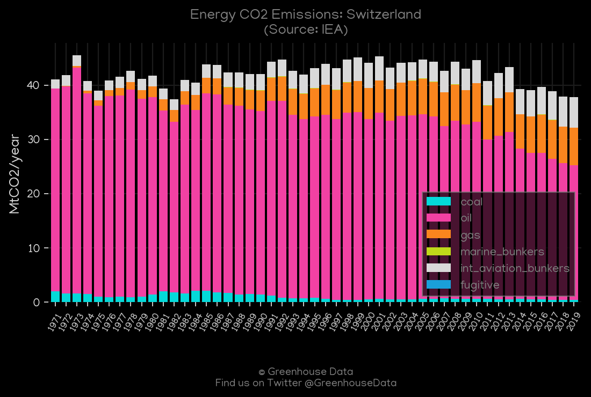

<h1 align="center">
🇨🇭🇨🇭🇨🇭🇨🇭🇨🇭
 
Switzerland
 
🇨🇭🇨🇭🇨🇭🇨🇭🇨🇭
</h1>
<h2>Datasets:</h2>

<a href="https://github.com/dquintani/GreenhouseData/tree/master/country_data/CHE_Switzerland/data">View on Github</a>
 

<a href="data/CHE_FAO.csv">FAO</a> || <a href="data/CHE_PRIMAP-hist.csv">PRIMAP-hist</a> || <a href="data/CHE_BP.csv">BP</a> || <a href="data/CHE_EIA.csv">EIA</a> || <a href="data/CHE_GCP.csv">GCP</a> || <a href="data/CHE_GCP_consupmption.csv">GCP_consupmption</a> || <a href="data/CHE_IEA.csv">IEA</a> || <a href="data/CHE_EDGAR.csv">EDGAR</a> || <a href="data/CHE_CDIAC.csv">CDIAC</a> || <a href="data/CHE_Minx_2021.csv">Minx_2021</a> || <a href="data/CHE_CAIT.csv">CAIT</a> || <a href="data/CHE_EPA.csv">EPA</a>

 

<h1>Figures:</h1><h2>#1 (CHE_CO2_totals)</h2>

<h2>#2 (CHE_UNFCCC_AI_1)</h2>

<h2>#3 (CHE_BP_1)</h2>

<h2>#4 (CHE_EIA_1)</h2>

<h2>#5 (CHE_GCP_Country_Highlight)</h2>

<h2>#6 (CHE_CDIAC_1)</h2>

<h2>#7 (CHE_Minx_top20_subsectors)</h2>

<h2>#8 (CHE_CAIT_lucf_vs_nolucf)</h2>

<h2>#9 (CHE_CAIT_gases_1)</h2>

<h2>#10 (CHE_GCP_1)</h2>

<h2>#11 (CHE_IEA_1)</h2>

