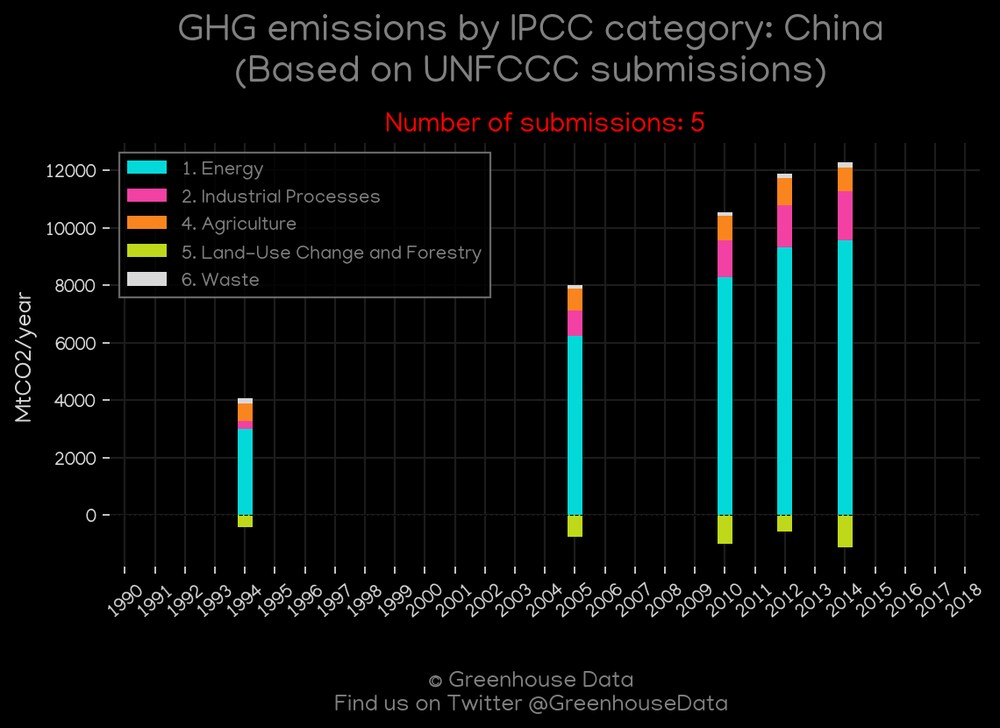
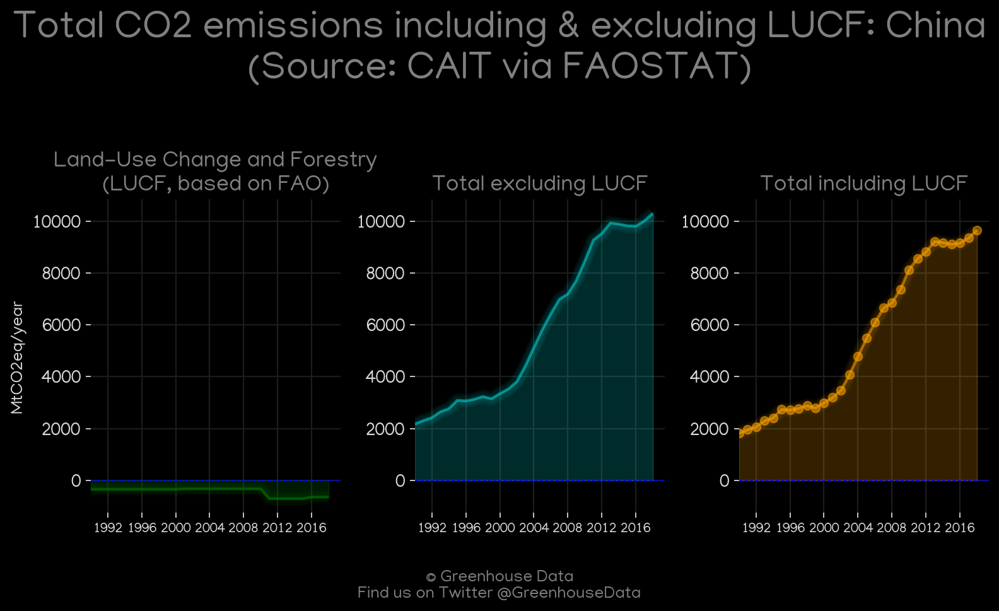
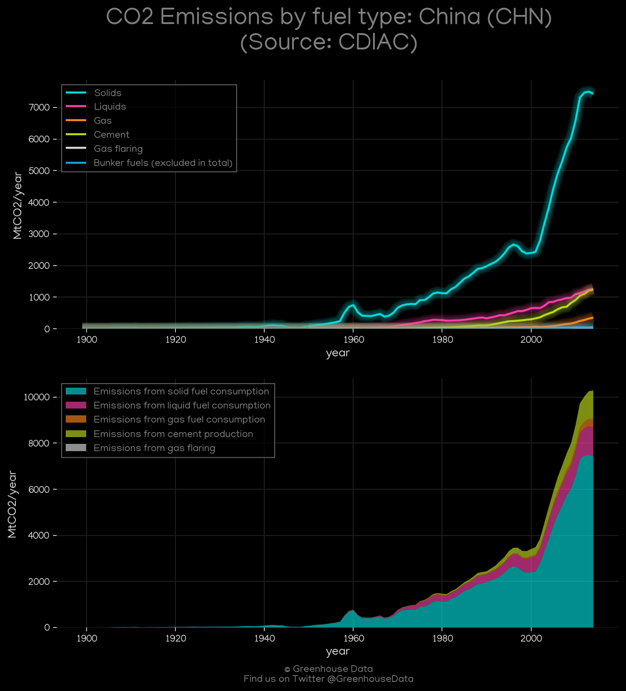
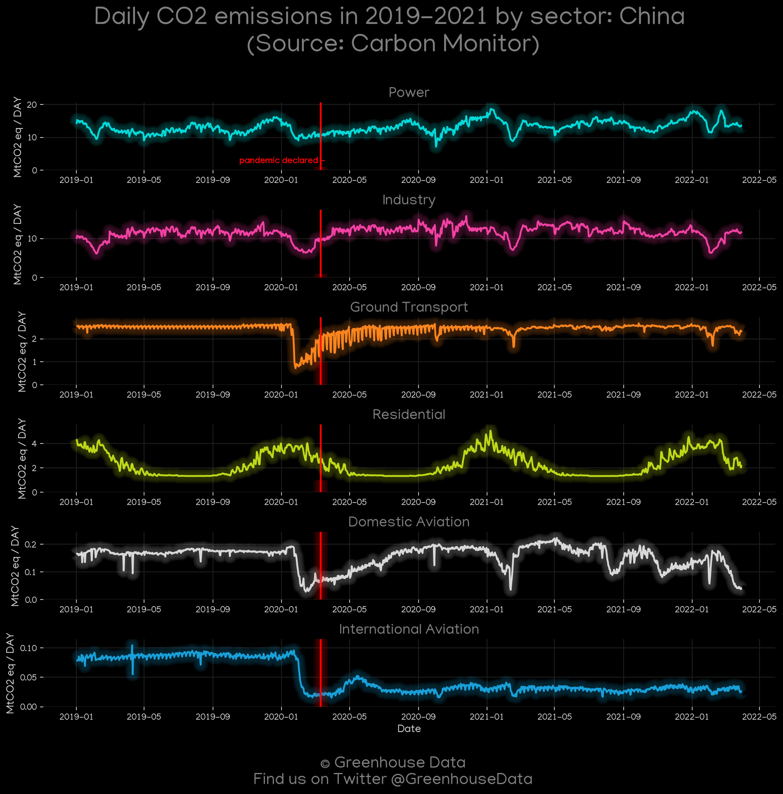
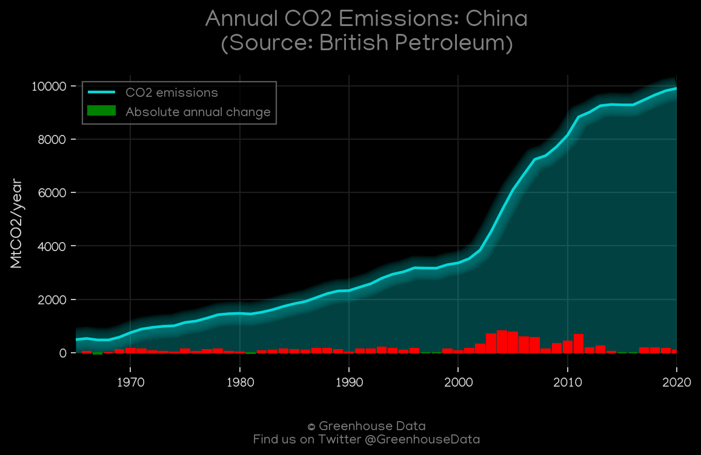
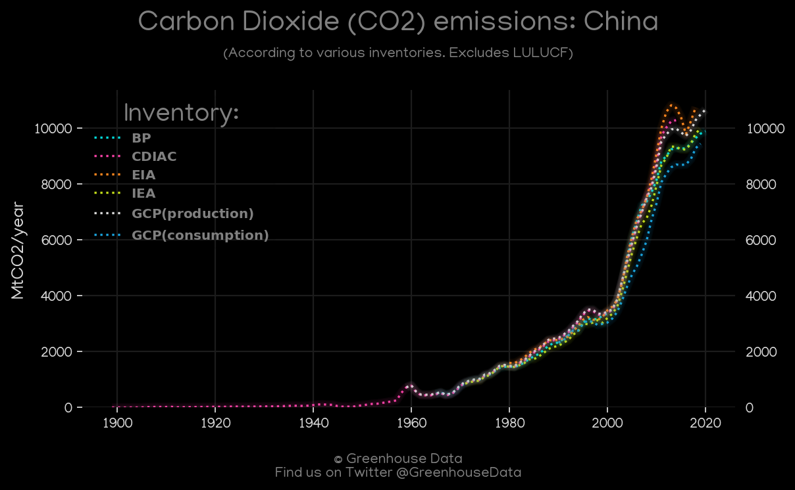
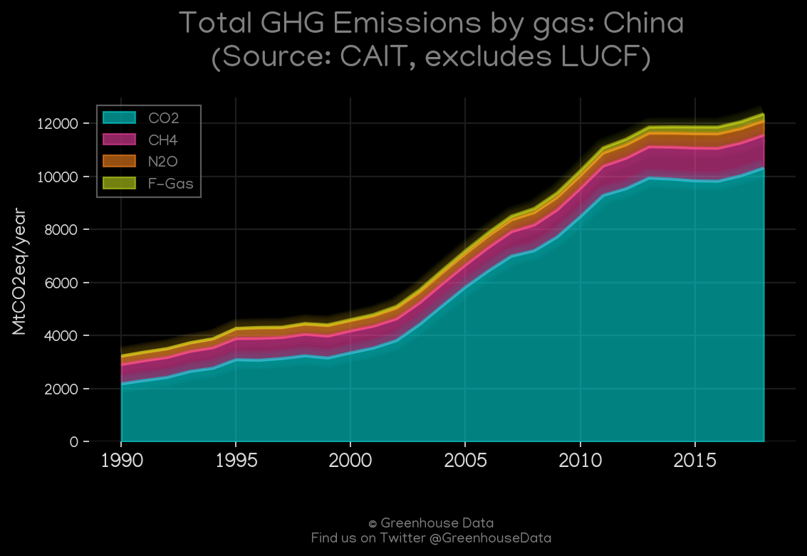
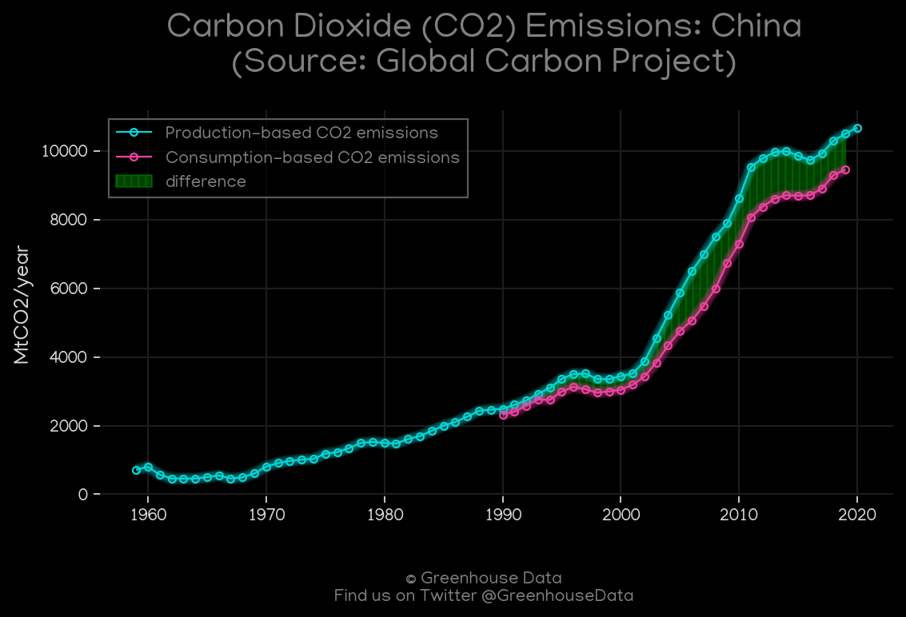
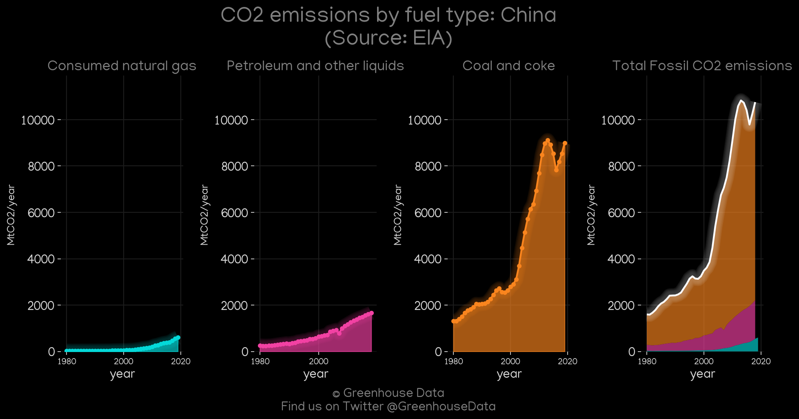
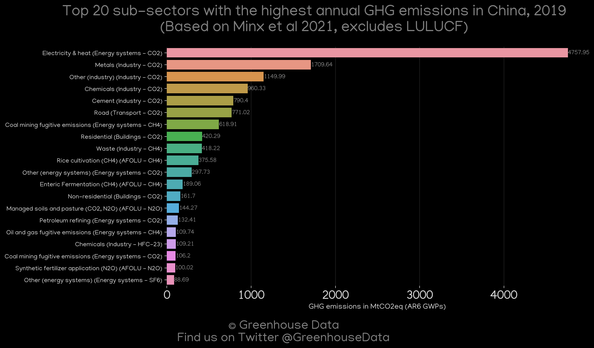

<h1 align="center">
🇨🇳🇨🇳🇨🇳🇨🇳🇨🇳
 
China
 
🇨🇳🇨🇳🇨🇳🇨🇳🇨🇳
</h1>
<h2>Datasets:</h2>

<a href="https://github.com/dquintani/GreenhouseData/tree/master/country_data/CHN_China/data">View on Github</a>
 

<a href="data/CHN_PRIMAP-hist.csv">PRIMAP-hist</a> || <a href="data/CHN_CAIT.csv">CAIT</a> || <a href="data/CHN_CDIAC.csv">CDIAC</a> || <a href="data/CHN_EIA.csv">EIA</a> || <a href="data/CHN_BP.csv">BP</a> || <a href="data/CHN_GCP.csv">GCP</a> || <a href="data/CHN_GCP_consupmption.csv">GCP_consupmption</a> || <a href="data/CHN_EDGAR.csv">EDGAR</a> || <a href="data/CHN_Minx_2021.csv">Minx_2021</a> || <a href="data/CHN_EPA.csv">EPA</a> || <a href="data/CHN_FAO.csv">FAO</a> || <a href="data/CHN_IEA.csv">IEA</a>

 

<h1>Figures:</h1><h2>#1 (CHN_UNFCCC_NAI_1)</h2>

<h2>#2 (CHN_CAIT_lucf_vs_nolucf)</h2>

<h2>#3 (CHN_IEA_1)</h2>

<h2>#4 (CHN_CDIAC_1)</h2>

<h2>#5 (CHN_Carbon_Monitor_1)</h2>

<h2>#6 (CHN_BP_1)</h2>

<h2>#7 (CHN_CO2_totals)</h2>

<h2>#8 (CHN_CAIT_gases_1)</h2>

<h2>#9 (CHN_GCP_1)</h2>

<h2>#10 (CHN_EIA_1)</h2>

<h2>#11 (CHN_Minx_top20_subsectors)</h2>

