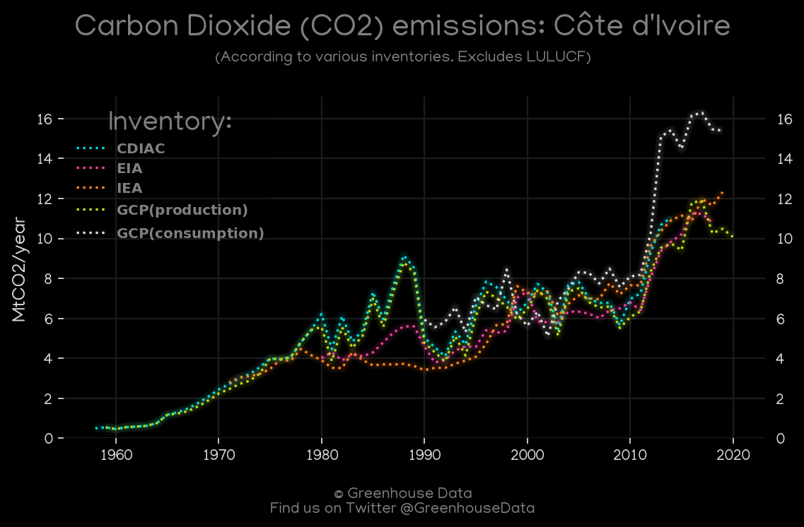
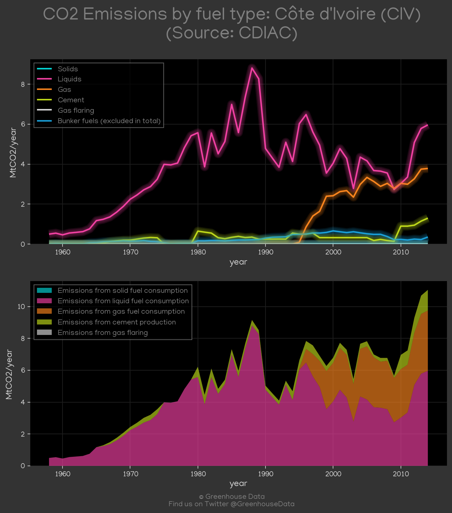
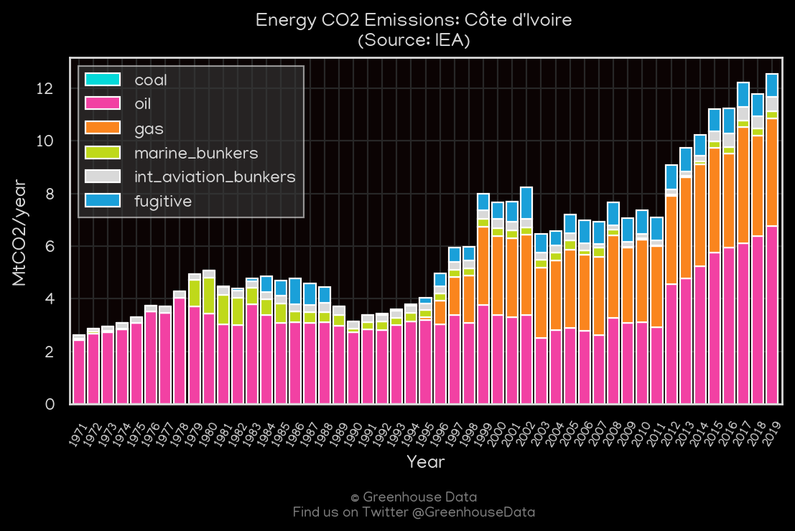
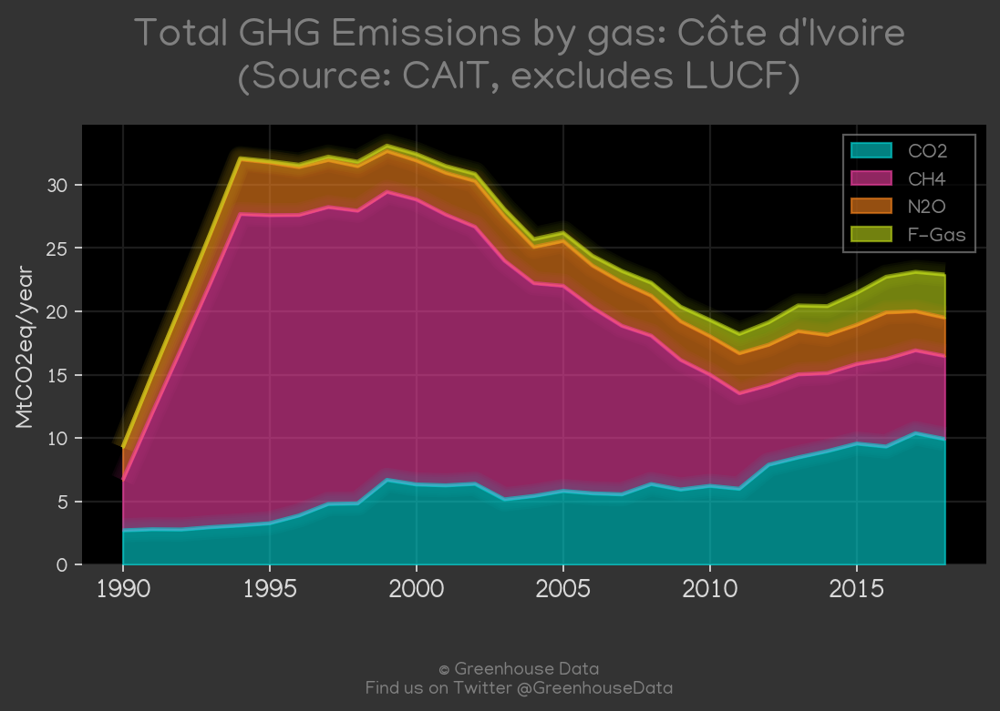
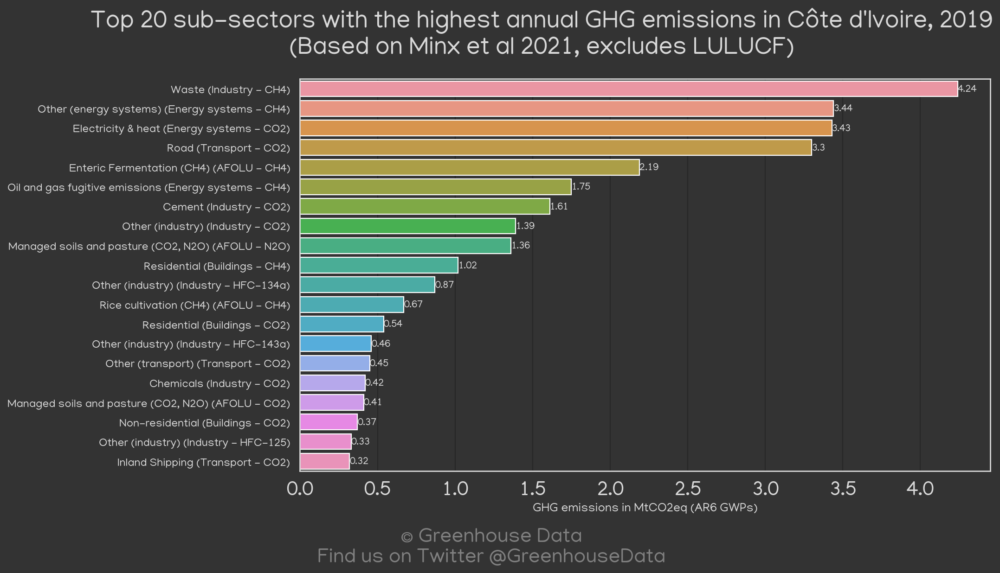
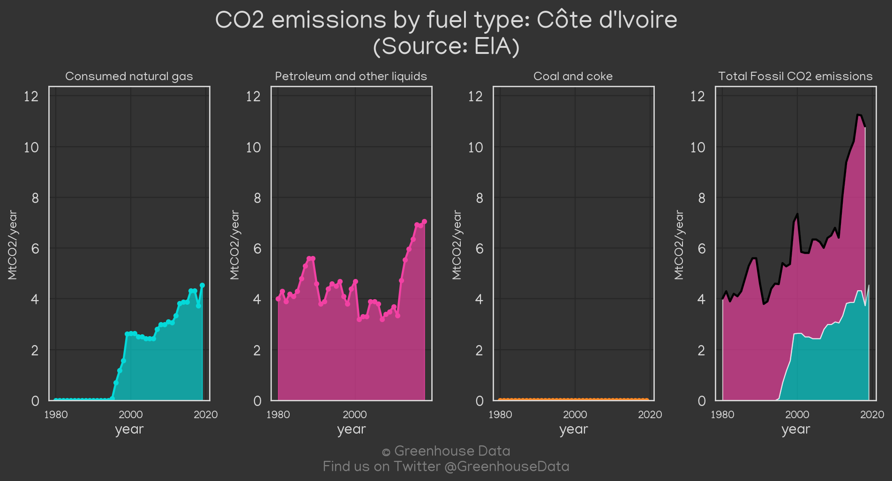
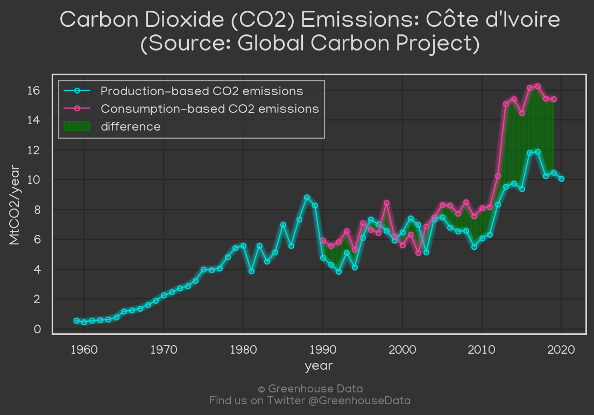
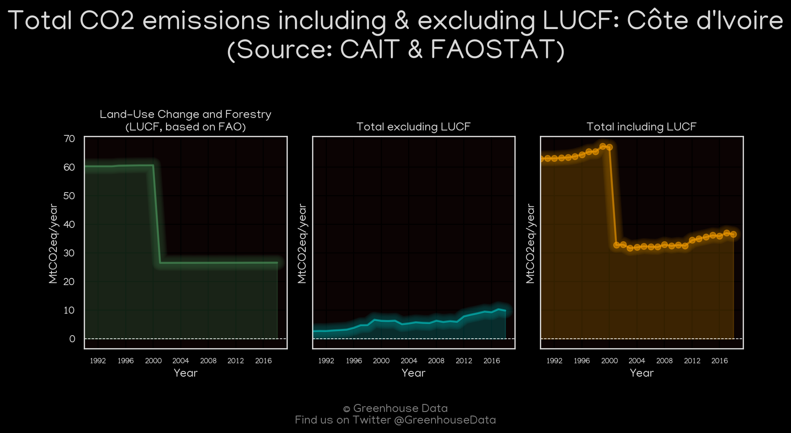
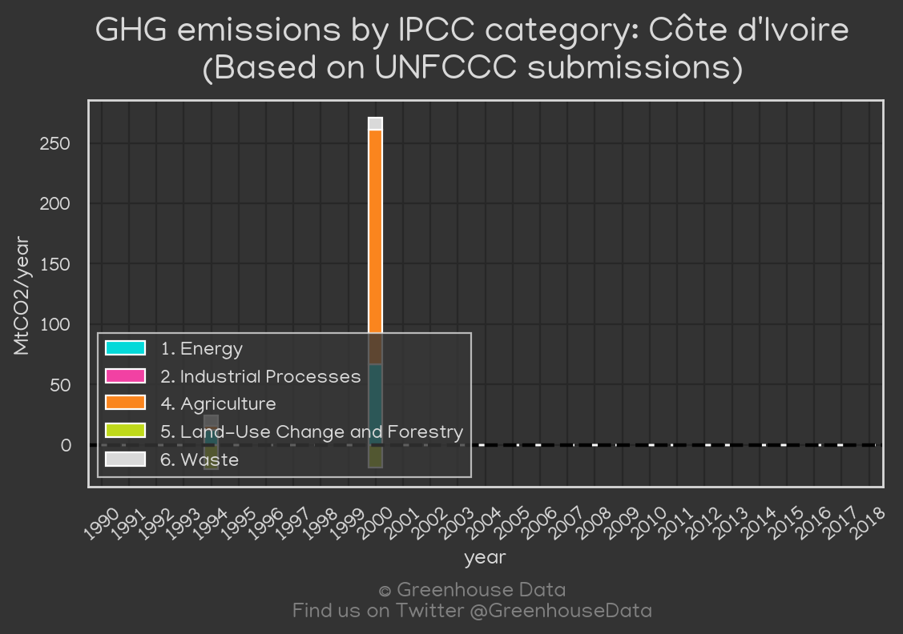

<h1 align="center">
🇨🇮🇨🇮🇨🇮🇨🇮🇨🇮
 
Côte d'Ivoire
 
🇨🇮🇨🇮🇨🇮🇨🇮🇨🇮
</h1>
<h2>Datasets:</h2>

<a href="https://github.com/dquintani/GreenhouseData/tree/master/country_data/CIV_Côte d'Ivoire/data">View on Github</a>
 

<a href="data/CIV_FAO.csv">FAO</a> || <a href="data/CIV_EIA.csv">EIA</a> || <a href="data/CIV_CDIAC.csv">CDIAC</a> || <a href="data/CIV_PRIMAP-hist.csv">PRIMAP-hist</a> || <a href="data/CIV_GCP_consupmption.csv">GCP_consupmption</a> || <a href="data/CIV_EPA.csv">EPA</a> || <a href="data/CIV_IEA.csv">IEA</a> || <a href="data/CIV_CAIT.csv">CAIT</a> || <a href="data/CIV_EDGAR.csv">EDGAR</a> || <a href="data/CIV_GCP.csv">GCP</a> || <a href="data/CIV_Minx_2021.csv">Minx_2021</a>

 

<h1>Figures:</h1><h2>#1 (CIV_CO2_totals)</h2>

<h2>#2 (CIV_CDIAC_1)</h2>

<h2>#3 (CIV_IEA_1)</h2>

<h2>#4 (CIV_CAIT_gases_1)</h2>

<h2>#5 (CIV_Minx_top20_subsectors)</h2>

<h2>#6 (CIV_EIA_1)</h2>

<h2>#7 (CIV_GCP_1)</h2>

<h2>#8 (CIV_CAIT_lucf_vs_nolucf)</h2>

<h2>#9 (CIV_UNFCCC_NAI_1)</h2>

