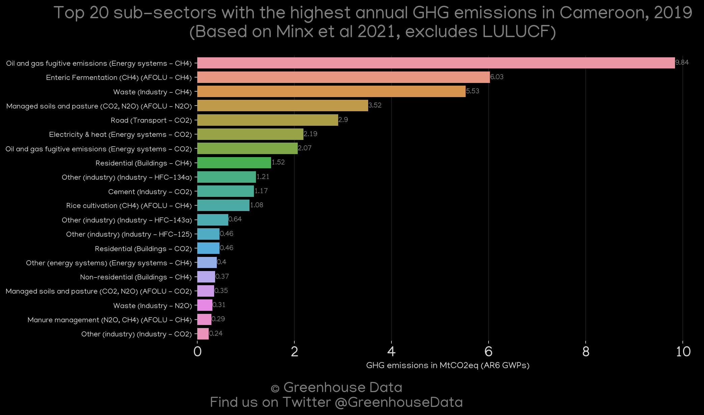
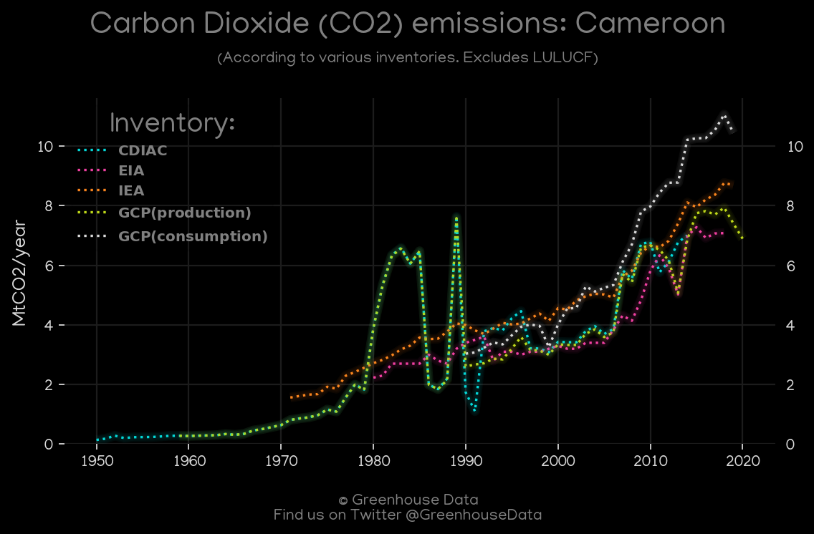
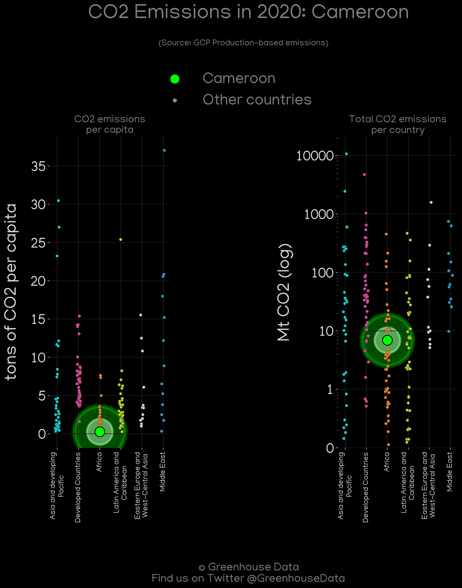
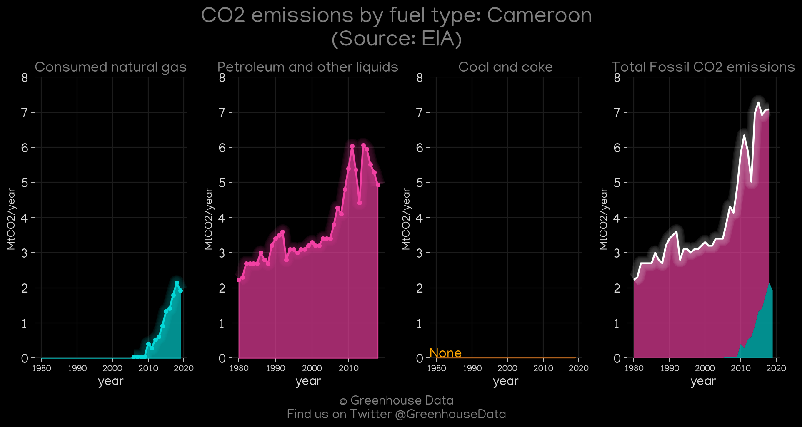
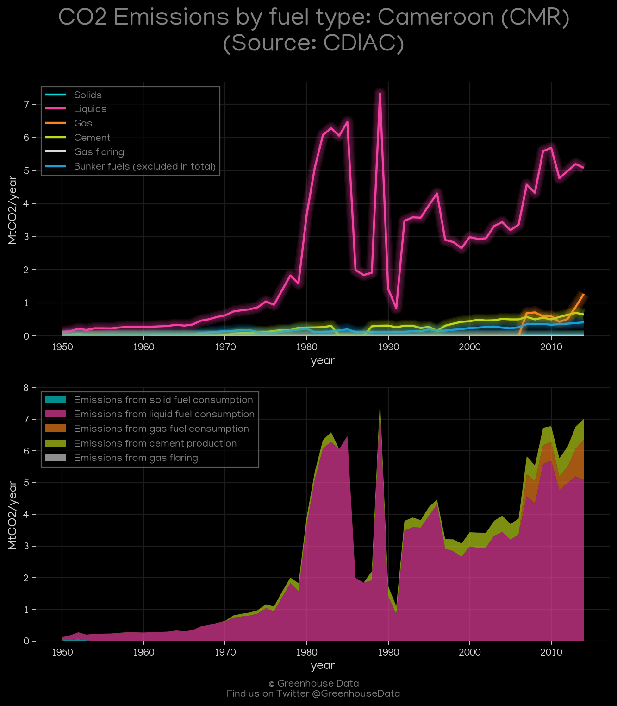
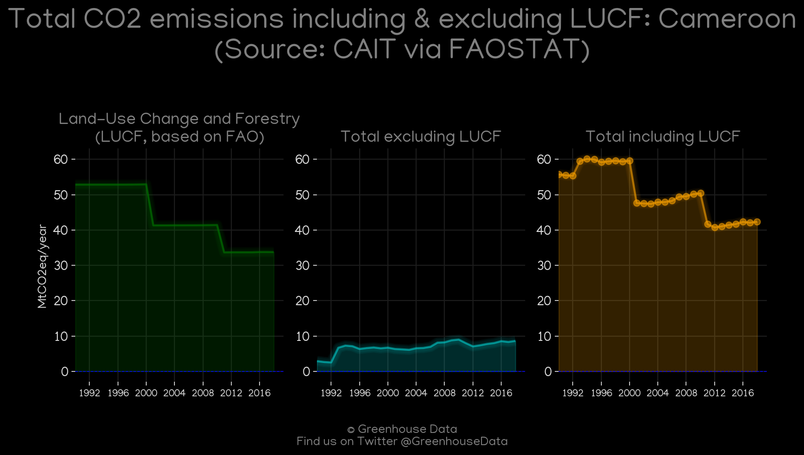
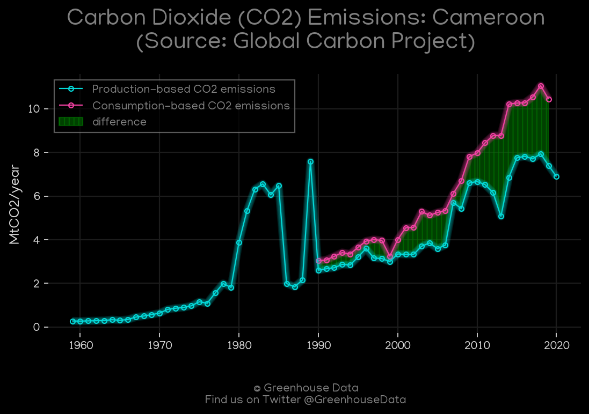
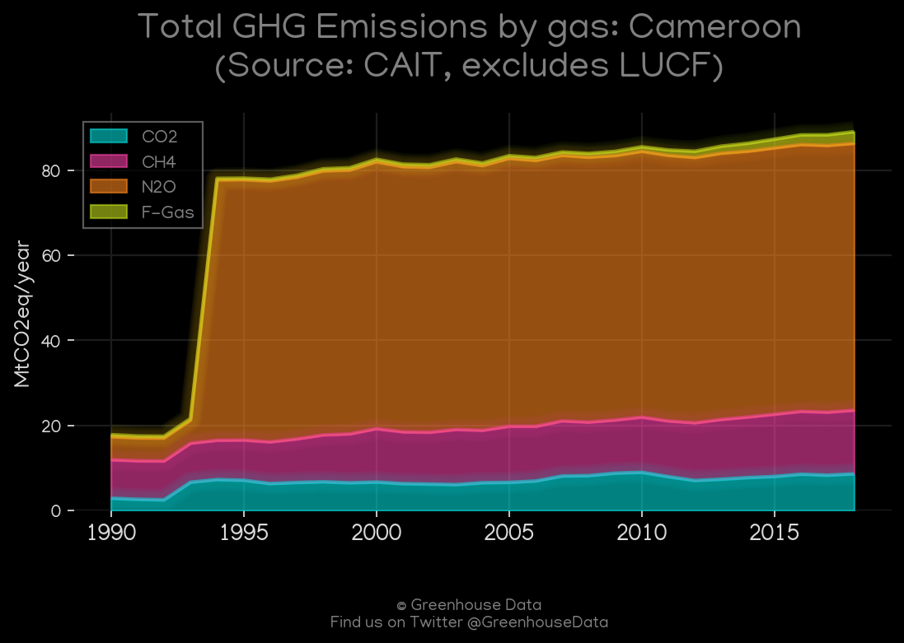
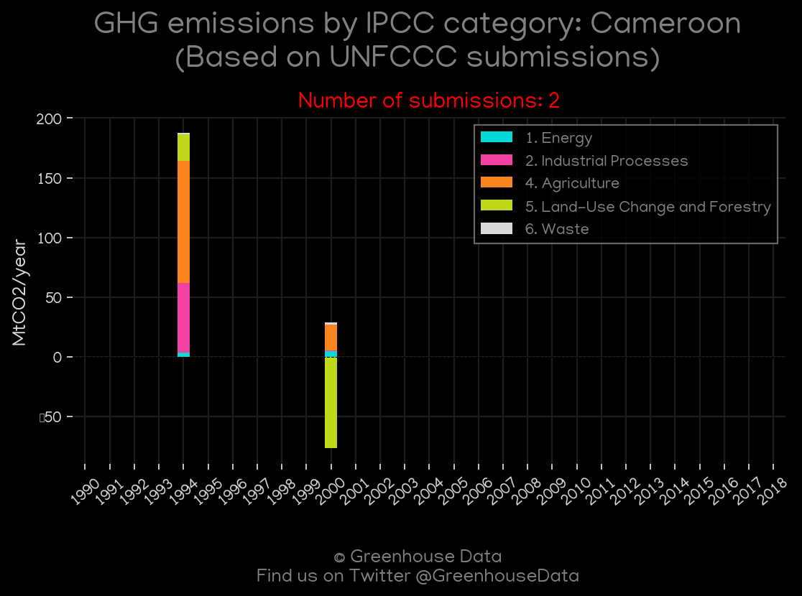
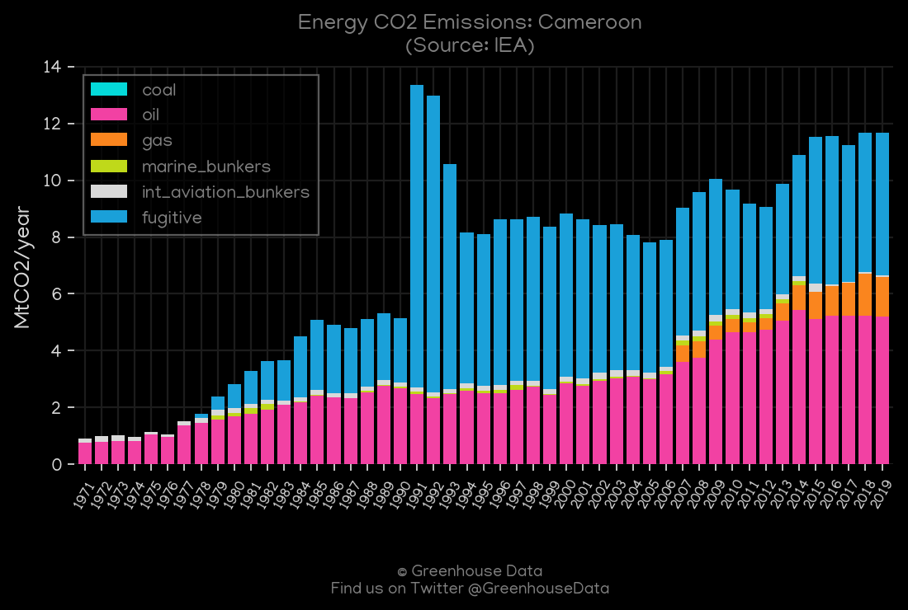

<h1 align="center">
🇨🇲🇨🇲🇨🇲🇨🇲🇨🇲
 
Cameroon
 
🇨🇲🇨🇲🇨🇲🇨🇲🇨🇲
</h1>
<h2>Datasets:</h2>

<a href="https://github.com/dquintani/GreenhouseData/tree/master/country_data/CMR_Cameroon/data">View on Github</a>
 

<a href="data/CMR_FAO.csv">FAO</a> || <a href="data/CMR_Minx_2021.csv">Minx_2021</a> || <a href="data/CMR_EIA.csv">EIA</a> || <a href="data/CMR_PRIMAP-hist.csv">PRIMAP-hist</a> || <a href="data/CMR_CDIAC.csv">CDIAC</a> || <a href="data/CMR_IEA.csv">IEA</a> || <a href="data/CMR_EDGAR.csv">EDGAR</a> || <a href="data/CMR_CAIT.csv">CAIT</a> || <a href="data/CMR_GCP.csv">GCP</a> || <a href="data/CMR_EPA.csv">EPA</a> || <a href="data/CMR_GCP_consupmption.csv">GCP_consupmption</a>

 

<h1>Figures:</h1><h2>#1 (CMR_Minx_top20_subsectors)</h2>

<h2>#2 (CMR_CO2_totals)</h2>

<h2>#3 (CMR_GCP_Country_Highlight)</h2>

<h2>#4 (CMR_EIA_1)</h2>

<h2>#5 (CMR_CDIAC_1)</h2>

<h2>#6 (CMR_CAIT_lucf_vs_nolucf)</h2>

<h2>#7 (CMR_GCP_1)</h2>

<h2>#8 (CMR_CAIT_gases_1)</h2>

<h2>#9 (CMR_UNFCCC_NAI_1)</h2>

<h2>#10 (CMR_IEA_1)</h2>

