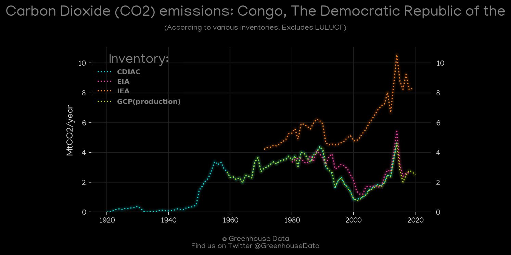
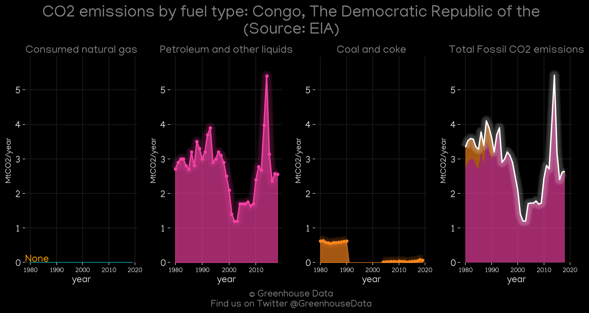
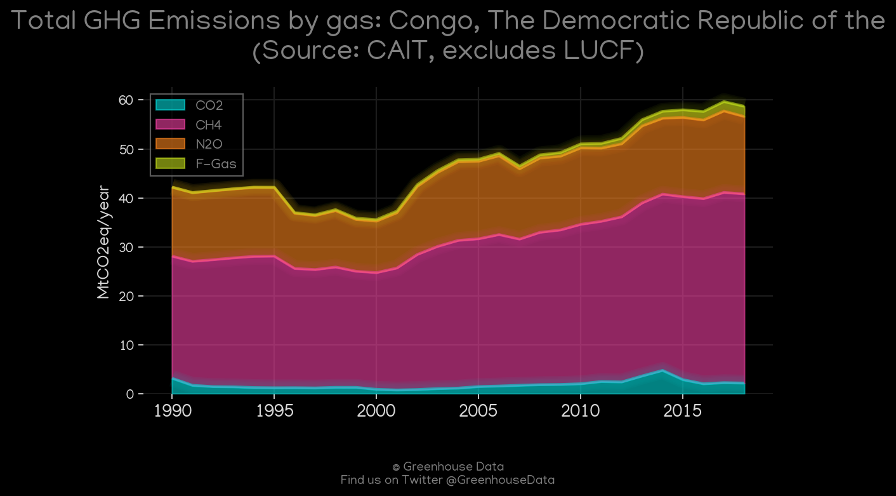
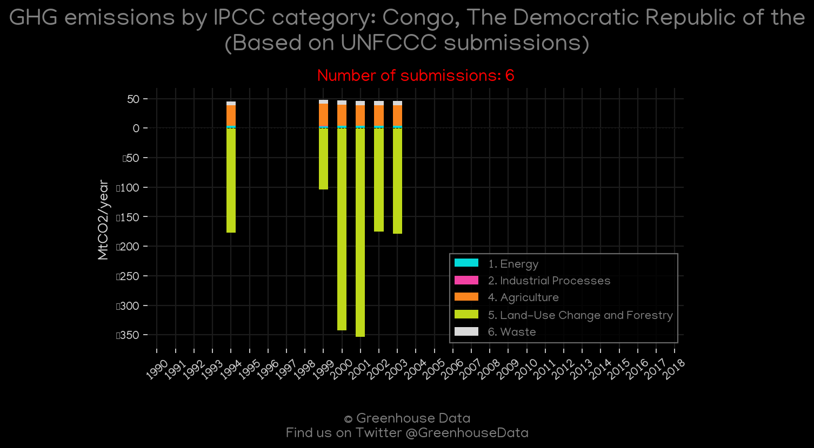
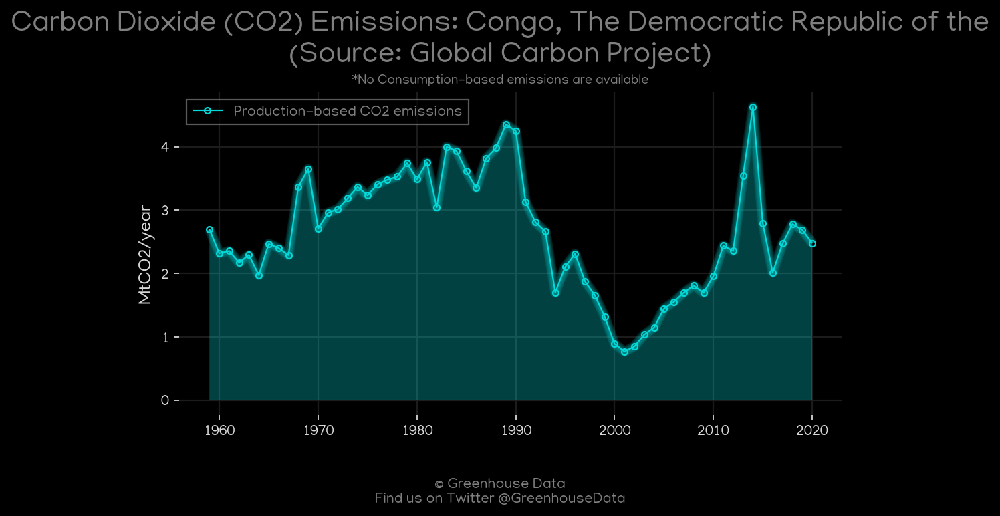
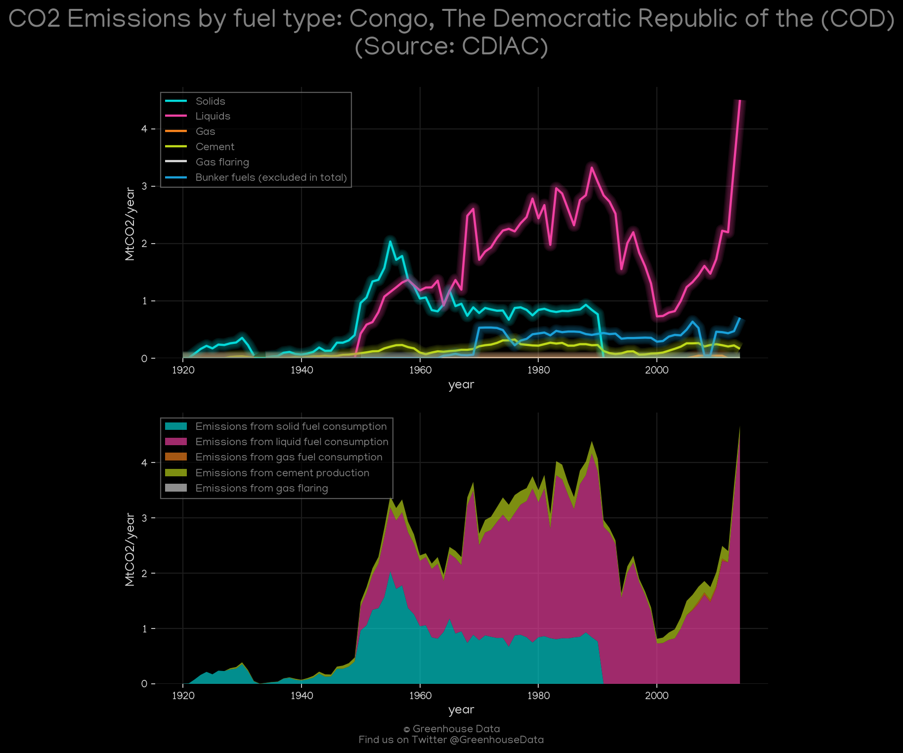
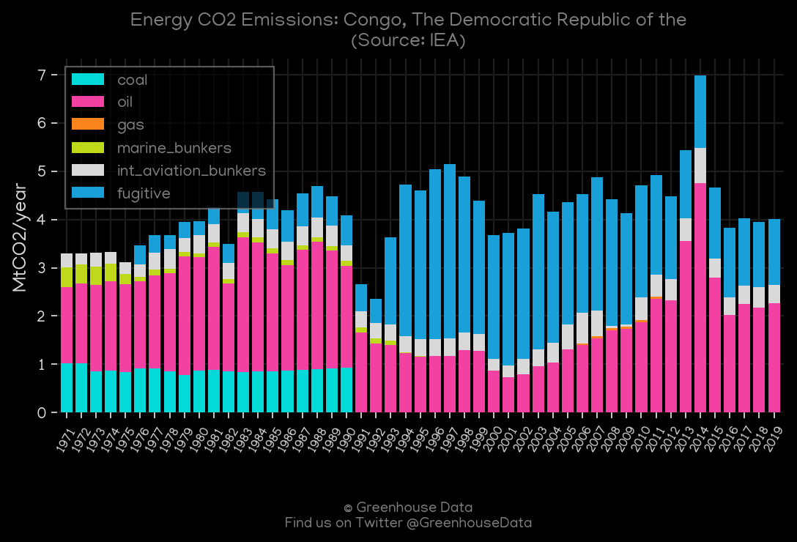
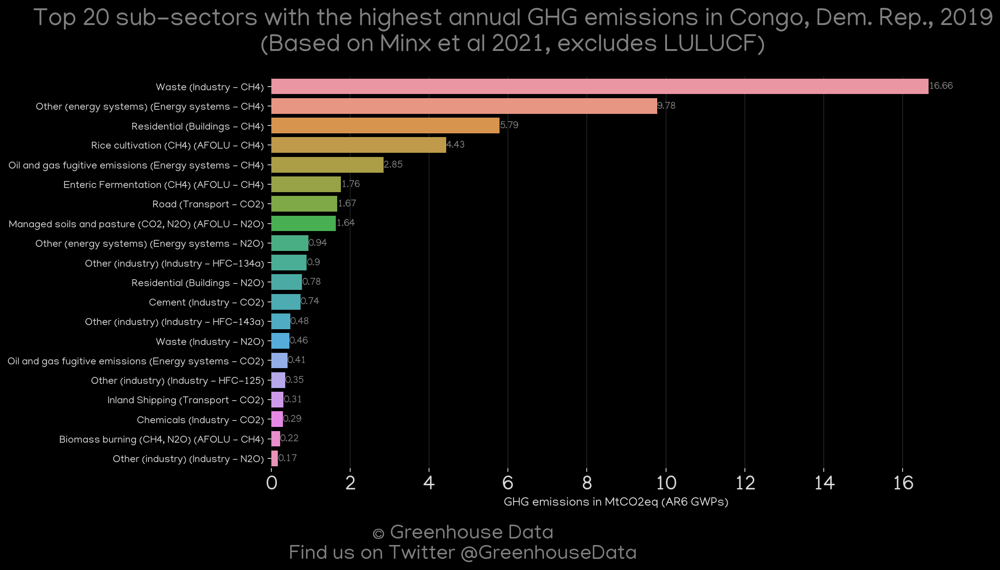

<h1 align="center">
🇨🇩🇨🇩🇨🇩🇨🇩🇨🇩
 
Congo, The Democratic Republic of the
 
🇨🇩🇨🇩🇨🇩🇨🇩🇨🇩
</h1>
<h2>Datasets:</h2>

<a href="https://github.com/dquintani/GreenhouseData/tree/master/country_data/COD_Congo, The Democratic Republic of the/data">View on Github</a>
 

<a href="data/COD_Minx_2021.csv">Minx_2021</a> || <a href="data/COD_GCP.csv">GCP</a> || <a href="data/COD_PRIMAP-hist.csv">PRIMAP-hist</a> || <a href="data/COD_CDIAC.csv">CDIAC</a> || <a href="data/COD_EIA.csv">EIA</a> || <a href="data/COD_IEA.csv">IEA</a> || <a href="data/COD_EDGAR.csv">EDGAR</a> || <a href="data/COD_FAO.csv">FAO</a> || <a href="data/COD_CAIT.csv">CAIT</a> || <a href="data/COD_EPA.csv">EPA</a> || <a href="data/COD_GCP_consupmption.csv">GCP_consupmption</a>

 

<h1>Figures:</h1><h2>#1 (COD_CO2_totals)</h2>

<h2>#2 (COD_EIA_1)</h2>

<h2>#3 (COD_CAIT_gases_1)</h2>

<h2>#4 (COD_UNFCCC_NAI_1)</h2>

<h2>#5 (COD_GCP_1)</h2>

<h2>#6 (COD_CDIAC_1)</h2>

<h2>#7 (COD_IEA_1)</h2>

<h2>#8 (COD_Minx_top20_subsectors)</h2>

