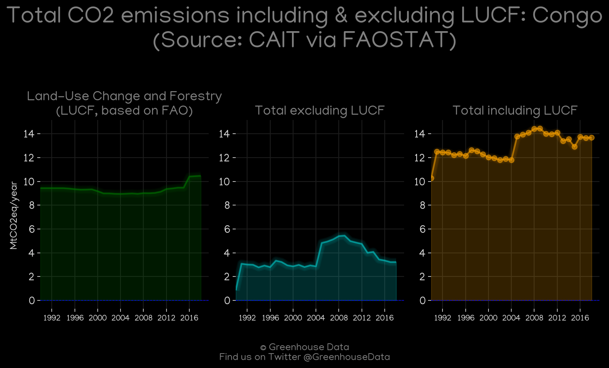
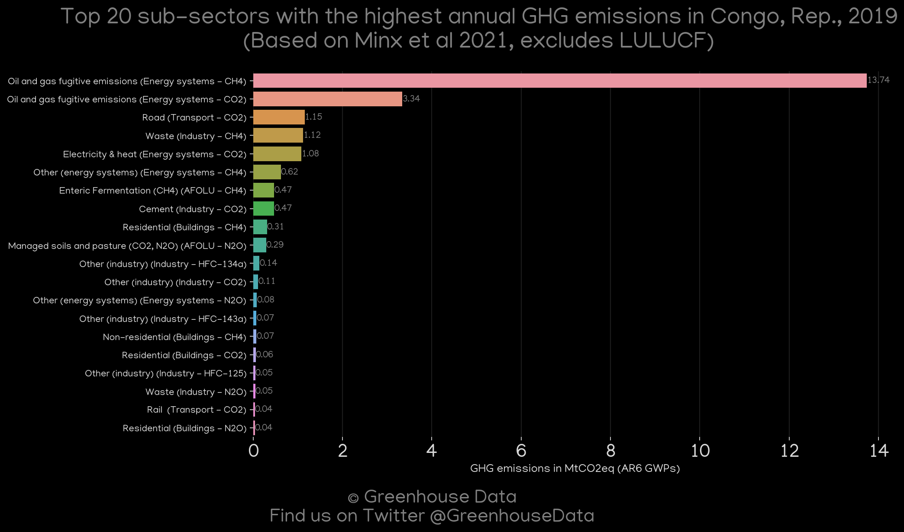
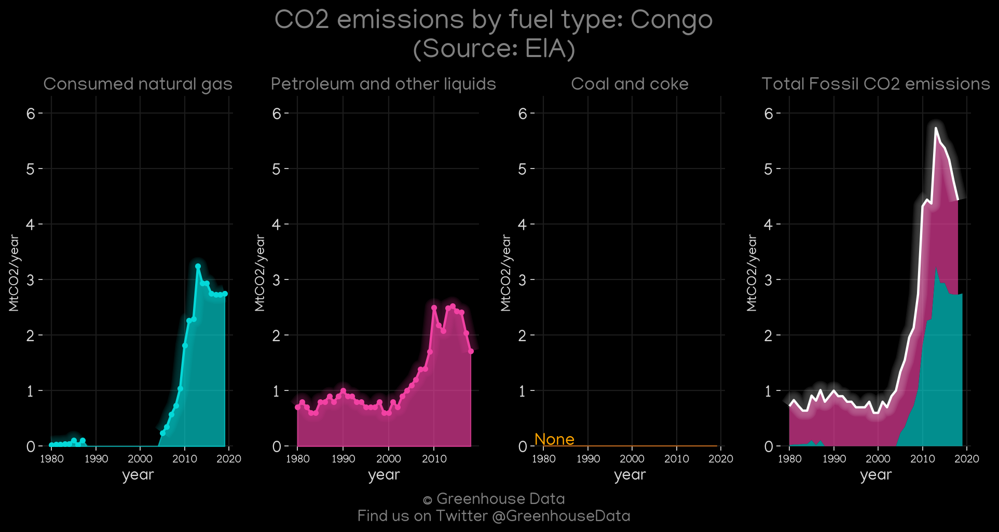
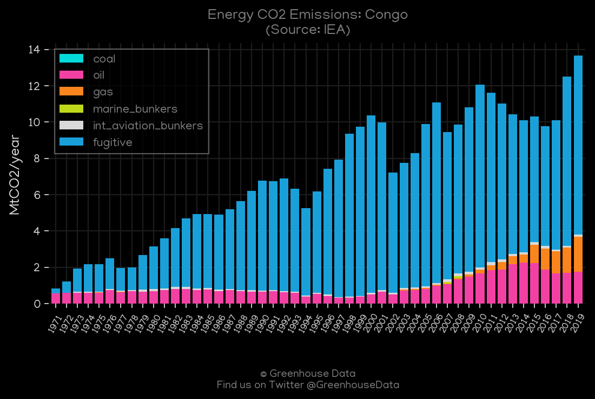
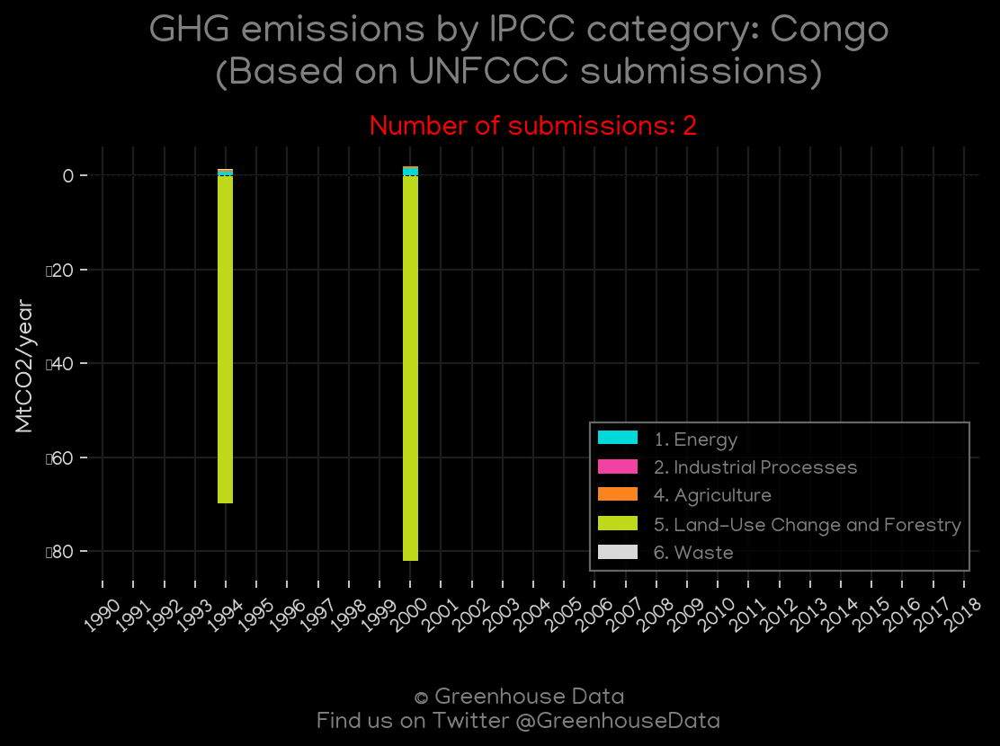
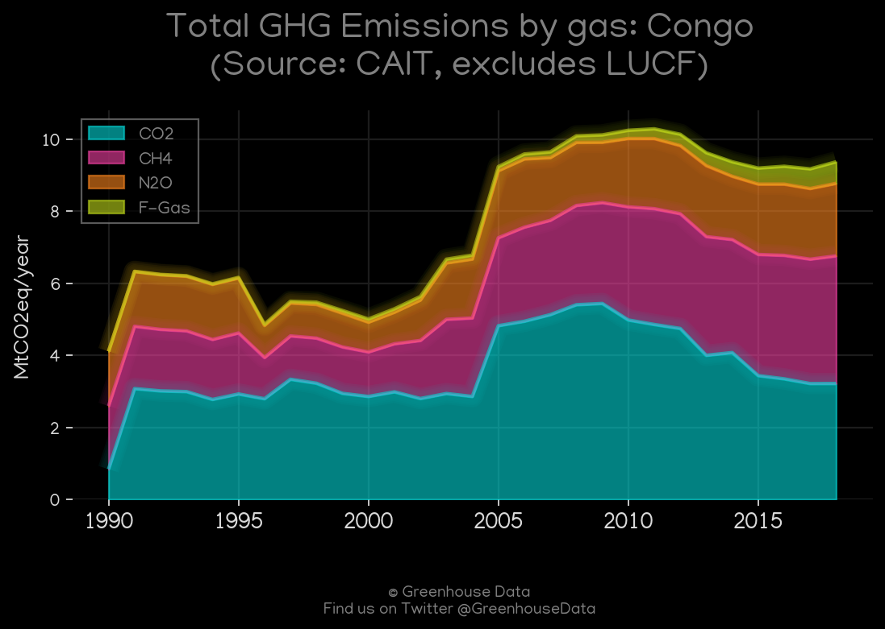
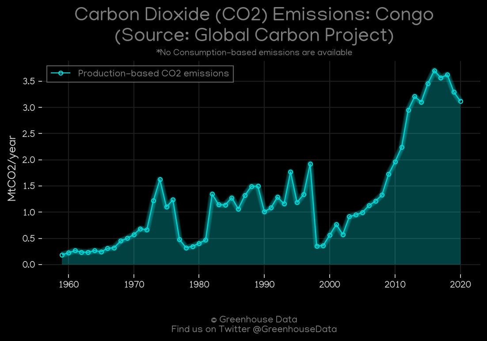
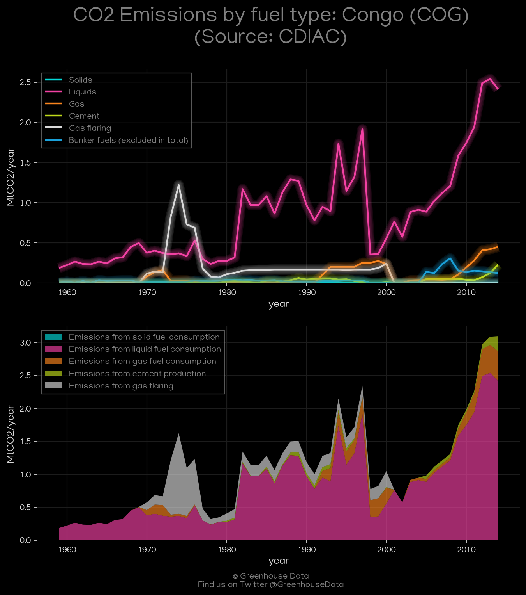
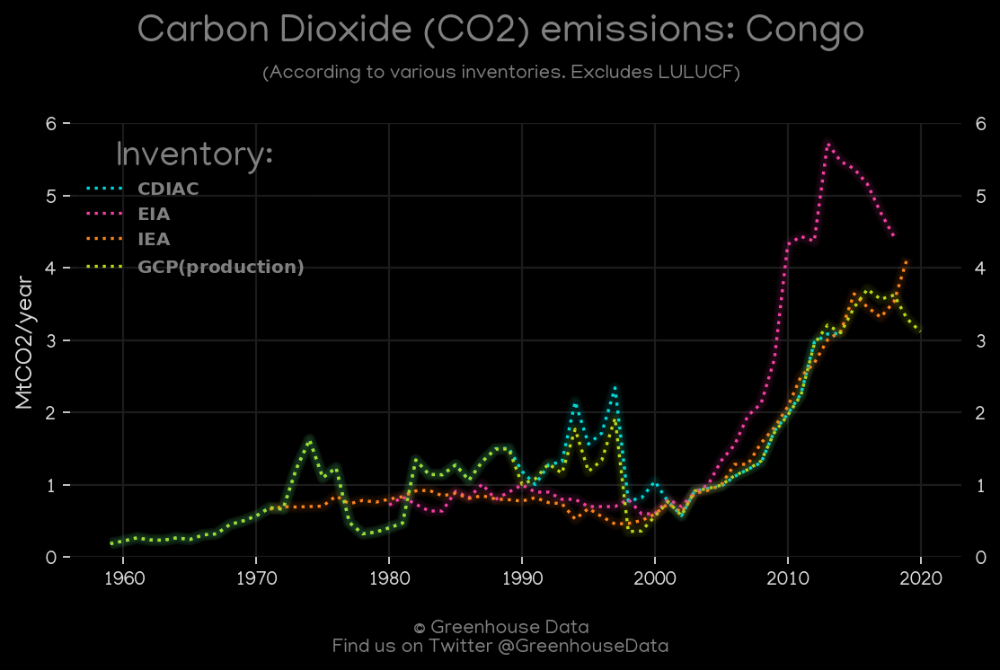

<h1 align="center">
🇨🇬🇨🇬🇨🇬🇨🇬🇨🇬
 
Congo
 
🇨🇬🇨🇬🇨🇬🇨🇬🇨🇬
</h1>
<h2>Datasets:</h2>

<a href="https://github.com/dquintani/GreenhouseData/tree/master/country_data/COG_Congo/data">View on Github</a>
 

<a href="data/COG_EDGAR.csv">EDGAR</a> || <a href="data/COG_EPA.csv">EPA</a> || <a href="data/COG_IEA.csv">IEA</a> || <a href="data/COG_PRIMAP-hist.csv">PRIMAP-hist</a> || <a href="data/COG_EIA.csv">EIA</a> || <a href="data/COG_FAO.csv">FAO</a> || <a href="data/COG_CDIAC.csv">CDIAC</a> || <a href="data/COG_Minx_2021.csv">Minx_2021</a> || <a href="data/COG_CAIT.csv">CAIT</a> || <a href="data/COG_GCP.csv">GCP</a> || <a href="data/COG_GCP_consupmption.csv">GCP_consupmption</a>

 

<h1>Figures:</h1><h2>#1 (COG_CAIT_lucf_vs_nolucf)</h2>

<h2>#2 (COG_Minx_top20_subsectors)</h2>

<h2>#3 (COG_EIA_1)</h2>

<h2>#4 (COG_IEA_1)</h2>

<h2>#5 (COG_UNFCCC_NAI_1)</h2>

<h2>#6 (COG_CAIT_gases_1)</h2>

<h2>#7 (COG_GCP_1)</h2>

<h2>#8 (COG_CDIAC_1)</h2>

<h2>#9 (COG_CO2_totals)</h2>

