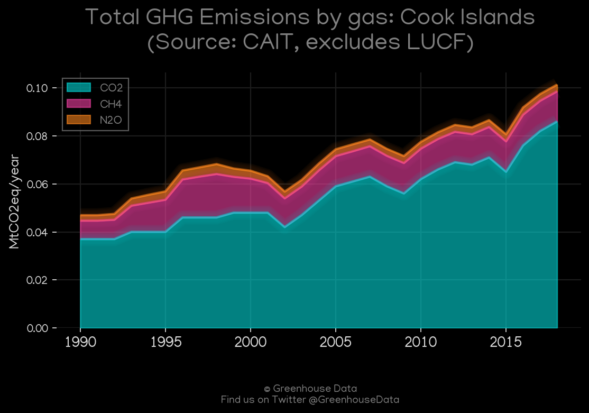
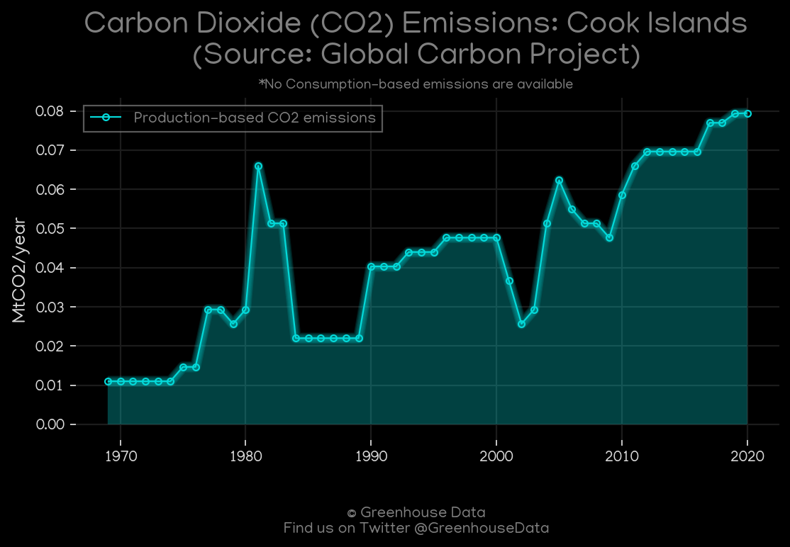
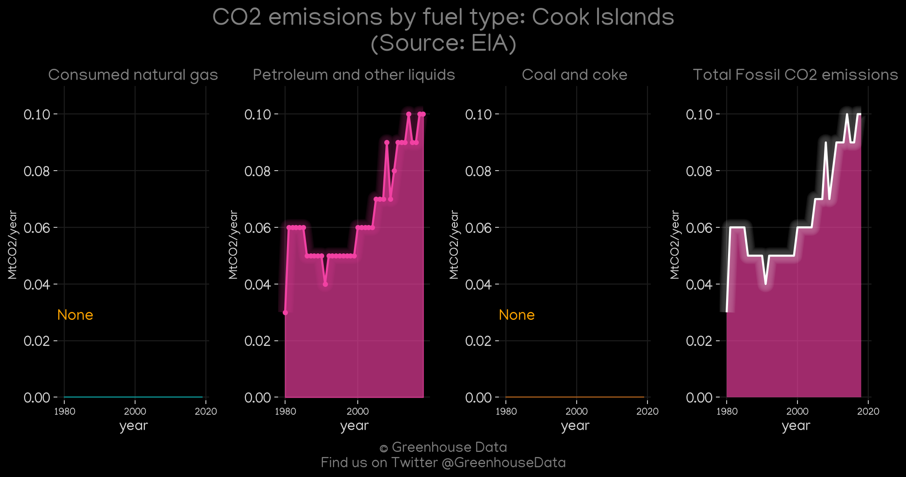
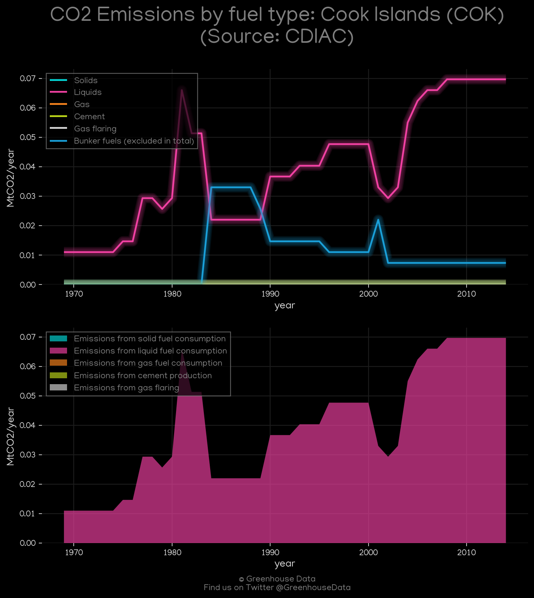
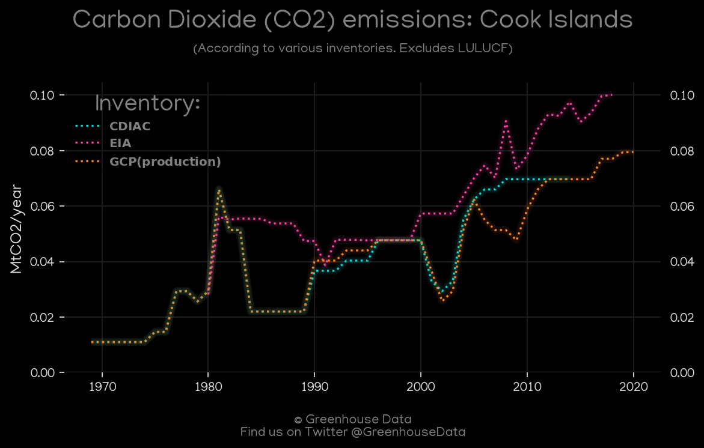
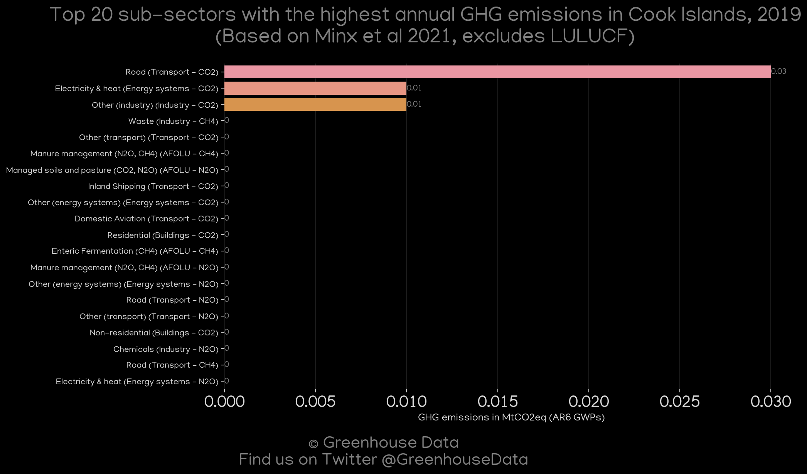
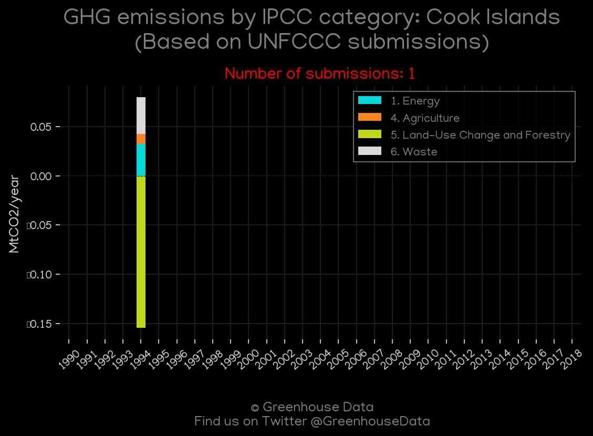

<h1 align="center">
🇨🇰🇨🇰🇨🇰🇨🇰🇨🇰
 
Cook Islands
 
🇨🇰🇨🇰🇨🇰🇨🇰🇨🇰
</h1>
<h2>Datasets:</h2>

<a href="https://github.com/dquintani/GreenhouseData/tree/master/country_data/COK_Cook Islands/data">View on Github</a>
 

<a href="data/COK_Minx_2021.csv">Minx_2021</a> || <a href="data/COK_PRIMAP-hist.csv">PRIMAP-hist</a> || <a href="data/COK_EDGAR.csv">EDGAR</a> || <a href="data/COK_EIA.csv">EIA</a> || <a href="data/COK_GCP.csv">GCP</a> || <a href="data/COK_GCP_consupmption.csv">GCP_consupmption</a> || <a href="data/COK_CDIAC.csv">CDIAC</a> || <a href="data/COK_CAIT.csv">CAIT</a> || <a href="data/COK_FAO.csv">FAO</a>

 

<h1>Figures:</h1><h2>#1 (COK_CAIT_gases_1)</h2>

<h2>#2 (COK_GCP_1)</h2>

<h2>#3 (COK_EIA_1)</h2>

<h2>#4 (COK_CDIAC_1)</h2>

<h2>#5 (COK_CO2_totals)</h2>

<h2>#6 (COK_CAIT_lucf_vs_nolucf)</h2>

<h2>#7 (COK_Minx_top20_subsectors)</h2>

<h2>#8 (COK_UNFCCC_NAI_1)</h2>

