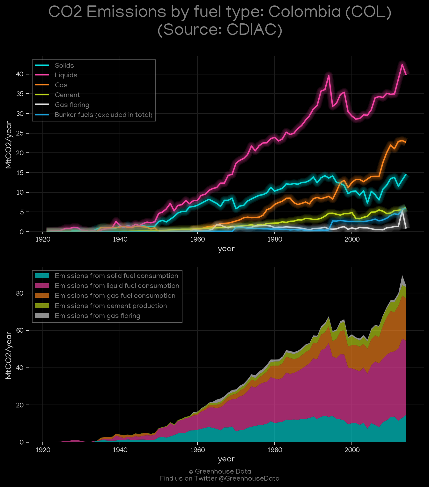
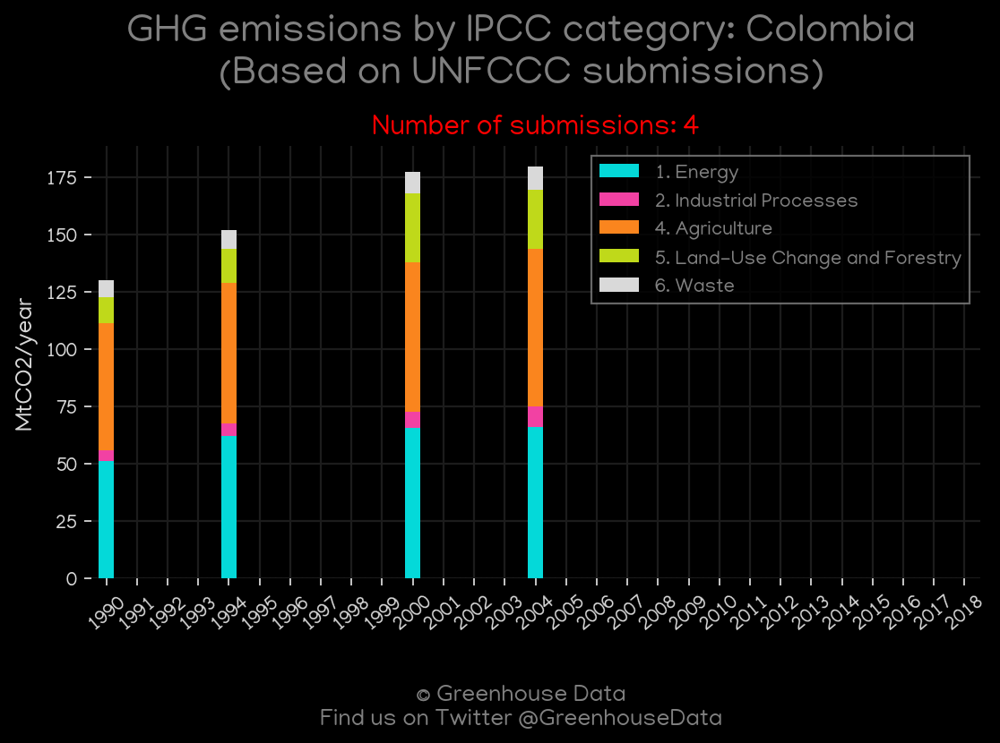
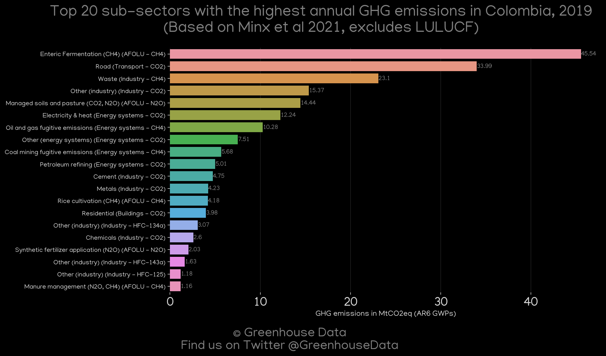
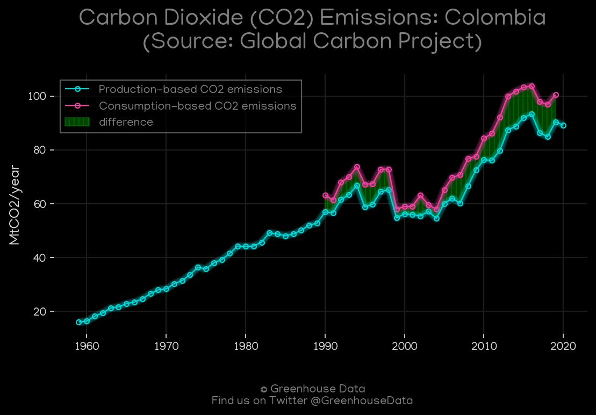
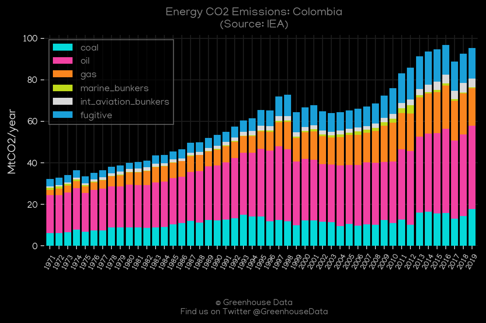
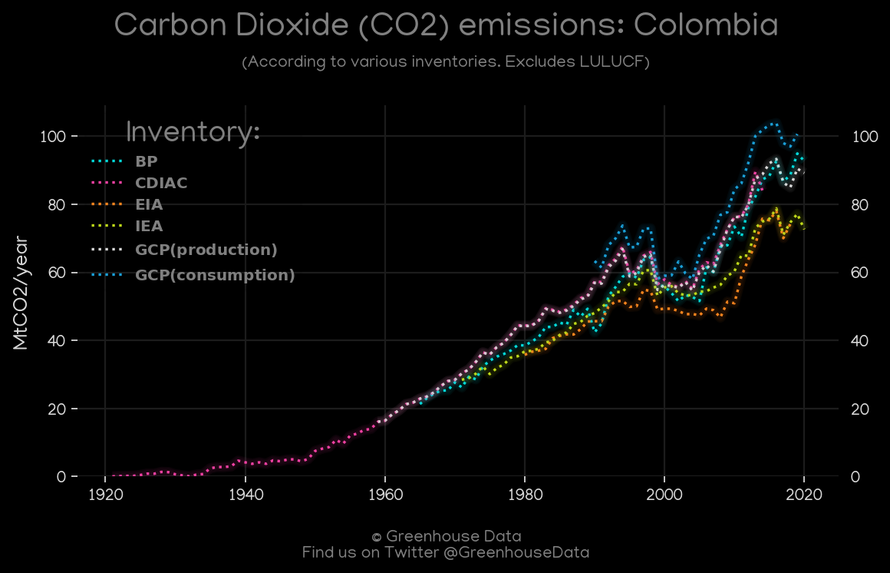

<h1 align="center">
🇨🇴🇨🇴🇨🇴🇨🇴🇨🇴
 
Colombia
 
🇨🇴🇨🇴🇨🇴🇨🇴🇨🇴
</h1>
<h2>Datasets:</h2>

<a href="https://github.com/dquintani/Greenhouse-Data/tree/master/country_data/COL_Colombia/data">View on Github</a>
 

<a href="data/COL_FAO.csv">FAO</a> || <a href="data/COL_GCP_cons.csv">GCP_cons</a> || <a href="data/COL_EDGAR.csv">EDGAR</a> || <a href="data/COL_PRIMAP-hist.csv">PRIMAP-hist</a> || <a href="data/COL_CAIT.csv">CAIT</a> || <a href="data/COL_GCP.csv">GCP</a> || <a href="data/COL_GCP_consupmption.csv">GCP_consupmption</a> || <a href="data/COL_EIA.csv">EIA</a> || <a href="data/COL_BP.csv">BP</a> || <a href="data/COL_CDIAC.csv">CDIAC</a> || <a href="data/COL_EPA.csv">EPA</a> || <a href="data/COL_Minx_2021.csv">Minx_2021</a> || <a href="data/COL_IEA.csv">IEA</a>

 

<h1>Figures:</h1><h2>#1 (COL_CDIAC_1)</h2>

<h2>#2 (COL_EIA_1)</h2>

<h2>#3 (COL_UNFCCC_NAI_1)</h2>

<h2>#4 (COL_Minx_top20_subsectors)</h2>

<h2>#5 (COL_GCP_1)</h2>

<h2>#6 (COL_BP_1)</h2>

<h2>#7 (COL_CAIT_gases_1)</h2>

<h2>#8 (COL_IEA_1)</h2>

<h2>#9 (COL_CO2_totals)</h2>

