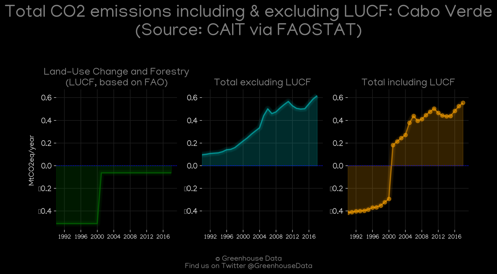
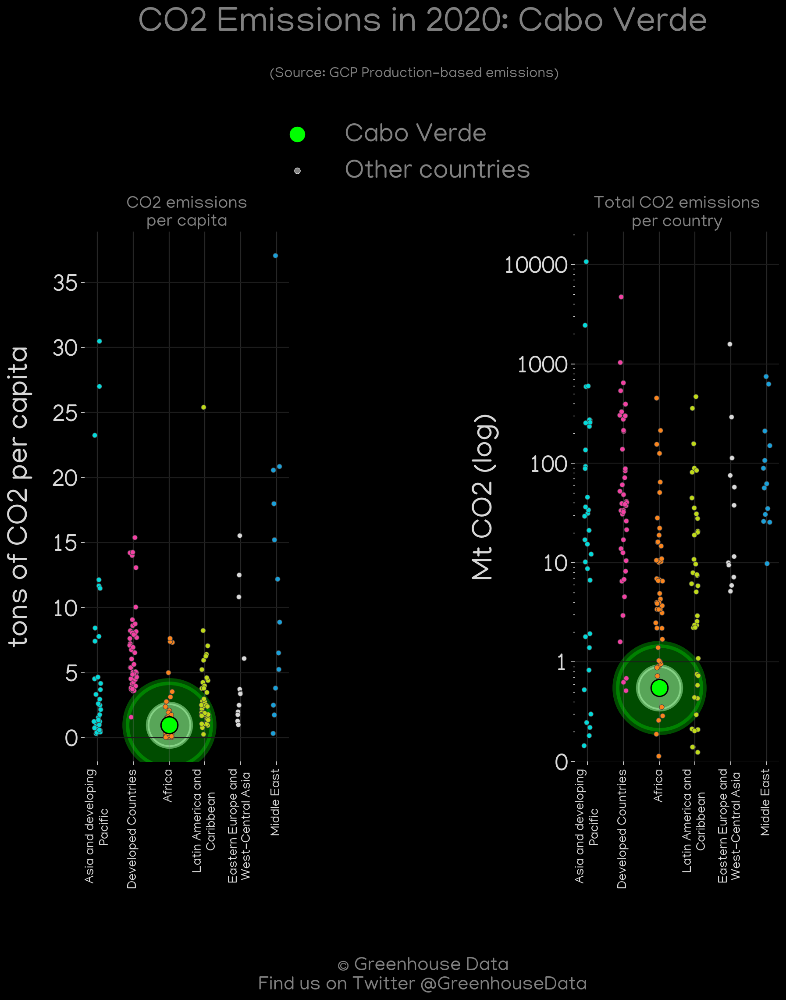
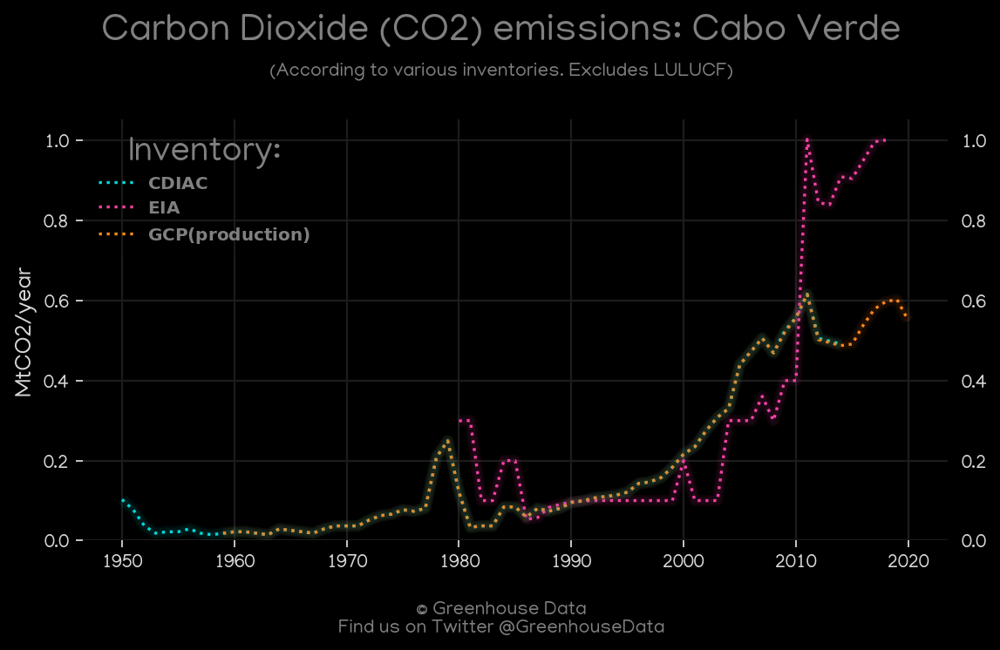
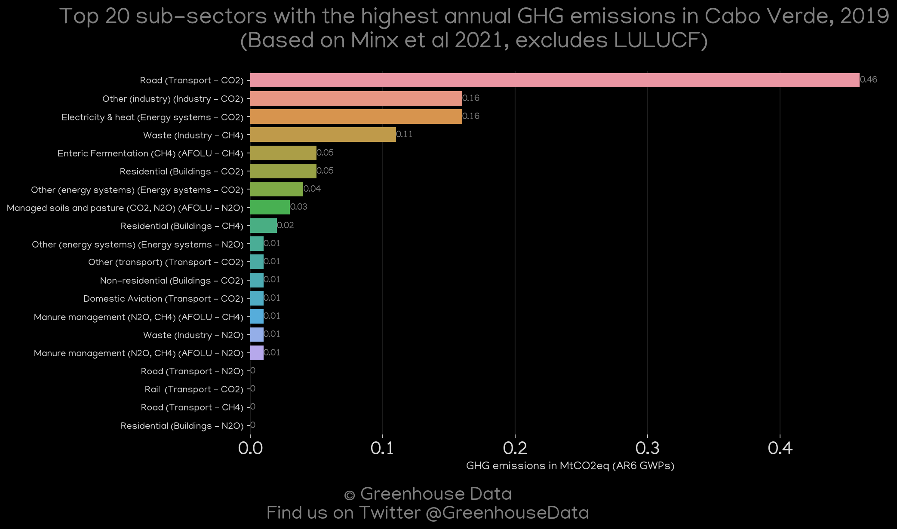
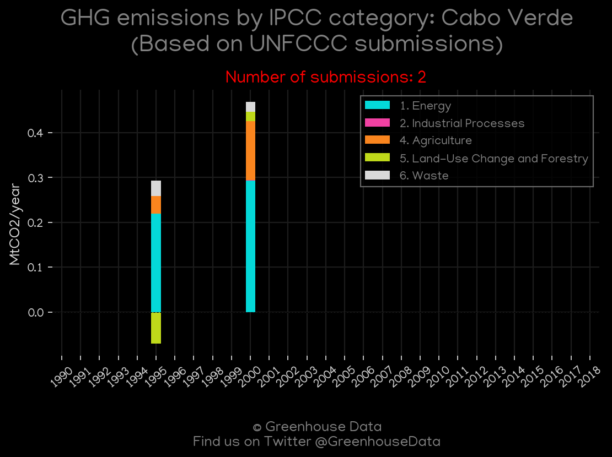
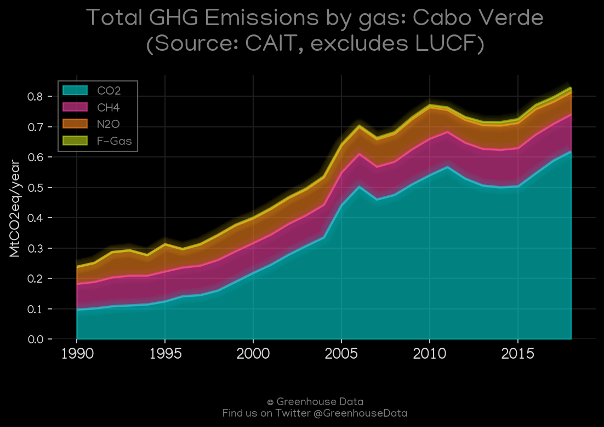
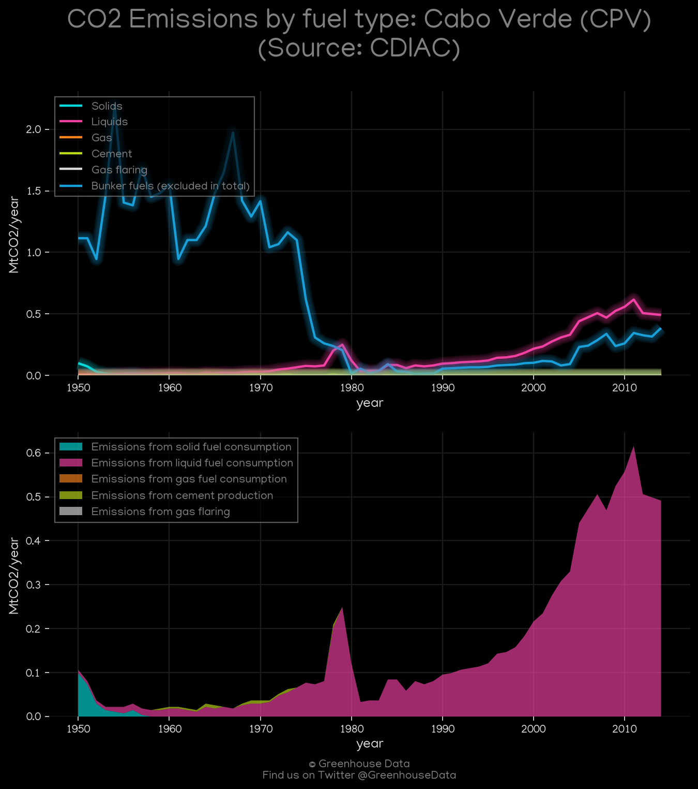
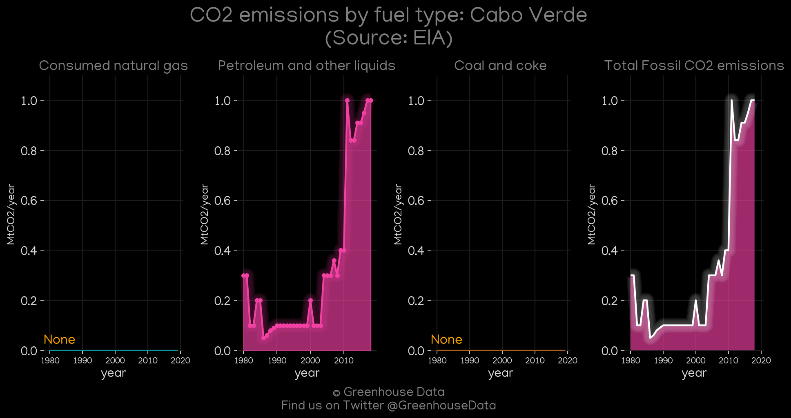

<h1 align="center">
🇨🇻🇨🇻🇨🇻🇨🇻🇨🇻
 
Cabo Verde
 
🇨🇻🇨🇻🇨🇻🇨🇻🇨🇻
</h1>
<h2>Datasets:</h2>

<a href="https://github.com/dquintani/GreenhouseData/tree/master/country_data/CPV_Cabo Verde/data">View on Github</a>
 

<a href="data/CPV_EDGAR.csv">EDGAR</a> || <a href="data/CPV_CDIAC.csv">CDIAC</a> || <a href="data/CPV_EIA.csv">EIA</a> || <a href="data/CPV_FAO.csv">FAO</a> || <a href="data/CPV_PRIMAP-hist.csv">PRIMAP-hist</a> || <a href="data/CPV_EPA.csv">EPA</a> || <a href="data/CPV_Minx_2021.csv">Minx_2021</a> || <a href="data/CPV_CAIT.csv">CAIT</a> || <a href="data/CPV_GCP.csv">GCP</a> || <a href="data/CPV_GCP_consupmption.csv">GCP_consupmption</a>

 

<h1>Figures:</h1><h2>#1 (CPV_CAIT_lucf_vs_nolucf)</h2>

<h2>#2 (CPV_GCP_Country_Highlight)</h2>

<h2>#3 (CPV_CO2_totals)</h2>

<h2>#4 (CPV_Minx_top20_subsectors)</h2>

<h2>#5 (CPV_UNFCCC_NAI_1)</h2>

<h2>#6 (CPV_GCP_1)</h2>

<h2>#7 (CPV_CAIT_gases_1)</h2>

<h2>#8 (CPV_CDIAC_1)</h2>

<h2>#9 (CPV_EIA_1)</h2>

