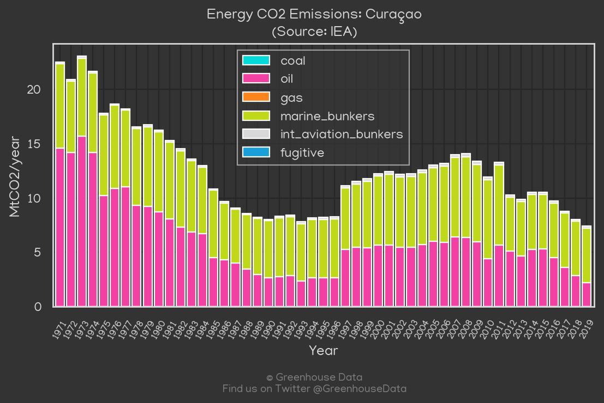
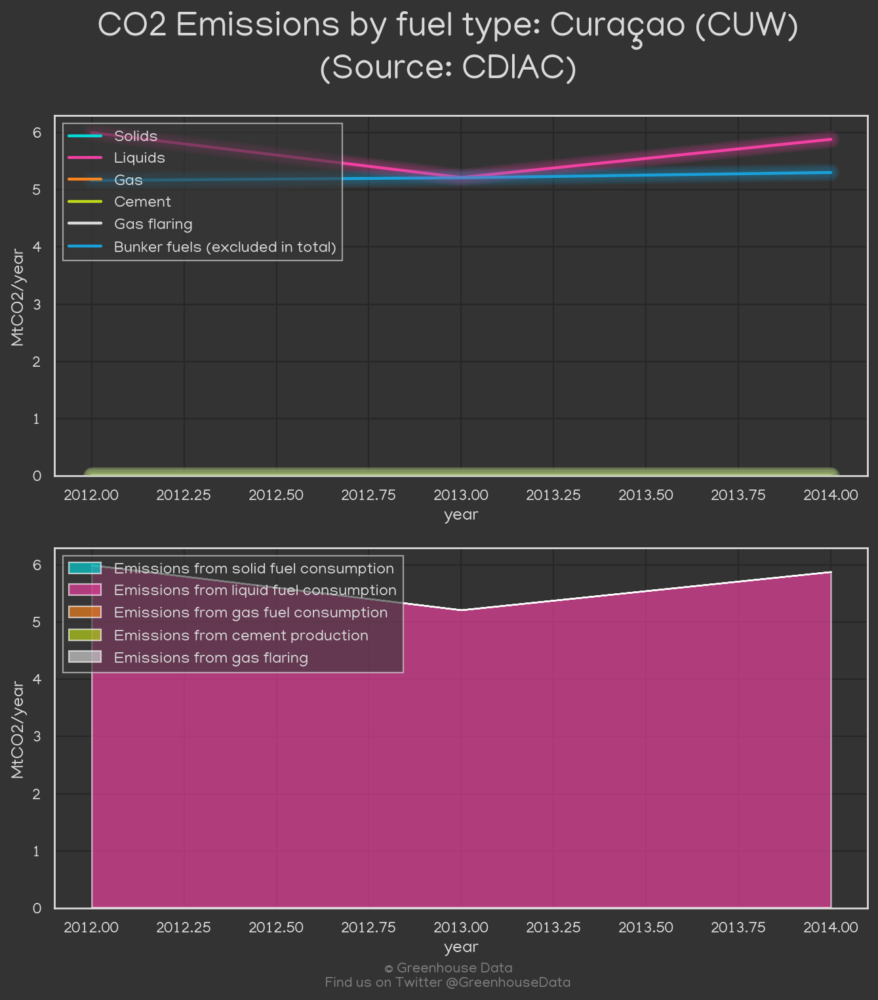
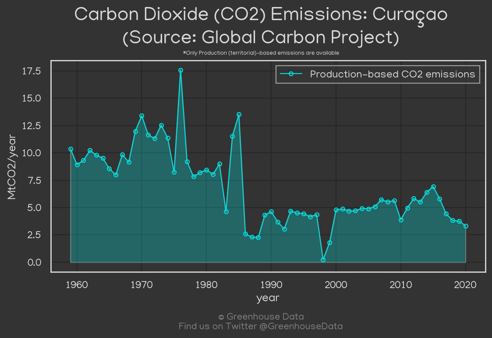
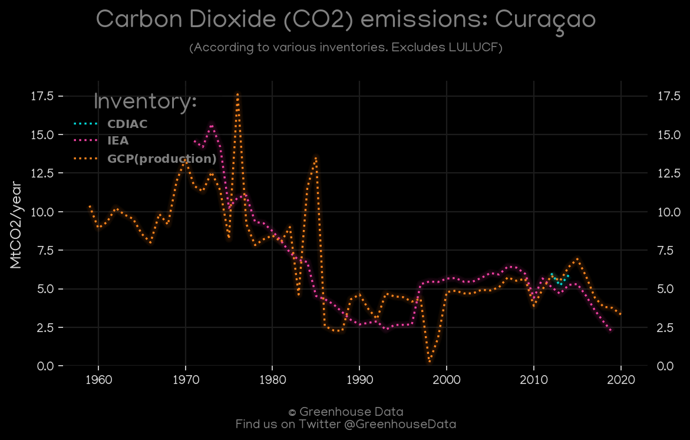

<h1 align="center">
🇨🇼🇨🇼🇨🇼🇨🇼🇨🇼
 
Curaçao
 
🇨🇼🇨🇼🇨🇼🇨🇼🇨🇼
</h1>
<h2>Datasets:</h2>

<a href="https://github.com/dquintani/GreenhouseData/tree/master/country_data/CUW_Curaçao/data">View on Github</a>
 

<a href="data/CUW_CDIAC.csv">CDIAC</a> || <a href="data/CUW_IEA.csv">IEA</a> || <a href="data/CUW_GCP_consupmption.csv">GCP_consupmption</a> || <a href="data/CUW_GCP.csv">GCP</a>

 

<h1>Figures:</h1><h2>#1 (CUW_IEA_1)</h2>

<h2>#2 (CUW_CDIAC_1)</h2>

<h2>#3 (CUW_GCP_1)</h2>

<h2>#4 (CUW_CO2_totals)</h2>

