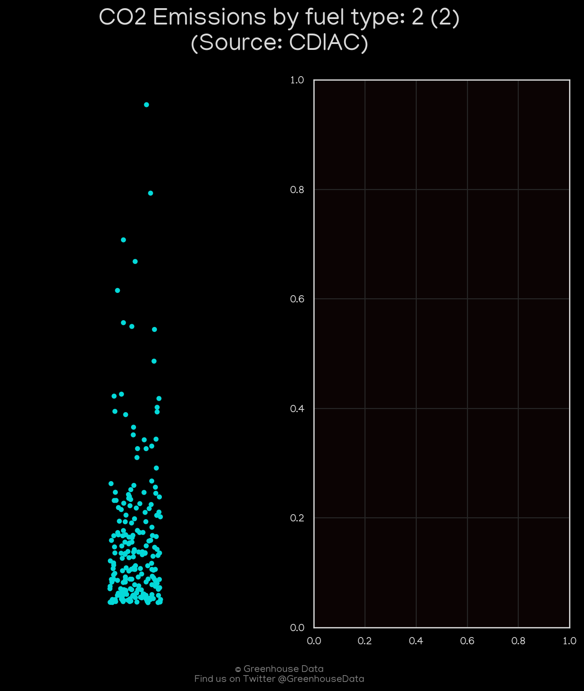
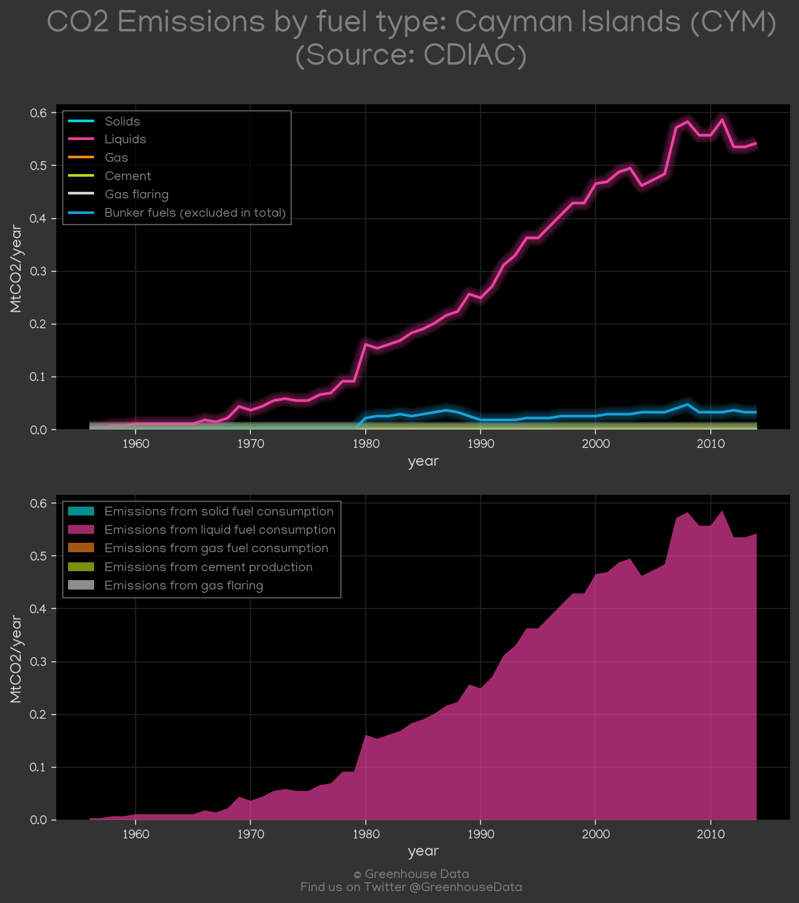
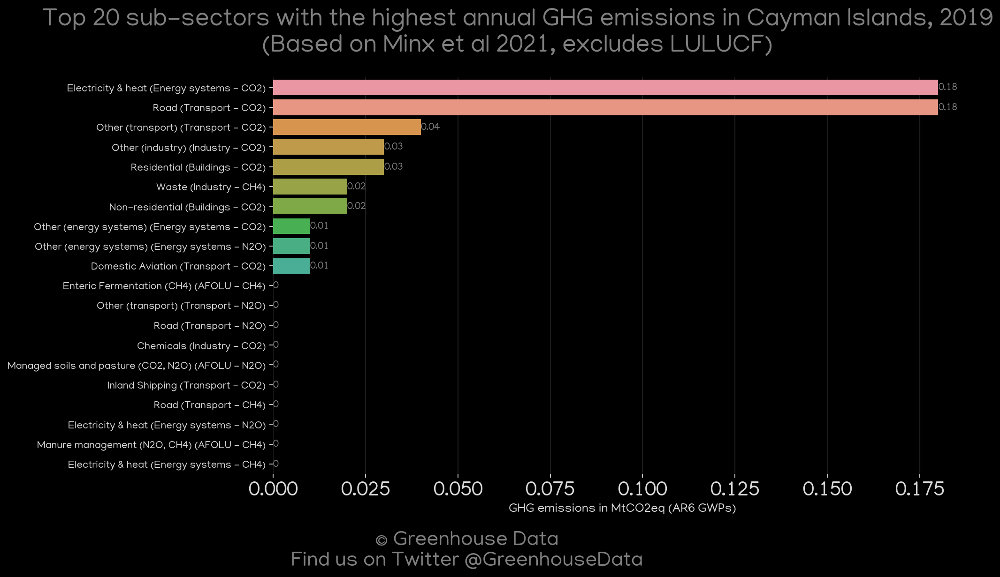
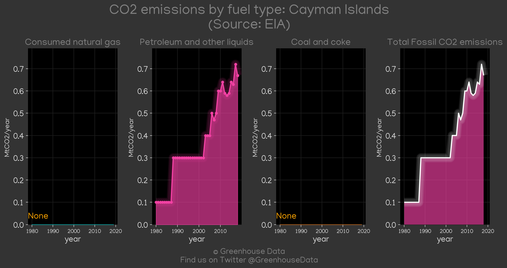
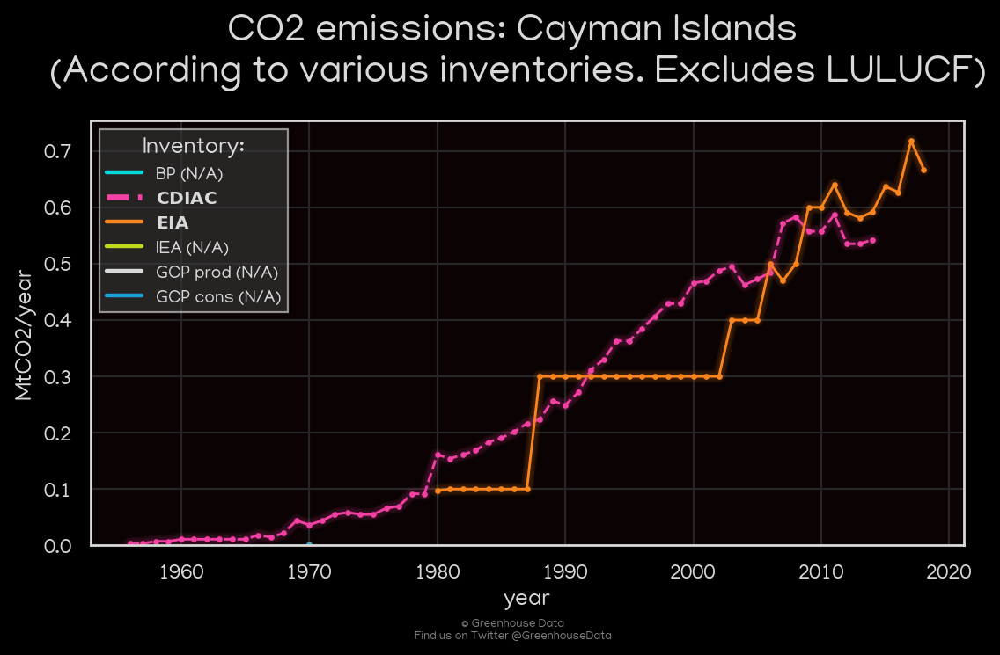

<h1 align="center">
🇰🇾🇰🇾🇰🇾🇰🇾🇰🇾
 
Cayman Islands
 
🇰🇾🇰🇾🇰🇾🇰🇾🇰🇾
</h1>
<h2>Datasets:</h2>

<a href="https://github.com/dquintani/GreenhouseData/tree/master/country_data/CYM_Cayman Islands/data">View on Github</a>
 

<a href="data/CYM_EIA.csv">EIA</a> || <a href="data/CYM_Minx_2021.csv">Minx_2021</a> || <a href="data/CYM_FAO.csv">FAO</a> || <a href="data/CYM_EDGAR.csv">EDGAR</a> || <a href="data/CYM_CDIAC.csv">CDIAC</a>

 

<h1>Figures:</h1><h2>#1 (CYM_GCP_Country_Highlight)</h2>

<h2>#2 (CYM_CDIAC_1)</h2>

<h2>#3 (CYM_Minx_top20_subsectors)</h2>

<h2>#4 (CYM_EIA_1)</h2>

<h2>#5 (CYM_CO2_totals)</h2>

