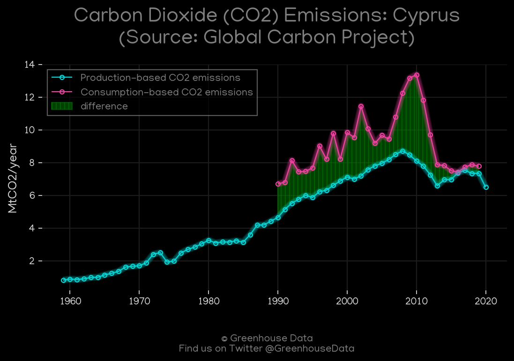
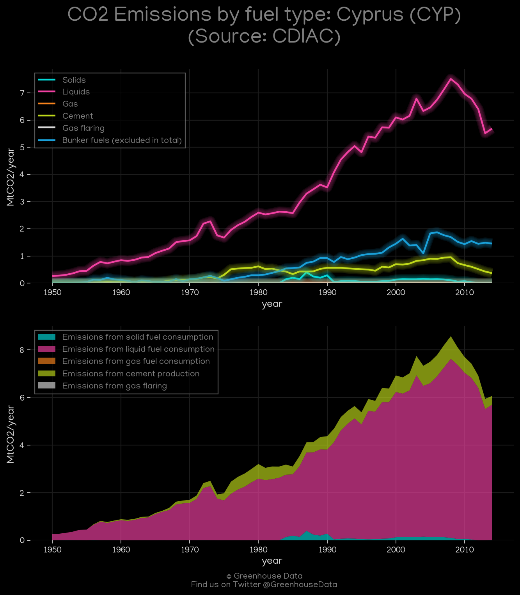
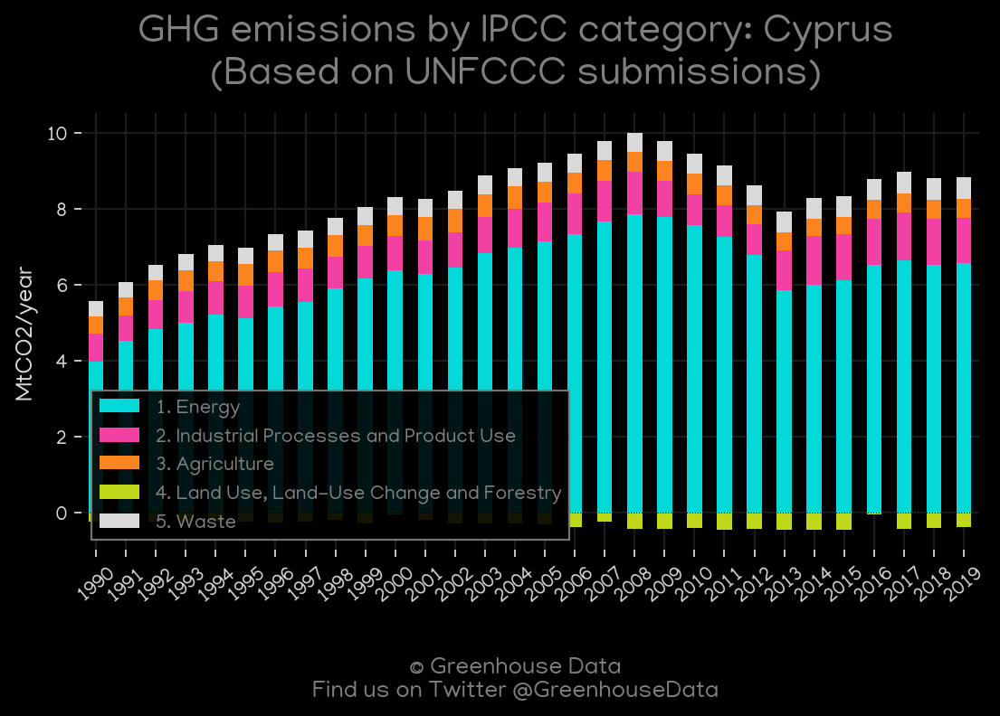
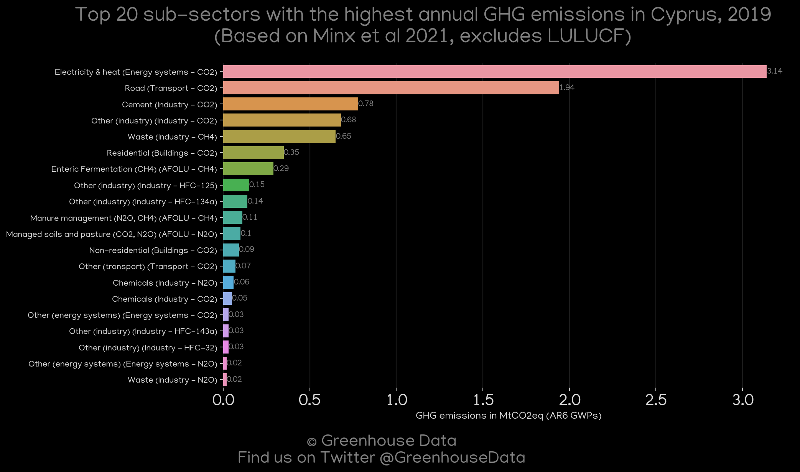
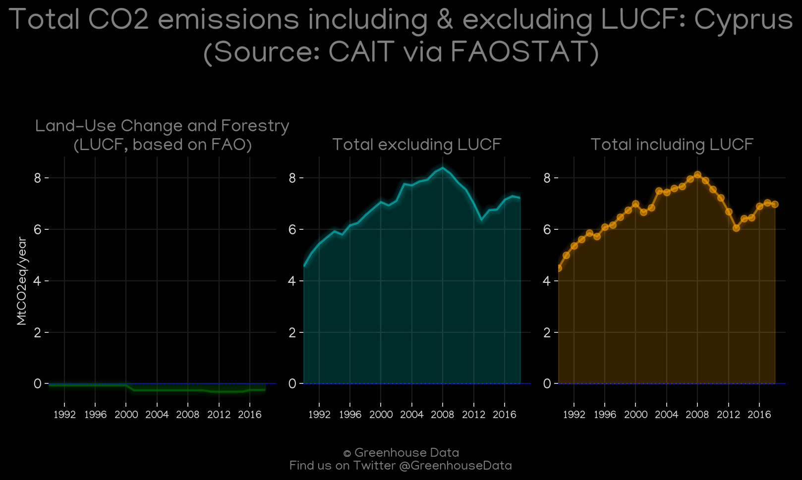
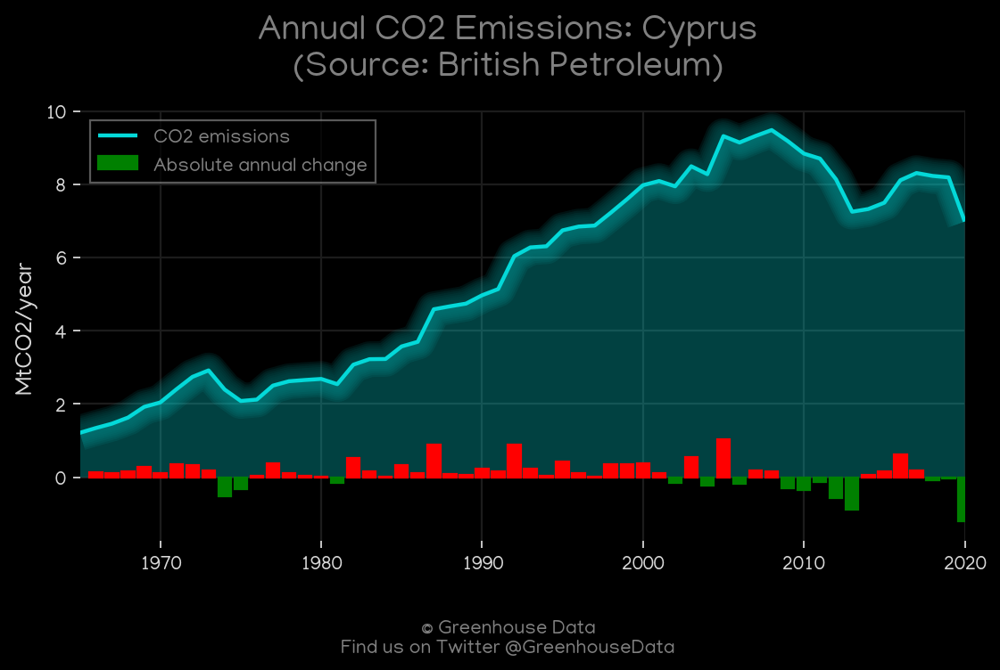
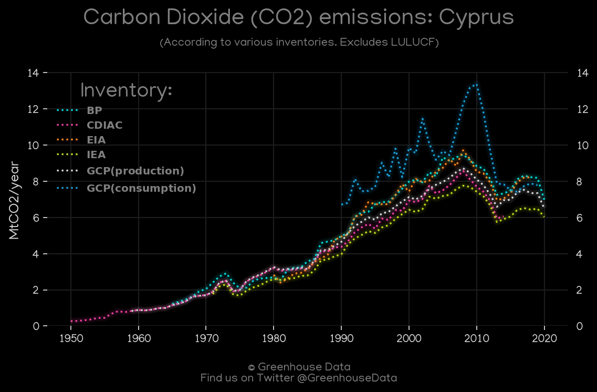
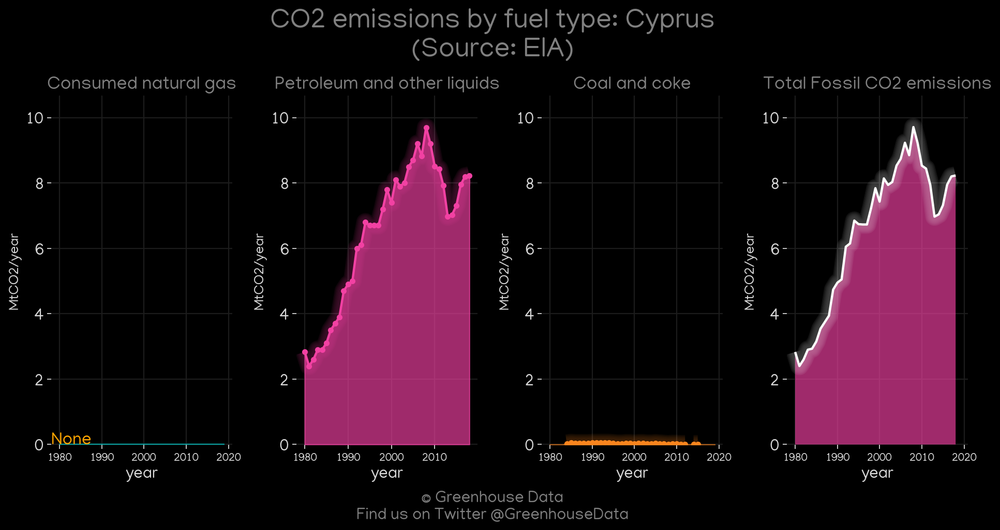

<h1 align="center">
🇨🇾🇨🇾🇨🇾🇨🇾🇨🇾
 
Cyprus
 
🇨🇾🇨🇾🇨🇾🇨🇾🇨🇾
</h1>
<h2>Datasets:</h2>

<a href="https://github.com/dquintani/GreenhouseData/tree/master/country_data/CYP_Cyprus/data">View on Github</a>
 

<a href="data/CYP_BP.csv">BP</a> || <a href="data/CYP_CDIAC.csv">CDIAC</a> || <a href="data/CYP_GCP.csv">GCP</a> || <a href="data/CYP_PRIMAP-hist.csv">PRIMAP-hist</a> || <a href="data/CYP_GCP_consupmption.csv">GCP_consupmption</a> || <a href="data/CYP_Minx_2021.csv">Minx_2021</a> || <a href="data/CYP_CAIT.csv">CAIT</a> || <a href="data/CYP_IEA.csv">IEA</a> || <a href="data/CYP_EDGAR.csv">EDGAR</a> || <a href="data/CYP_FAO.csv">FAO</a> || <a href="data/CYP_EIA.csv">EIA</a> || <a href="data/CYP_EPA.csv">EPA</a>

 

<h1>Figures:</h1><h2>#1 (CYP_GCP_1)</h2>

<h2>#2 (CYP_CAIT_gases_1)</h2>

<h2>#3 (CYP_CDIAC_1)</h2>

<h2>#4 (CYP_UNFCCC_AI_1)</h2>

<h2>#5 (CYP_IEA_1)</h2>

<h2>#6 (CYP_Minx_top20_subsectors)</h2>

<h2>#7 (CYP_CAIT_lucf_vs_nolucf)</h2>

<h2>#8 (CYP_BP_1)</h2>

<h2>#9 (CYP_CO2_totals)</h2>

<h2>#10 (CYP_EIA_1)</h2>

