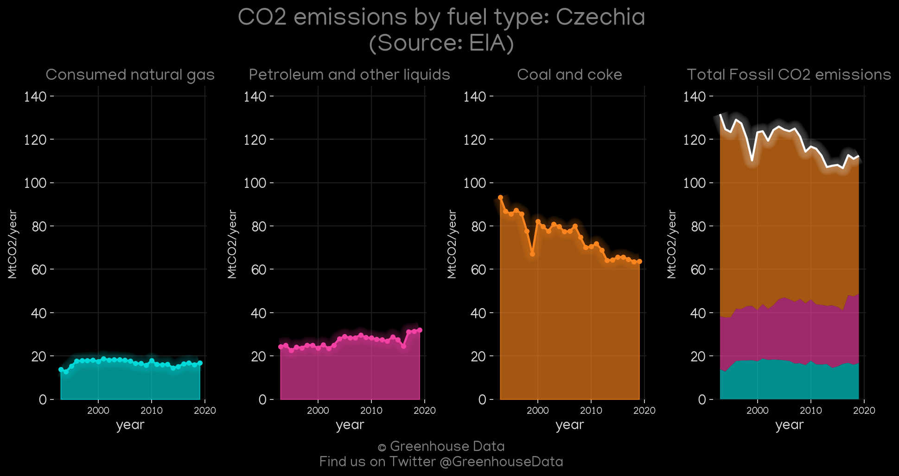
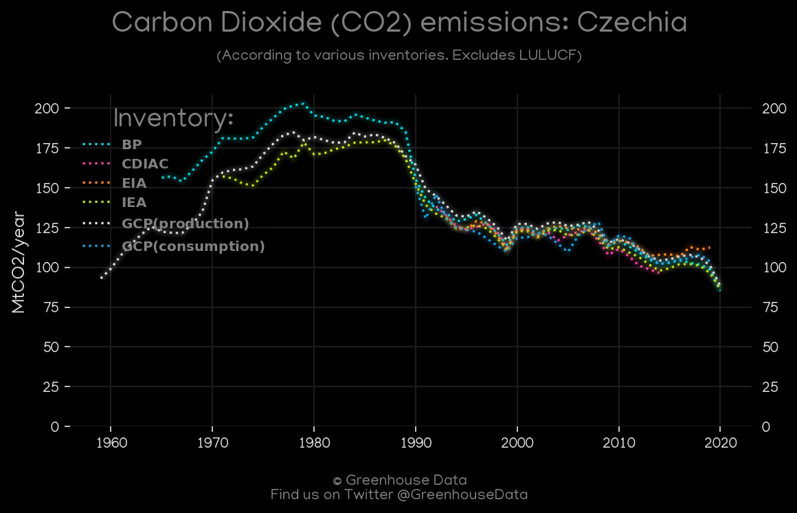
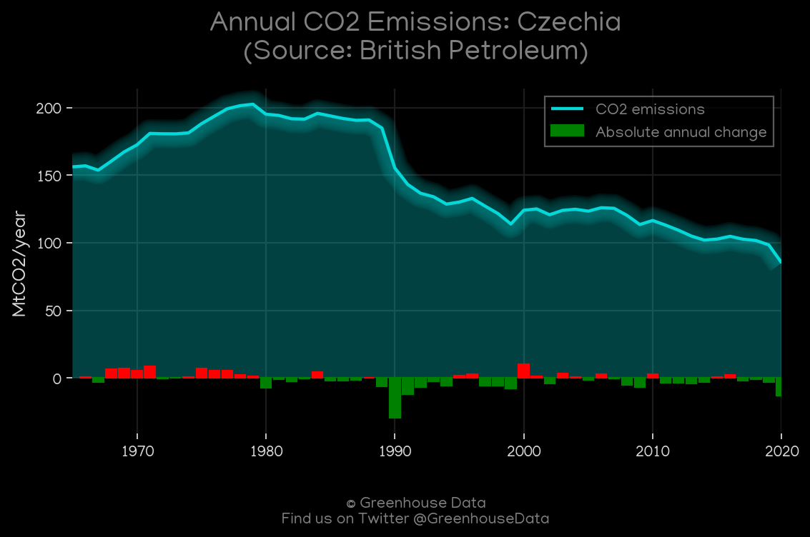
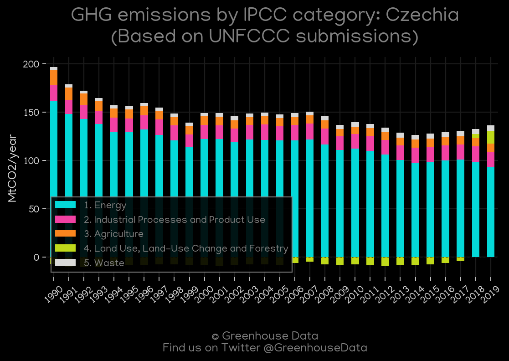
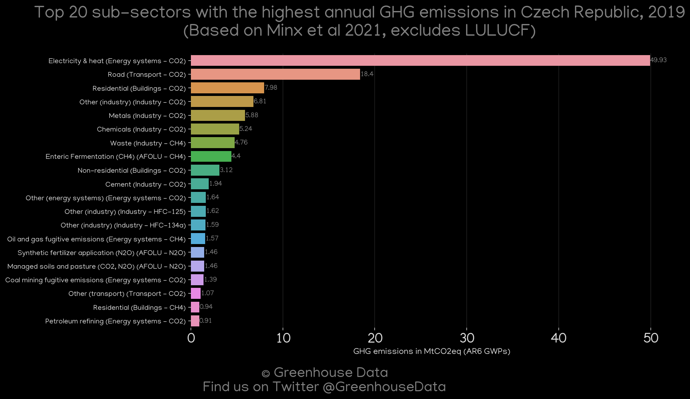
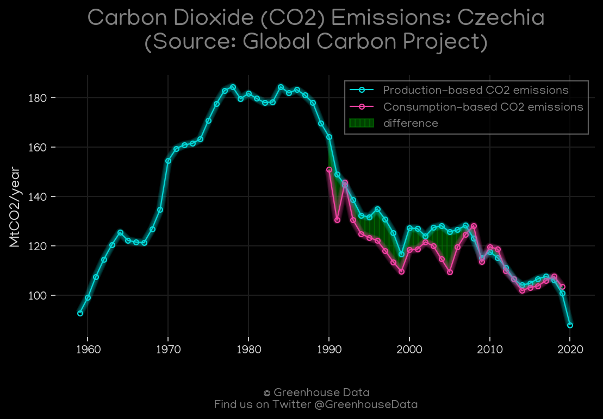
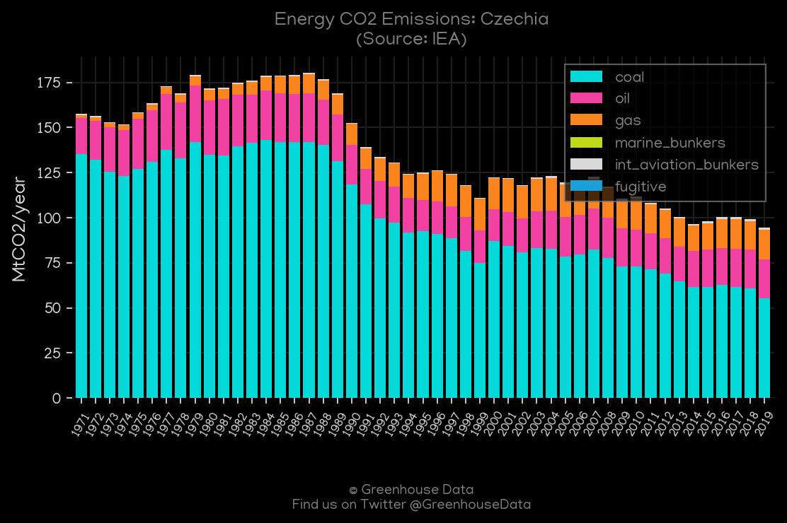
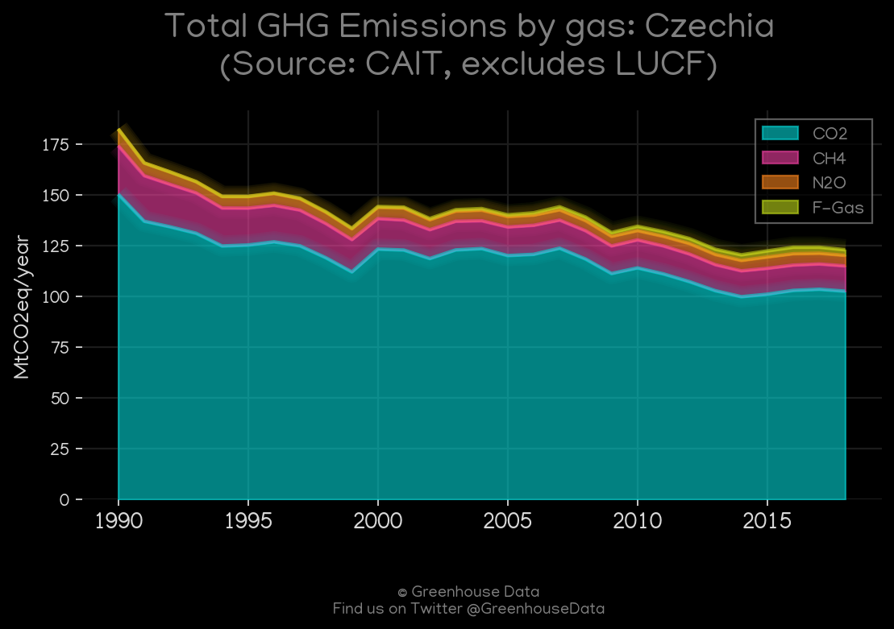

<h1 align="center">
🇨🇿🇨🇿🇨🇿🇨🇿🇨🇿
 
Czechia
 
🇨🇿🇨🇿🇨🇿🇨🇿🇨🇿
</h1>
<h2>Datasets:</h2>

<a href="https://github.com/dquintani/GreenhouseData/tree/master/country_data/CZE_Czechia/data">View on Github</a>
 

<a href="data/CZE_IEA.csv">IEA</a> || <a href="data/CZE_EIA.csv">EIA</a> || <a href="data/CZE_GCP.csv">GCP</a> || <a href="data/CZE_PRIMAP-hist.csv">PRIMAP-hist</a> || <a href="data/CZE_FAO.csv">FAO</a> || <a href="data/CZE_GCP_consupmption.csv">GCP_consupmption</a> || <a href="data/CZE_Minx_2021.csv">Minx_2021</a> || <a href="data/CZE_CAIT.csv">CAIT</a> || <a href="data/CZE_BP.csv">BP</a> || <a href="data/CZE_EPA.csv">EPA</a> || <a href="data/CZE_EDGAR.csv">EDGAR</a> || <a href="data/CZE_CDIAC.csv">CDIAC</a>

 

<h1>Figures:</h1><h2>#1 (CZE_EIA_1)</h2>

<h2>#2 (CZE_CO2_totals)</h2>

<h2>#3 (CZE_CDIAC_1)</h2>

<h2>#4 (CZE_BP_1)</h2>

<h2>#5 (CZE_UNFCCC_AI_1)</h2>

<h2>#6 (CZE_Minx_top20_subsectors)</h2>

<h2>#7 (CZE_GCP_1)</h2>

<h2>#8 (CZE_IEA_1)</h2>

<h2>#9 (CZE_CAIT_gases_1)</h2>

