

<h1 align="center">
🇩🇪🇩🇪🇩🇪🇩🇪🇩🇪
 
Germany
 
🇩🇪🇩🇪🇩🇪🇩🇪🇩🇪
</h1>
<h2>Datasets:</h2>

<a href="https://github.com/dquintani/GreenhouseData/tree/master/country_data/DEU_Germany/data">View on Github</a>
 

<a href="data/DEU_GCP_consupmption.csv">GCP_consupmption</a> || <a href="data/DEU_CDIAC.csv">CDIAC</a> || <a href="data/DEU_EDGAR.csv">EDGAR</a> || <a href="data/DEU_BP.csv">BP</a> || <a href="data/DEU_IEA.csv">IEA</a> || <a href="data/DEU_PRIMAP-hist.csv">PRIMAP-hist</a> || <a href="data/DEU_Minx_2021.csv">Minx_2021</a> || <a href="data/DEU_CAIT.csv">CAIT</a> || <a href="data/DEU_EPA.csv">EPA</a> || <a href="data/DEU_FAO.csv">FAO</a> || <a href="data/DEU_GCP.csv">GCP</a> || <a href="data/DEU_EIA.csv">EIA</a>

 

<h1>Figures:</h1><h2>#1 (DEU_CAIT_gases_1)</h2>

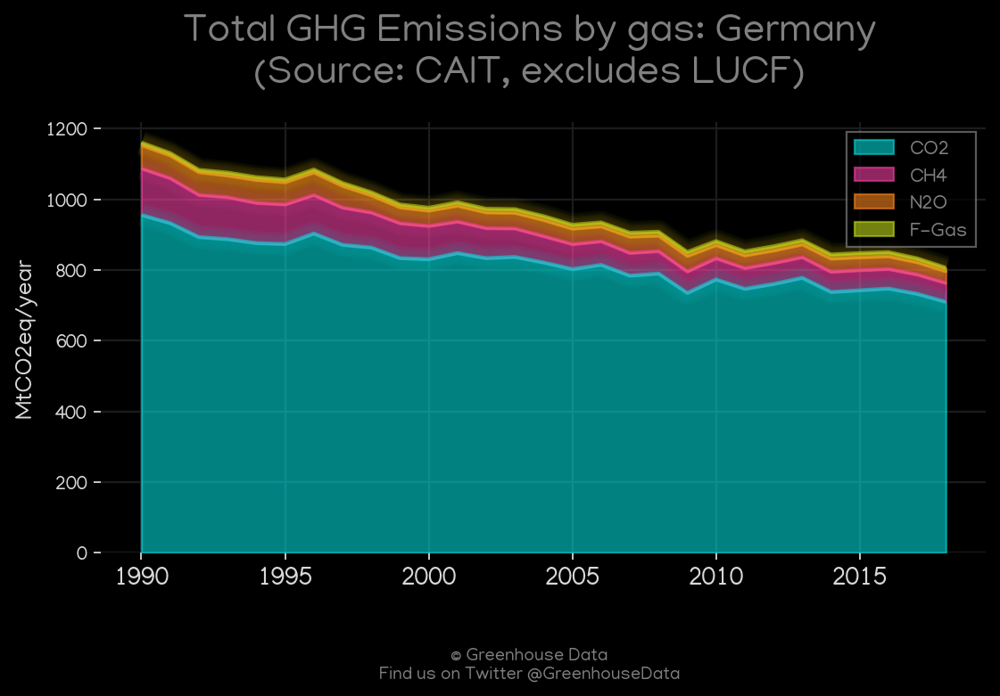
<h2>#2 (DEU_Minx_top20_subsectors)</h2>

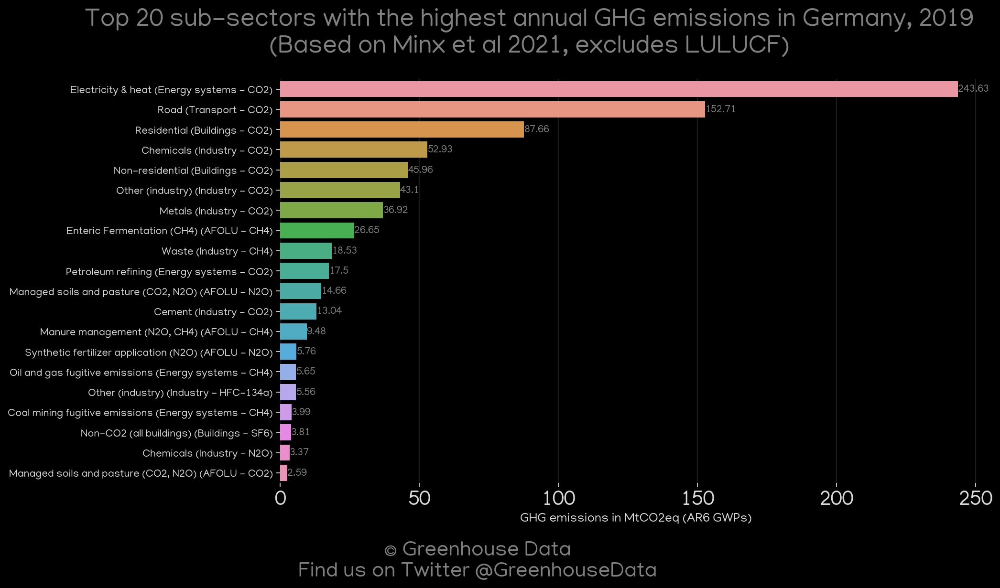
<h2>#3 (DEU_CAIT_lucf_vs_nolucf)</h2>

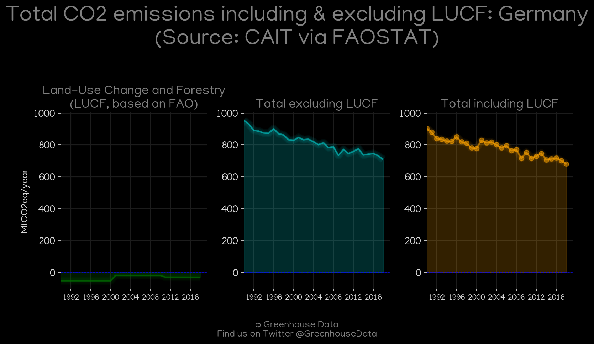
<h2>#4 (DEU_EIA_1)</h2>

<h2>#5 (DEU_CO2_totals)</h2>

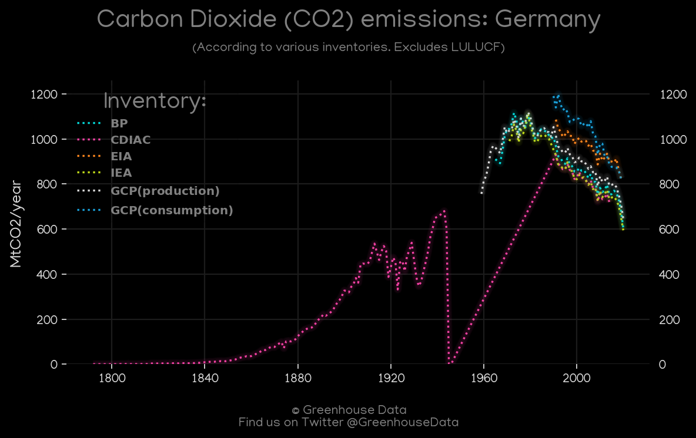
<h2>#6 (DEU_CDIAC_1)</h2>

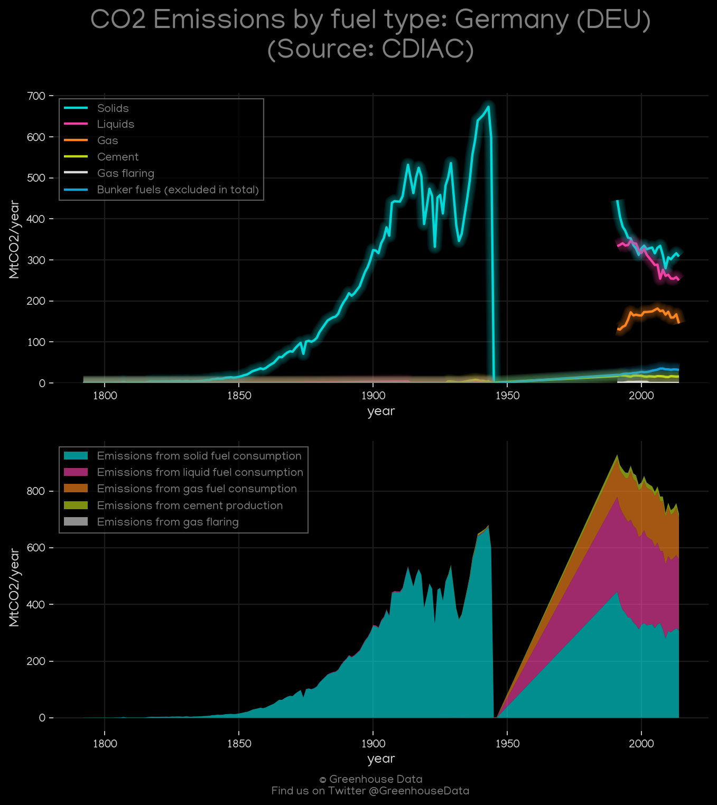
<h2>#7 (DEU_BP_1)</h2>

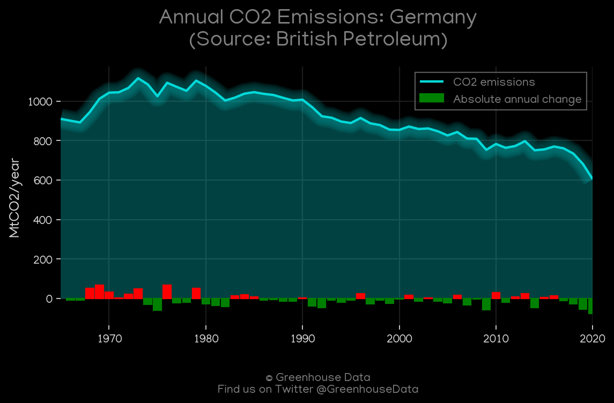
<h2>#8 (DEU_UNFCCC_AI_1)</h2>

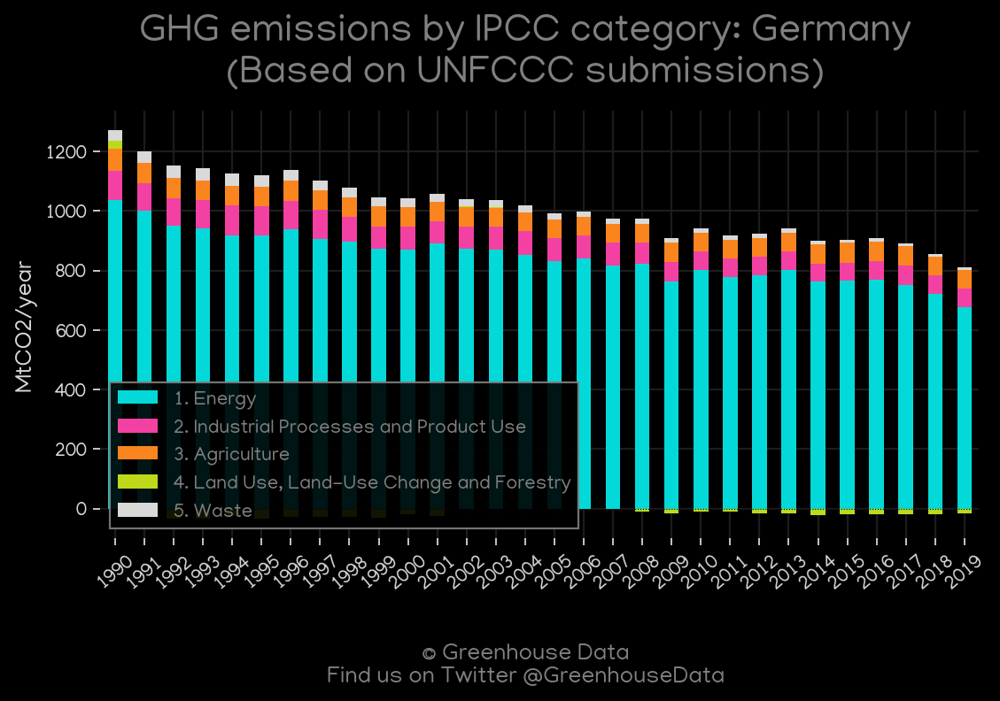
<h2>#9 (DEU_GCP_1)</h2>

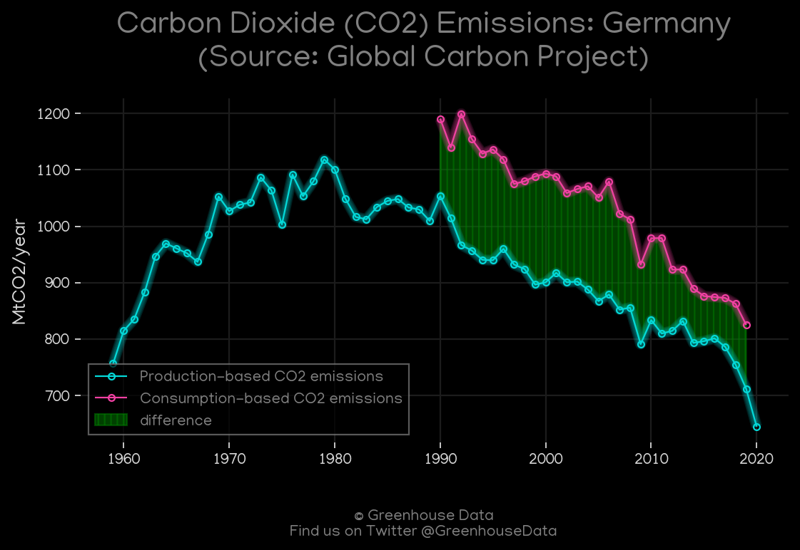
<h2>#10 (DEU_Carbon_Monitor_1)</h2>

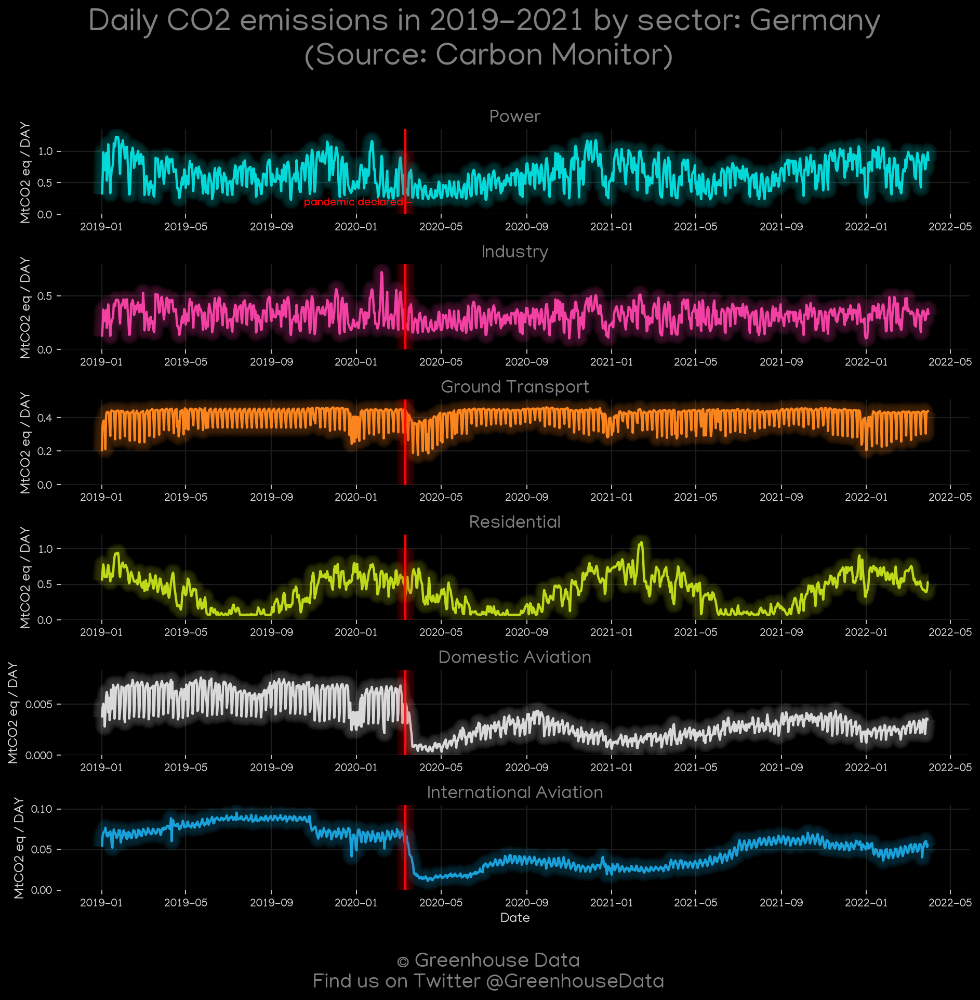
<h2>#11 (DEU_GCP_Country_Highlight)</h2>

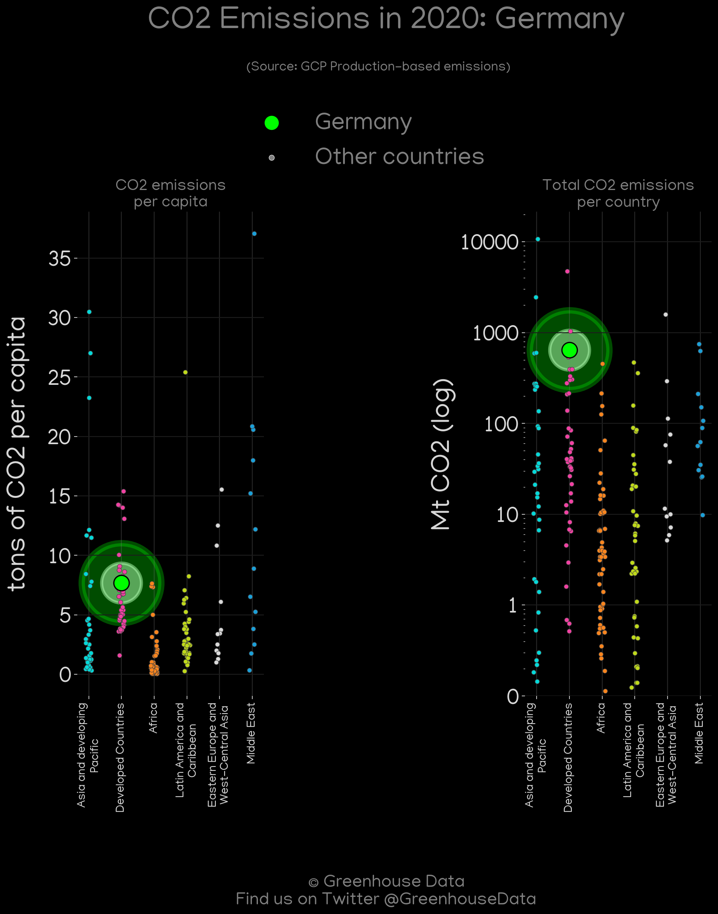
<h2>#12 (DEU_IEA_1)</h2>

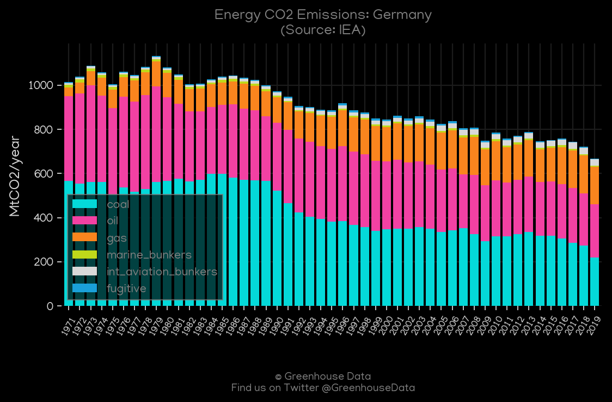
