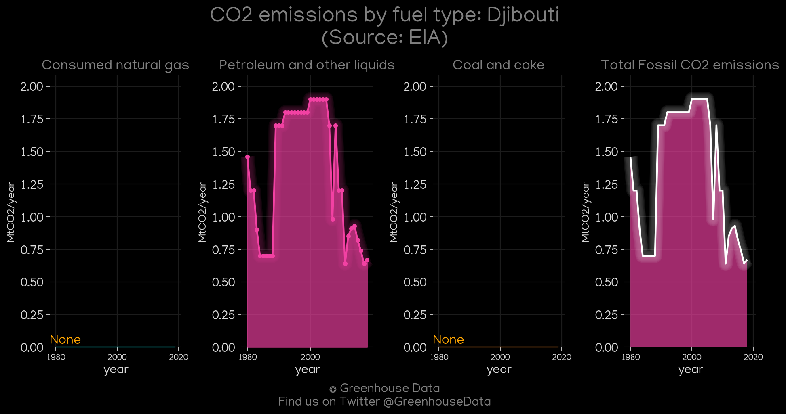
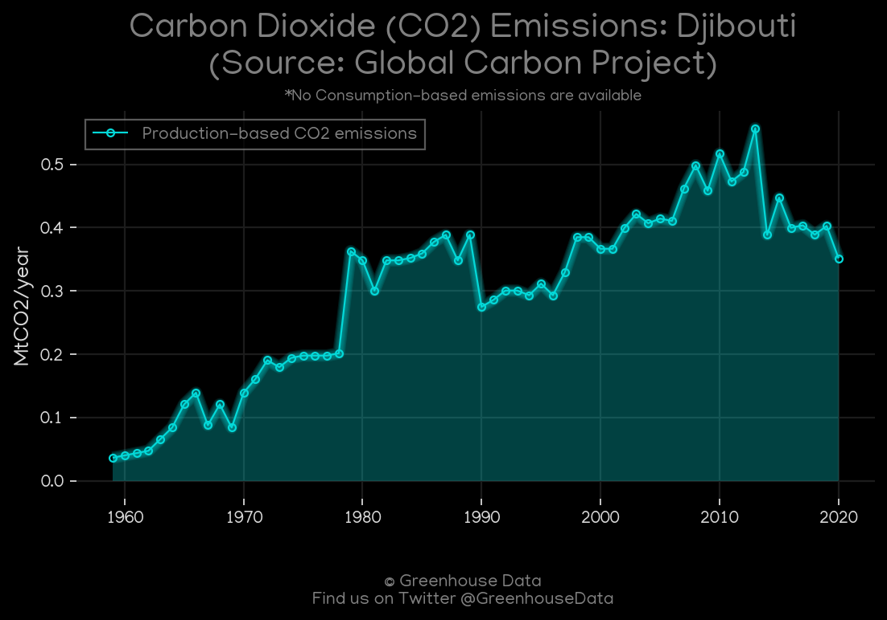
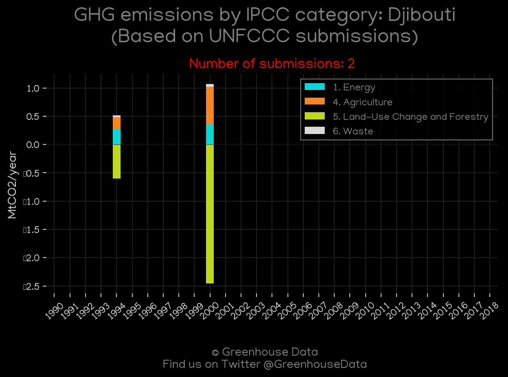
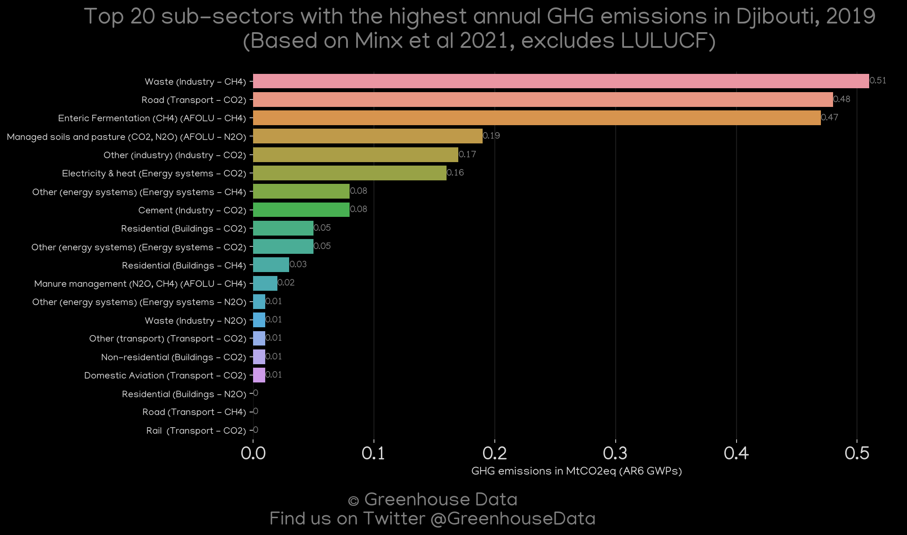
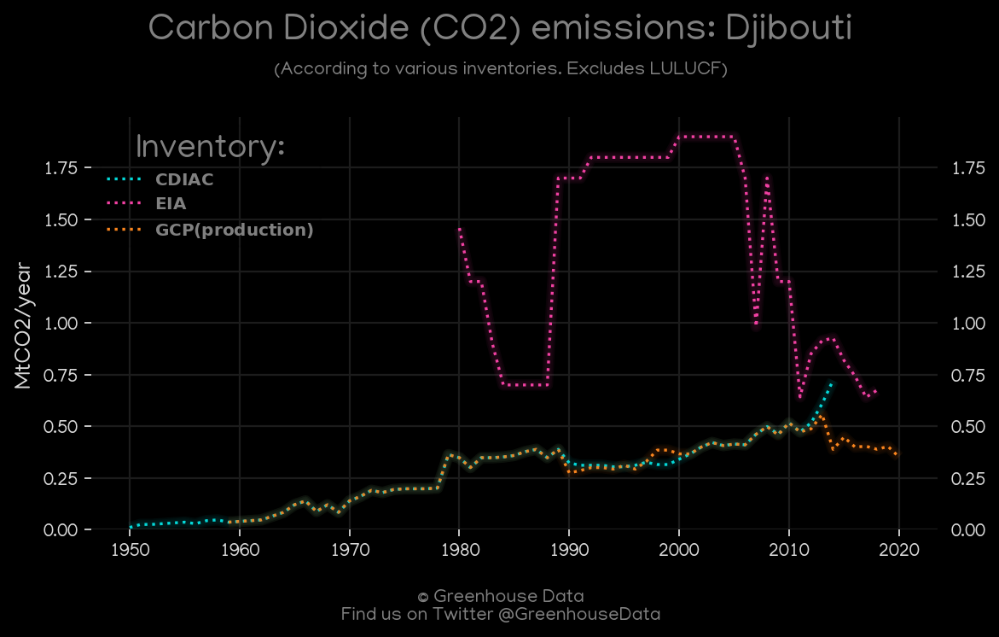
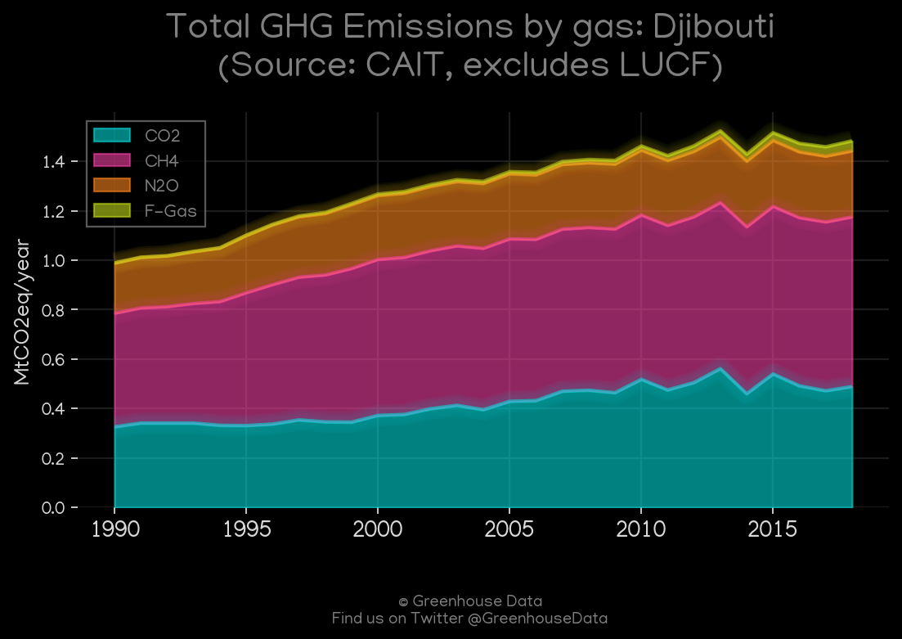
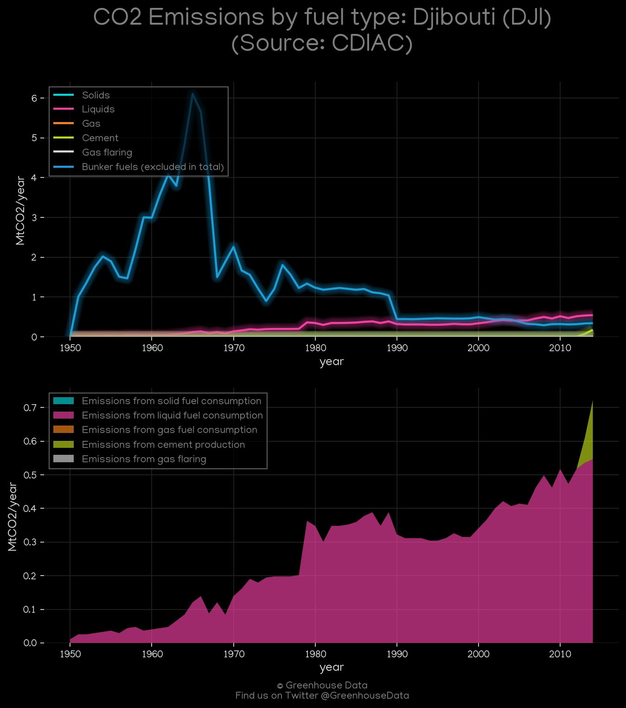

<h1 align="center">
🇩🇯🇩🇯🇩🇯🇩🇯🇩🇯
 
Djibouti
 
🇩🇯🇩🇯🇩🇯🇩🇯🇩🇯
</h1>
<h2>Datasets:</h2>

<a href="https://github.com/dquintani/GreenhouseData/tree/master/country_data/DJI_Djibouti/data">View on Github</a>
 

<a href="data/DJI_GCP.csv">GCP</a> || <a href="data/DJI_FAO.csv">FAO</a> || <a href="data/DJI_GCP_cons.csv">GCP_cons</a> || <a href="data/DJI_EPA.csv">EPA</a> || <a href="data/DJI_Minx_2021.csv">Minx_2021</a> || <a href="data/DJI_EIA.csv">EIA</a> || <a href="data/DJI_CAIT.csv">CAIT</a> || <a href="data/DJI_CDIAC.csv">CDIAC</a> || <a href="data/DJI_EDGAR.csv">EDGAR</a> || <a href="data/DJI_PRIMAP-hist.csv">PRIMAP-hist</a> || <a href="data/DJI_GCP_consupmption.csv">GCP_consupmption</a>

 

<h1>Figures:</h1><h2>#1 (DJI_EIA_1)</h2>

<h2>#2 (DJI_GCP_1)</h2>

<h2>#3 (DJI_UNFCCC_NAI_1)</h2>

<h2>#4 (DJI_Minx_top20_subsectors)</h2>

<h2>#5 (DJI_CO2_totals)</h2>

<h2>#6 (DJI_CAIT_gases_1)</h2>

<h2>#7 (DJI_CDIAC_1)</h2>

