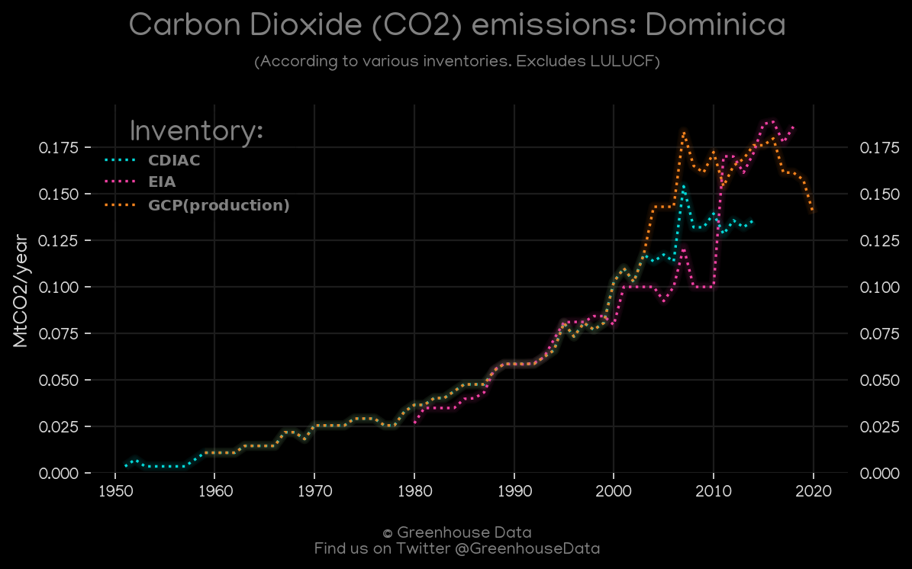
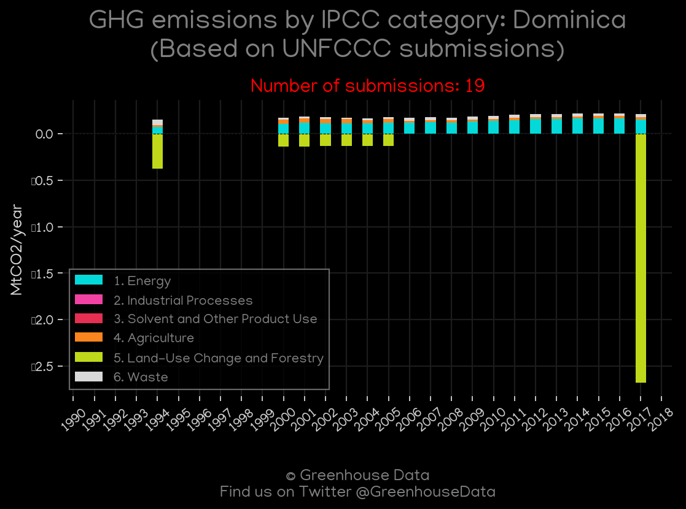
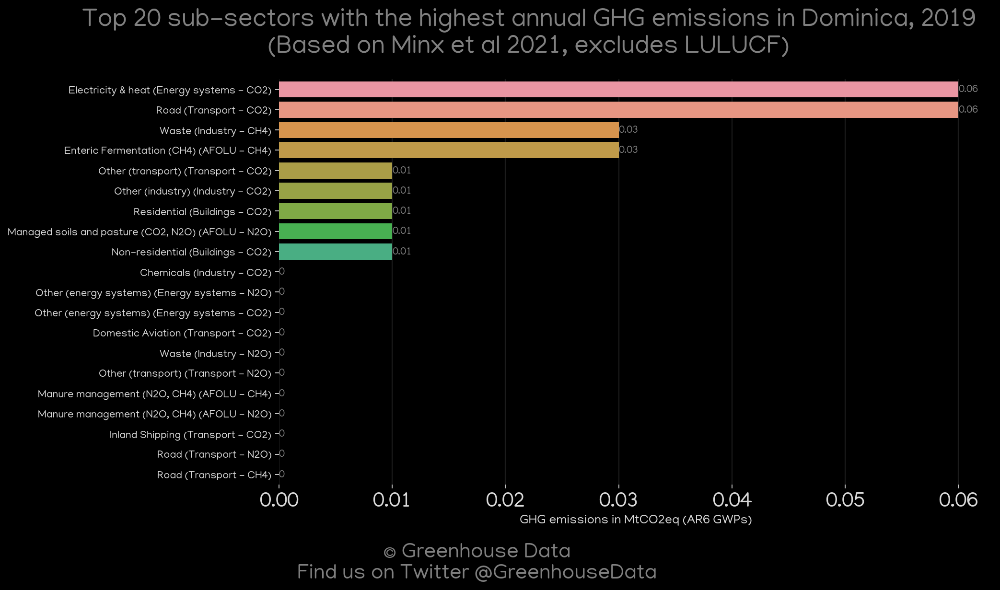
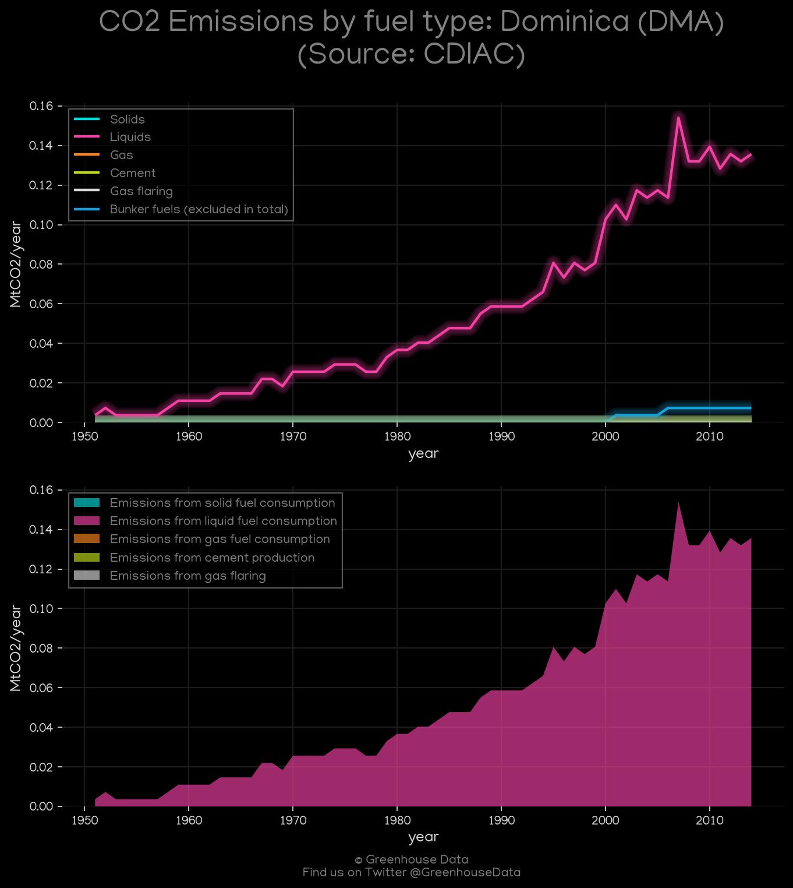
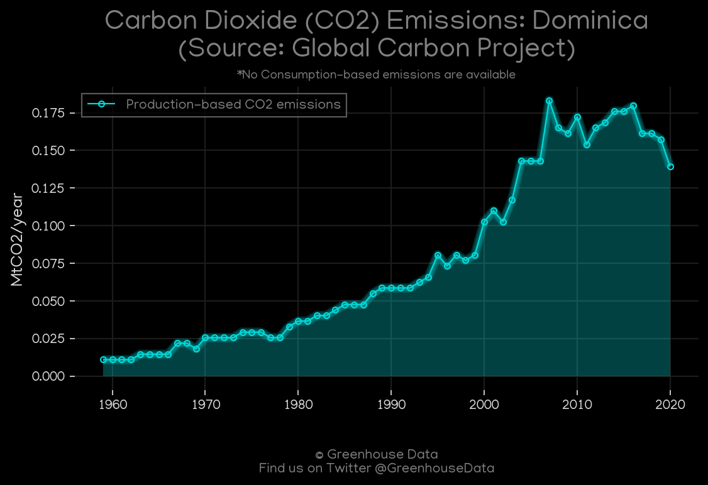
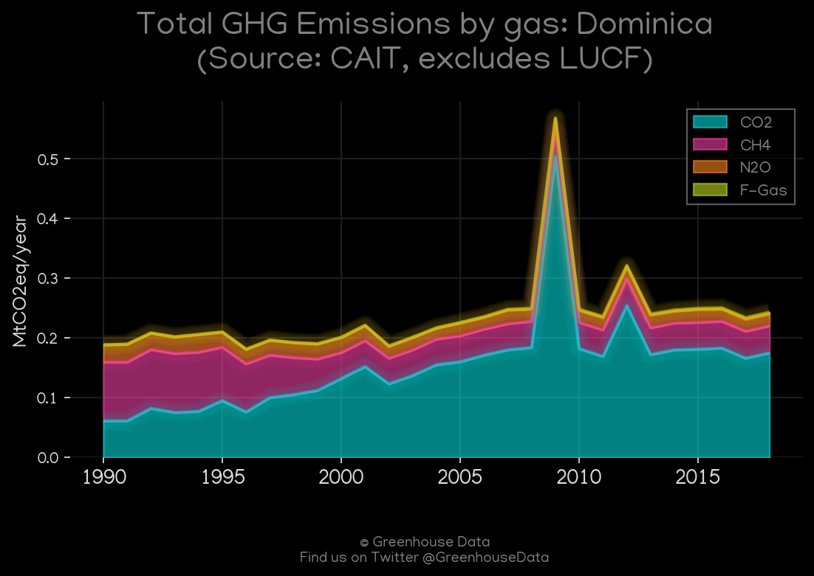
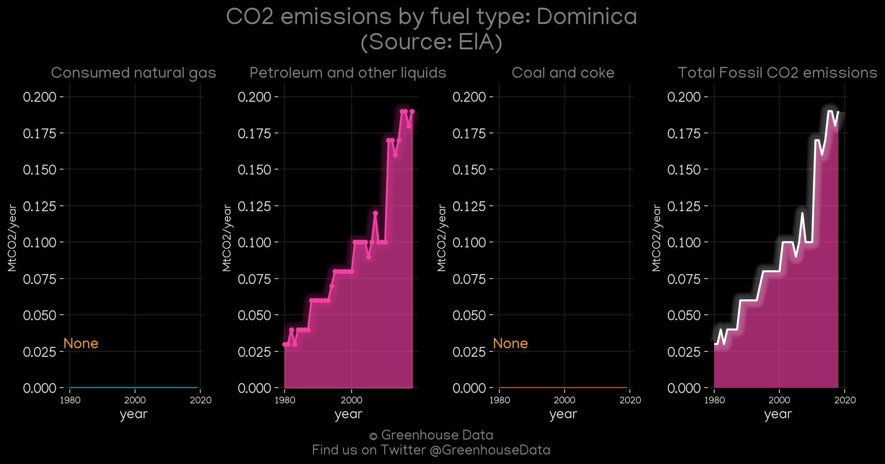

<h1 align="center">
🇩🇲🇩🇲🇩🇲🇩🇲🇩🇲
 
Dominica
 
🇩🇲🇩🇲🇩🇲🇩🇲🇩🇲
</h1>
<h2>Datasets:</h2>

<a href="https://github.com/dquintani/GreenhouseData/tree/master/country_data/DMA_Dominica/data">View on Github</a>
 

<a href="data/DMA_PRIMAP-hist.csv">PRIMAP-hist</a> || <a href="data/DMA_CAIT.csv">CAIT</a> || <a href="data/DMA_EDGAR.csv">EDGAR</a> || <a href="data/DMA_GCP.csv">GCP</a> || <a href="data/DMA_CDIAC.csv">CDIAC</a> || <a href="data/DMA_GCP_consupmption.csv">GCP_consupmption</a> || <a href="data/DMA_Minx_2021.csv">Minx_2021</a> || <a href="data/DMA_EIA.csv">EIA</a> || <a href="data/DMA_FAO.csv">FAO</a> || <a href="data/DMA_EPA.csv">EPA</a>

 

<h1>Figures:</h1><h2>#1 (DMA_CO2_totals)</h2>

<h2>#2 (DMA_UNFCCC_NAI_1)</h2>

<h2>#3 (DMA_Minx_top20_subsectors)</h2>

<h2>#4 (DMA_CDIAC_1)</h2>

<h2>#5 (DMA_GCP_1)</h2>

<h2>#6 (DMA_CAIT_gases_1)</h2>

<h2>#7 (DMA_EIA_1)</h2>

