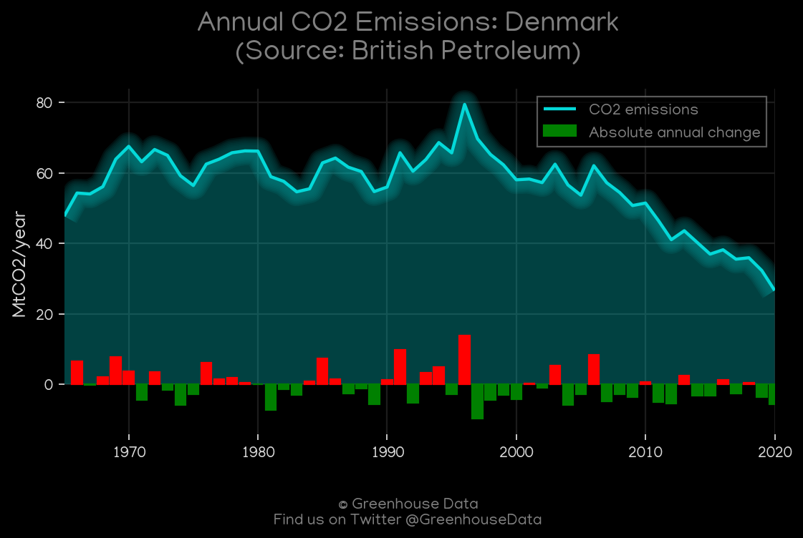
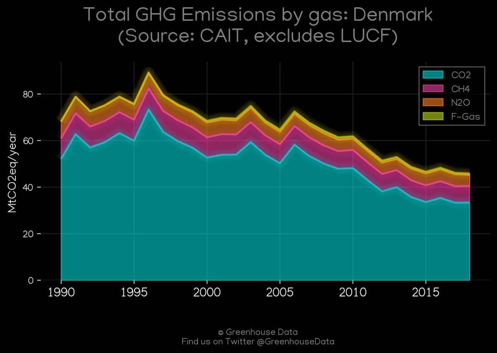
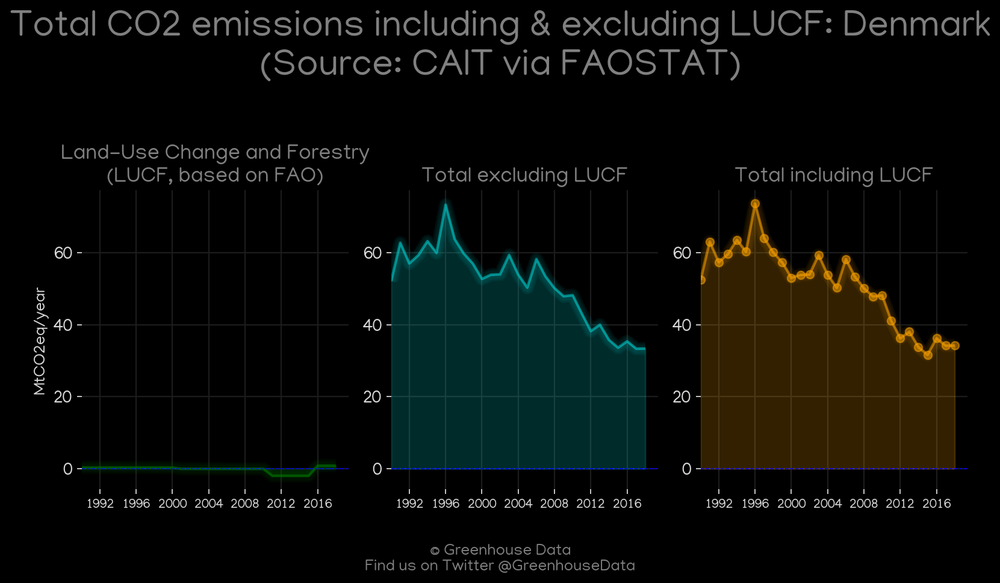
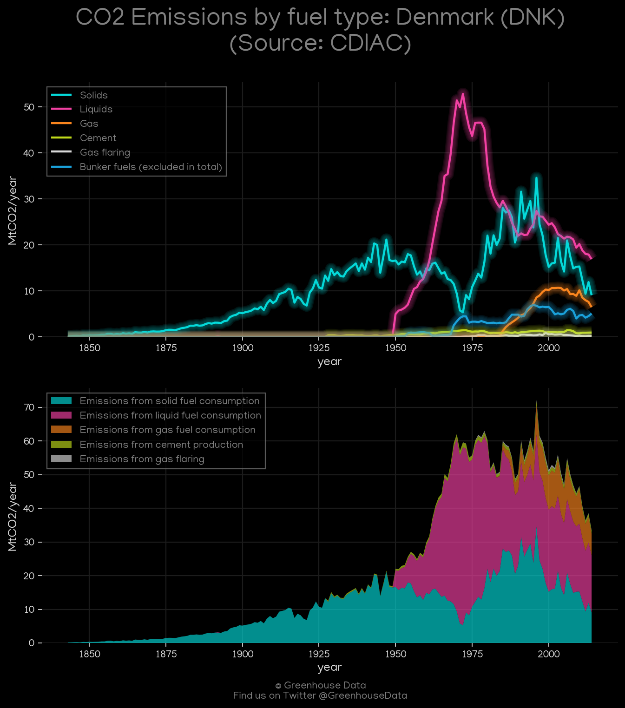
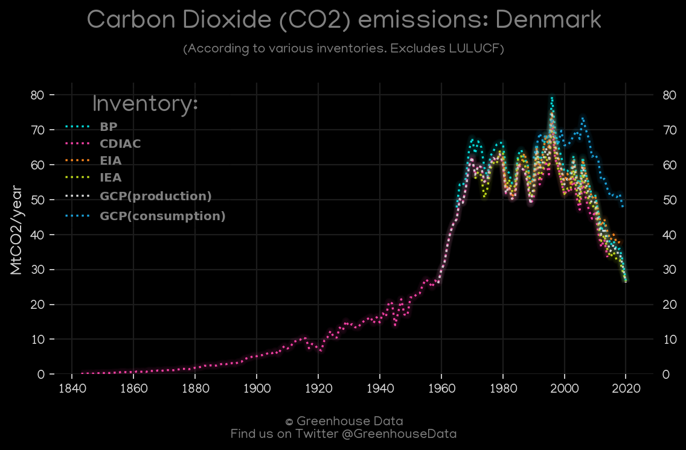
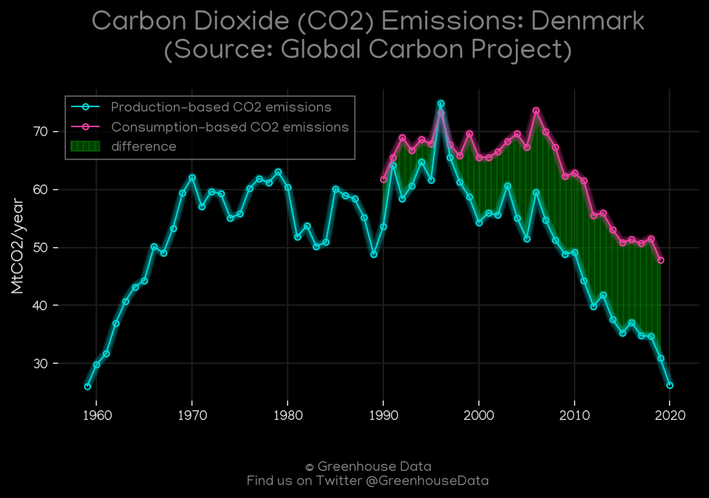
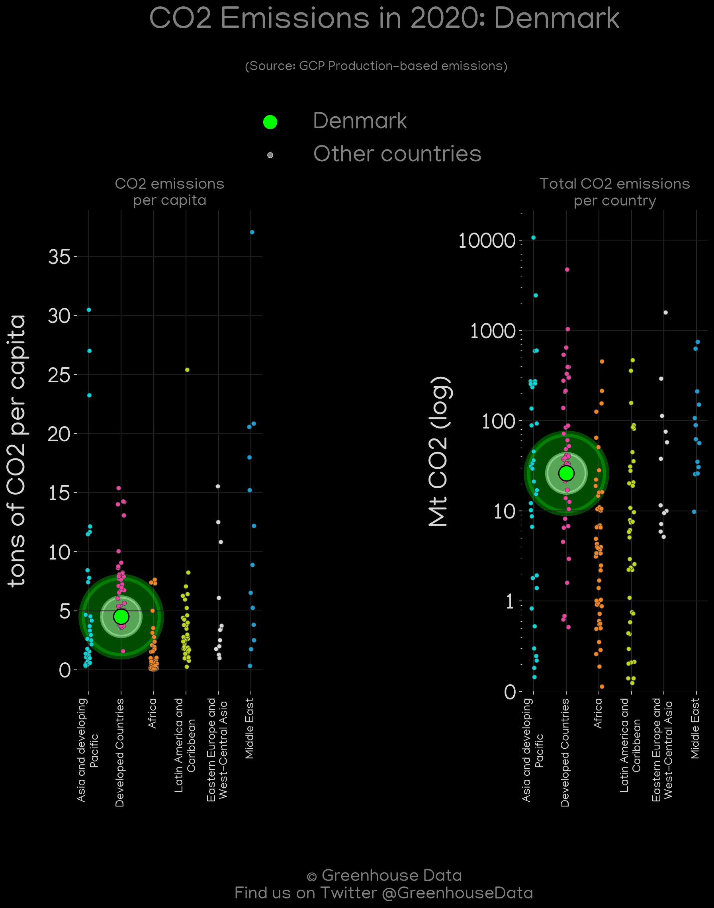
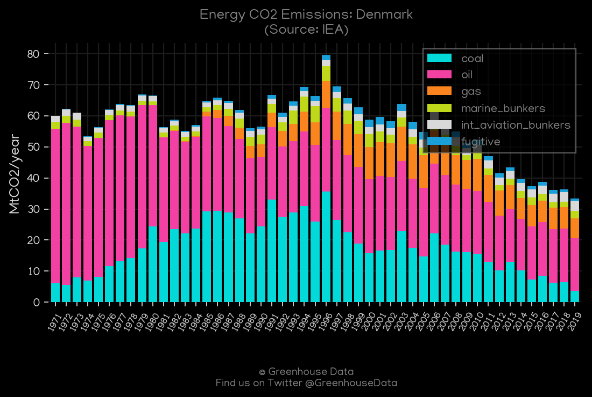
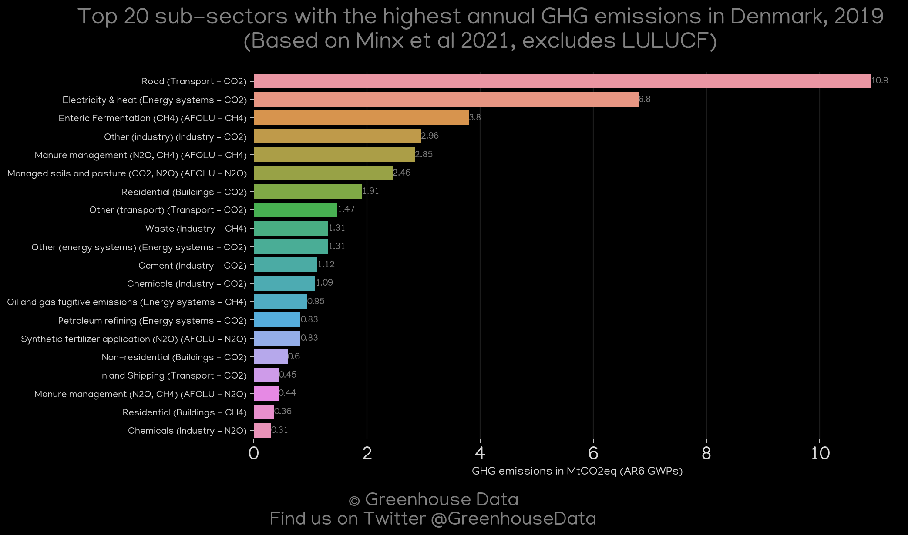

<h1 align="center">
🇩🇰🇩🇰🇩🇰🇩🇰🇩🇰
 
Denmark
 
🇩🇰🇩🇰🇩🇰🇩🇰🇩🇰
</h1>
<h2>Datasets:</h2>

<a href="https://github.com/dquintani/GreenhouseData/tree/master/country_data/DNK_Denmark/data">View on Github</a>
 

<a href="data/DNK_BP.csv">BP</a> || <a href="data/DNK_CAIT.csv">CAIT</a> || <a href="data/DNK_CDIAC.csv">CDIAC</a> || <a href="data/DNK_EDGAR.csv">EDGAR</a> || <a href="data/DNK_EIA.csv">EIA</a> || <a href="data/DNK_EPA.csv">EPA</a> || <a href="data/DNK_FAO.csv">FAO</a> || <a href="data/DNK_GCP.csv">GCP</a> || <a href="data/DNK_GCP_consupmption.csv">GCP_consupmption</a> || <a href="data/DNK_IEA.csv">IEA</a> || <a href="data/DNK_Minx_2021.csv">Minx_2021</a> || <a href="data/DNK_PRIMAP-hist.csv">PRIMAP-hist</a>

 

<h1>Figures:</h1><h2>#1 (DNK_BP_1)</h2>

<h2>#2 (DNK_CAIT_gases_1)</h2>

<h2>#3 (DNK_CAIT_lucf_vs_nolucf)</h2>

<h2>#4 (DNK_CDIAC_1)</h2>

<h2>#5 (DNK_CO2_totals)</h2>

<h2>#6 (DNK_EIA_1)</h2>

<h2>#7 (DNK_GCP_1)</h2>

<h2>#8 (DNK_GCP_Country_Highlight)</h2>

<h2>#9 (DNK_IEA_1)</h2>

<h2>#10 (DNK_Minx_top20_subsectors)</h2>

<h2>#11 (DNK_relative_totals)</h2>

<h2>#12 (DNK_UNFCCC_AI_1)</h2>

