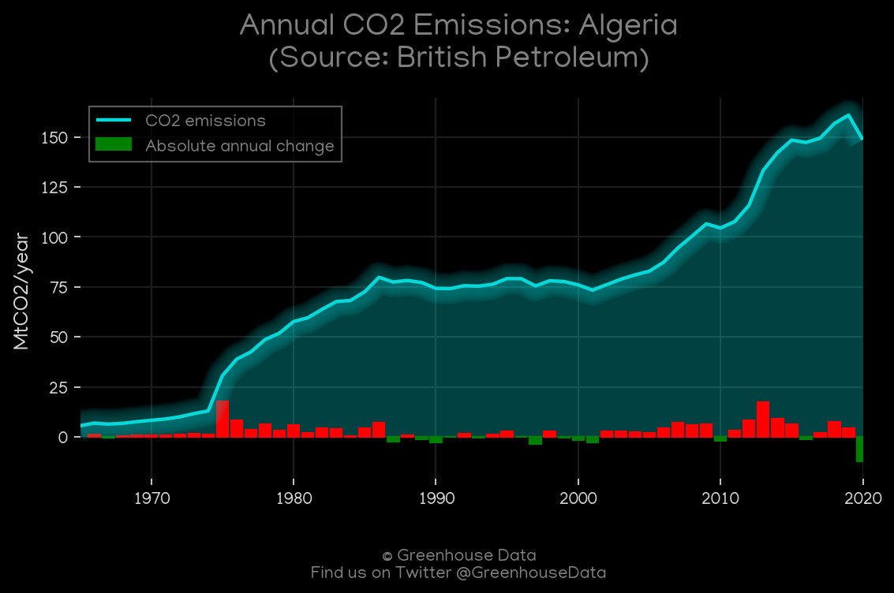
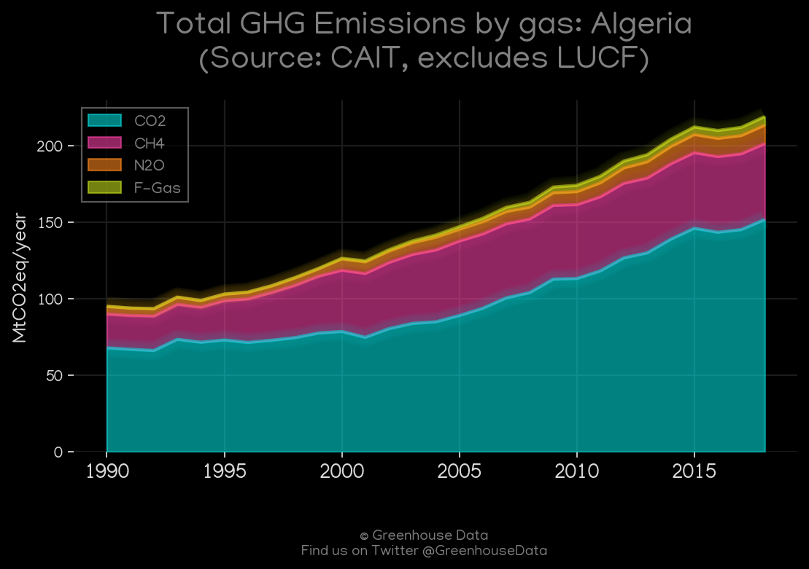
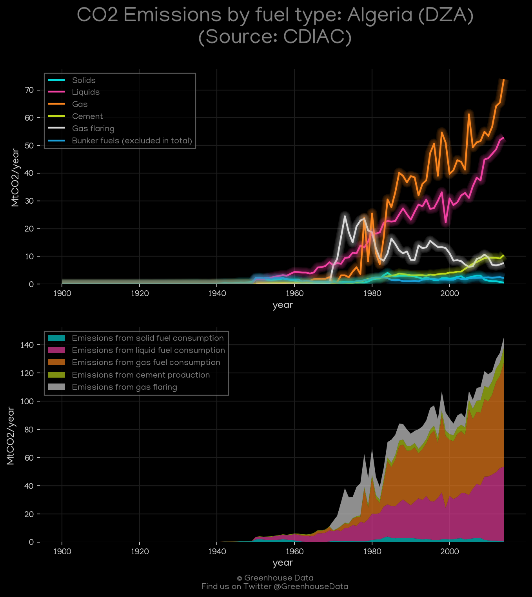
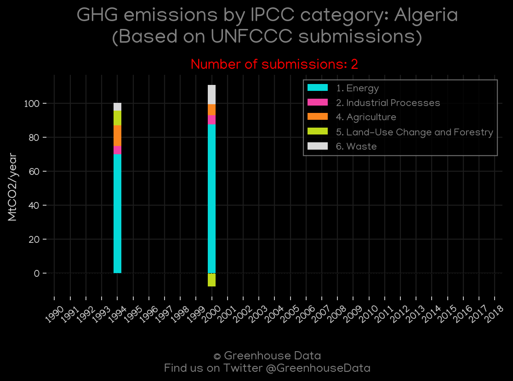
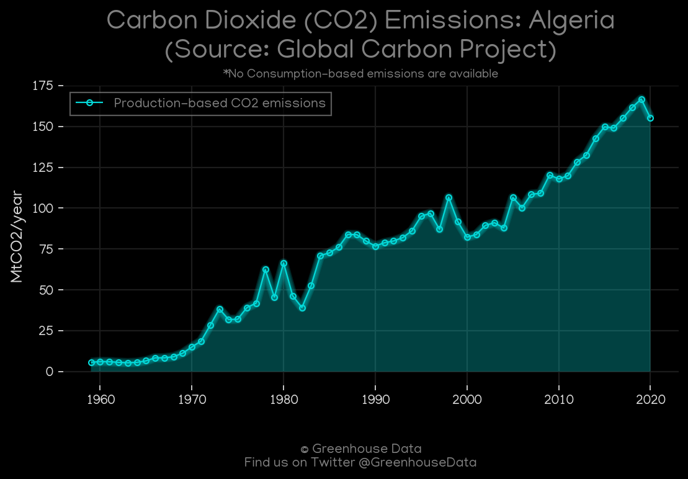
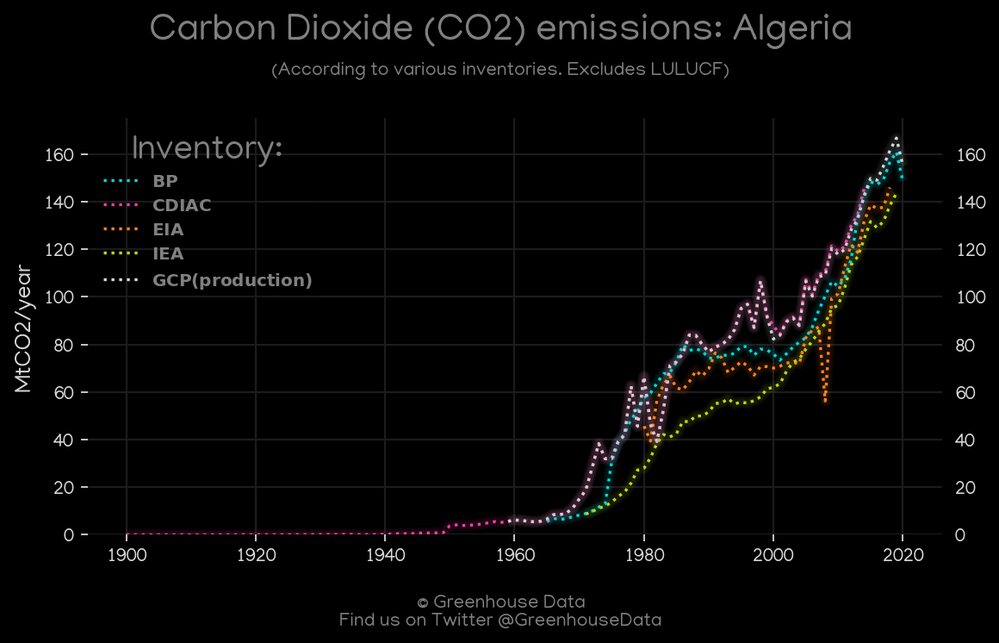
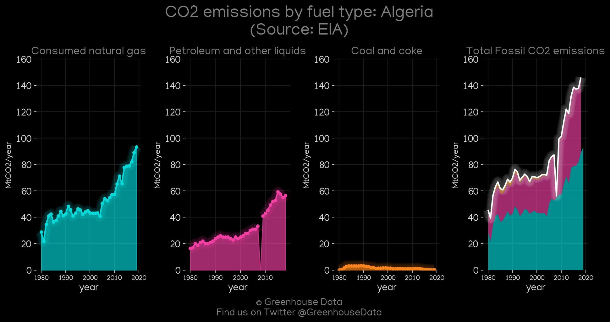
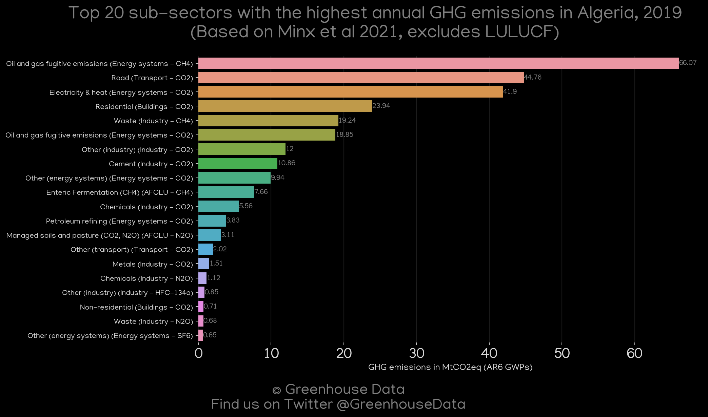
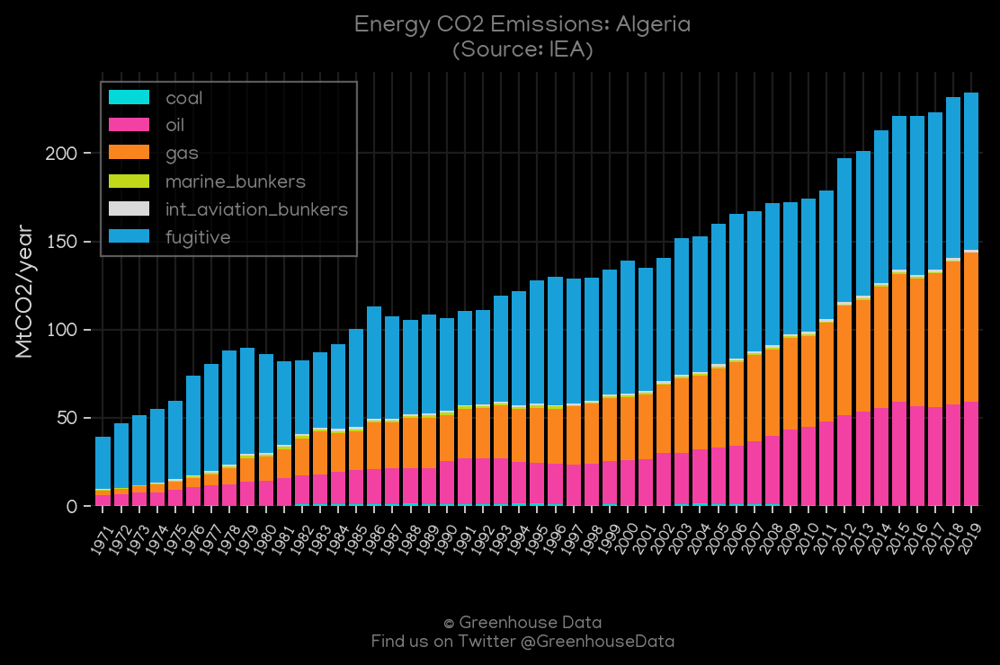

<h1 align="center">
🇩🇿🇩🇿🇩🇿🇩🇿🇩🇿
 
Algeria
 
🇩🇿🇩🇿🇩🇿🇩🇿🇩🇿
</h1>
<h2>Datasets:</h2>

<a href="https://github.com/dquintani/GreenhouseData/tree/master/country_data/DZA_Algeria/data">View on Github</a>
 

<a href="data/DZA_CAIT.csv">CAIT</a> || <a href="data/DZA_FAO.csv">FAO</a> || <a href="data/DZA_EIA.csv">EIA</a> || <a href="data/DZA_CDIAC.csv">CDIAC</a> || <a href="data/DZA_BP.csv">BP</a> || <a href="data/DZA_Minx_2021.csv">Minx_2021</a> || <a href="data/DZA_GCP_consupmption.csv">GCP_consupmption</a> || <a href="data/DZA_EDGAR.csv">EDGAR</a> || <a href="data/DZA_PRIMAP-hist.csv">PRIMAP-hist</a> || <a href="data/DZA_GCP_cons.csv">GCP_cons</a> || <a href="data/DZA_IEA.csv">IEA</a> || <a href="data/DZA_GCP.csv">GCP</a> || <a href="data/DZA_EPA.csv">EPA</a>

 

<h1>Figures:</h1><h2>#1 (DZA_BP_1)</h2>

<h2>#2 (DZA_CAIT_gases_1)</h2>

<h2>#3 (DZA_CDIAC_1)</h2>

<h2>#4 (DZA_UNFCCC_NAI_1)</h2>

<h2>#5 (DZA_GCP_1)</h2>

<h2>#6 (DZA_CO2_totals)</h2>

<h2>#7 (DZA_EIA_1)</h2>

<h2>#8 (DZA_Minx_top20_subsectors)</h2>

<h2>#9 (DZA_IEA_1)</h2>

