

<h1 align="center">
🇪🇨🇪🇨🇪🇨🇪🇨🇪🇨
 
Ecuador
 
🇪🇨🇪🇨🇪🇨🇪🇨🇪🇨
</h1>
<h2>Datasets:</h2>

<a href="https://github.com/dquintani/GreenhouseData/tree/master/country_data/ECU_Ecuador/data">View on Github</a>
 

<a href="data/ECU_FAO.csv">FAO</a> || <a href="data/ECU_EIA.csv">EIA</a> || <a href="data/ECU_IEA.csv">IEA</a> || <a href="data/ECU_BP.csv">BP</a> || <a href="data/ECU_CDIAC.csv">CDIAC</a> || <a href="data/ECU_CAIT.csv">CAIT</a> || <a href="data/ECU_GCP_consupmption.csv">GCP_consupmption</a> || <a href="data/ECU_EDGAR.csv">EDGAR</a> || <a href="data/ECU_PRIMAP-hist.csv">PRIMAP-hist</a> || <a href="data/ECU_GCP.csv">GCP</a> || <a href="data/ECU_EPA.csv">EPA</a> || <a href="data/ECU_Minx_2021.csv">Minx_2021</a>

 

<h1>Figures:</h1><h2>#1 (ECU_CAIT_lucf_vs_nolucf)</h2>

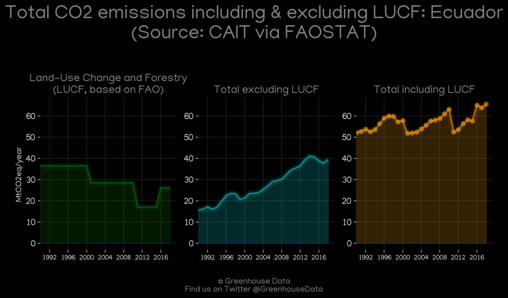
<h2>#2 (ECU_GCP_1)</h2>

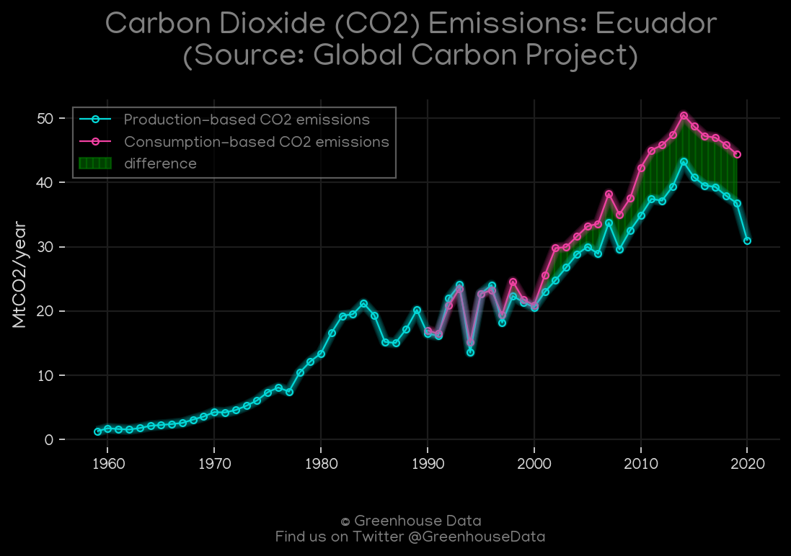
<h2>#3 (ECU_EIA_1)</h2>

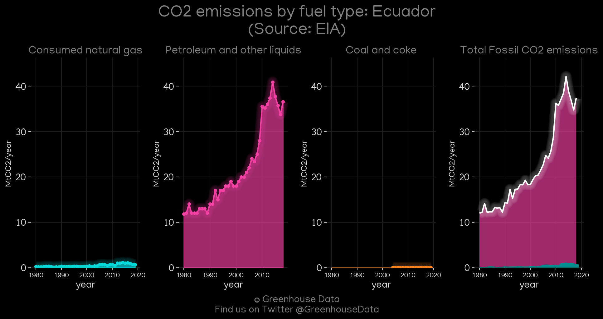
<h2>#4 (ECU_CO2_totals)</h2>

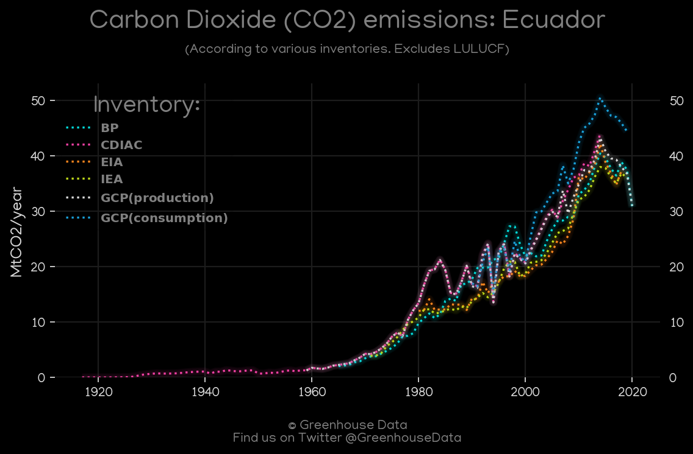
<h2>#5 (ECU_CAIT_gases_1)</h2>

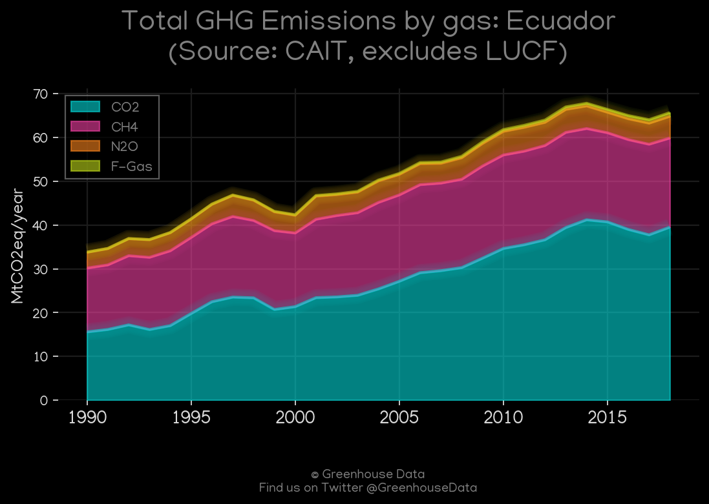
<h2>#6 (ECU_Minx_top20_subsectors)</h2>

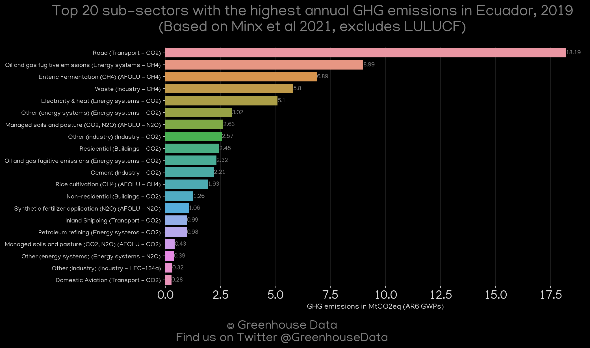
<h2>#7 (ECU_BP_1)</h2>

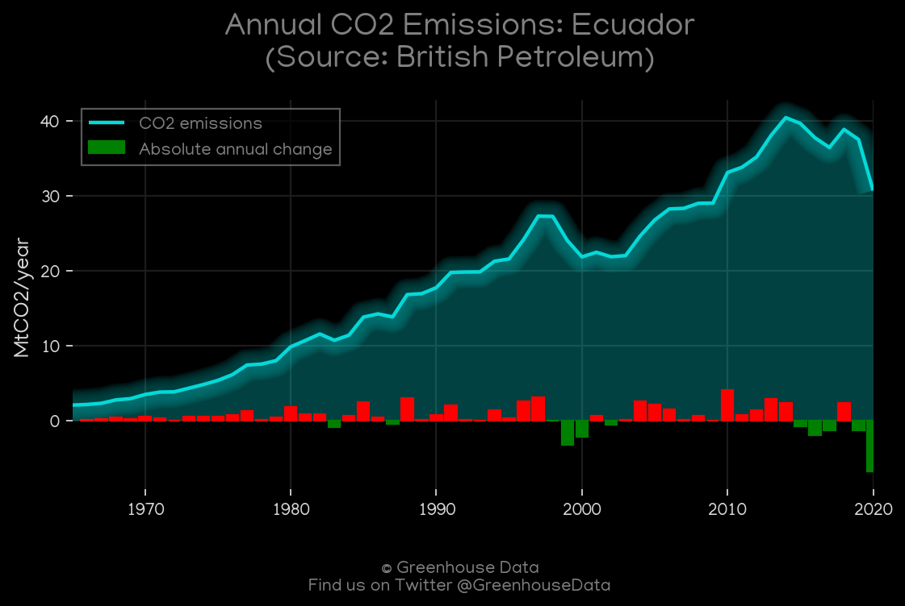
<h2>#8 (ECU_UNFCCC_NAI_1)</h2>

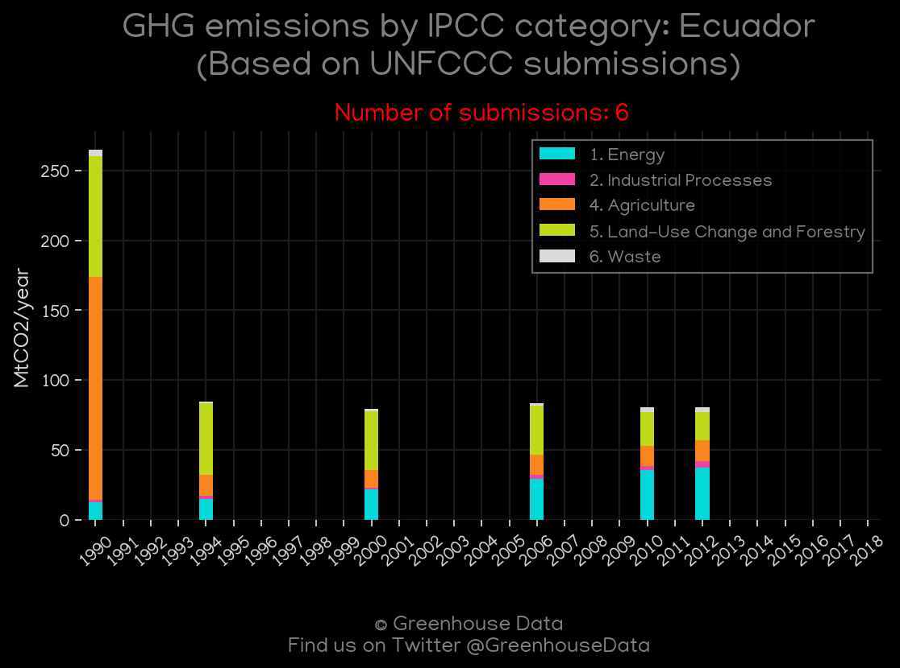
<h2>#9 (ECU_CDIAC_1)</h2>

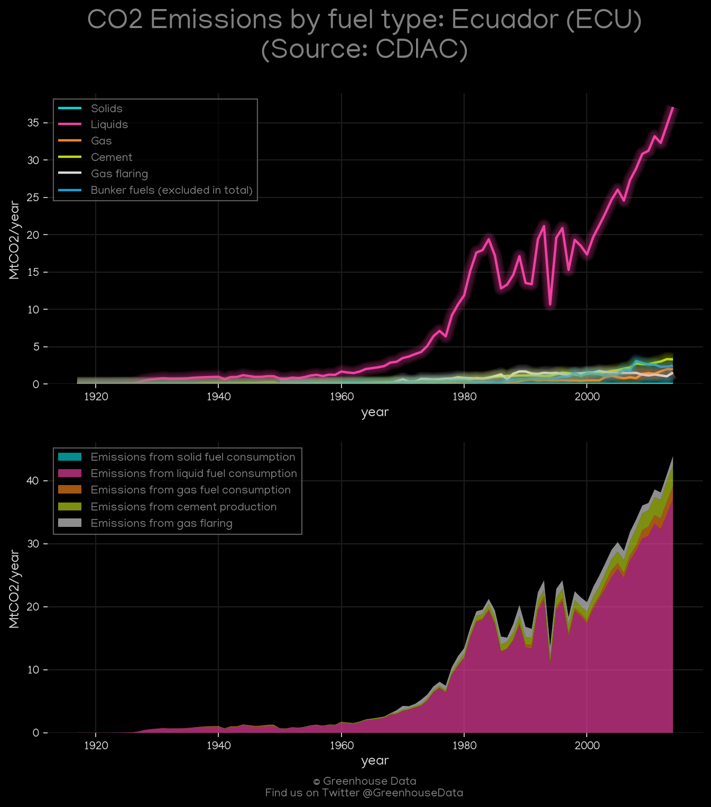
<h2>#10 (ECU_GCP_Country_Highlight)</h2>

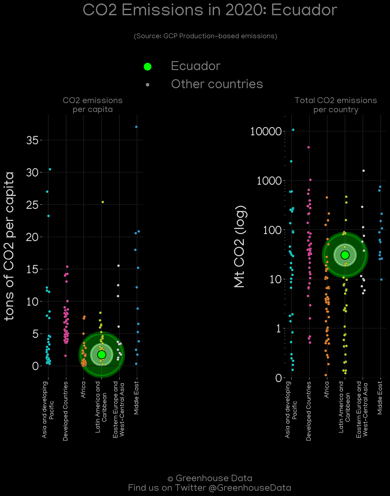
<h2>#11 (ECU_IEA_1)</h2>

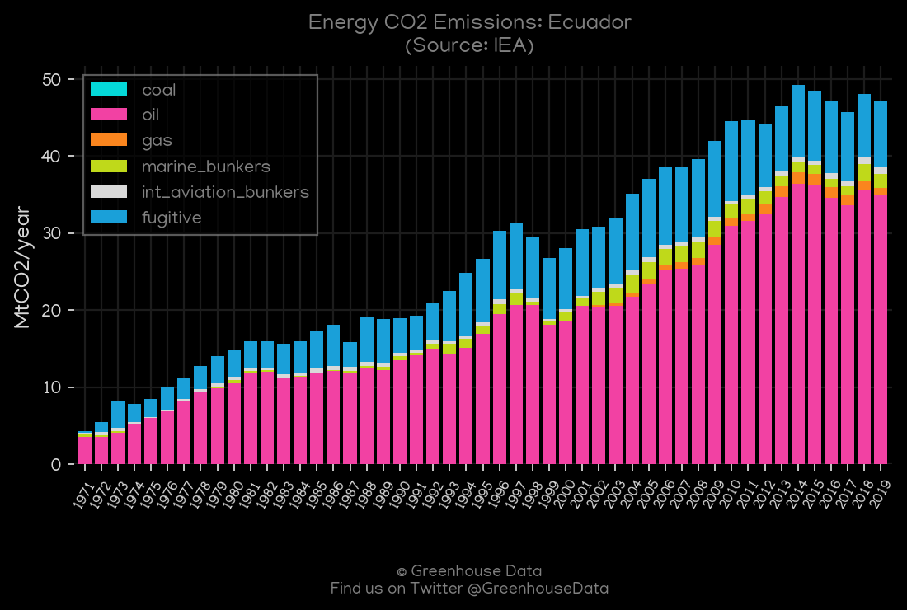
